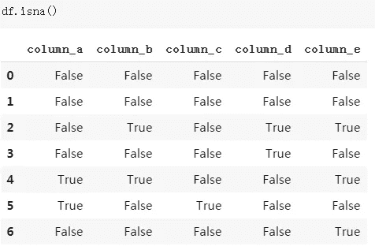

# 用熊猫处理缺失值

> 原文：<https://towardsdatascience.com/handling-missing-values-with-pandas-b876bf6f008f?source=collection_archive---------2----------------------->

## 关于如何检测和处理缺失值的完整教程

由 [Unsplash](https://unsplash.com/s/photos/pandas?utm_source=unsplash&utm_medium=referral&utm_content=creditCopyText) 上的 [chuttersnap](https://unsplash.com/@chuttersnap?utm_source=unsplash&utm_medium=referral&utm_content=creditCopyText) 拍摄

数据科学项目中最耗时的部分是数据清理和准备。然而，有许多强有力的工具可以加速这个过程。其中之一是 Pandas，它是一个广泛使用的 Python 数据分析库。

处理缺失值是数据清理和准备过程中必不可少的一部分，因为现实生活中几乎所有的数据都带有一些缺失值。在这篇文章中，我将解释如何使用 Pandas 来检测丢失的值并以一种正确有效的方式处理它们。

让我们先创建一个缺少值的数据帧。

np.nan、None 和 NaT(对于 datetime64[ns]类型)是熊猫的标准缺失值。

**注意:**Pandas 1.0 中引入了一种新的缺失数据类型(< NA >)，它是一种整数类型的缺失值表示。

np.nan 是浮点型的，所以如果你在一列整数中使用它们，它们将被转换成浮点数据类型，正如你在我们创建的 dataframe 的“column_a”中看到的。但是，<na>可以和整数一起使用，不会导致向上转换。让我们使用<na>向 dataframe 再添加一列，可以通过显式请求 dtype Int64Dtype()来使用它。</na></na>

# **查找缺失值**

Pandas 提供了 **isnull()** ， **isna()** 函数来检测缺失值。他们俩做着同样的事情。

**df.isna()** 返回带有布尔值的 dataframe，该值表示缺少的值。

也可以选择使用与 isna()正好相反的 **notna()** 。

**df.isna()。any()** 为每一列返回一个布尔值。如果该列中至少有一个值缺失，则结果为真。

**df.isna()。sum()** 返回每列中缺失值的数量。

# 处理缺失值

并非所有缺失的值都是简洁明了的 np.nan 或 None 格式。比如，“？”数据帧 c 列中的“---”字符没有给我们任何有价值的信息或见解，因此本质上它们是缺失值。但是，这些字符无法被熊猫检测为缺失值。

如果我们知道哪种字符用作数据集中的缺失值，我们可以在使用 **na_values** 参数创建数据帧时处理它们:

另一种选择是在创建数据帧后使用 pandas **replace()** 函数来处理这些值:

我们已经用 NaN 值替换了非信息单元格。**就地**参数保存数据帧中的变化。inplace 的默认值为 False，因此如果将其设置为 True，将不会保存更改。

没有处理缺失值的最佳方法。根据数据集和任务的特征，我们可以选择:

*   删除缺少的值
*   替换丢失的值

## 删除缺少的值

我们可以使用 **dropna()** 函数删除带有缺失值的行或列。**如何用**参数设置条件下降。

*   how='any ':如果有任何缺少的值，则删除
*   how='all ':如果所有值都丢失，则删除

此外，使用 **thresh** 参数，我们可以根据非缺失值的数量设置一个阈值，以便删除一行/一列。

thresh 参数要求一行或一列至少要有指定数量的非缺失值才能不被删除。例如，如果我们将 thresh 参数的值设置为 3，则一列或一行必须至少有 3 个非缺失值才不会被删除。没有 3 个或更多非缺失值的行或列(取决于轴参数的值)将被删除。

**轴**参数用于选择行(0)或列(1)。

我们的 dataframe 没有一行充满缺失值，因此设置 how='all '不会删除任何行。缺省值是' any '，所以如果我们想使用 how='any '，就不需要指定它:

至少有一个值缺失的行已被删除。

将 thresh 参数设置为至少有 3 个非缺失值的 3 个已删除行。

数据是宝贵的资产，所以我们不应该轻易放弃它。此外，机器学习模型几乎总是倾向于在更多数据的情况下表现更好。因此，根据具体情况，我们可能更喜欢替换丢失的值，而不是丢弃。

**替换缺失值**

**fillna()** 熊猫的功能方便处理缺失值。使用 fillna()，缺失值可以由特殊值或聚合值(如平均值、中值)替换。此外，缺失的值可以用它之前或之后的值替换，这对时间序列数据集非常有用。

*   用标量替换丢失的值:

*   fillna()也可以用于特定的列:

*   使用**方法**参数，缺失的值可以用它们之前或之后的值替换。

**ffill** 代表“向前填充”用前一行的值替换缺失的值。您也可以选择 **bfill** 代表“反向填充”。

如果一列或一行中有许多连续的缺失值，您可能希望**限制**向前或向后填充的缺失值的数量。

极限参数设置为 1，因此只有一个缺失值被向前填充。

感谢您的阅读。如果您有任何反馈，请告诉我。

# 我的其他帖子

*   [支持向量机—解释](/support-vector-machine-explained-8d75fe8738fd)
*   [决策树和随机森林——解释](/decision-tree-and-random-forest-explained-8d20ddabc9dd)
*   [用机器学习预测二手车价格](/predicting-used-car-prices-with-machine-learning-fea53811b1ab)
*   [数据清理和分析，附带一个奖励故事](/data-cleaning-and-analysis-with-a-bonus-story-36b3ae39564c)