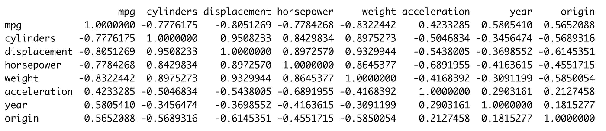
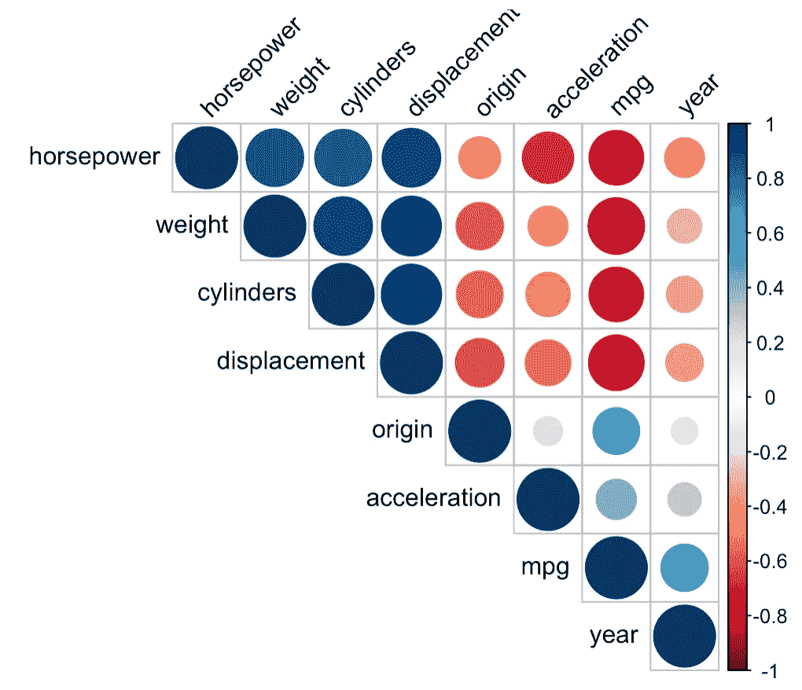
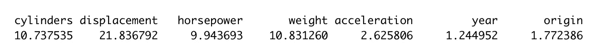

# ML 模型中多重共线性的处理

> 原文：<https://towardsdatascience.com/handling-multi-collinearity-6579eb99fd81?source=collection_archive---------17----------------------->

## 提高线性回归模型可解释性的简单方法


图片来自 Unsplash

[多元线性回归](https://medium.com/@pardeshi.vishwa25/linear-regression-model-for-ml-cd18a392bd8b?source=friends_link&sk=7682368acebef7c531b02da7788892bf)模型用于模拟响应/因变量和解释/自变量之间的关系。然而，多重共线性、误差项方差相关性、非线性等问题影响了模型的可解释性。本文将讨论多重共线性、多重共线性的影响以及处理多重共线性的技术。

# 什么是多重共线性？

当被假定为相互独立的解释变量被揭示为相互密切相关时，这种相关性被称为共线性。当观察到两个或更多解释变量的相关性时，称为多重共线性。

多重共线性尤其不可取，因为**它会影响线性回归模型的可解释性。**线性回归模型不仅有助于建立响应变量和解释变量之间的关系，还有助于确定每个解释变量对响应变量的个别影响。

因此，由于多重共线性的存在，很难分离出这些单独的影响。换句话说，多重共线性可以被视为一种现象，其中两个或更多的解释变量彼此高度线性相关，以至于一个解释变量可以从另一个解释变量以相当高的准确度预测。

# 多重共线性的影响

> 由于共线性/多重共线性的存在，很难隔离解释变量对响应变量的个别影响。

多重共线性会导致以下结果:

1.  **系数估计的不确定性或不稳定方差:**数据的微小变化(添加/删除行/列)会导致系数的变化。
2.  **标准误差增加:**降低估计的准确性，增加检测的机会。
3.  **统计显著性下降:**由于标准误差增加，t-统计下降，这对检测系数中的统计显著性的能力产生负面影响，导致 II 型误差。
4.  **缩减系数& p 值:**由于共线性，相关解释变量的重要性被掩盖。
5.  **过度拟合:**导致过度拟合，如高方差问题所示。

# 如何检测多重共线性？

除了观察上述影响的模型行为之外，多重共线性也在相关值中进行了定量捕捉。因此，可以使用以下内容:

**相关矩阵:**

数据中两个变量之间的皮尔逊相关性在-1 到 1 之间变化。两个变量的数据类型应为数值型，以便计算皮尔逊相关值。

这里，使用 r 的[自动 MPG](http://archive.ics.uci.edu/ml/datasets/Auto+MPG) 数据集的相关矩阵。列名包含字符串，因此被删除。响应变量是 mpg，它代表燃油消耗效率。

```
#data = Auto
#generate correlation matrix in Rcorrelation_matrix <- cor(Auto[, -which(names(Auto) == "name")])
```



Autompg 数据集的相关矩阵；作者图片

可以观察到气缸和排量、马力和重量之间的高度相关性。此外，还有几对具有高度正/负相关性的解释变量。因此，存在多重共线性。

然而，正如人们会注意到的，对 8 个变量来说，浏览表格并识别这些变量是令人厌倦的，而且随着变量数量的增加，情况只会变得更糟。因此，关联热图是更直观的关联表示。

**关联热图:**

关联热图通过调整正负关联的颜色和大小来帮助更好地可视化数据。

在 R 中，corrplot 包可以用来创建相关性的热图。

```
library(corrplot)
corrplot(correlation_matrix, type = "upper", order = "hclust", tl.col = "black", tl.srt = 45)
```



Autompg 数据集的关联热图；作者图片

热图无疑更加直观和可视化。但是，它有助于严格识别 2 个变量之间的相关性，而**无法识别 3 个或更多变量之间存在的共线性，对此可以使用方差膨胀因子。**

**方差膨胀因子(VIF):** VIF 是拟合完整模型时系数估计的方差除以系数估计的方差(如果单独拟合的话)的比值。最小可能值为 1，表示没有共线性。如果值超过 5，则应解决共线性问题。

```
library(rms)
multiple.lm <- lm(mpg ~ . -name, data = Auto)
summary(multiple.lm)
vif(multiple.lm)
```



Autompg 数据集的 VIF 值；作者图片

气缸、排量、马力和重量的 VIF 值远高于 5，因此应该处理，因为数据中的共线性很高。

# 处理多重共线性

多重共线性可以用以下两种方法处理。注意，自变量之间的这种相关性会导致数据冗余，消除这种冗余有助于消除多重共线性。

1.  **引入惩罚或删除高度相关的变量:**使用 lasso 和岭回归来删除提供冗余信息的变量。这也可以通过观察 VIF 来实现。
2.  **组合高度相关变量:**由于共线变量包含冗余信息，使用 PCA 等方法将其组合成单个变量，生成自变量。

对于在 R 中实现的 Autompg 线性回归模型，请查看这个 Github 库。 **该库探究多重共线性以及线性回归模型的交互项和非线性转换。**

## 参考:

R 中的统计学习导论。