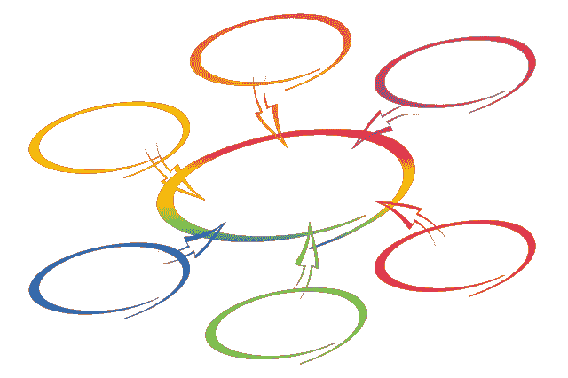
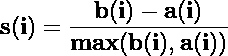
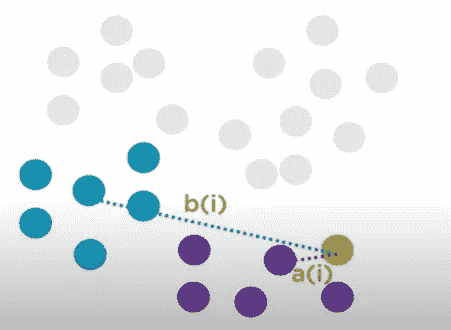
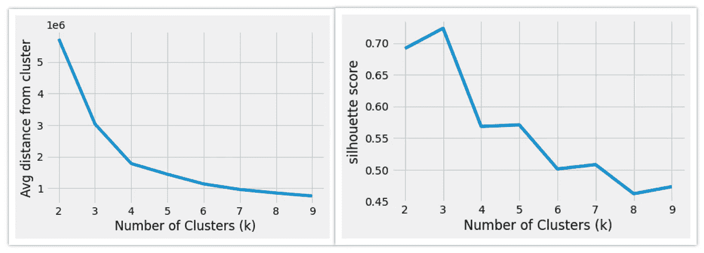
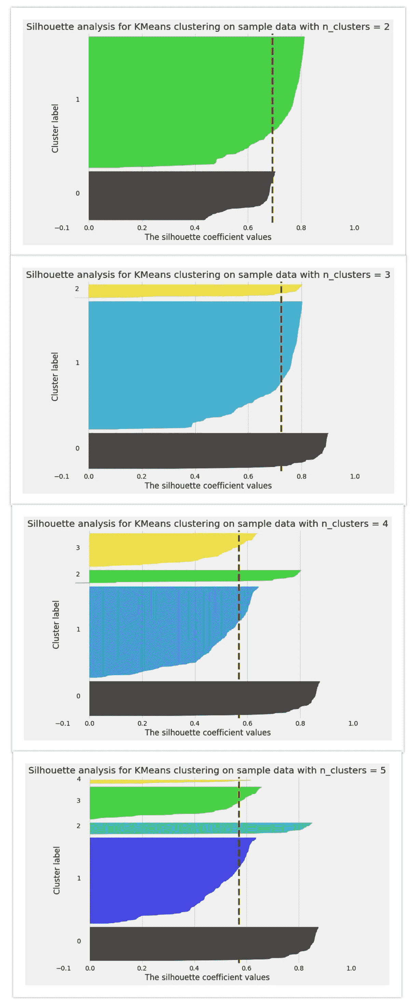

# 使用轮廓分析处理聚类中的异常值

> 原文：<https://towardsdatascience.com/handling-outliers-in-clusters-using-silhouette-analysis-5a7d51118dac?source=collection_archive---------14----------------------->

## 从 K 均值聚类中识别并移除每个聚类中的异常值



图片由[皮克斯拜](https://pixabay.com/?utm_source=link-attribution&amp;utm_medium=referral&amp;utm_campaign=image&amp;utm_content=1987214)的 Gerd Altmann 提供

现实世界中的数据通常有很多异常值。异常值的原因可能是数据损坏或未能记录数据。异常值的处理在数据预处理过程中非常重要，因为异常值的存在会妨碍模型发挥最佳性能。

有各种策略来处理数据集中的异常值。本文将介绍如何在使用剪影分析将数据聚类成几个簇之后处理异常值。

# 轮廓分析:

**剪影法**是一种寻找最佳聚类数以及解释和验证数据聚类一致性的方法。剪影方法计算每个点的剪影系数，该系数测量一个点与其自己的聚类相比与其他聚类相似的程度。通过提供一个**简洁的图形表示**来显示每个对象的分类情况。这些图形表示的分析被称为**轮廓分析**。

剪影值是一个衡量对象与其自身聚类(**内聚**)相比与其他聚类(**分离**)相似程度的指标。轮廓值的范围在[1，-1]之间。

```
**Important Points:
The Silhouette coefficient of +1** indicates that the sample is far away from the neighboring clusters.
**The Silhouette** coefficient **of 0** indicates that the sample is on or very close to the decision boundary between two neighboring clusters.
**Silhouette** coefficient **<0** indicates that those samples might have been assigned to the wrong cluster or are outliers.
```

## 计算轮廓系数:

求第 I 个点的轮廓系数的步骤:

1.  计算 an (i):该点与同一聚类中所有其他点的平均距离。
2.  Compute b(i):该点与离其聚类最近的聚类中所有点的平均距离。
3.  使用下述公式计算 s(I)-轮廓系数或第 I 点。



(图片由作者提供)，a(i)和 b(i)的图解表示，根据上述公式计算轮廓系数— s(i)

## 使用轮廓分析找到“k”的最佳值:

使用剪影法寻找最佳的聚类数。也可以用肘法找到，但剪影法被认为是比肘法更好的方法。阅读以下文章了解更多信息:

[](/silhouette-method-better-than-elbow-method-to-find-optimal-clusters-378d62ff6891) [## 轮廓法——比肘法更好的寻找最优聚类的方法

### k-Means 聚类中寻找最优聚类的剪影法深度分析

towardsdatascience.com](/silhouette-method-better-than-elbow-method-to-find-optimal-clusters-378d62ff6891) 

(图片由作者提供)，**左:**平均距离与聚类数，**右:**剪影得分与聚类数

轮廓图显示了一个聚类中的每个点与相邻聚类中的点的接近程度，从而提供了一种视觉评估聚类数量等参数的方法。



## 轮廓分析的关键要点:

1.  从不同 n_clusters 值的侧影线图和侧影分析，观察到 **n_cluster=3** 是聚类数(k)的最佳值。
2.  在上面的“*剪影分析，用于对样本数据进行 KMeans 聚类，n_clusters=3* ”的图像中，观察到所有聚类[0，1，2]的大部分点的剪影系数大于平均剪影分数。
3.  在上面的“对样本数据进行 KMeans 聚类的剪影分析，n_clusters=3 ”的图像中，可以观察到，对于 cluster_label 2，很少有点具有负剪影系数，可以将其视为异常值。同样对于 cluster_label 1，一些点的轮廓系数小于平均轮廓得分，这些点位于远离其聚类中心的聚类边界上。

要查找异常值，请查找具有负轮廓系数的点，并将其移除。位于远离聚类中心的聚类边界上的点也可以被移除以创建健壮的模型，但是这取决于案例研究。

> **阅读** [**本文**](/silhouette-method-better-than-elbow-method-to-find-optimal-clusters-378d62ff6891) **获得剪影分析的深潜解释，参考** [**要诀**](https://gist.github.com/satkr7/2a45e3d4af279458b48eba32add0d17e) **获得 python 代码实现。**

# 参考资料:

[1]维基百科:[剪影(聚类)](https://en.wikipedia.org/wiki/Silhouette_(clustering)#:~:text=The%20silhouette%20value%20is%20a,poorly%20matched%20to%20neighboring%20clusters)，(2020 年 9 月 14 日)

[2] Scikit 学习文档:[通过对 KMeans 聚类进行轮廓分析来选择聚类数](https://scikit-learn.org/stable/auto_examples/cluster/plot_kmeans_silhouette_analysis.html#sphx-glr-auto-examples-cluster-plot-kmeans-silhouette-analysis-py)

> 感谢您的阅读