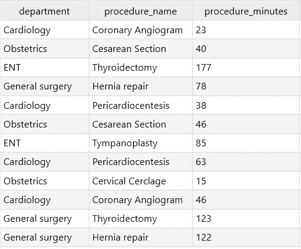
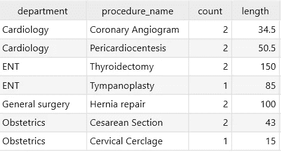
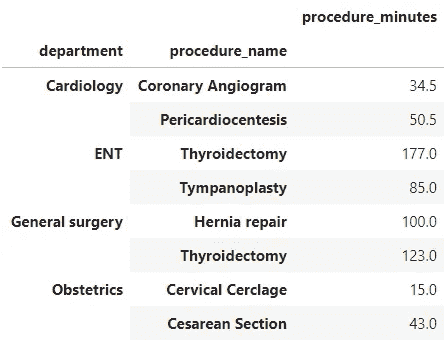
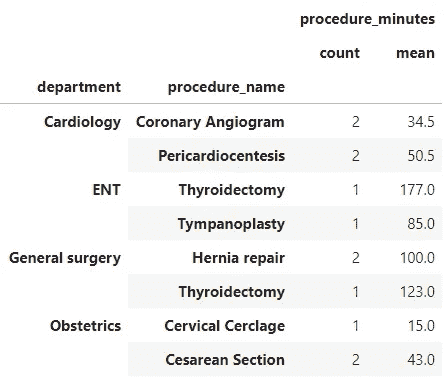
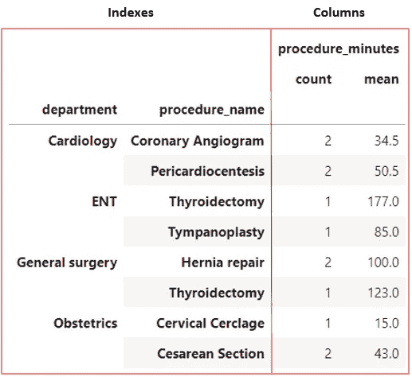
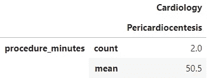
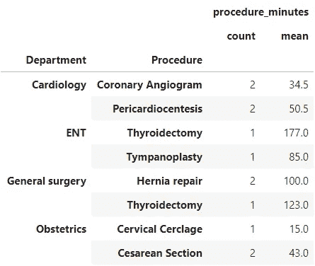
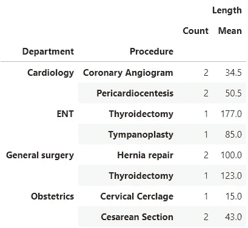
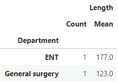
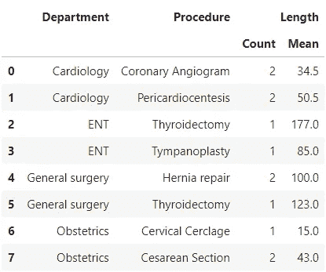

# 熊猫分组及其多指标处理

> 原文：<https://towardsdatascience.com/handling-pandas-groupby-and-its-multi-indexes-efae3e6b788c?source=collection_archive---------17----------------------->

## 熊猫群入门


Pandas groupby 方法产生了几个级别的索引和列

Pandas 被认为是任何使用 Python 的数据科学家的必备工具。一个常用的特性是`groupby` 方法。然而，那些刚刚过渡到 pandas 的人可能会觉得有点困惑，尤其是如果你来自 SQL 的世界。

为了比较，我们先来看看`GROUP BY`在 SQL 中是如何工作的。我们将使用几个部门的手术数据集，其中包含手术时间的信息:



要获得 SQL 中过程的平均长度:

```
SELECT department, procedure_name, COUNT(*) AS count, AVG(procedure_minutes) AS length 
FROM cases
GROUP BY procedure_name
ORDER BY department
```

`ORDER BY` *部门*允许我们对属于同一个部门的程序进行分组。

输出:



这几乎相当于熊猫使用`groupby`:

```
gp = cases.groupby(['department','procedure_name']).mean()
gp
```

输出:



如您所见，我们遗漏了*计数*列。通过直接调用`mean`函数，我们不能插入多个聚合函数。让我们通过使用`agg` 函数来解决这个问题:

```
gp = cases.groupby(['department','procedure_name']).agg(['mean', 'count'])
gp
```

输出:



太好了，现在这个看起来更熟悉了。注意*程序 _ 会议记录*标题与*部门*和*程序 _ 名称*标题不对齐。这就是我们开始看到 SQL 表和 pandas 数据帧之间差异的地方。

在 SQL 中，从查询派生的每个新表都由列组成。熊猫里有*索引*和*栏目。索引*类似于 SQL 的*主键*列，它唯一地标识表中的每一行。然而，熊猫数据帧可以有多个索引。在这种情况下，*部门*和*程序名*都是*索引*。



要使用索引找到一行，我们只需使用`.loc` 方法一个接一个地传递索引:

```
gp.loc[`Cardiology’,‘Pericardiocentesis’]
```

输出:



在 SQL 中，使用`AS`语句重命名*‘过程名称’，**‘计数’*和*‘过程长度*’列非常简单。因为 pandas 有*索引*和*列*，重命名它们有点棘手。要重命名*索引*:

```
gp.index.rename(['Department','Procedure'],inplace=True)
gp
```

输出:



由于这些列有多个级别，重命名它们需要更多的努力:

```
gp.columns.set_levels(['Length'],level=0,inplace=True)
gp.columns.set_levels(['Count','Mean'],level=1,inplace=True)
gp
```

输出:



尽管与 SQL 相比，命名列很复杂，但是 pandas 有很多优点。在这篇文章中探索一切可能太长了，但是这里有一个简单的。请注意，*甲状腺切除术*既可以是*耳鼻喉科*也可以是*普通外科*手术。为了获得两个部门的*甲状腺切除术*的平均值:

```
gp.xs('Thyroidectomy', level=1)
```

输出:



但是，如果您仍然喜欢类似于好的 ol' SQL 的表，只需传入 *reset_index* :

```
gp.reset_index(inplace=True)
gp
```

输出:



这就对了，熊猫分组方法入门。希望有所帮助！