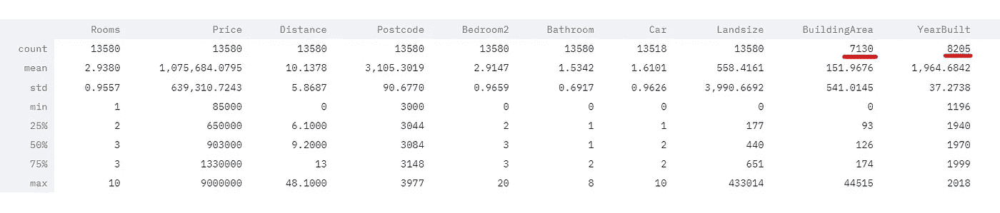
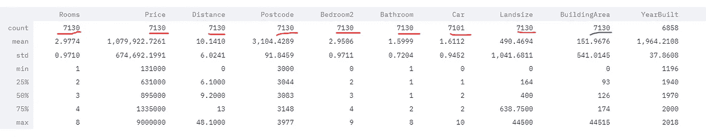
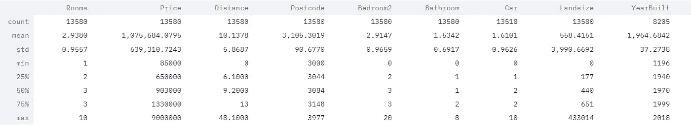
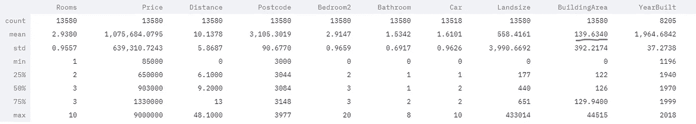

# 机器学习:处理数据中的缺失值:简单的方法

> 原文：<https://towardsdatascience.com/handling-the-missing-values-in-data-the-easy-way-9ea5983f8ba4?source=collection_archive---------15----------------------->

## **SciKit 估算器**简介


由[在](https://unsplash.com/@helloquence?utm_source=medium&utm_medium=referral) [Unsplash](https://unsplash.com?utm_source=medium&utm_medium=referral) 上拍摄的

大多数机器学习算法不能处理特征中的缺失值。参见下面墨尔本住房数据的例子。



墨尔本 _ 数据.描述()

这里，BuildingArea 有 **7130** 行有值，而大多数特性有 13580 行有值。

现在，您可以做一些事情来处理缺失值

## 1.去掉相应的数据

```
**melbourne_data.dropna(subset=["BuildingArea"])**
```

这将删除所有缺少值的行。您可以看到现在行数减少了。



墨尔本 _ 数据.描述()

## 2.去掉整个属性。

```
**melbourne_data.drop("BuildingArea", axis=1)**
```

这将删除整个要素/属性。见下图，**建筑面积**列现已删除。



墨尔本 _ 数据.描述()

## 3.将缺少的值设置为某个值

> **接近 A**

如果您认为该属性足够重要，并且必须包含在培训中。您可以填充缺少的值。

> **用什么填充缺失的值？？？**

你可以用中间值、平均值或零来代替缺失值。

```
**median = melbourne_data["BuildingArea"].median()
melbourne_data["BuildingArea"].fillna(median, inplace=True)**
```

这将用计算出的中值替换所有缺失的值。此外，现在您会注意到一件事，即当我们填充了缺少的值时，属性的平均值发生了变化。



墨尔本 _ 数据.描述()

对于**“year build”**属性，您也可以遵循类似的过程。您将不得不保存中间值，因为稍后需要它来填充测试集和新数据中缺失的值(哦，是的，我没有想到)。

> **方法 B:** 引入**估算器**

SciKit-Learn 提供了 Imputer 类来轻松使用上述任务。您可以按以下方式使用它:

首先，你需要决定策略，它可以是这些策略之一:**均值、中值、最频繁**

其次，使用决定的策略创建估算器实例

```
# 1\. Remove categorial 
melbourne_data = melbourne_data.select_dtypes(exclude=   
                 [**"object"**]).copy()# 2\. Fit the numerical data to Imputer
**from** sklearn.impute **import** SimpleImputer
imputer = SimpleImputer(strategy=**"median"**)
imputer.fit(melbourne_data)# 3.
X = imputer.transform(melbourne_data)
melbourne_data_tr = pd.DataFrame(X, columns=melbourne_data.columns, 
                    index=melbourne_data.index)
```

现在，这将计算所有属性的中值，并用各自的平均值填充属性的缺失值。


melbourne_data_tr.describe()

**注意:**不关注类别值，因为它们不在本教程的范围内。

## Github 上的代码

[**Python 代码**](https://github.com/akashp1712/ml-akash/blob/master/Articles/imputer/imputer.py) **:** 全文 **python 代码**用三种方式全部解释。

[**细流码**](https://github.com/akashp1712/ml-akash/blob/master/Articles/imputer/imputer_streamlit.py) **:** 哦..你也喜欢细流。在此找到 **streamlit 代码**。

[**数据**](https://github.com/akashp1712/ml-akash/blob/master/Articles/imputer/melb_data.csv) **:** 二手墨尔本房价数据。