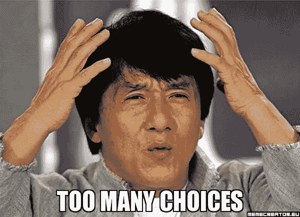
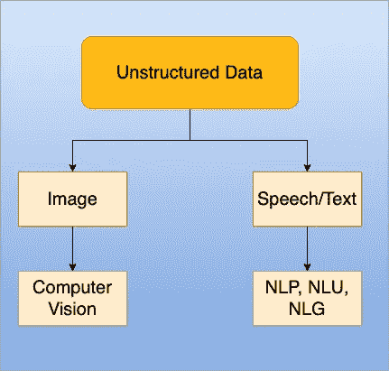

# 2020 年学习深度学习精选资源

> 原文：<https://towardsdatascience.com/handpicked-resources-for-learning-deep-learning-in-2020-e50c6768ab6e?source=collection_archive---------15----------------------->

互联网上充斥着各种噪音，很难找到一个进入人工智能世界的真正起点。因此，我包括一些精选的资源，可以帮助你更有效地学习深度学习。这篇文章并不是要给你提供一份你一年都无法完成的资源清单，这篇文章包含了有限的信息，告诉你如何开始、学习，然后向未来的雇主展示你的项目。

*注:本文所有观点均为我个人观点。没有任何公司或组织付钱给我来推广他们的课程。*

# 深度学习

如果你知道经典的机器学习，比如(逻辑回归，随机森林，XGBoost ),并且你想转向深度学习，那么这些资源可以帮助你。

## 理解概念(自下而上的方法):

1.  [deep learning . ai](https://www.deeplearning.ai/deep-learning-specialization/):coursera.org 吴恩达在线授课的最好课程之一。前 3 门课程会帮助你理解深度学习。

## 通过做项目来理解概念(自上而下的方法):

1.  [深度学习纳米学位](https://www.udacity.com/course/deep-learning-nanodegree--nd101):由 Udacity 提供，是从项目角度学习 DL 的最佳课程之一。

## 选择深度学习库

如果你希望更快地学习深度学习，你必须选择深度学习库。以下是我可以推荐的几个选项:

1.  **tensor flow/Keras**:Google 的开源库。要学习 tensorflow，你可以点击这里的[公开课](https://www.udacity.com/course/intro-to-tensorflow-for-deep-learning--ud187)。
    Keras 是一个构建在 Tensorlfow 之上的包装器，帮助最终用户快速设计深度学习模型。默认包含在 Tensorflow 的 2.x 版本中。
    *常见问题:应该学习哪个版本的 tensorflow？
    答:您应该直接从版本≥ 2.x 开始。如果您在工业界工作，那么您可能需要阅读 1.x 中的大量代码，因为许多流行的模型都是用 1.x 编写的，但它们仍然与 2.x 兼容。*
2.  Pytorch :脸书的开源库。学习 PyTorch，可以在这里跟着这个[公开课](https://www.udacity.com/course/deep-learning-pytorch--ud188)。

常见问题:我是否应该选择 Tensorflow 和 Pytorch
回答:这是一个非常主观的答案，取决于你。如果在 2020 年我必须开始学习一个 DL 框架，我肯定会从 Keras 开始。但这里有一个事实，如果你在工业界工作，你将不得不与他们两个一起工作，你没有选择。有些模型在 PyTorch 中实现得很好，有些在 TensorFlow 中实现得很好。

## 书

1.  [动手操作 ML](https://www.amazon.in/Hands-Machine-Learning-Scikit-Learn-TensorFlow/dp/1492032646/ref=dp_ob_image_bk) 作者 Aurelien Geron:这本书将帮助你学习 ML 和 DL 的基本概念，并将很好地介绍如何使用 Tensorflow 作为深度学习库。请直接去找这本书的最新版本。
2.  [用 Python 进行深度学习](https://www.manning.com/books/deep-learning-with-python):这本书将帮助你学习 Keras，因为它是 Keras 的创始人 Franchois Chollet 写的。这本书的最新版本将于 2020 年 9 月发布。所以要小心！
3.  [深度学习书籍](https://www.deeplearningbook.org/):这本书被称为深度学习的圣经，作者是伊恩·古德菲勒、约舒阿·本吉奥和亚伦·库维尔。这本书只免费提供！
4.  [钻研深度学习:](https://www.manning.com/books/grokking-deep-learning)(可选)这本书是由 DeepMind 的研究科学家 Andrew Trask 写的。

# 通过深度学习选择子职业道路

图一。基于数据的职业选择

现在理想的情况是，你必须决定你是想成为一名处理图像的计算机视觉工程师，还是一名处理文本的自然语言处理/理解/生成工程师。我在这里也包括了演讲，但是演讲没有特别的工作描述，只有文本(出于一些奇怪的原因，我不明白)

# 计算机视觉

如果你想成为一名摇滚明星，从事图像方面的工作，那么计算机视觉就是你要走的路。

## 课程:

1.  [CS 231n](http://cs231n.stanford.edu/) :斯坦福大学提供。Youtube 视频[在这里](https://www.youtube.com/watch?v=vT1JzLTH4G4&list=PLC1qU-LWwrF64f4QKQT-Vg5Wr4qEE1Zxk)。这是由费李非(最近进入 Twitter 董事会)和安德烈卡帕西(特斯拉人工智能总监)教授的
2.  深度学习专业化课程 4。它包含了卷积神经网络非常坚实的介绍。

## 书籍:

1.  [计算机视觉的深度学习](https://www.pyimagesearch.com/deep-learning-computer-vision-python-book/):由 Adrian Rosebrock 博士撰写。他是机器学习领域的明星。

## 项目:

为了制作一个好的投资组合，以下是 Kaggle 的三个顶级项目:

1.  [钢材缺陷检测](https://www.kaggle.com/c/severstal-steel-defect-detection/overview):钢材是现代最重要的建筑材料之一。钢结构建筑可以抵抗自然和人为的磨损，这使得这种材料在世界各地无处不在。为了提高钢铁生产的效率，这场比赛将有助于发现缺陷。
2.  [肺炎检测](https://www.kaggle.com/c/rsna-pneumonia-detection-challenge/data):这里要求你从胸部的数字图像中检测肺炎，如果你的目标是医学/医疗保健领域的计算机视觉，这是一个很好的比赛。
3.  座头鲸识别:这个挑战将教会你暹罗网络的重要性以及如何实现一次性学习。一次性学习就是如何利用一张图片来区分多种鲸鱼。

## **资源:**

1.  Adrian Rosebrock 的精彩网站，他每周都会发布一篇新文章。如果选择 Tensorflow 作为 DL 库，建议这样做。
2.  [learnopencv.com](https://learnopencv.com/):萨泰·马里克的精彩网站。代码示例[此处](https://github.com/spmallick/learnopencv)。如果选择 Pytorch 作为 DL 库，建议这样做。

# 自然语言处理

1.  CS 224n :斯坦福大学的课程。视频是[这里](https://www.youtube.com/watch?v=8rXD5-xhemo)。网上免费提供的最好的课程之一。如果你在看完最初的 8 个视频后退出本课程，那也没关系。
2.  深度学习专业化课程 5。吴恩达深入讲授递归神经网络、长短期记忆网络及其应用，如触发词检测！
3.  Udacity 自然语言纳米学位:如果你想遵循自上而下的方法，这是最好的课程之一。项目包括:情感分析，建立一个 ASR(自动语音识别)系统！

## 书籍:

1.  [自然语言处理在行动](https://www.amazon.in/Natural-Language-Processing-Action-Understanding/dp/1617294632/ref=sr_1_1?crid=1CENW4P4AG9E3&dchild=1&keywords=natural+language+processing&qid=1589597548&sprefix=natural+language+%2Caps%2C290&sr=8-1):我正在阅读它，对我来说看起来很有希望

## 项目:

1.  [Tensorflow 问答](https://www.kaggle.com/c/tensorflow2-question-answering):这个比赛的目标是预测关于维基百科文章的真实问题的简短和详细回答。
2.  Quora 不真诚问题分类:看起来与之前的比赛相似，但实际上是为了识别和标记不真诚的问题。
3.  Tensorflow 语音识别(tensor flow Speech Recognition):如果你想建立自动语音识别模型，这个比赛是必不可少的。这场比赛包括 65，000 个由 30 个短词组成的一秒钟长的话语，由成千上万不同的人完成。在这场比赛中，你的挑战是使用语音命令数据集来构建一个能够理解简单语音命令的算法。

## 资源

1.  [拥抱脸](https://huggingface.co/):所有 NLP 相关任务的最佳库之一。在您开始实现任何定制模型之前，一定要检查他们是否已经为您完成了。
2.  [Super Duper NLP repo](https://notebooks.quantumstat.com/) :包含该领域最常见问题的笔记本。

# 结论

这篇文章旨在指导你如何开始深度学习/计算机视觉/自然语言处理，如果你目前不在数据科学领域工作，但打算转行到数据科学职位，你可以如何向未来的雇主展示你的投资组合。

请注意，在一个月内学习这些技术和进一步的子领域没有捷径，需要大量的时间和努力，最重要的是需要大量的自我决定。现在的问题是:

> “你有这种能力吗？”

如果是，那么你拥有世界上所有的资源，如果不是，那么甚至不是世界上所有的资源都能帮到你。

# 关于我

我叫 Harveen，目前在 ThoughWorks 公司担任数据科学家。我正在设计像印地语，马拉地语，泰卢固语，卡纳达语等印度语自动端到端语音识别系统的状态！

请随时在 [LinkedIn](https://www.linkedin.com/in/harveenchadha/) 上与我联系！

谢谢！请随时评论任何进一步的资源。我将对它们进行审查，并将其添加到本文中。感谢阅读！