# 使用 R 进行客户流失预测，并比较不同的客户流失预测模型

> 原文：<https://towardsdatascience.com/hands-on-churn-prediction-with-r-and-comparison-of-different-models-for-churn-prediction-4b79011a082a?source=collection_archive---------10----------------------->

## 使用 GLM、决策树和随机森林来预测流失，并比较模型的准确性和 AUC 值


[斯科特·格雷厄姆](https://unsplash.com/@sctgrhm?utm_source=medium&utm_medium=referral)在 [Unsplash](https://unsplash.com?utm_source=medium&utm_medium=referral) 上拍照

**什么是客户流失？**

当应用于客户群时，流失率是指在给定时间段内离开供应商的合同客户或订户的比例。([维基百科](https://en.wikipedia.org/wiki/Churn_rate))

**为什么客户流失预测很重要？**

流失率直接关系到公司的盈利能力。一些人对顾客行为了解得越多，就能获得越多的利润。这也有助于识别和改进客户服务不足的领域。

## 获取和处理数据

数据是从 IBM 收集的。首先加载所需的库和数据，并查看数据。

```
library(tidyverse)
library(caret)
library(repr)
library(caTools)
library(rpart)
library(rpart.plot)
library(ggpubr)# input the data and take a look on the variables
data <- read.csv("telco.csv")
glimpse(data)data <- data[complete.cases(data),] # removing na's
```

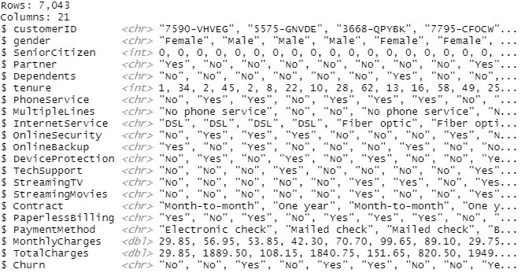

图 1:看一下数据

关于数据:

*   在这个数据中，所有的行代表不同的客户，每一列代表他们的属性。
*   “流失”列表示客户在上个月离开。
*   客户订购的服务—电话、多条线路、互联网、在线安全、在线备份、设备保护、技术支持以及流媒体电视和电影。
*   每个客户的账户信息——合同、支付方式、无纸化账单、每月费用和总费用。
*   人口统计信息——性别、年龄范围，以及他们是否有伴侣和家属

**数据角力:**

1.  为了方便起见，像“没有互联网服务”和“没有电话服务”这样的术语应该改为“没有”。

```
data <- data.frame(lapply(data, function(x) {
  gsub("No internet service", "No", x)}))data <- data.frame(lapply(data, function(x) {
  gsub("No phone service", "No", x)}))
```

2.SeniorCitizen 用 1 和 0 回答，分别改为“是”或“否”。

```
data$SeniorCitizen <- as.factor(ifelse(data$SeniorCitizen==1, 'YES', 'NO'))
```

3.将 double 类型变量转换为 numeric 类型，并将它们作为数据框存储在变量中。

```
num_columns <- c("tenure", "MonthlyCharges", "TotalCharges")
data[num_columns] <- sapply(data[num_columns], as.numeric)data_int <- data[,c("tenure", "MonthlyCharges", "TotalCharges")]
data_int <- data.frame(scale(data_int))
```

4.任期以月为单位。我们应该把它换算成年。

```
data <- mutate(data, tenure_year = tenure)data$tenure_year[data$tenure_year >=0 & data$tenure_year <= 12] <- '0-1 year'
data$tenure_year[data$tenure_year > 12 & data$tenure_year <= 24] <- '1-2 years'
data$tenure_year[data$tenure_year > 24 & data$tenure_year <= 36] <- '2-3 years'
data$tenure_year[data$tenure_year > 36 & data$tenure_year <= 48] <- '3-4 years'
data$tenure_year[data$tenure_year > 48 & data$tenure_year <= 60] <- '4-5 years'
data$tenure_year[data$tenure_year > 60 & data$tenure_year <= 72] <- '5-6 years'data$tenure_year <- as.factor(data$tenure_year)
```

5.准备用于分析的最终数据，排除我们在整个分析过程中不需要的选定变量。

```
data$tenure_year <- as.factor(data$tenure_year)data_req <- data[,-c(1,6,19,20)]
x <- data.frame(sapply(data_req,function(x) data.frame(model.matrix(~x-1,data =data_req))[,-1]))x <- na.omit(x) # omit the NA's
data_int <- na.omit(data_int) # omit the NA'sdata_final <- cbind(x, data_int)
```

# 探索性分析

1.  数字变量之间的相关图:

```
nv <- sapply(data_int, is.numeric)
cormat <- cor(data_int[,nv])
ggcorrplot::ggcorrplot(cormat, title = "Correlation of Numeric Variables")
```

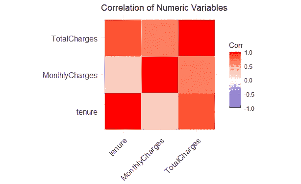

图 2:数值变量的相关图

2.流失率表明上个月大约有 26.58%的客户离开。

```
churn <- data %>% 
  group_by(Churn) %>% 
  summarise(Count = n())%>% 
  mutate(percentage = prop.table(Count)*100)
ggplot(churn, aes(reorder(Churn, -percentage), percentage), fill = Churn)+
  geom_col(fill = c("green", "red"))+
  geom_text(aes(label = sprintf("%.2f%%", percentage)))+
  xlab("Churn") + 
  ylab("Percent")+
  ggtitle("Churn Percentage")
```

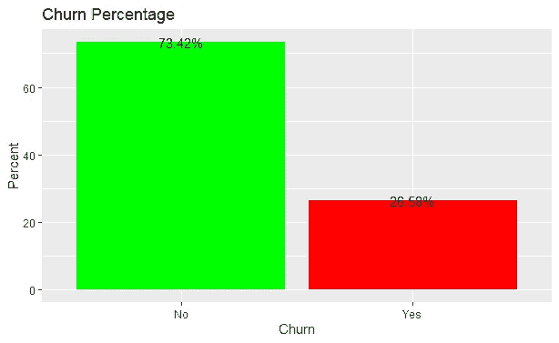

图 3:流失率

3.条形图显示分类变量中的流失率。

```
fig1 <-   ggarrange(ggplot(data, aes(x=gender,fill=Churn))+ geom_bar() ,
          ggplot(data, aes(x=SeniorCitizen,fill=Churn))+ geom_bar(position = 'fill'),
          ggplot(data, aes(x=Partner,fill=Churn))+ geom_bar(position = 'fill'),
          ggplot(data, aes(x=Dependents,fill=Churn))+ geom_bar(position = 'fill'),
          ggplot(data, aes(x=PhoneService,fill=Churn))+ geom_bar(position = 'fill'),
          ggplot(data, aes(x=MultipleLines,fill=Churn))+ geom_bar(position = 'fill'),
          ggplot(data, aes(x=InternetService,fill=Churn))+ geom_bar(position = 'fill'),
          ggplot(data, aes(x=OnlineSecurity,fill=Churn))+ geom_bar(position = 'fill'),
          ggplot(data, aes(x=OnlineBackup,fill=Churn))+ geom_bar(position = 'fill'),
          ggplot(data, aes(x=DeviceProtection,fill=Churn))+ geom_bar(position = 'fill'),
          ggplot(data, aes(x=TechSupport,fill=Churn))+ geom_bar(position = 'fill'),
          ggplot(data, aes(x=StreamingTV,fill=Churn))+ geom_bar(position = 'fill'),
          ggplot(data, aes(x=StreamingMovies,fill=Churn))+ 
geom_bar(position = 'fill'),
          ggplot(data, aes(x=Contract,fill=Churn))+ 
geom_bar(position = 'fill'),
          ggplot(data, aes(x=PaperlessBilling,fill=Churn))+ 
geom_bar(position = 'fill'),
          ggplot(data, aes(x=PaymentMethod,fill=Churn))+
geom_bar(position = 'fill')+theme_bw()+
          rremove("x.text"), 
          ncol = 3, nrow = 6,
          common.legend = TRUE, legend = "bottom")
annotate_figure(fig1, bottom  = text_grob("Churn Percentage in categorical variables", col = "blue", face = "bold", size = 14))
```

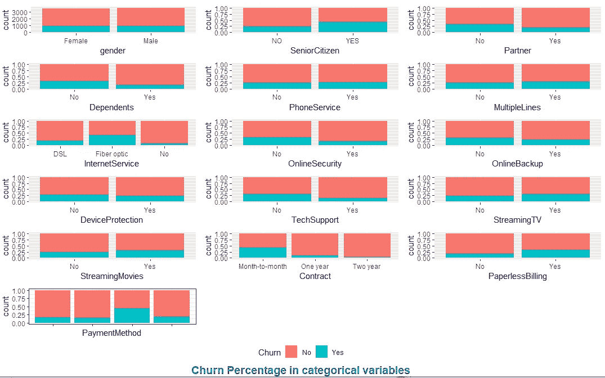

图 4:分类变量中的流失百分比

4.以数字变量显示流失百分比的条形图。

```
fig2 <-   ggarrange(
          ggplot(data, aes(y= tenure, x = "", fill = Churn))
+geom_boxplot() + xlab(" "),
          ggplot(data, aes(y= MonthlyCharges, x = "", fill = Churn))                                   +geom_boxplot() + xlab(" "),
          ggplot(data, aes(y= TotalCharges, x = "", fill = Churn)) 
+geom_boxplot() + xlab(" "),
          rremove("x.text"),
          ncol = 2, nrow = 2, common.legend = TRUE, legend = "bottom")annotate_figure(fig2, bottom  = text_grob("Churn Percentage in numeric variables", col = "red", face = "bold", size = 14))
```

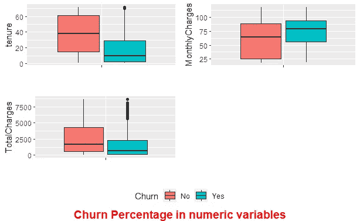

图 5:数字变量中的流失率

# 不同模型的分析

## 逻辑回归

1.  将数据拆分为训练集和测试集

```
set.seed(123)
split <- sample.split(data_final$Churn, SplitRatio = 0.70)
train <- data_final[split,]
test <- data_final[!(split),]
```

2.计算基线精度

```
prop.table(table(train$Churn))
```

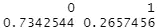

图 6:基线精度

3.使用 glm()函数拟合模型

```
glm <- glm(Churn ~., data = train, family = "binomial")
summary(glm)
```

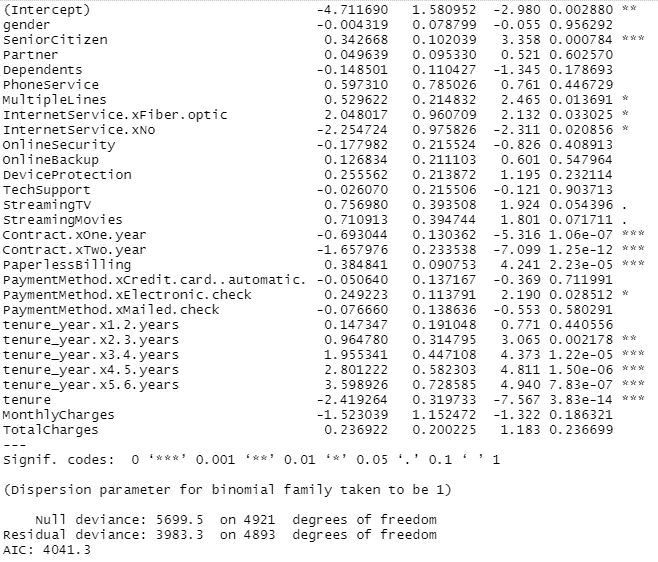

图 7:来自 GLM 的总结

4.计量精度

```
pred <- predict(glm, data = train, type = "response")# confusion matrix on training setglmtab1 <- table(train$Churn, pred >= 0.5)
acc_glm_train <- (3275+708)/nrow(train)# observations on the test set
predtest <- predict(glm, newdata = test, type = "response")
glmtab2 <- table(test$Churn, predtest >= 0.5)
acc_glm_test <- (1382+307)/nrow(test) 
```

***精度= 0.80***

5.重要变量


图 8:来自 GLM 的重要变量

## 随机森林

1.  拟合模型

```
fit_rf <- randomForest(Churn ~ ., data=train, proximity=FALSE,importance = FALSE)
fit_rf
```

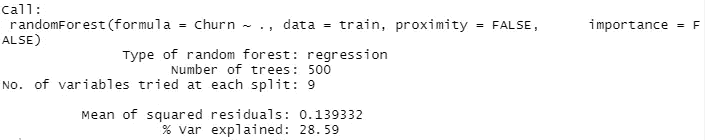

图 9:来自 RF 的摘要

2.计算精度

```
predrf <- predict(fit_rf, data = "train", type = "response")rftab <- table(predrf, train$Churn)
acc_rf_train <- (3248+694)/nrow(train)
acc_rf_train
```

***精度= 0.80***

3.误差和重要变量图

```
plot(fit_rf)
varImpPlot(rf)
```

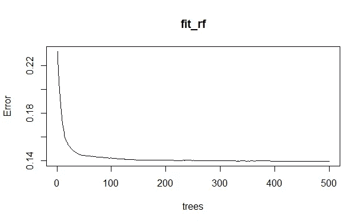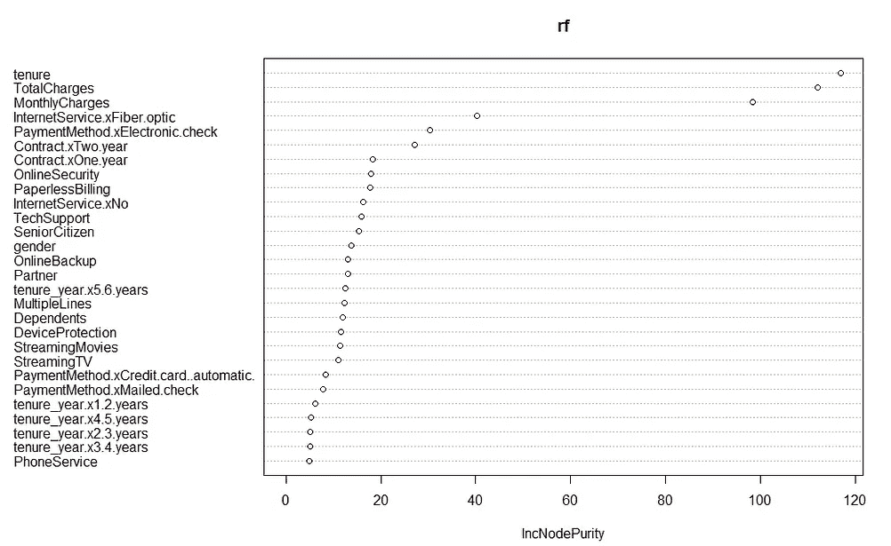

图 10:RF 方法的误差和重要变量图

# 决策树

1.  符合模型

```
rpart <- rpart(Churn ~. , data = train, method = "class", control = rpart.control((cp = 0.05)))
summary(rpart)
```

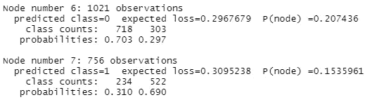

图 11:决策树摘要的一部分

2.计算精度

```
rpred <- predict(rpart, data = train, type = "class")
dtab1 <- table(rpred, train$Churn)
acc_rpart_train <- (3380+522)/nrow(train) rpredt <- predict(rpart, newdata = test, type = "class")
dtab2 <- table(rpredt, test$Churn)
acc_rpredt_test <- (1435+218)/nrow(test) 
```

***精度= 0.78***

3.重要变量

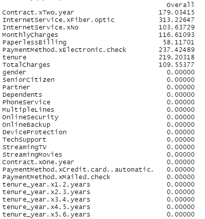

图 12:来自 DT 的重要变量。

**所有三款车型的 AUC**

本代码参考: [rstudio-pubs](http://rstudio-pubs-static.s3.amazonaws.com/277278_427ca6a7ce7c4eb688506efc7a6c2435.html) 。

```
library(pROC)glm.roc <- roc(response = test$Churn, predictor = as.numeric(predtest))
rpart.roc <- roc(response = train$Churn, predictor = as.numeric(predrf))
rf.roc <- roc(response = test$Churn, predictor = as.numeric(rpredt))plot(glm.roc,      legacy.axes = TRUE, print.auc.y = 1.0, print.auc = TRUE)
plot(rpart.roc, col = "blue", add = TRUE, print.auc.y = 0.65, print.auc = TRUE)
plot(rf.roc, col = "red" , add = TRUE, print.auc.y = 0.85, print.auc = TRUE)legend("bottom", c("Random Forest", "Decision Tree", "Logistic"),
       lty = c(1,1), lwd = c(2, 2), col = c("red", "blue", "black"), cex = 0.75)
```

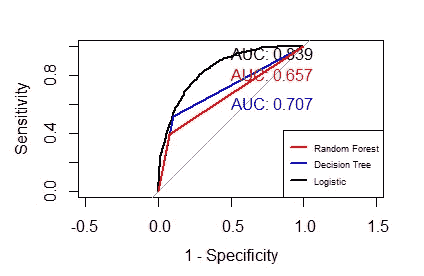

图 13:这些模型的 AUC

结论:

*   比较准确性和 AUC 值，逻辑模型比随机森林和决策树更好地预测该特定数据集中的流失。
*   任期、合同、无纸账单、互联网服务是最重要的特征。
*   一些特征如性别、伴侣等对客户流失没有影响。

其他故事:

1.  [R 中的时间序列预测](https://medium.com/@aashiqreza/time-series-forecasting-in-r-80a0e5834a4f?source=friends_link&sk=317b90e40789464ba9651de10910efca)
2.  [比较 ARIMA 和 NNAR 模型预测商品价格的方法。](/an-approach-to-make-comparison-of-arima-and-nnar-models-for-forecasting-price-of-commodities-f80491aeb400)
3.  [R](https://medium.com/@aashiqreza/market-share-prediction-with-r-57d9145ac97b)市场份额预测