# 量子位的实践探索

> 原文：<https://towardsdatascience.com/hands-on-exploration-of-the-qubit-815bee3f30dd?source=collection_archive---------38----------------------->

## 量子计算入门

本帖是本书的一部分: [**用 Python 实践量子机器学习**](https://www.pyqml.com/page?ref=medium_qubit&dest=/)

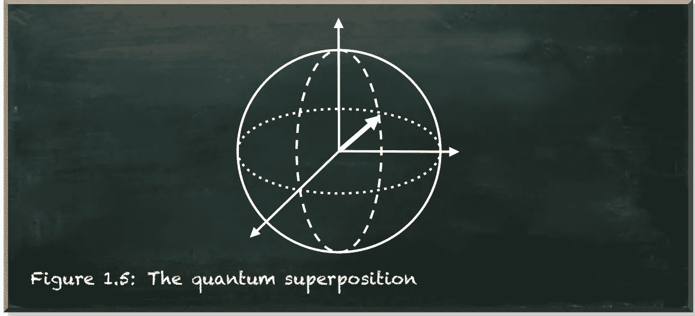

作者弗兰克·齐克特的图片

量子力学的世界是…不同的。量子系统可以处于叠加态。一个流行的叠加概念是系统同时处于不同的状态，除非你测量它。

例如，一个粒子的自旋不是向上**或向下**，而是同时向上**和向下**。但是当你看它的时候，你会发现它不是向上**就是向下**。

或者，假设你掷一枚量子硬币。在空中，它有两个值头**和**尾。当且仅当你抓住它，看着它，它决定一个值。一旦落地，它就是一枚正面朝上**或反面朝上**的普通硬币。

叠加的另一个概念是，系统是真正随机的，因此与我们已知的系统不同。例如，投掷一枚(正常的)硬币似乎是随机的，因为无论何时你这样做，情况都略有不同。即使是微小的差异也会改变结果。硬币对初始条件有敏感的依赖性。

如果我们能够精确地测量所有的条件，我们就能知道结果。在经典力学中，没有随机性。我们日常生活中的事物，比如硬币，似乎是随机的。但事实并非如此。如果用无限精确的方法测量，随机性就会消失。相比之下，量子系统是真正随机的。

也许你会疑惑:*好吧，随机。有什么大不了的？*

重要的是后果。在一个经典系统中，一个对初始条件敏感的系统，在我们提问之前，问题的答案就已经确定了。

今晚你没有去看棒球比赛，而是和朋友一起度过了这个夜晚。当你回到家，即使你不知道结果，比赛已经结束，有了确定的结果。可能会有不同的结果，但你只是在看到它之前不知道结果。

相反，在量子系统中，问题的答案直到你问它的时候才确定。因为还没有确定，你仍然可以改变测量不同状态的概率。

如果你有疑问，很好！甚至连爱因斯坦都不喜欢这个想法。这让他说出了他的名言:上帝不掷骰子(T21)。

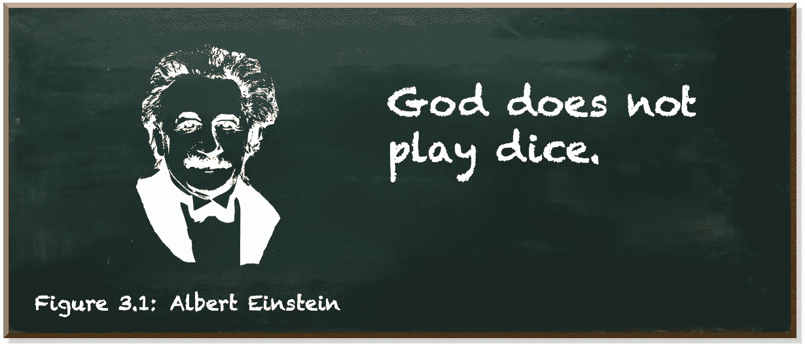

作者弗兰克·齐克特的图片

包括爱因斯坦在内的许多物理学家提出，尽管量子态是隐藏的，但它是一个定义明确的态。这就是所谓的*隐变量理论*。

在遵循隐藏变量理论的系统和遵循叠加原理的量子系统之间存在统计上不同的行为。实验表明量子力学的预测是正确的。

现在，让我们接受量子态是不同的。在本书的后面，我们将更仔细地研究它。以及它的后果。但这需要更多的理论和数学知识。

我们求助于量子计算机。假设你有一个量子比特。我们称之为量子位。除非你观察它的值，否则它处于`0`和`1`的叠加状态。一旦你观察到它的值，你就会得到`0`或者`1`。

一个量子位产生任何一个值的几率不需要 50:50。可以是 25:75，67:33，甚至 100:0。它可以是任何加权概率分布。

一个量子位被观察时的概率分布取决于它的状态。量子态。

在量子力学中，我们用矢量来描述量子态。表示量子状态向量的一种流行方式是狄拉克符号的“ket”，看起来像|ψ⟩|ψ⟩.在 Python 中，我们没有向量。但是我们有数组。幸运的是，它们的结构相似。

让我们看一看。我们从最简单的例子开始。比方说，我们有一个量子位，当被观察时，它的值总是`0`。如果你认为这个量子位在被观察到之前就必须有值`0`，你就不会完全错了。然而，你会不精确。在被观察到之前，这个量子位有 1 (=100%=100%)的概率在被观察时具有值`0`。

这些是一个量子位的等价表示(ket，vector，array ),当观察时总是产生`0`:

|0⟩=[1 0]和 Python 中的`[1, 0]`。

因此，下面的表示描述了一个量子位，当观察时，它总是产生`1`:

|1⟩=[0 1]和 Python 中的`[0, 1]`。

好了，理论到此为止。我们来看看这样一个量子位的代码。

您将需要一个 Python 环境。我会推荐在虚拟环境中运行的 Jupyter 笔记本电脑。我整理了一个关于如何建立这样一个环境的简要说明。

除了一般的设置，我们还需要两个库: **Qiskit** 和 **Matplotlib** 。Qiskit 是 IBM 的 Python SDK，用于量子编程。Matplotlib 是一个用于在 Python 中创建静态、动画和交互式可视化的综合库

您可以使用`pip`安装两者:

```
pip install qiskit — user
pip install matplotlib
```

在您的主目录中安装 Qiskit。使用`--user`在安装过程中不依赖任何特权(即管理员权限)。

如果您还没有配置您的工作站，请看一下如何设置工作环境的简要说明(参见{ configuring-your-quantum-machine-learning-workstation })。

现在，打开 *Jupyter* 笔记本，测试 *Qiskit* 是否工作。

```
import qiskit
qiskit.__qiskit_version__{'qiskit-terra': '0.15.1',
 'qiskit-aer': '0.6.1',
 'qiskit-ignis': '0.4.0',
 'qiskit-ibmq-provider': '0.8.0',
 'qiskit-aqua': '0.7.5',
 'qiskit': '0.20.0'}
```

如果你得到这样的回应， *Qiskit* 有效。太好了！我们已经准备好创造我们的第一个量子比特。

第一个量子位

*Qiskit* 的基本单元是量子电路。量子电路是量子计算的模型。这个项目，如果你愿意的话。我们的电路由一个量子位组成(第 4 行)。

我们将`[0,1]`定义为我们量子位的`initial_state`(第 7 行)，并用它初始化我们量子电路的第一个也是唯一的量子位(在阵列的位置`0`)(第 10 行)。

还记得`[0,1]`吗？这相当于|1⟩=[0 1]。用简单的英语来说，它是一个量子位，当观察时产生值`1`。

这就是了。现在是时候启动我们的量子计算机了。万一你没有，没问题。我们可以模拟一下。(万一你有:*“酷，让我知道”*)。

准备模拟后端

*Qiskit* 提供了`Aer`包(我们在第 1 行导入它)。它为模拟量子电路提供了不同的后端。最常见的后端是`statevector_simulator`(第 4 行)。

`execute`-函数(我们也在第 1 行导入)在指定的`backend`运行我们的量子电路(`qc`)。它返回一个具有有用方法`job.result()`的`job`-对象。一旦我们的程序完成它，它就返回`result`对象。

让我们来看看我们的量子位在起作用。

Qiskit 使用 Matplotlib 来提供有用的可视化。简单的直方图就可以了。`result`对象提供了`get_counts`方法来获取被执行电路的直方图数据(第 5 行)。

方法`plot_histogram`返回一个 Jupyter 自动绘制的 *Matplotlib* 图形(第 8 行)。

我们看到我们有 100%的机会观察到值`1`。

测量的量子位

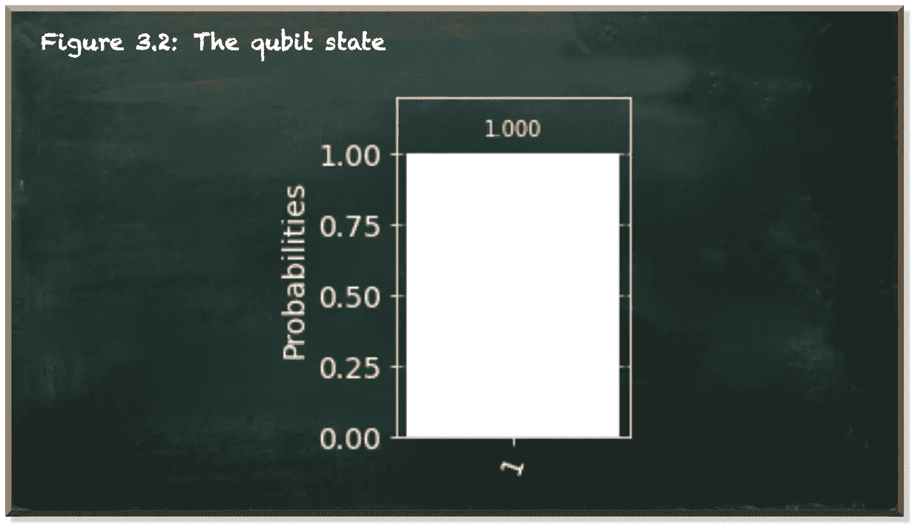

作者弗兰克·齐克特的图片

现在，让我们来看一个更高级的案例。比方说，我们希望我们的量子位以相同的概率(50:50)产生`0`或`1`。

在量子力学中，有基本的叠加原理。它说，任何两个(或更多)量子态可以加在一起(“叠加”)，结果将是另一个有效的量子态。

等等！我们已经知道两个量子态，|0⟩和|1⟩.我们为什么不把它们加进去呢？|0⟩和|1⟩是媒介。将两个向量相加非常简单。

向量是一种具有大小(或长度)和方向的几何对象。通常，它们用直箭头表示，从坐标轴上的一点开始，到另一点结束。

通过将一个向量的尾部放在另一个向量的头部，可以添加两个向量。尚未连接的尾部和尚未连接的尾部之间的直线是两个向量的和。看看下图。

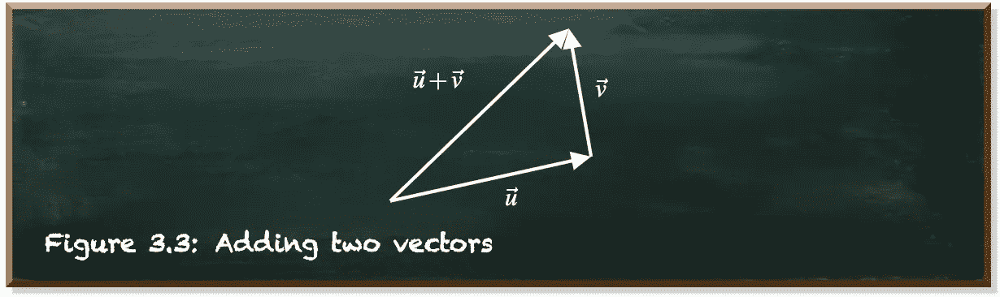

作者弗兰克·齐克特的图片

从数学上来说，这很容易。

设 u=[u1 u2]和 v=[v1 v2]为两个向量。

u 和 v 之和为:

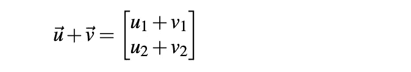

相应地，我们的叠加态应该是ψ∫:
*∑ψ(“psi”)是一种常用于量子系统状态的符号。*

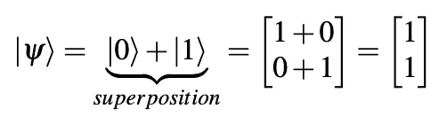

我们手里有一台电脑。我们为什么不试试呢？

首次尝试叠加两种状态

```
QiskitError: 'Sum of amplitudes-squared does not equal one.'
```

它不太管用。它告诉我们:`QiskitError: 'Sum of amplitudes-squared does not equal one.'`。

振幅是数组中的值。它们与概率成正比。所有的概率加起来应该正好是 1 (100%)。我们需要增加量子态|0⟩和|1⟩.的重量姑且称之为α和β。

我们用α加权|0⟩，用β加权|1⟩。像这样:

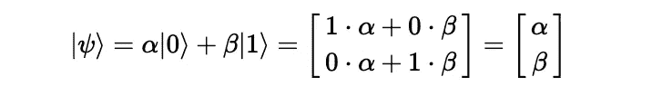

振幅与概率成正比。我们需要将它们规范化，以便:


如果|0⟩和|1⟩两个州应该有相同的权重，那么 **α=β** 。因此，我们可以求解等式到α:

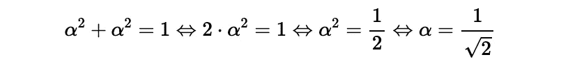

我们插入α和β的值(两者相等)。让我们试试这个量子态:

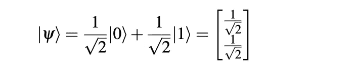

Python 中对应的数组是:`[1/sqrt(2), 1/sqrt(2)]`。别忘了进口`sqrt`。

加权初始状态

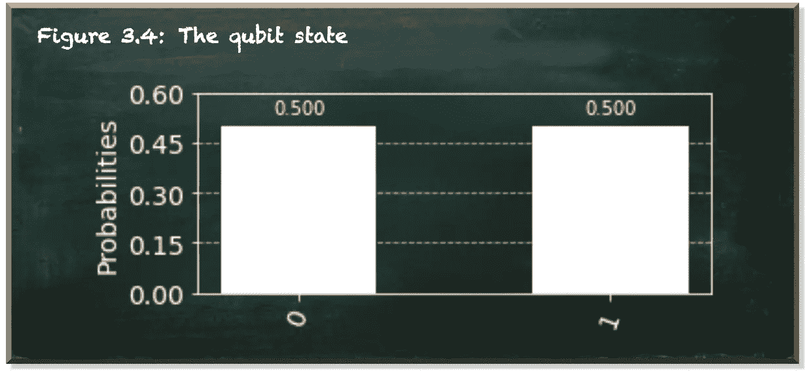

作者弗兰克·齐克特的图片

唷。在这篇文章中，我们介绍了相当多的术语和方程，只是为了对量子力学有所了解。但是实际的源代码非常简洁，不是吗？

我们引入了量子态的概念。特别是二元量子系统的状态。量子位或量子位。

在我们观察到一个量子比特之前，它是处于叠加态的。与可能是`0`或`1`的经典比特相反，量子比特是两种状态的叠加。但是一旦你观察它，就有明显的概率测量出`0`或`1`。

这意味着对处于相同状态的多个量子位进行多次测量不会总是得到相同的结果。当观察时，量子比特具有α^2 导致`0`和β^2 导致`1`的概率的等效表示为:

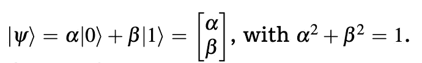

在 Python 中，数组`[alpha, beta]`表示这种状态。

本帖是本书的一部分: [**用 Python 动手做量子机器学习。**](https://www.pyqml.com/page?ref=medium_qubit&dest=/)


免费获取前三章[点击这里](https://www.pyqml.com/page?ref=medium_qubit&dest=/)。