# NBA 球员统计数据 R 包“ggplot2”中数据可视化的实践指导

> 原文：<https://towardsdatascience.com/hands-on-guidance-of-data-visualization-in-r-package-ggplot2-of-nba-players-stats-d812ed272d66?source=collection_archive---------25----------------------->

## 工具

## 应用于 NBA 数据的 R 数据可视化工具“ggplot2”的 6 分钟之旅。


卢克·切瑟在 [Unsplash](https://unsplash.com?utm_source=medium&utm_medium=referral) 上的照片

我最近通读了关于数据科学 的书 [***R，发现 R 中的***【gg plot 2】***比我想象的更强大。***](https://r4ds.had.co.nz/data-visualisation.html)

所以，我通过将它应用于 2019-2020 赛季的 NBA 球员统计数据来玩这个工具。在本文中，我将一步一步地分享我的探索，并希望 R 中的“ggplot2”可以成为您的数据科学工具箱中的另一个有用工具。

我要澄清一下，下面的材料是通过探究 ggplot2 中的函数来驱动的，而不是理解数据。

# 1.基本指挥结构。

[***数据科学中的 R***](https://r4ds.had.co.nz/data-visualisation.html)描述了在 *ggplot2* 中生成图的方程如下图所示:

```
ggplot(data = <DATA>) +
      <GEOM_FUNCTION>(
                     mapping = aes(<MAPPINGS>),
                     stat = <STAT>,
                     position = <POSITION>
                     )+ 
      <COORDINATE_FUNCTION> + <FACET_FUNCTION>
```

其中 ***数据*** 是您的数据框，***GEOM _ 函数*** 是您要使用的绘图类型(如柱状图)， ***映射*** 是要绘图的变量(如 x 和 y)，*统计*是应用于您的数据框中原始数据的方程式(如计算观察值)， ***坐标 _ 函数***

# 2.数据集。

2019-2020 NBA 赛季每场比赛的球员统计数据*。*

*数据集已经通过删除“NA”和纠正赛季中交易的球员的统计数据进行了清理。*

# *3.代码和图。*

## *a.散点图和折线图*

**ggplot2* 生成的复杂图形通常包含多个 ***层*** ，基本上是一个***GEOM _ 函数*** s 序列生成的图的重叠，因此，如果没有指定***GEOM _ 函数*** 的话，这个图将是空的。*

*我们先把 ***放一层*** 在图上，这是一个散点图，x 是出场分钟数(MP)，y 是做的分钟数(PTS)。*

```
*ggplot(data = df, mapping = aes(x = MP, y=PTS)) + 
  geom_point()*
```

*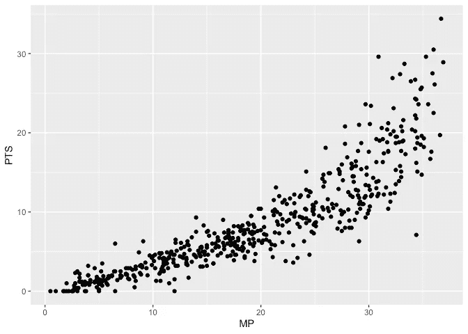*

*裕丰的 ggplot 几何点()*

*在这里，我将 ***映射*** 放在 *ggplot()* 函数中，而不是 *geom_point()* 函数中，以将其设置为一个全局变量，该变量将被后面的所有图层使用。但也可以放入 *geom_point()* 中，作为局部变量代替。*

*看起来，球员的上场时间和每场比赛的得分之间存在着正相关，然而，它并不是严格的线性关系，这表明即使在相同的上场时间内，普通球员也不能像超级明星那样获得那么多的得分。*

*太简单了？*

*是的，您可以通过指定数据中相应的列名来添加 ***颜色*** 或 ***形状*** 。*

```
*ggplot(data = df, mapping = aes(x = MP, y=PTS, color = Pos, shape = Pos)) + 
  geom_point()*
```

*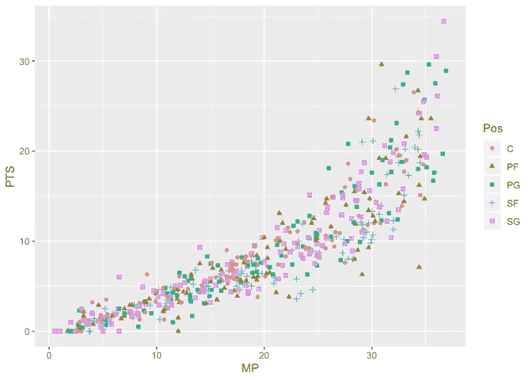*

*裕丰的 ggplot 几何点()*

*这里，我使用数据集中的变量 *Pos* 将玩家分成五组，并用不同的颜色和形状突出显示这些点。*

*也可以将颜色分配给连续变量，而不是分类变量，如下例所示。*

```
*ggplot(data = df, mapping = aes(x = MP, y=PTS, color = Age)) + 
  geom_point()*
```

*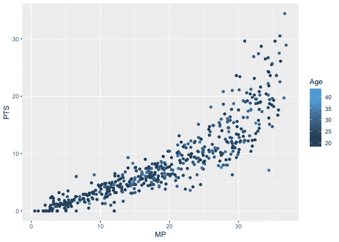*

*裕丰的 ggplot 几何点()*

****ggplot2*** 的神奇之处在于，你甚至可以在参数中指定一个条件。比如我们要把 ***LA 湖人*** 和其他球队分开。*

```
*ggplot(data = df, mapping = aes(x = MP, y=PTS, color = Tm == "LAL")) + 
  geom_point()*
```

*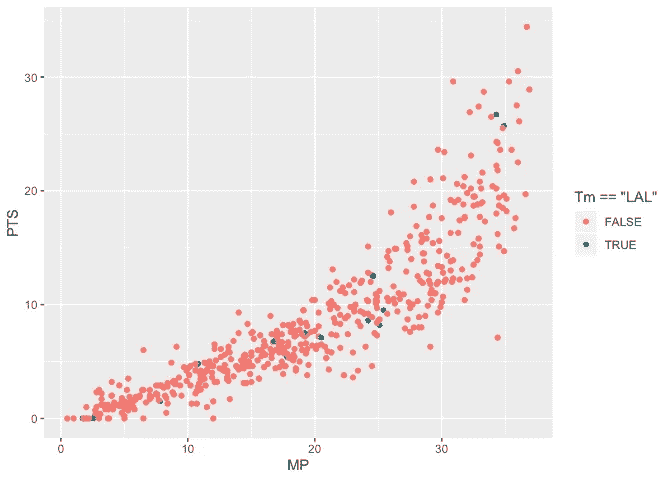*

*裕丰的 ggplot 几何点()*

*这里， *Tm* 代表数据集中的球队，*“拉尔”*就是 ***湖人*** 。*

*事实上，散点图非常混乱，所有的东西都相互重叠，很难得出任何结论。*

*接下来，让我们尝试根据数据集中的分类变量将数据分成不同的组。*

*例如，我想按团队划分数据。我将使用与之前相同的 ***ggplot*** 等式，但是使用***FACET _ FUNCTION***调整刻面中的输出。*

```
*ggplot(data = df, mapping = aes(x = MP, y=PTS,color = Pos)) + 
  geom_point() + 
  facet_wrap(~Tm, nrow = 6)*
```

*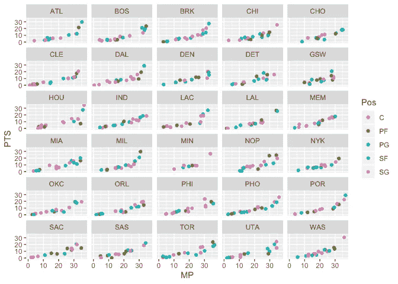*

*裕丰的 ggplot 几何点()*

*您还可以在 facet 函数中使用多个分类变量来实现这一点，方法是将 *facet_wrap()* 替换为 *facet_grid()* 。*

```
*ggplot(data = df, mapping = aes(x = MP, y=PTS)) + 
  geom_point() + 
  facet_grid(Pos~Tm)*
```

*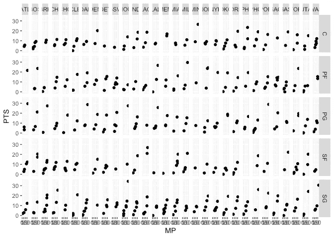*

*裕丰的 ggplot 几何点()*

*很乱，对吧？这是我们需要避免的视觉化现象之一。*

*接下来，我将添加另一层的情节。*

```
*ggplot(data = df,mapping = aes(x = MP, y=PTS, color = Pos)) + 
  geom_point() +
  geom_smooth()*
```

*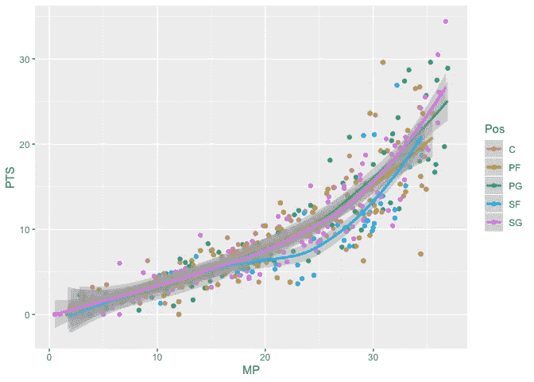*

*裕丰的 ggplot 几何点()*

*这个图现在有了另一层由 *geom_smooth()* 生成的折线图。由于我们在 *ggplot()* 中的全局变量中指定了参数“颜色”，散点图和折线图都用相同的颜色设置按位置划分玩家。*

*为了让情节看起来不那么混乱，我决定添加 facet 函数来更好地组织它们。*

```
*ggplot(data = df,mapping = aes(x = MP, y=PTS, color = Pos)) + 
  geom_point() +
  geom_smooth() +
  facet_grid(Pos~.)*
```

*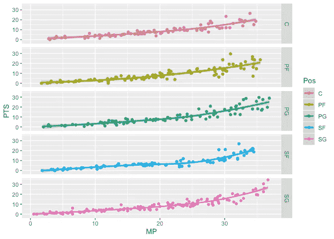*

*裕丰的 ggplot 几何点()*

*好多了，对吧？*

*似乎所有五个职位的趋势都是相似的。然而，与其他三个位置相比， **SG** 和 **SF** 在高 *MP* 区域，我确实观察到了稍微小一点的变化。这些结果让我想起了那些超级巨星的共同立场。*

## *b.柱状图和 Combcox 图*

*条形图是数据可视化中另一种流行的绘图类型。不过 ***ggplot2*** 中的 ***有点特殊*** ，因为它的默认功能是**而不是**绘制数据中的原始值。*

*原因与 ***ggplot2*** 中的 ***STAT*** 功能有关。条形图( *geom_bar* )的默认 ***STAT*** 函数是 *stat_count()* ，它计算由参数 x 定义的每个类别中的观察值数量。*

```
*ggplot(data = df) + 
  geom_bar(mapping=aes(x = Pos))*
```

*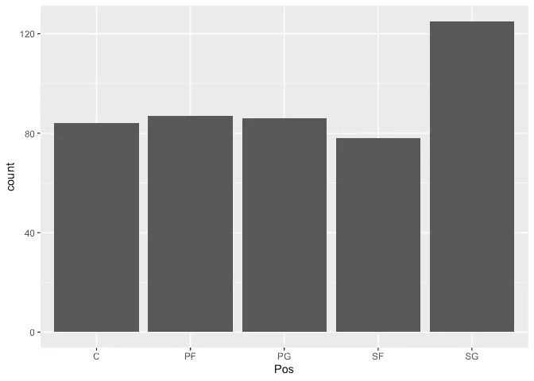*

*裕丰的 ggplot 几何点()*

*该图在 Y 轴上显示了每个类别的玩家数量，这是 ggplot2 中 geom_bar()函数的默认行为。*

*此外，条形的颜色需要通过*来定义，而不是通过 ***【颜色】*** 来定义，这是与散点图的另一个区别。**

```
**ggplot(data = df) + 
  geom_bar(mapping=aes(x = Pos, fill = Pos))**
```

**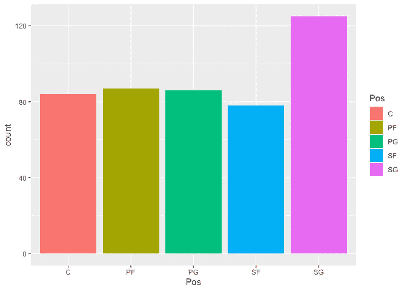**

**裕丰的 ggplot 几何点()**

**然而，大多数情况下，数据集中原始值的条形图比计数的条形图更重要，因此使用***‘stat = " identity "’***作为参数。**

```
**ggplot(data = df,mapping = aes(x = Pos, y = PTS, fill = Pos)) +
  geom_bar(stat = "identity")**
```

**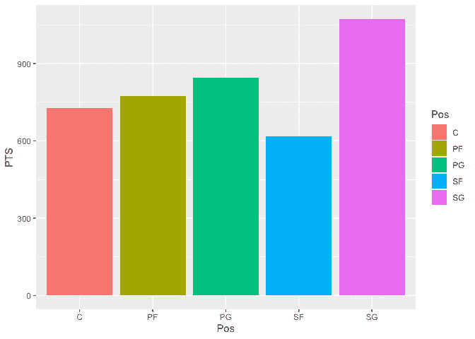**

**裕丰的 ggplot 几何点()**

**现在上图中的 y 轴从计数变为点数之和。**

**代码的最后一部分展示了您可以用不同的坐标类型显示生成的图形。我最喜欢的一个叫做**鸡冠图**，如下图所示。**

```
**ggplot(data = df,mapping = aes(x = Pos, y = PTS, fill = Pos)) +
  geom_bar(stat = "identity",width = 1) + 
  coord_polar()**
```

**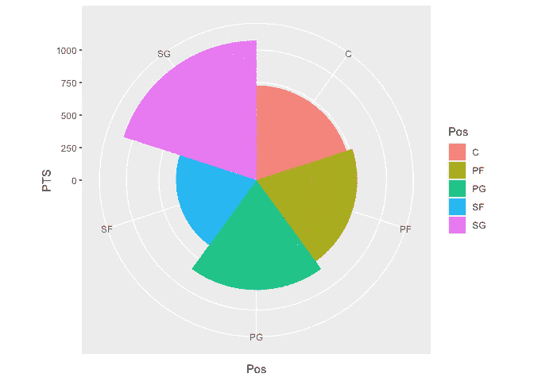**

**裕丰的 ggplot 几何点()**

**是不是很酷？**

**我们可以从数据中解读出，得分后卫在赛季场均总得分中贡献最大。然而，这可能是因为这个位置的玩家数量最多。**

> **尽管 NBA 在球员冠状病毒检测呈阳性后暂停赛季，但我希望所有的球员、球迷和世界人民保持健康，并赢得这场对抗病毒的战争。**

**希望 ggplot2 成为你作为数据科学家的可视化武器之一。**

****

**由 [Max Duzij](https://unsplash.com/@max_duz?utm_source=medium&utm_medium=referral) 在 [Unsplash](https://unsplash.com?utm_source=medium&utm_medium=referral) 上拍照**

## **参考资料:**

1.  **[*Garrett Grolemund 和 Hadley Wickham，R 为数据科学*](https://r4ds.had.co.nz/index.html)**