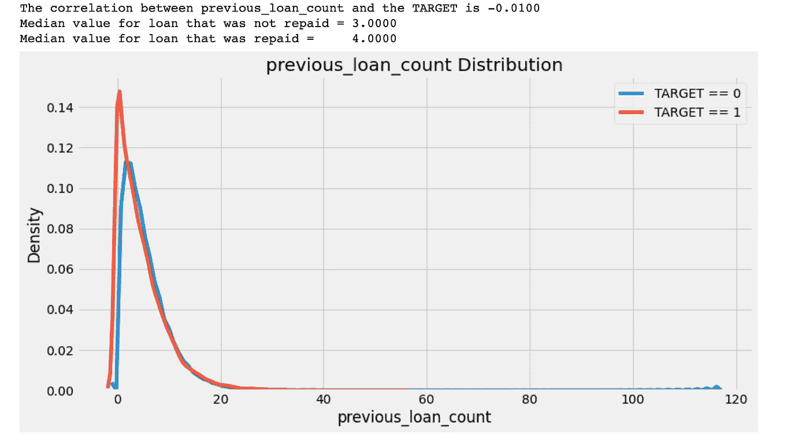
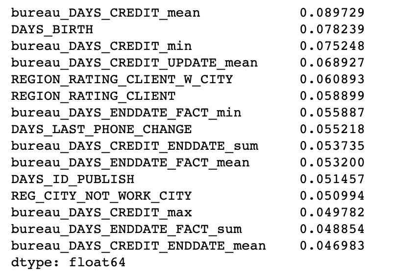
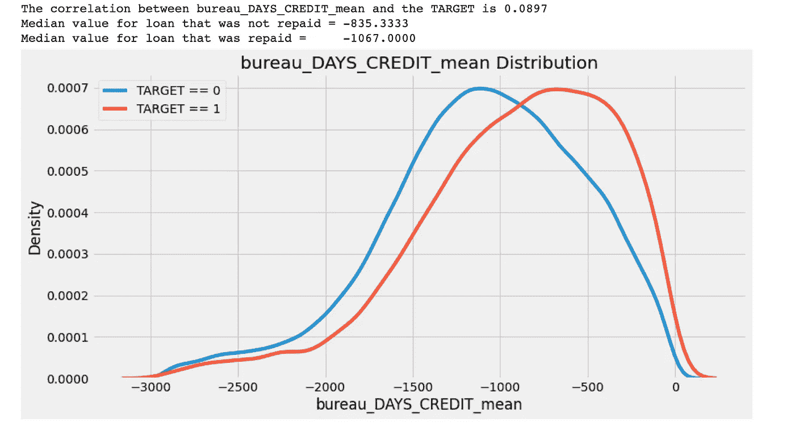
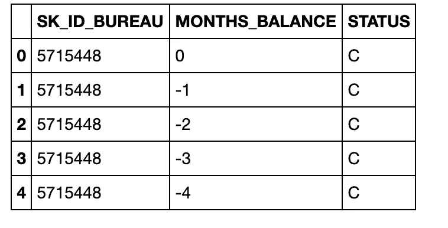
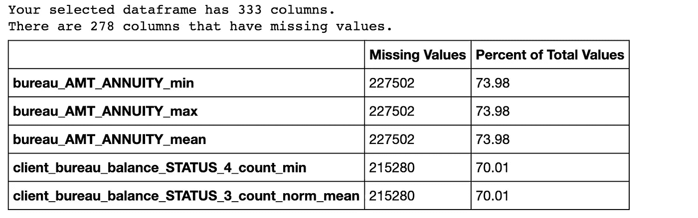
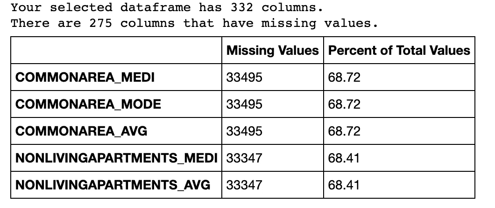
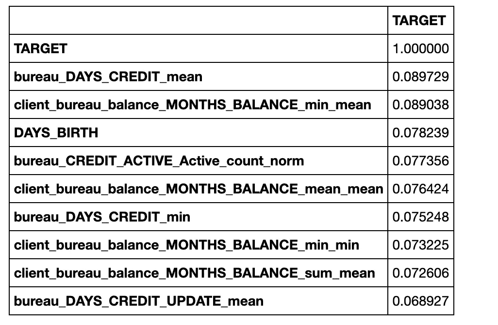
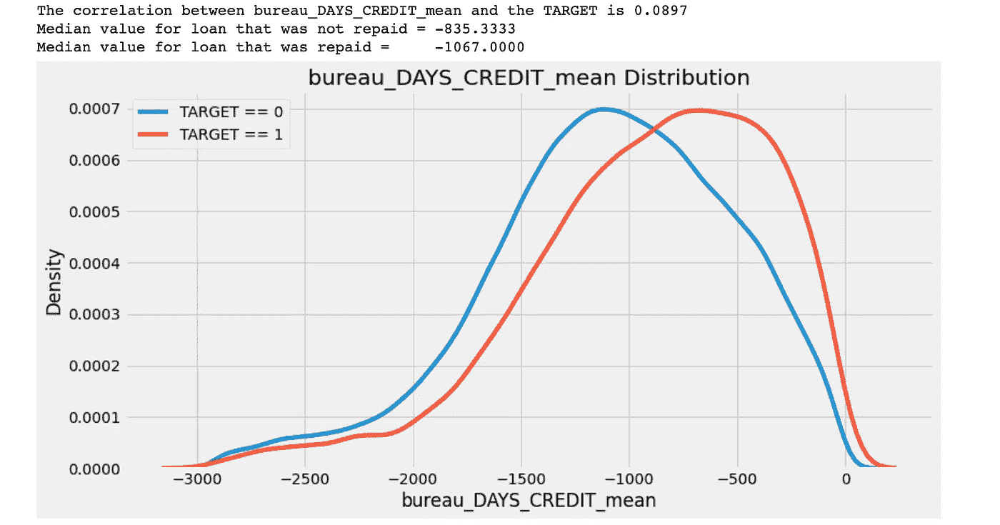
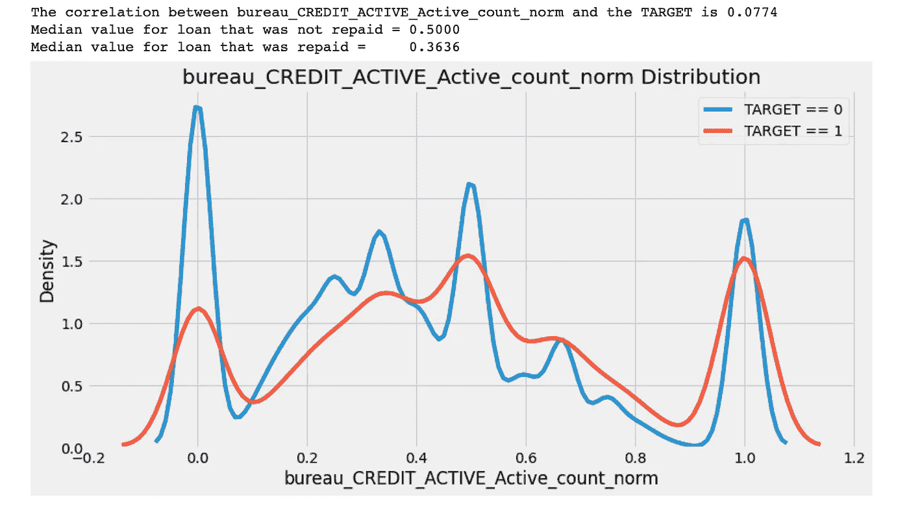

# Python 中要素工程的实践指南

> 原文：<https://towardsdatascience.com/hands-on-guide-to-feature-engineering-de793efc785?source=collection_archive---------39----------------------->

## 一步一步地从数据中提取有用的见解


照片由[约书亚·索蒂诺](https://unsplash.com/@sortino?utm_source=unsplash&utm_medium=referral&utm_content=creditCopyText)在 [Unsplash](https://unsplash.com/s/photos/innovation?utm_source=unsplash&utm_medium=referral&utm_content=creditCopyText) 上拍摄

# 介绍

在本指南中，我将介绍如何利用数据操作来手动提取特征。

手动特征工程可能会令人疲惫不堪，并且需要大量的时间、经验和领域知识来开发正确的特征。有许多可用的自动特征工程工具，如 FeatureTools 和 AutoFeat。然而，手动特征工程对于理解这些高级工具是必不可少的。此外，这将有助于建立一个稳健的通用模型。我将使用 Kaggle 平台上可用的住房信贷违约风险数据集。我将只使用主文件夹中的两个表`bureau`和`bureau_balance`。根据竞争页面上的数据集描述，表格如下:

**bureau.csv**

*   此表包括所有客户以前从其他金融机构向信用局报告的信用。

**bureau_balance.csv**

*   信用局早期贷款的每月余额。
*   该表中有一行记录了每个月向信用局报告的每笔贷款的历史。

# 本教程将涵盖相关主题

1.  读取和管理数据—定制 KDE 图
2.  调查相关性
3.  聚合数字列
4.  获取 bureau_balance 的统计数据
5.  调查分类变量
6.  将计算出的特征插入训练数据集中
7.  检查缺失的数据
8.  相关
9.  共线性

# 1.读取和管理数据

我将从导入一些有助于理解数据的重要库开始。

```
*# pandas and numpy for data manipulation* import pandas as pd
import numpy as np

*# matplotlib and seaborn for plotting*
import matplotlib.pyplot as plt
import seaborn as sns

*# Suppress warnings from pandas*
import warnings
warnings.filterwarnings('ignore')

plt.style.use('fivethirtyeight')
```

我先开始分析 bureau.csv:

```
*# Read in bureau*
bureau = pd.read_csv('../input/home-credit-default-risk/bureau.csv')
bureau.head()
```

该表有 1716428 个观察值和 17 个特征。

```
SK_ID_CURR                  int64
SK_ID_BUREAU                int64
CREDIT_ACTIVE              object
CREDIT_CURRENCY            object
DAYS_CREDIT                 int64
CREDIT_DAY_OVERDUE          int64
DAYS_CREDIT_ENDDATE       float64
DAYS_ENDDATE_FACT         float64
AMT_CREDIT_MAX_OVERDUE    float64
CNT_CREDIT_PROLONG          int64
AMT_CREDIT_SUM            float64
AMT_CREDIT_SUM_DEBT       float64
AMT_CREDIT_SUM_LIMIT      float64
AMT_CREDIT_SUM_OVERDUE    float64
CREDIT_TYPE                object
DAYS_CREDIT_UPDATE          int64
AMT_ANNUITY               float64
dtype: object
```

我们需要得到每个客户 id 是多少以前的贷款`SK_ID_CURR`。我们可以使用 pandas 聚合函数`groupby`和`count().`来得到这个结果，然后在为了可读性而将`SK_ID_BUREAU`重命名为`previous_loan_count`之后，将新的结果存储在一个新的数据帧中。

```
*# groupby client-id, count #previous loans*
**from** **pandas** **import** DataFrame

prev_loan_count = bureau.groupby('SK_ID_CURR', as_index = **False**).count().rename(columns = {'SK_ID_BUREAU': 'previous_loan_count'})
```

新的`prev_loan_count`只有 305811 个观测值。现在，我将通过客户端 id `SK_ID_CURR`将`prev_loan_count`数据帧合并到`train`数据集中，然后用 0 填充缺失的值。最后，检查新列是否已经使用`dtypes`函数添加。

```
# join with the training dataframe
# read train.csvpd.set_option('display.max_column', None)
train = pd.read_csv('../input/home-credit-default-risk/application_train.csv')
train = train.merge(prev_loan_count, on = 'SK_ID_CURR', how = 'left')# fill the missing values with 0train['previous_loan_count'] = train['previous_loan_count'].fillna(0)
train['previous_loan_count'].dtypesdtype('float64')
```

它已经在那里了！

# 2.调查相关性

下一步是通过特征重要性探索属性之间的皮尔逊相关值或( **r 值**)。它不是衡量新变量重要性的标准；但是，它提供了一个变量对模型是否有帮助的参考。

因变量的相关性越高，意味着该变量的任何变化都会导致因变量的显著变化。因此，在下一步中，我将研究相对于因变量的 r 值的最高绝对值。

核密度估计(KDE)是描述因变量和自变量之间关系的最佳方法。

```
# Plots the disribution of a variable colored by value of the dependent variabledef kde_target(var_name, df):

    # Calculate the correlation coefficient between the new variable and the target
    corr = df['TARGET'].corr(df[var_name])

    # Calculate medians for repaid vs not repaid
    avg_repaid = df.loc[df['TARGET'] == 0, var_name].median()
    avg_not_repaid = df.loc[df['TARGET'] == 1, var_name].median()

    plt.figure(figsize = (12, 6))

    # Plot the distribution for target == 0 and target == 1
    sns.kdeplot(df.loc[df['TARGET'] == 0, var_name], label = 'TARGET == 0')
    sns.kdeplot(df.loc[df['TARGET'] == 1, var_name], label = 'TARGET == 1')

    # label the plot
    plt.xlabel(var_name); plt.ylabel('Density'); plt.title('%s Distribution' % var_name)
    plt.legend();

    # print out the correlation
    print('The correlation between %s and the TARGET is %0.4f' % (var_name, corr)) # Print out average values
    print('Median value for loan that was not repaid = %0.4f' % avg_not_repaid) print('Median value for loan that was repaid =     %0.4f' % avg_repaid)
```

然后对照`Target`检查`previous_loan_count`的分配

```
kde_target('previous_loan_count', train)
```



上一次贷款计数的 KDE 图

很难看出`TARGET`和`previous_loan_count`之间有任何显著的相关性。从图上看不出有明显的相关性。因此，需要使用聚合函数来研究更多的变量。

# 3.聚合数字列

我将选择按客户端 id 分组的数字列，然后应用统计函数`min, max, sum, mean, and count`来获得每个数字特性的汇总统计信息。

```
*# Group by the client id, calculate aggregation statistics*
bureau_agg = bureau.drop(columns = ['SK_ID_BUREAU']).groupby('SK_ID_CURR', as_index = **False**).agg(['count', 'mean', 'min','max','sum']).reset_index()
```

为可读性起见，为每个列创建一个新名称。然后与`train`数据集合并。

```
*# List of column names*
columns = ['SK_ID_CURR']

*# Iterate through the variables names*
**for** var **in** bureau_agg.columns.levels[0]:
    *# Skip the id name*
    **if** var != 'SK_ID_CURR':

        *# Iterate through the stat names*
        **for** stat **in** bureau_agg.columns.levels[1][:-1]:
            *# Make a new column name for the variable and stat*
            columns.append('bureau_**%s**_**%s**' % (var, stat))*# Assign the list of columns names as the dataframe column names*
bureau_agg.columns = columns# merge with the train dataset
train = train.merge(bureau_agg, on = 'SK_ID_CURR', how = 'left')
```

使用`TARGET`变量获取相关性，然后使用`sort_values()` Python 函数按绝对值对相关性进行排序。

```
# Calculate correlation between variables and the dependent variable
# Sort the correlations by the absolute valuenew_corrs = train.drop(columns=['TARGET']).corrwith(train['TARGET']).sort_values(ascending=False)
new_corrs[:15]
```



与目标变量的相关性

现在检查新创建的变量的 KDE 图

```
kde_target('bureau_DAYS_CREDIT_mean', train)
```



bureau_DAYS_CREDIT_mean 和目标之间的相关性

如图所示，相关性非常弱，可能只是噪声。此外，较大的负数表示该贷款在当前贷款申请之前。

# 4.获取 bureau_balance 的统计数据

```
bureau_balance = pd.read_csv('../input/home-credit-default-risk/bureau_balance.csv')bureau_balance.head()
```



bureau_balance.csv

# 5.调查分类变量

下面的函数遍历 dataframe，选择分类列并为其创建一个虚拟变量。

```
def process_categorical(df, group_var, col_name):
    """Computes counts and normalized counts for each observation
    of `group_var` of each unique category in every categorical variable

    Parameters
    --------
    df : dataframe 
        The dataframe to calculate the value counts for.

    group_var : string
        The variable by which to group the dataframe. For each unique
        value of this variable, the final dataframe will have one row

    col_name : string
        Variable added to the front of column names to keep track of columnsReturn
    --------
    categorical : dataframe
        A dataframe with counts and normalized counts of each unique category in every categorical variable
        with one row for every unique value of the `group_var`.

    """
    # pick the categorical column 
    categorical = pd.get_dummies(df.select_dtypes('O'))

    # put an id for each column
    categorical[group_var] = df[group_var]

    # aggregate the group_var
    categorical = categorical.groupby(group_var).agg(['sum', 'mean'])

    columns_name = []

    # iterate over the columns in level 0
    for var in categorical.columns.levels[0]:
        # iterate through level 1 for stats
        for stat in ['count', 'count_norm']:
            # make new column name
            columns_name.append('%s_%s_%s' %(col_name, var, stat))

    categorical.columns = columns_name

    return categorical
```

这个函数将为每个分类列返回一个统计数据`sum`和`mean`。

```
bureau_count = process_categorical(bureau, group_var = 'SK_ID_CURR',col_name = 'bureau')
```

对 bureau_balance 执行相同的操作

```
bureau_balance_counts = process_categorical(df = bureau_balance, group_var = 'SK_ID_BUREAU', col_name = 'bureau_balance')
```

现在，我们有了每笔贷款的计算结果。我们需要为每个*客户端*进行聚合。我将把所有以前的数据帧合并在一起，然后再次汇总按`SK_ID_CURR`分组的统计数据。

```
# dataframe grouped by the loan 
bureau_by_loan = bureau_balance_agg.merge(bureau_balance_counts, right_index = True, left_on = 'SK_ID_BUREAU', how = 'outer')# Merge to include the SK_ID_CURR
bureau_by_loan = bureau[['SK_ID_BUREAU', 'SK_ID_CURR']].merge(bureau_by_loan, on = 'SK_ID_BUREAU', how = 'left')# Aggregate the stats for each client
bureau_balance_by_client = agg_numeric(bureau_by_loan.drop(columns = ['SK_ID_BUREAU']), group_var = 'SK_ID_CURR', col_name = 'client')
```

# 6.将计算出的特征插入训练数据集中

```
original_features = list(train.columns)
print('Original Number of Features: ', len(original_features))
```

输出:原始特征数:122

```
# Merge with the value counts of bureau
train = train.merge(bureau_counts, on = 'SK_ID_CURR', how = 'left')# Merge with the stats of bureau
train = train.merge(bureau_agg, on = 'SK_ID_CURR', how = 'left')# Merge with the monthly information grouped by client
train = train.merge(bureau_balance_by_client, on = 'SK_ID_CURR', how = 'left')new_features = list(train.columns)
print('Number of features using previous loans from other institutions data: ', len(new_features))# Number of features using previous loans from other institutions data:  333
```

输出为:使用以前从其他机构贷款的特征数数据:333

# 7.检查缺失的数据

合并新特征后，检查训练集中缺失的数据非常重要。

```
# Function to calculate missing values by column# Funct 
def missing_percent(df):"""Computes counts and normalized counts for each observation
    of `group_var` of each unique category in every categorical variable

    Parameters
    --------
    df : dataframe 
        The dataframe to calculate the value counts for.Return
    --------
    mis_column : dataframe
        A dataframe with missing information .

    """
        # Total missing values
        mis_val = df.isnull().sum()

        # Percentage of missing values
        mis_percent = 100 * df.isnull().sum() / len(df)

        # Make a table with the results
        mis_table = pd.concat([mis_val, mis_percent], axis=1)

        # Rename the columns
        mis_columns = mis_table.rename(
        columns = {0 : 'Missing Values', 1 : 'Percent of Total Values'})

        # Sort the table by percentage of missing descending
        mis_columns = mis_columns[
            mis_columns.iloc[:,1] != 0].sort_values(
        'Percent of Total Values', ascending=False).round(2)

        # Print some summary information
        print ("Your selected dataframe has " + str(df.shape[1]) + " columns.\n"      
            "There are " + str(mis_columns.shape[0]) +
              " columns that have missing values.")

        # Return the dataframe with missing information
        return mis_columnstrain_missing = missing_percent(train)
train_missing.head()
```



火车 _ 失踪

有相当多的列有大量缺失数据。我将删除任何缺失数据超过 90%的列。

```
missing_vars_train = train_missing.loc[train_missing['Percent of Total Values'] > 90, 'Percent of Total Values']
len(missing_vars_train)
# 0
```

我将对测试数据做同样的事情

```
*# Read in the test dataframe*
test = pd.read_csv('../input/home-credit-default-risk/application_test.csv')

*# Merge with the value counts of bureau*
test = test.merge(bureau_counts, on = 'SK_ID_CURR', how = 'left')

*# Merge with the stats of bureau*
test = test.merge(bureau_agg, on = 'SK_ID_CURR', how = 'left')

*# Merge with the value counts of bureau balance*
test = test.merge(bureau_balance_by_client, on = 'SK_ID_CURR', how = 'left')
```

然后，将对齐`train`和`test`数据集，并检查它们的形状和相同的列。

```
*# create a train target label* 
train_label = train['TARGET']

*# align both dataframes, this will remove TARGET column*
train, test = train.align(test, join='inner', axis = 1)

train['TARGET'] = train_label
print('Training Data Shape: ', train.shape)
print('Testing Data Shape: ', test.shape)#Training Data Shape:  (307511, 333)
#Testing Data Shape:  (48744, 332)
```

让我们检查一下`test`组的缺失百分比。

```
test_missing = missing_percent(test) 
test_missing.head()
```



test_missing.head()

# 8.相关

我将检查与`TARGET`变量和新创建的特征的相关性。

```
# calculate correlation for all dataframes
corr_train = train.corr()# Sort the resulted values in an ascending order
corr_train = corr_train.sort_values('TARGET', ascending = False)# show the ten most positive correlations
pd.DataFrame(corr_train['TARGET'].head(10))
```



与目标变量相关的前 10 个特征

从上面的例子中可以看出，最相关的变量是早期设计的变量。然而，相关性并不意味着因果关系，这就是为什么我们需要评估这些相关性，并选择对`TARGET`有更深影响的变量。为此，我将坚持使用`KDE`剧情。

```
kde_target('bureau_DAYS_CREDIT_mean', train)
```



KDE 图为局 _ 天 _ 信用 _ 均值

该图表明，每月每笔贷款记录较多的申请人倾向于偿还新贷款。让我们更深入地研究一下`bureau_CREDIT_ACTIVE_Active_count_norm`变量，看看这是不是真的。

```
kde_target('bureau_CREDIT_ACTIVE_Active_count_norm', train)
```



局的 KDE 图 _ 信用 _ 活跃 _ 活跃 _ 计数 _ 定额

这里的相关性很弱，我们看不出有什么意义。

# 9.共线性

我将设置一个 80%的阈值来删除任何与`TARGET`高度相关的变量

```
*# Set the threshold*
threshold = 0.8

*# Empty dictionary to hold correlated variables*
above_threshold_vars = {}

*# For each column, record the variables that are above the threshold*
**for** col **in** corr_train:
    above_threshold_vars[col] = list(corr_train.index[corr_train[col] > threshold])*# Track columns to remove and columns already examined*
cols_to_remove = []
cols_seen = []
cols_to_remove_pair = []

*# Iterate through columns and correlated columns*
**for** key, value **in** above_threshold_vars.items():
    *# Keep track of columns already examined*
    cols_seen.append(key)
    **for** x **in** value:
        **if** x == key:
            next
        **else**:
            *# Only want to remove one in a pair*
            **if** x **not** **in** cols_seen:
                cols_to_remove.append(x)
                cols_to_remove_pair.append(key)

cols_to_remove = list(set(cols_to_remove))
print('Number of columns to remove: ', len(cols_to_remove))
```

输出是:要删除的列数:134

然后，我们可以从数据集中删除这些列，作为用于模型构建的准备步骤

```
rain_corrs_removed = train.drop(columns = cols_to_remove)
test_corrs_removed = test.drop(columns = cols_to_remove)

print('Training Corrs Removed Shape: ', train_corrs_removed.shape)
print('Testing Corrs Removed Shape: ', test_corrs_removed.shape)
```

训练 Corrs 删除形状:(307511，199)
测试 Corrs 删除形状:(48744，198)

# 摘要

本教程的目的是向您介绍许多在开始时可能会令人困惑的概念:

1.  使用熊猫函数的特征工程。
2.  定制核密度估计图。
3.  评估新提取的特征
4.  消除数据中的共线性

# 参考

1.  [特征工程简介](https://www.kaggle.com/willkoehrsen/start-here-a-gentle-introduction/) —威尔·科尔森
2.  [GitHub 上本教程的完整笔记本](https://github.com/salma71/home_credit_risk/blob/master/notebooks/KBF_engineering/credit_risk_part%232.ipynb)
3.  [Kaggle](https://www.kaggle.com/salmaeng/credit-risk-part-1/)的完整笔记本——准备运行
4.  [Kaggle 上的住房信贷违约风险竞赛](https://www.kaggle.com/c/home-credit-default-risk)