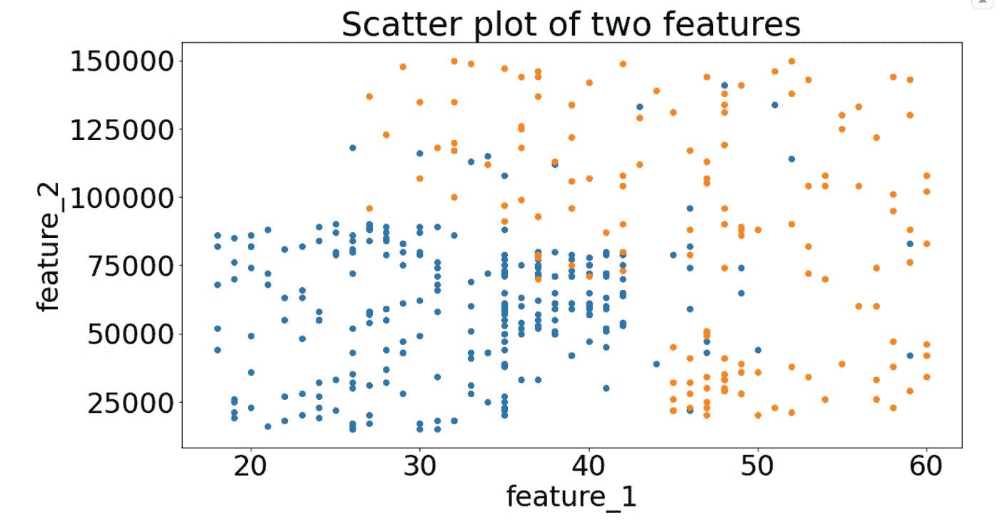
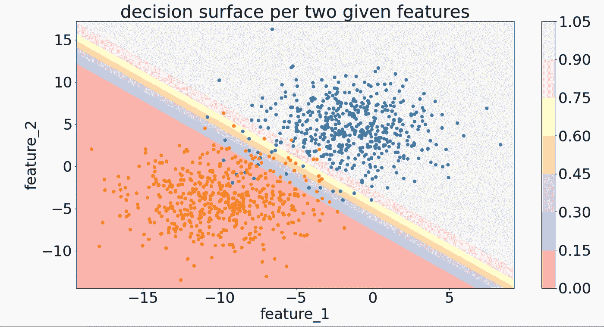
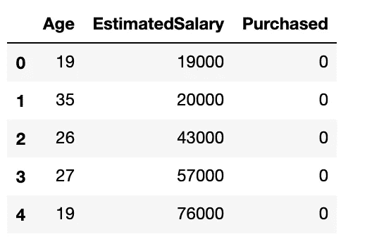
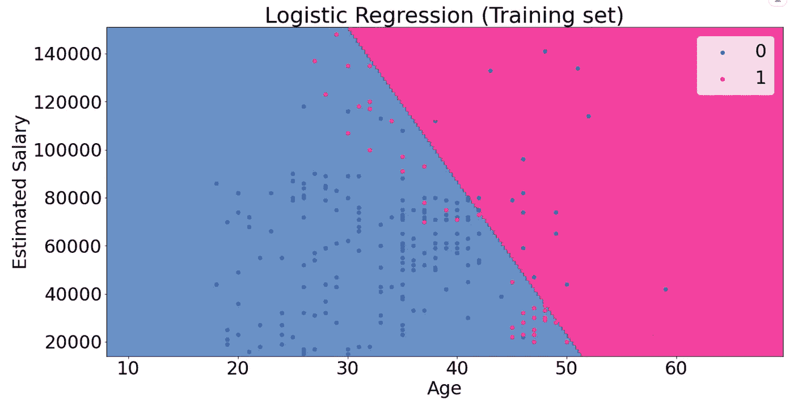
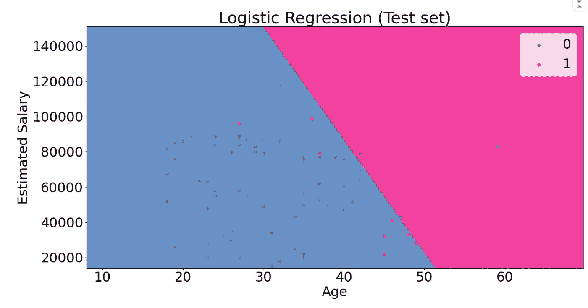

# 用 Python 绘制 ML 决策面的实践指南

> 原文：<https://towardsdatascience.com/hands-on-guide-to-plotting-a-decision-surface-for-ml-in-python-149710ee2a0e?source=collection_archive---------15----------------------->

## 利用 matplotlib 可视化 Python 中分类算法的决策边界


由[扬·坎迪](https://unsplash.com/@jancanty?utm_source=unsplash&utm_medium=referral&utm_content=creditCopyText)在 [Unsplash](https://unsplash.com/s/photos/boundaries?utm_source=unsplash&utm_medium=referral&utm_content=creditCopyText) 拍摄的照片

# 介绍

最近，我一直在努力将一个分类模型的生成模型可视化。我只依靠分类报告和混淆矩阵来衡量模型性能。

然而，将分类结果可视化有其魅力，也更有意义。所以，我建立了一个决策面，当我成功的时候，我决定把它作为一个学习的过程写下来，并且写给任何可能陷入同样问题的人。

# 教程内容

在本教程中，我将从 Sklearn 库中内置的数据集包开始，重点介绍实现步骤。之后，我将使用一个预处理数据(没有缺失数据或异常值)在应用标准缩放器后绘制决策面。

*   决策面
*   导入重要的库
*   数据集生成
*   生成决策面
*   申请真实数据

# 决策面

机器学习中的分类是指训练你的数据给输入的例子分配标签。

每个输入特征在特征空间上定义一个轴。平面的特征在于最少两个输入要素，点表示输入空间中的输入坐标。如果有三个输入变量，特征空间将是三维体积。

分类的最终目标是分离特征空间，以便尽可能正确地将标签分配给特征空间中的点。

这种方法称为决策面或决策边界，它是一种演示工具，用于解释分类预测建模任务中的模型。如果您有两个以上的输入要素，我们可以为每对输入要素创建一个决策表面。

# 导入重要的库

```
import numpy as np
import pandas as pdimport matplotlib.pyplot as plt
from matplotlib.colors import ListedColormapfrom sklearn import datasets
from sklearn.linear_model import LogisticRegression
from sklearn.preprocessing import StandardScaler
from sklearn.metrics import accuracy_score, confusion_matrix
from sklearn.model_selection import train_test_split
```

# 生成数据集

我将使用 Sklearn 库中 datasets 类中的`make_blobs()`函数来生成一个定制数据集。这样做可以将重点放在实现上，而不是清理数据。然而，步骤是相同的，并且是典型的模式。
为了简单起见，让我们从定义具有 1000 个样本、只有两个特征和标准偏差为 3 的数据集变量开始。

```
X, y = datasets.make_blobs(n_samples = 1000, 
                           centers = 2, 
                           n_features = 2, 
                           random_state = 1, 
                           cluster_std = 3)
```

一旦数据集生成，我们就可以绘制一个散点图来查看变量之间的可变性。

```
# create scatter plot for samples from each class
for class_value in range(2): # get row indexes for samples with this class
    row_ix = np.where(y == class_value) # create scatter of these samples
    plt.scatter(X[row_ix, 0], X[row_ix, 1])# show the plot
plt.show()
```

在这里，我们循环遍历数据集，并在每个由类标签着色的`X`和`y` 之间绘制点。在下一步中，我们需要建立一个预测分类模型来预测看不见的点的类别。在这种情况下可以使用逻辑回归，因为我们只有两个类别。



散点图 1

# 开发逻辑回归模型

```
regressor = LogisticRegression()# fit the regressor into X and y
regressor.fit(X, y)# apply the predict method 
y_pred = regressor.predict(X)
```

所有的`y_pred`都可以使用`sklearn`库中的`accuracy_score`类进行评估。

```
accuracy = accuracy_score(y, y_pred)
print('Accuracy: %.3f' % accuracy)## Accuracy: 0.972
```

# 生成决策面

`matplotlib`提供了一个叫做`contour()`的便捷函数，可以在点与点之间插入颜色。然而，正如文档所建议的，我们需要在特征空间中定义`y`的点`X`的网格。起点是找到每个特征的最大值和最小值，然后加 1，以确保覆盖整个空间。

```
min1, max1 = X[:, 0].min() - 1, X[:, 0].max() + 1 #1st feature
min2, max2 = X[:, 1].min() - 1, X[:, 1].max() + 1 #2nd feature
```

然后我们可以使用`numpy`库中的`arange()`函数定义坐标的比例，分辨率为`0.01`以获得比例范围。

```
x1_scale = np.arange(min1, max1, 0.1)
x2_scale = np.arange(min2, max2, 0.1)
```

下一步是将`x1_scale`和`x2_scale`转换成网格。`numpy`库中的函数`meshgrid()`正是我们所需要的。

```
x_grid, y_grid = np.meshgrid(x1_scale, x2_scale)
```

生成的`x_grid`是一个二维数组。为了能够使用它，我们需要使用来自`numpy`库的`flatten()`方法将大小减少到一维数组。

```
# flatten each grid to a vector
x_g, y_g = x_grid.flatten(), y_grid.flatten()
x_g, y_g = x_g.reshape((len(x_g), 1)), y_g.reshape((len(y_g), 1))
```

最后，像原始数据集一样，以更高的分辨率将向量并排堆叠为输入数据集中的列。

```
grid = np.hstack((x_g, y_g))
```

现在，我们可以拟合模型来预测值。

```
# make predictions for the grid
y_pred_2 = model.predict(grid)#predict the probability
p_pred = model.predict_proba(grid)# keep just the probabilities for class 0
p_pred = p_pred[:, 0]# reshaping the results
p_pred.shape
pp_grid = p_pred.reshape(x_grid.shape)
```

现在，已经生成了跨特征空间的值和预测类标签的网格。

随后，我们将使用`contourf()`将这些网格绘制成等高线图。
`contourf()`功能需要每个轴独立的网格。为了实现这一点，我们可以利用`x_grid`和`y_grid`并重塑预测`(y_pred)`使其具有相同的形状。

```
# plot the grid of x, y and z values as a surface
surface = plt.contourf(x_grid, y_grid, pp_grid, cmap='Pastel1')
plt.colorbar(surface)# create scatter plot for samples from each class
for class_value in range(2):
# get row indexes for samples with this class
    row_ix = np.where(y == class_value) # create scatter of these samples
    plt.scatter(X[row_ix, 0], X[row_ix, 1], cmap='Pastel1')# show the plot
plt.show()
```



两个特征的决策面

# 应用于真实数据

现在是时候将前面的步骤应用于真实数据以连接一切。正如我前面提到的，这个数据集已经被清理过了，没有遗漏点。该数据集根据年龄和年薪代表了样本人群的购车历史。

```
dataset = pd.read_csv('../input/logistic-reg-visual/Social_Network_Ads.csv')dataset.head()
```



社交网络广告数据集

数据集有两个特性`Age`和`EstimatedSalary`以及一个作为二进制列购买的因变量。值 0 表示年龄和薪水相似的人没有买车。然而，一个意味着这个人确实买了这辆车。下一步是将因变量从 X 和 y 特征中分离出来

```
X = dataset.iloc[:, :-1].values
y = dataset.iloc[:, -1].values# splitting the dataset
X_train, X_test, y_train, y_test = train_test_split(
                                               X, y, 
                                               test_size = 0.25,
                                               random_state = 0)
```

# 特征缩放

我们需要这一步，因为`Age`和`salary`不在同一尺度上

```
sc = StandardScaler()
X_train = sc.fit_transform(X_train)
X_test = sc.transform(X_test)
```

# 建立逻辑模型并拟合训练数据

```
classifier = LogisticRegression(random_state = 0)# fit the classifier into train data
classifier.fit(X_train, y_train)# predicting the value of y 
y_pred = classifier.predict(X_test)
```

# 绘制决策面—训练结果

```
#1\. reverse the standard scaler on the X_train
X_set, y_set = sc.inverse_transform(X_train), y_train#2\. Generate decision surface boundaries
min1, max1 = X_set[:, 0].min() - 10, X_set[:, 0].max() + 10 # for Age
min2, max2 = X_set[:, 1].min() - 1000, X_set[:, 1].max() + 1000 # for salary#3\. Set coordinates scale accuracy
x_scale ,y_scale = np.arange(min1, max1, 0.25), np.arange(min2, max2, 0.25)#4\. Convert into vector 
X1, X2 = np.meshgrid(x_scale, y_scale)#5\. Flatten X1 and X2 and return the output as a numpy array
X_flatten = np.array([X1.ravel(), X2.ravel()])#6\. Transfor the results into it's original form before scaling
X_transformed = sc.transform(X_flatten.T)#7\. Generate the prediction and reshape it to the X to have the same shape
Z_pred = classifier.predict(X_transformed).reshape(X1.shape)#8\. set the plot size
plt.figure(figsize=(20,10))#9\. plot the contour function
plt.contourf(X1, X2, Z_pred,
                     alpha = 0.75, 
                     cmap = ListedColormap(('#386cb0', '#f0027f')))#10\. setting the axes limit
plt.xlim(X1.min(), X1.max())
plt.ylim(X2.min(), X2.max())#11\. plot the points scatter plot ( [salary, age] vs. predicted classification based on training set)for i, j in enumerate(np.unique(y_set)):
    plt.scatter(X_set[y_set == j, 0], 
                X_set[y_set == j, 1], 
                c = ListedColormap(('red', 'green'))(i), 
                label = j)

#12\. plot labels and adjustments
plt.title('Logistic Regression (Training set)')
plt.xlabel('Age')
plt.ylabel('Estimated Salary')
plt.legend()
plt.show()
```



决策面—训练集

# 测试集的决策图

它与前面的代码完全相同，但是不使用 train，而是使用 test set。



决策图—测试集

# 结论

最后，我希望这个样板文件可以帮助可视化分类模型的结果。我建议使用另一个分类模型应用相同的步骤，例如，具有两个以上特征的 SVM。
感谢阅读，我期待着任何建设性的意见。

# 参考

1.  Sklearn.datasets A PI
2.  [利用熊猫转换数据](https://pandas.pydata.org/pandas-docs/stable/reference/api/pandas.DataFrame.transform.html)
3.  matplotlib . c[ontour()A](https://matplotlib.org/api/_as_gen/matplotlib.pyplot.contour.html)PI
4.  numpy.meshgrid() A PI
5.  [在 iris 数据集上绘制决策树的决策面](https://scikit-learn.org/stable/auto_examples/tree/plot_iris_dtc.html) — sklearn 示例
6.  [全工作卡格尔笔记本](https://www.kaggle.com/salmaeng/plot-decision-boundry-classification/edit)
7.  [GitHub 回购](https://github.com/salma71/blog_post)