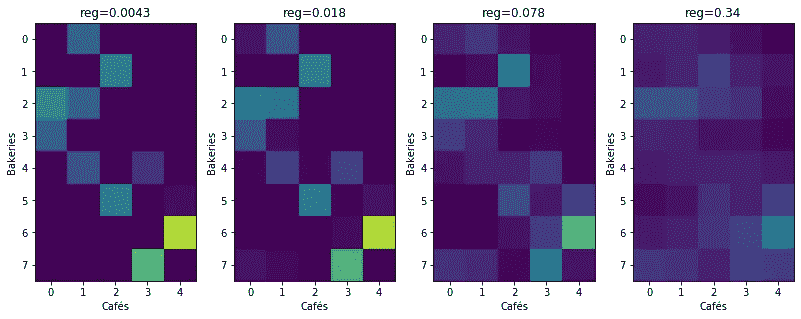

# Python 最优传输工具箱实践指南:第 1 部分

> 原文：<https://towardsdatascience.com/hands-on-guide-to-python-optimal-transport-toolbox-part-1-922a2e82e621?source=collection_archive---------26----------------------->

## 最佳运输的第一步

作为 Ievgen Redko 的关于最优传输的介绍性文章的后续文章，我将在下面介绍如何在实践中使用 [Python 最优传输(POT)](https://pythonot.github.io/) 工具箱求解最优传输(OT)。

首先，让我们从终端使用 pip 安装 POT，只需运行

```
pip3 install pot
```

或与康达

```
conda install -c conda-forge pot
```

如果一切顺利，您现在已经安装了 POT，可以在您的计算机上使用了。

# POT Python 最佳运输工具箱

## 导入工具箱

```
import numpy as np # always need it
import scipy as sp # often use it
import pylab as pl # do the plotsimport ot # ot
```

## 获得帮助

POT 的在线文档可从 [http://pot.readthedocs.io、](http://pot.readthedocs.io)获得，或者您可以查看在线帮助`help(ot.dist)`。

我们现在准备开始我们的例子。

# 简单 OT 问题

我们将解决面包店/咖啡馆将羊角面包从一个城市(在本例中为曼哈顿)的多个面包店运送到咖啡馆的问题。我们在谷歌地图上快速搜索了曼哈顿的面包店和咖啡馆:


我们从这一搜索中提取他们的位置，并生成虚构的生产和销售数字(两者的总和相同)。

我们可以访问描述**来源分布**的面包店`bakery_pos`的位置及其各自的生产`bakery_prod`。出售羊角面包的咖啡馆也由其位置`cafe_pos`和`cafe_prod`决定，并描述了**目标分布**。

现在我们加载数据

```
data = np.load('[https://github.com/PythonOT/POT/raw/master/data/manhattan.npz](https://github.com/PythonOT/POT/raw/master/data/manhattan.npz)')bakery_pos = data['bakery_pos']
bakery_prod = data['bakery_prod']
cafe_pos = data['cafe_pos']
cafe_prod = data['cafe_prod']
Imap = data['Imap']print('Bakery production: {}'.format(bakery_prod))
print('Cafe sale: {}'.format(cafe_prod))
print('Total croissants : {}'.format(cafe_prod.sum()))
```

这给出了:

```
Bakery production: [31\. 48\. 82\. 30\. 40\. 48\. 89\. 73.]
Cafe sale: [82\. 88\. 92\. 88\. 91.]
Total croissants : 441.0
```

## 策划城市中的面包店

接下来，我们在地图上标出面包店和咖啡馆的位置。圆圈的大小与它们的产量成正比。


## 成本矩阵

我们现在可以计算面包店和咖啡馆之间的成本矩阵，这将是**运输成本矩阵**。这可以使用`[ot.dist](https://pythonot.github.io/all.html#ot.dist)`函数来完成，该函数默认为平方欧几里得距离，但可以返回其他值，如城市街区(或曼哈顿距离)。

```
M = ot.dist(bakery_pos, cafe_pos)
```


面包店-咖啡馆问题的平方欧氏距离成本矩阵 M

矩阵图中的红色单元显示的是距离较远的面包店和咖啡馆，因此从一个地方到另一个地方的运输成本更高，而蓝色单元显示的是距离平方欧几里得距离非常近的面包店和咖啡馆。

# 用推土机的距离解决加班问题

我们现在来看问题本身，即找到将羊角面包从面包店运送到咖啡馆的最佳解决方案。为了做到这一点，让我们来看一点数学。

目标是找到传输矩阵`gamma`,使得


其中 M 是成本矩阵，a 和 b 分别是源和目标的样本权重。

> 这意味着，我们考虑了通过 *M* 将羊角面包从一家面包店运送到一家咖啡馆的成本，我们希望每一行`gamma`的总和是相应的面包店要出售的羊角面包的数量，每一列的总和是相应的咖啡馆需要的羊角面包的数量。因此，运输矩阵的每个元素将对应于面包店必须送到咖啡馆的羊角面包的数量。

这个问题被称为推土机的距离，或 EMD，也称为离散 Wasserstein 距离。

让我们看看它在我们的例子中给出了什么。

```
gamma_emd = ot.emd(bakery_prod, cafe_prod, M)
```

下图(左图)显示了从面包店到咖啡馆的运输，线的宽度与要运输的羊角面包数量成比例。在右边，我们可以看到带有精确值的传输矩阵。我们可以看到，面包店只需要将羊角面包运输到一两家咖啡馆，运输矩阵非常稀疏。


EMD 下的最优运输

# 用 Sinkhorn 正则化 OT

EMD 的一个问题是它的算法复杂度是 O( *n* log( *n* )， *n* 是源和目标之间的最大维度。在我们的例子中， *n* 很小，所以可以使用 EMD，但是对于更大的 *n* 值，我们可能需要考虑其他选项。

当一个算法的计算时间很长时，我们可以将其正则化，以获得一个更简单或更快的问题的解决方案。Sinkhorn 算法通过添加熵正则化项来实现这一点，从而解决了以下问题。


其中 *reg* 是超参数， *Omega* 是熵正则项，定义如下:


Sinkhorn 算法的编码非常简单。您可以使用以下伪代码直接实现它:


小心数字问题。Sinkhorn 的一个好的预处理是用成本矩阵`M`除以它的最大值。

```
reg = 0.1
K = np.exp(-M / M.max() / reg)
nit = 100
u = np.ones((len(bakery_prod), ))
for i in range(1, nit):
    v = cafe_prod / np.dot(K.T, u)
    u = bakery_prod / (np.dot(K, v))
gamma_sink_algo = np.atleast_2d(u).T * (K * v.T)  # Equivalent to np.dot(np.diag(u), np.dot(K, np.diag(v)))
```

另一种方法是使用带有 [ot.sinkhorn](https://pythonot.github.io/all.html#ot.sinkhorn) 的 POT 工具箱:

```
gamma_sinkhorn = ot.sinkhorn(bakery_prod, cafe_prod, reg=reg, M=M/M.max())
```

> 当绘制最终的运输矩阵时，我们马上注意到，使用 Sinkhorn，它一点也不稀疏，每个面包店都使用该解决方案向所有 5 家咖啡馆运送羊角面包。此外，这个解决方案给出了分数的传输，这在羊角面包的情况下没有意义。EMD 的情况并非如此。


带 Sinkhorn 的正则化最优运输

## 改变 Sinkhorn 中的正则化参数

显然，新疆的正则化超参数 *reg* 起着重要的作用。让我们通过下面的图表，从不同的值来看它是如何影响运输矩阵的。



reg 对运输矩阵的影响

这一系列图表显示，对于非常小的正则化参数值`reg`，Sinkhorn 的解开始于非常类似于 EMD 的东西(尽管不是稀疏的),并且随着`reg`的增加而趋向于更一致的解。

# 结论

第一部分展示了一个使用 POT 库应用优化传输的简单示例。正如 Ievgen Redko 在[第二部分中所讨论的，最优运输是一个可以在许多方面应用的强大工具。](/hands-on-guide-to-python-optimal-transport-toolbox-part-2-783029a1f062)