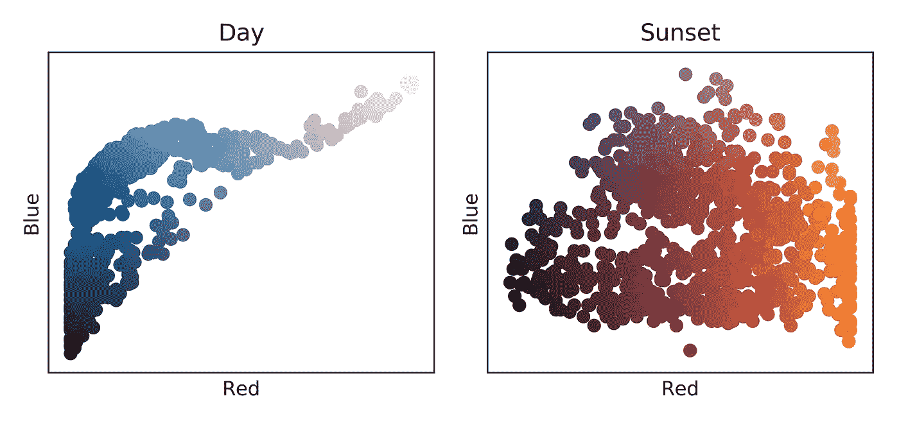
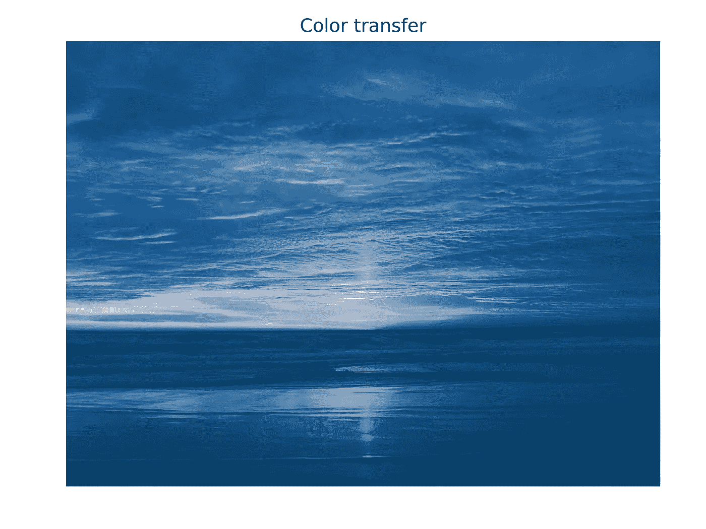
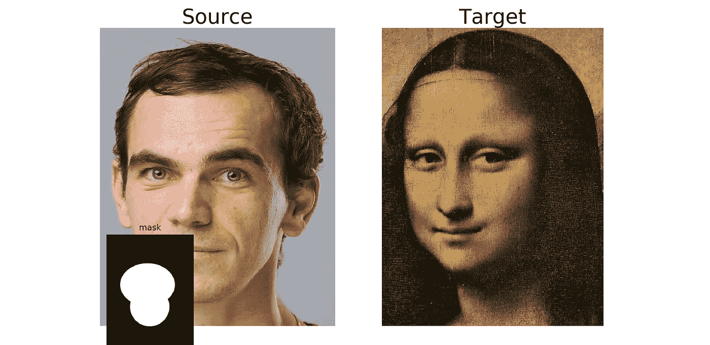
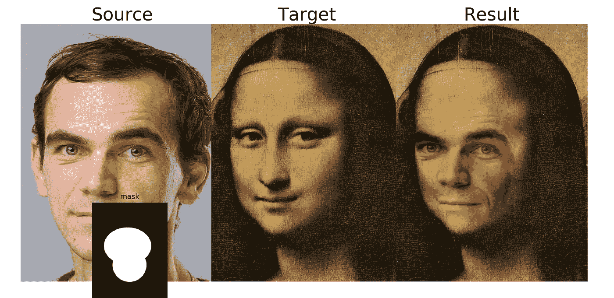
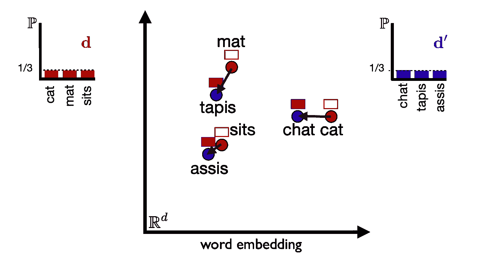
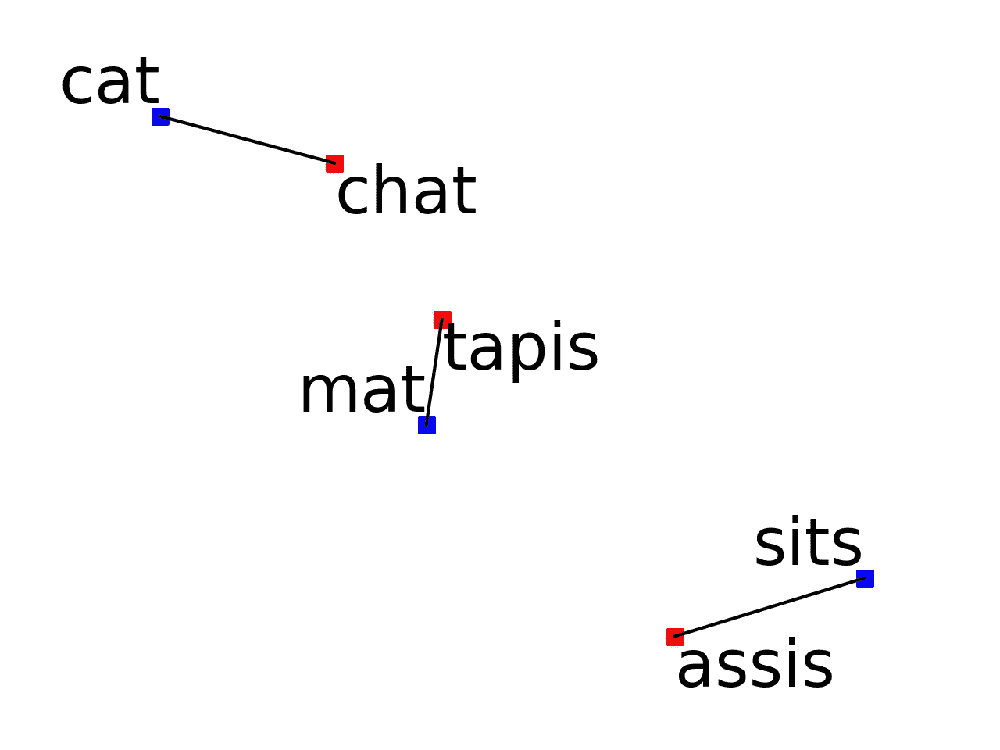

# Python 最优传输工具箱实践指南:第 2 部分

> 原文：<https://towardsdatascience.com/hands-on-guide-to-python-optimal-transport-toolbox-part-2-783029a1f062?source=collection_archive---------32----------------------->

## 色彩转换、图像编辑和自动翻译

作为我上一篇关于最优传输的介绍性文章的后续，我将在下面介绍如何使用 [Python 最优传输(POT)](https://pythonot.github.io/) 工具箱来解决不同的最优传输(OT)任务。

首先，让我们从终端使用 pip 安装 POT，只需运行

```
pip3 install ot
```

瞧！如果一切顺利，您现在已经安装了 POT，可以在您的计算机上使用了。现在让我解释一下如何复制我以前文章中的结果。

## 颜色转移

在这个应用程序中，我们的目标是以尽可能平滑的方式将一个图像的颜色风格转移到另一个图像上。为此，我们将遵循 POT library 官方网页上的示例[并从定义处理图像时所需的几个补充功能开始:](https://pythonot.github.io/auto_examples/domain-adaptation/plot_otda_color_images.html#sphx-glr-auto-examples-domain-adaptation-plot-otda-color-images-py)

```
import numpy as np
import matplotlib.pylab as pl
import ot

[r](https://numpy.org/doc/stable/reference/random/legacy.html#numpy.random.RandomState) = [np.random.RandomState](https://numpy.org/doc/stable/reference/random/legacy.html#numpy.random.RandomState)(42)

def im2mat(img):
    """Converts an image to a matrix (one pixel per line)"""
    return img.reshape((img.shape[0] * img.shape[1], img.shape[2]))

def mat2im(X, shape):
    """Converts a matrix back to an image"""
    return X.reshape(shape)
```

因此，这里的前三行只是 numpy、matplotlib.pylab 和 ot 包的导入。然后，我们有两个函数，允许我们转换由 3d 矩阵(有人称之为张量)表示的图像，其中第一维是图像的高度，第二维是其宽度，而第三维由像素的 RGB 坐标给出。现在让我们加载一些图像来看看它的含义。

```
[I1](https://numpy.org/doc/stable/reference/generated/numpy.ndarray.html#numpy.ndarray) = pl.imread('../../data/ocean_day.jpg').astype([np.float64](https://docs.python.org/3/library/functions.html#float))/256
[I2](https://numpy.org/doc/stable/reference/generated/numpy.ndarray.html#numpy.ndarray) = pl.imread('../../data/ocean_sunset.jpg').astype([np.float64](https://docs.python.org/3/library/functions.html#float))/256
```


它们在这里，白天的海洋图像和日落图像直接在 POT 工具箱中提供。注意，最初所有的像素 RGB 坐标都是整数，所以 astype( [np.float64](https://docs.python.org/3/library/functions.html#float) )将它们转换成浮点数。然后，每个值除以 256(每个像素坐标的最大值),以将数据标准化为位于[0，1]区间内。如果我们检查它们的尺寸，我们得到如下结果

```
print(I1[0,0,:])
[0.0234375 0.2421875 0.53125]
```

这意味着左下角的第一个像素具有由向量[R = 0.0234375，G= 0.2421875，B = 0.53125]给出的 RGB 坐标(蓝色如白天图像所预期的那样占主导)。现在，我们将张量转换为 2d 矩阵，其中每条线是一个像素，由其 RGB 坐标描述，如下所示:

```
day = im2mat(I1)
sunset = im2mat(I2)
```

请注意，这些矩阵相当大，通过运行以下代码可以看出:

```
print(day.shape)
(669000, 3)
```

让我们从每幅图像中随机抽取 1000 个像素，以减少将要应用 OT 的矩阵的大小。我们可以这样做:

```
nb = 1000
idx1 = r.randint(day.shape[0], size=(nb,)) 
idx2 = r.randint(sunset.shape[0], size=(nb,))

Xs = day[idx1, :]
Xt = sunset[idx2, :]
```

我们现在有两个矩阵，每个矩阵只有 1000 行和 3 列。让我们将它们绘制在 RB(红-蓝)平面上，看看我们实际采样的是什么颜色的像素:

```
plt.subplot(1, 2, 1)
plt.scatter(Xs[:, 0], Xs[:, 2], c=Xs)
*#plt.axis([0, 1, 0, 1])* plt.xlabel(**'Red'**)
plt.ylabel(**'Blue'**)
plt.xticks([])
plt.yticks([])
plt.title(**'Day'**)

plt.subplot(1, 2, 2)

plt.scatter(Xt[:, 0], Xt[:, 2], c=Xt)
*#plt.axis([0, 1, 0, 1])* plt.xlabel(**'Red'**)
plt.ylabel(**'Blue'**)
plt.title(**'Sunset'**)
plt.xticks([])
plt.yticks([])
plt.tight_layout()plt.show()
```

结果将如下所示:



一切似乎都是为了最终在它们身上运行我们的 OT 算法而设置的。为此，我们创建了一个 Monge-Kantorovich 问题类的实例，并将其放在我们的图像上:

```
ot_emd = ot.da.EMDTransport()
ot_emd.fit(Xs=Xs, Xt=Xt)
```

请注意，我们创建了一个 *ot.da.EMDTransport()* 类的实例，它提供了使用 ot 进行域自适应的功能，并在调用其 *fit()* 方法时自动定义了均匀经验分布(每个像素是一个概率为 1/1000 的点)和成本矩阵(像素坐标向量之间的平方欧几里德距离)。我们现在可以使用耦合矩阵将一个图像“传输”到另一个图像上，如下所示:

```
transp_Xt_emd = ot_emd.inverse_transform(Xt=sunset)
```

我们刚刚调用的函数 *inverse_transform()* 使用重心映射将日落图像传输到白天图像:最终结果中每个传输的像素是日落图像中像素的平均值，由耦合矩阵的相应值加权。您也可以通过调用 *transform(Xs=day)* 反过来做同样的事情。我们现在将最终结果绘制如下:

```
I2t = mat2im(transp_Xt_emd, I2.shape)

plt.figure()
plt.imshow(I2t)
plt.axis(**'off'**)
plt.title(**'Color transfer'**)
plt.tight_layout()
plt.show()
```

并且它给出了期望的结果:



## ***图像编辑***

我们现在想做一个无缝拷贝，即通过用另一个图像的补丁替换图像的一部分来编辑图像。例如，这可以是你的脸被传送到蒙娜丽莎的画像上。要继续，我们首先需要从这个 github 库下载 *poissonblending.py* 文件。然后，我们将从数据文件夹中加载三个图像(您需要事先将它们放在那里)，如下所示:

```
**import** matplotlib.pyplot **as** plt
**from** poissonblending **import** blend

img_mask = plt.imread(**'./data/me_mask_copy.png'**)
img_mask = img_mask[:,:,:3] *# remove alpha* img_source = plt.imread(**'./data/me_blend_copy.jpg'**)
img_source = img_source[:,:,:3] *# remove alpha* img_target = plt.imread(**'./data/target.png'**)
img_target = img_target[:,:,:3] *# remove alpha*
```

第一个图像是我的肖像，第二个图像提供了我的肖像将被复制到蒙娜丽莎的脸的区域。预处理还去除了透明度，并且只保留每个像素的 RGB 值。总体而言，它们将如下所示:



您可以使用任何带有简单几何对象的图像编辑器来调整遮罩。

然后可以使用如下调用的 *blend()* 函数获得最终结果:

```
nbsample = 500
off = (35,-15)seamless_copy = blend(img_target, img_source, img_mask, reg=5, eta=1, nbsubsample=nbsample, offset=off, adapt=**'kernel'**)
```

同样，我们只对 500 个像素的子集应用 OT，因为对整个图像应用 OT 需要一些时间。该函数背后的代码涉及许多图像预处理例程，但我们特别感兴趣的是 OT 部分。这由来自*poisson blending . py*的 *adapt_Gradients_kernel()表示，它包含以下代码:*

```
Xs, Xt = subsample(G_src,G_tgt,nb)

ot_mapping=ot.da.MappingTransport(mu=mu,eta=eta,bias=bias, max_inner_iter = 10,verbose=**True**, inner_tol=1e-06)
ot_mapping.fit(Xs=Xs,Xt=Xt)**return** ot_mapping.transform(Xs=G_src)
```

这里的第一行从梯度 G_src、G_tgt 中提取两个 500 像素的样本。然后， *ot.da.MappingTransport()* 函数学习非线性(内核化)变换，该变换近似于我们在前面的示例中使用的重心映射。你可能想知道为什么需要这样做？嗯，重心映射依赖于耦合矩阵，该矩阵仅对齐它所拟合的样本(它的形状是来自第一个分布的样本数*来自第二个分布的样本数)，因此它不能用于样本外点。最后，返回使用这个近似，就像以前一样，把我的脸的渐变转移到蒙娜丽莎肖像的渐变上。最终结果由下式给出:



作者最右边的图片。

## 自动翻译



对于最后一个应用程序，我们的目标是找到不同语言给出的两个句子中的单词之间的最佳对齐。例如，我们将使用英语命题"*猫坐在垫子上*"及其法语翻译" *le chat est assis sur le tapis* "，目标是恢复提供对应关系"*猫* "- " *聊天*"，"*坐在* "- " *assis* "和"*垫子*"-"*tapis*为此，我们需要可以通过 pip 安装的 nltk 库，如下所示:**

```
pip3 install nltk
```

我们还需要克隆下面的 github 库并遵循它的自述文件，以便下载将用于描述我们的主张的嵌入(我在这里还提供了一个快捷方式，在这里您可以直接找到所考虑的对的嵌入)。

现在让我们做一些通常的导入，并添加两个以后会用到的函数。

```
**import** numpy **as** np, sys, codecs
**import** ot
**import** nltk
nltk.download(**'stopwords'**) # download stopwords
nltk.download(**'punkt'**) # download punctuation 

**from** nltk **import** word_tokenize
**import** matplotlib.pyplot **as** plt

**def** load_embeddings(path, dimension):
    *"""
    Loads the embeddings from a file with word2vec format.
    The word2vec format is one line per words and its associated embedding.
    """* f = codecs.open(path, encoding=**"utf8"**).read().splitlines()
    vectors = {}
    **for** i **in** f:
        elems = i.split()
        vectors[**" "**.join(elems[:-dimension])] =  **" "**.join(elems[-dimension:])
    **return** vectors

**def** clean(embeddings_dico, corpus, vectors, language, stops, instances = 10000):
    clean_corpus, clean_vectors, keys = [], {}, []
    words_we_want = set(embeddings_dico).difference(stops)
    **for** key, doc **in** enumerate(corpus):
        clean_doc = []
        words = word_tokenize(doc*)* **for** word **in** words:
            word = word.lower()
            **if** word **in** words_we_want:
                clean_doc.append(word+**"__%s"**%language)
                clean_vectors[word+**"__%s"**%language] = np.array(vectors[word].split()).astype(np.float)
        **if** len(clean_doc) > 5 :
            keys.append(key)
        clean_corpus.append(**" "**.join(clean_doc))
    **return** clean_vectors
```

第一个函数用于加载嵌入内容，而第二个函数用于预处理文本以删除所有停用词和标点符号。

接下来，我们加载英语和法语语言的嵌入，如下所示:

```
vectors_en = load_embeddings(**"concept_net_1706.300.en"**, 300) vectors_fr = load_embeddings(**"concept_net_1706.300.fr"**, 300) 
```

并定义要翻译的两个命题:

```
en = [**"the cat sits on the mat"**]
fr = [**"le chat est assis sur le tapis"**]
```

现在让我们清理我们的句子如下:

```
clean_en = clean(set(vectors_en.keys()), en, vectors_en, **"en"**, set(nltk.corpus.stopwords.words(**"english"**)))clean_fr = clean(set(vectors_fr.keys()), fr, vectors_fr, **"fr"**, set(nltk.corpus.stopwords.words(**"french"**)))
```

这将只返回嵌入的有意义的单词"*猫*"、*坐*"、*垫*、*聊*、 *assis* 、 *tapis* 。现在一切都准备好了，可以使用最佳的运输方式。如上图所示，我们定义了两个经验均匀分布，并在它们之间运行 OT，成本矩阵由成对平方欧几里得距离给出。

```
emp_en = np.ones((len(en_emd),))/len(en_emd)
emp_fr =  np.ones((len(fr_emd),))/len(fr_emd)
M = ot.dist(en_emd,fr_emd)

coupling = ot.emd(emp_en, emp_fr, M)
```

一旦获得了耦合，我们现在可以用 t-SNE 找到我们的嵌入到 2d 空间的投影，然后如下绘制相应的单词及其匹配对:

```
np.random.seed(2) # fix the seed for visualization purpose

en_embedded = TSNE(n_components=3).fit_transform(en_emd)
fr_embedded = TSNE(n_components=3).fit_transform(fr_emd)

f, ax = plt.subplots()
plt.tick_params(top=**False**, bottom=**False**, left=**False**, right=**False**, labelleft=**False**, labelbottom=**False**)
plt.axis(**'off'**)
ax.scatter(en_embedded[:,0], en_embedded[:,1], c = **'blue'**, s = 50, marker = **'s'**)

**for** i **in** range(len(en)):
    ax.annotate(en[i], (en_embedded[i,0], en_embedded[i,1]), ha = **'right'**, va = **'bottom'**, fontsize = 30)

ax.scatter(fr_embedded[:,0], fr_embedded[:,1], c = **'red'**, s = 50, marker = **'s'**)

**for** i **in** range(len(fr)):
    ax.annotate(fr[i], (fr_embedded[i,0], fr_embedded[i,1]), va = **'top'**, fontsize = 30)

coupling /= np.max(coupling)

**for** i, j **in** enumerate(np.array(np.argmax(coupling, axis= 1)).flatten()):
    ax.plot([en_embedded[i, 0], fr_embedded[j, 0]], [en_embedded[i, 1], fr_embedded[j, 1]], c=**'k'**)

plt.show()
```

这给出了最终结果:



图片作者。

请注意，后面的例子可以扩展为基于 github 存储库中可用的 wikipidea 数据进行自动翻译，我们从 github 存储库中获取了初始代码。要了解更多细节，您还可以查看相应的论文和其中的结果，以进一步提高性能。