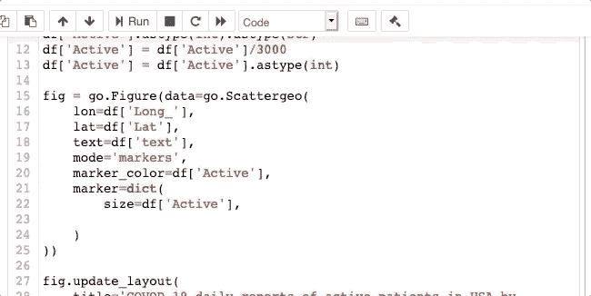

# 手把手的 Jupyter 笔记本黑客

> 原文：<https://towardsdatascience.com/hands-on-jupyter-notebook-hacks-f59f313df12b?source=collection_archive---------23----------------------->

## 编程；编排

## 您应该使用的技巧、提示和快捷方式


由 [Toa Heftiba](https://unsplash.com/@heftiba?utm_source=medium&utm_medium=referral) 在 [Unsplash](https://unsplash.com?utm_source=medium&utm_medium=referral) 上拍摄的照片

```
**Table of Contents**[**Introduction**](#782f)1\. [Gist](#0756)
2\. [display() over print() for dataFrame](#ceee)
3\. [Output without print()](#1400)
4\. [Bash commands without !](#cb0f)
5\. [Other useful shortcuts](#1498)
6\. [Nbextensions](#a90b)
7\. [Move Selected Cells](#0986)
8\. [Tabnine](#03ba)
9\. [Autopep8](#3284)
```

# 介绍

在这篇短文中，我将写一些我在使用 Jupyter Notebook 时发现有用的技巧、扩展和窍门。关于 Jupyter 笔记本的写作技巧，请阅读这篇文章。

# 要点

要点是分享由 Github 托管的片段的简单方法。这个黑客可以让你在 Juptyer 笔记本的单元格中从你的代码中创建一个要点。

假设你有一个 Github 账号，首先，你需要安装 [gist](https://github.com/defunkt/gist) 。如果您使用的是 brew，请在您的终端中运行[下面的](https://docs.brew.sh/FAQ)。

```
brew update
brew outdated
brew upgrade
brew cleanup
brew install gist
```

现在你需要登录 Github。

```
gist --login
Obtaining OAuth2 access_token from GitHub.
GitHub username: your-github-name
GitHub password: your-github-pw
2-factor auth code:
Success! https://github.com/settings/tokens
```

[gist](https://github.com/defunkt/gist) 将允许你从文件或剪贴板上传内容，添加文件名和描述。

将以下代码放入 Jupyter 笔记本的一个单元格中。你需要改变`myfile.py`和`my description`。

```
%%bash
gist -P -f myfile.py -d "my description"
```

将你想发送给 Gist 的单元格中的代码复制到你的剪贴板上，CTRL+C/⌘C，然后运行上面的单元格就会将你的剪贴板发送给 Gist。

它返回你的要点网址。

```
[https://gist.github.com/b9e4b509cb6ed80631b617b53a65f0b9](https://gist.github.com/b9e4b509cb6ed80631b617b53a65f0b9)
```

当你想更新你的要点时，你需要使用你的本地文件名。您可以在单元格中添加以下内容，并运行它来更新要点。

```
%%bash
gist -u your-gist-id your-filename-with-extension
```

[](/how-to-run-jupyter-notebook-on-docker-7c9748ed209f) [## 如何在 Docker 上运行 Jupyter 笔记本

### 不再有 Python 环境和包更新

towardsdatascience.com](/how-to-run-jupyter-notebook-on-docker-7c9748ed209f) [](/version-control-with-jupyter-notebook-b9630bc5996e) [## 使用 Jupyter 笔记本进行版本控制

### Jupytext 循序渐进指南

towardsdatascience.com](/version-control-with-jupyter-notebook-b9630bc5996e) 

# 在数据帧的打印()上显示()

`IPython.display`已经安装在朱庇特的笔记本上了。如果你正在打印一个项目，你不需要`print()`方法。如果你要打印一个以上的项目，`display()`将显示更好的输出。

```
import pandas as pd
df = pd.DataFrame(
    [
        [48,22,33,47],
        [35,36,42,27]
    ],
    index=["Male","Female"],
    columns=["Black","White","Red","Blue"])print(df)
display(df)
df
```


# 不打印输出()

如果你觉得懒得为所有输出键入`print()`，那么这是给你的。

对于 Conda 用户，您需要在一个单元格中添加以下代码。

```
from IPython.core.interactiveshell import InteractiveShell
InteractiveShell.ast_node_interactivity = "all"
```

我们来测试一下。

```
testvar=2
testvar
testvar
```

这将会回来，

```
2
2
```

如果你用 PIP 安装了 Jupyter Notebook，你可以把它作为默认设置，不需要上面的代码。请用编辑器打开`~/.ipython/profile_default/ipython_config.py`并粘贴以下内容。

```
c = get_config()
c.InteractiveShell.ast_node_interactivity = "all"
```

您需要重新启动 Jupyter 笔记本才能使其工作。

[](/7-essential-tips-for-writing-with-jupyter-notebook-60972a1a8901) [## 用 Jupyter 笔记本写作的 7 个基本技巧

### 第一篇数据科学文章指南

towardsdatascience.com](/7-essential-tips-for-writing-with-jupyter-notebook-60972a1a8901) 

# Bash 命令没有！

您可以在没有`!`的情况下使用 bash 命令。尝试一下。您可以使用的一些示例有:

```
ls -al
pwd
cat Readme.md
man ls
mkdir newfolder
```

# 其他有用的快捷方式


# nb 扩展

请在使用以下扩展之前安装 [Nbextensions](https://jupyter-contrib-nbextensions.readthedocs.io/en/latest/) 。jupyter_contrib_nbextensions 包包含一组社区贡献的非官方扩展，这些扩展为 jupyter 笔记本增加了功能。

[如何安装 jupyter _ contrib _ nb extensions](https://jupyter-contrib-nbextensions.readthedocs.io/en/latest/install.html#install-the-python-package)

我用了相当多的 nb 扩展。[方程式自动编号](https://jupyter-contrib-nbextensions.readthedocs.io/en/latest/nbextensions/equation-numbering/readme.html)、[选择 CodeMirror 键图](https://jupyter-contrib-nbextensions.readthedocs.io/en/latest/nbextensions/select_keymap/README.html)、[目录(2)](https://jupyter-contrib-nbextensions.readthedocs.io/en/latest/nbextensions/toc2/README.html) 、[上升](https://rise.readthedocs.io/en/maint-5.6/)。我想向您展示另外三个非常有用的扩展。

[](/how-to-create-an-attractive-bubble-map-5cf452c244e9) [## 如何创建一个有吸引力的泡泡图

### 从 Github repo 抓取数据的分步指南

towardsdatascience.com](/how-to-create-an-attractive-bubble-map-5cf452c244e9) 

# 移动选定的单元格

请从 Nbextensions 选项卡中启用[移动所选单元格](https://jupyter-contrib-nbextensions.readthedocs.io/en/latest/nbextensions/move_selected_cells/README.html)进行安装。


当你组织你的细胞时，这是非常有用的。您可以使用 Option/Alt +向上/向下移动选定的一个或多个单元格。


# 泰伯宁

[jupyter-tabnine](https://github.com/wenmin-wu/jupyter-tabnine) 支持使用基于深度学习的编码自动完成。

让我们安装它。

```
pip install jupyter-tabnine
jupyter nbextension install --py jupyter_tabnine
jupyter nbextension enable --py jupyter_tabnine
jupyter serverextension enable --py jupyter_tabnine
```

你可能需要重启几次 Jupyter 笔记本**才能工作。你可以在下面的 gif 图片中看到 Tabnine 的动作。**


# Autopep8

缩进的键盘快捷键是“CMD+]”表示右缩进，“CMD+[”表示左缩进。

Nbextensions [Autopep8](https://jupyter-contrib-nbextensions.readthedocs.io/en/latest/nbextensions/code_prettify/README_autopep8.html) 只需点击一下鼠标，即可格式化代码单元格中的代码。

您可以使用 pip 安装它:

```
pip install autopep8
```

然后在 Nbextsions 中启用它。


Nbextensions 中的 Autopep8



缩进和 Autopep8 的作用

你最喜欢什么？你还有什么要分享的吗？

**通过** [**成为**](https://blog.codewithshin.com/membership) **会员，可以完全访问媒体上的每一个故事。**


[https://blog.codewithshin.com/subscribe](https://blog.codewithshin.com/subscribe)

[](https://medium.com/series/jupyter-hacks-and-tips-1b1a3a10bc79) [## Jupyter 的技巧和窍门

### Jupyter 技巧和提示的集合

medium.com](https://medium.com/series/jupyter-hacks-and-tips-1b1a3a10bc79) [](/stepping-into-intermediate-with-jupyter-f6647aeb1184) [## Jupyter 用户的生产力提示

### 使用 Jupyter 笔记本和 JupyterLab 让您的工作流程更加高效

towardsdatascience.com](/stepping-into-intermediate-with-jupyter-f6647aeb1184)