# Python 中的动手机器学习—决策树分类

> 原文：<https://towardsdatascience.com/hands-on-machine-learning-in-python-decision-tree-classification-eba67a37a39c?source=collection_archive---------43----------------------->


由 [fietzfotos](https://pixabay.com/users/fietzfotos-6795508/) 在 [Pixabay](https://pixabay.com/photos/landscape-tree-bench-park-meadow-5591270/) 拍摄的照片

## 实现决策树模型的完整工作流程

作为最流行的经典机器学习算法之一，决策树在可解释性方面比其他算法更直观。今天，在本文中，我将向您展示实现决策树分类模型的整个工作流程。

机器学习任务的典型工作流程通常始于数据争论，因为我们最初获得的数据通常无法直接使用。这就是所谓的原始数据。典型的工作流程通常如下。

1.  问题陈述
2.  探索性数据分析
3.  数据清理
4.  特征工程
5.  模特培训
6.  模型评估

请注意，工作流程可能不是线性的。比如有时候在我们做了模型评估之后，模型的表现并不是很好，我们还有其他的想法可以尝试。然后，我们可能会回到第 3-5 步中的任何一步，应用我们的想法来改进模型。

在本文中，我将以线性方式展示这些步骤。我假设你已经知道什么是决策树，以及它是如何工作的。然而，如果没有，我写了许多文章来介绍决策树模型的直觉。如果需要的话，请在本文末尾查看它们。

# 1.问题陈述


照片由 [pixel2013](https://pixabay.com/users/pixel2013-2364555/) 在 [Pixabay](https://pixabay.com/photos/ship-wreck-old-rust-stranded-3401500/) 上拍摄

泰坦尼克号生存数据集在数据科学领域很有名，也被认为是 Kaggle 的“第一课”。当然，很多优秀的解都可以很好的预测存活数，事实证明决策树并不是最好的解。但是，这并不妨碍我们使用这个数据集作为例子来训练我们的决策树分类模型。

数据集可以在 Kaggle 中找到，可以免费下载。

[](https://www.kaggle.com/c/titanic/data) [## 泰坦尼克号:机器从灾难中学习

### 从这里开始！预测泰坦尼克号上的生存并熟悉 ML 基础知识

www.kaggle.com](https://www.kaggle.com/c/titanic/data) 

请注意，我们将只使用`train.csv`。`test.csv`用于提交你的预测结果，因为 Kaggle 是用于比赛目的的。`gender_submission.csv`与机器学习模型无关，请忽略。

数据集的说明，包括变量、训练/测试集等。可以在上面的链接中找到，还有可下载的数据集。

然而，在实践中，给定原始数据集的所有信息可能不够清楚。知道问题是“预测生存”是远远不够的。可能有必要与数据所有者和其他利益相关者召开研讨会。

相信我，阐明一个数据集不是一件容易的工作。大多数时候，我们可能不得不在没有 100%理解的情况下开始处理数据集，因为有时这是不可能的。

# 2.探索性数据分析


照片由 [Julius_Silver](https://pixabay.com/users/julius_silver-4371822/) 在 [Pixabay](https://pixabay.com/photos/portugal-algarve-benagil-caves-3029665/) 上拍摄

EDA 的成果并不直接用于模型训练，但也不可忽视。我们需要详细了解数据集，以便于数据清洗和特征选择。

这里我将展示一些基本的和常用的 EDA。

## 数据预览

在一切之前，我们通常想知道数据集是什么样子的。然而，数据集太大以至于我们无法完全打印出来的情况并不少见。有一个简单的函数`head()`可以预览前 5 行。

```
df_train.head()
```

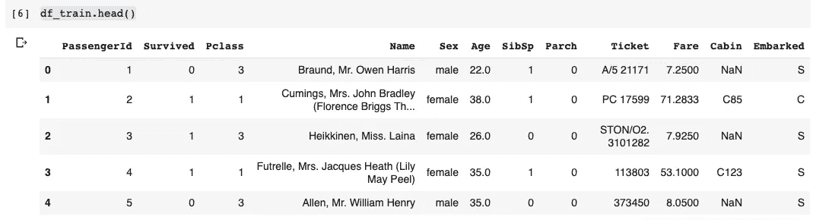

## 数据剖析

Pandas 为我们提供了一个非常方便的功能来分析我们拥有的数据框架。简单调用数据框的`info()`函数如下。

```
df_train.info()
```

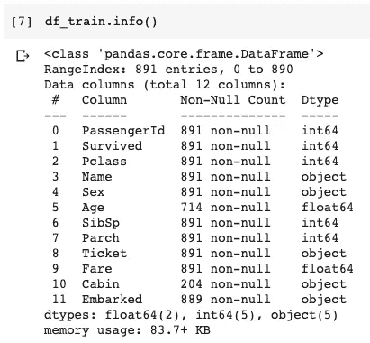

## 特征统计

检查特征的统计数据也非常重要。熊猫数据框也可以很容易地为我们做到这一点。

```
df_train.describe()
```

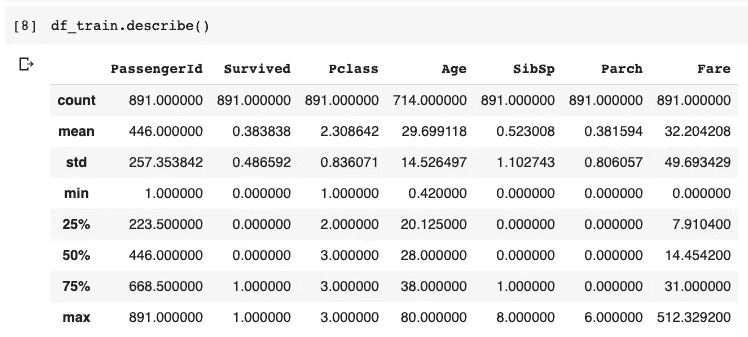

`describe()`功能将自动选择数字特征并为我们计算它们的统计数据。然而，如果我们也想得到这些分类的或字符串类型的特征的图片呢？我们可以在`describe()`函数中使用`include`参数，并显式传入一个对象类型列表，如下所示。

```
df_train.describe(include=['O'])
```

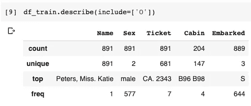

请注意，类型`'O'`是指字符串类型。在 Pandas 中，默认情况下，没有变量会被读取为分类变量，除非您明确要求它这样做。如果您真的有任何分类类型的列(可以在数据配置文件中找到)，您还需要在列表中传递`'categorical'`。

## EDA 成果

在实践中，您可能需要为 EDA 执行更多的任务，例如绘制直方图中的特征以查看它们的分布或获取相关矩阵等等。本文将在此停止，因为它意味着向您展示在 EDA 中做什么类型的事情。

完成上述 EDA 任务后，我们发现了一些需要在数据清理阶段解决的问题。

*   在`Age`、`Cabin`和`Embarked`栏中有一些缺失的数据。
*   在那些有缺失数据的列中，`Age`是数值型的，而`Cabin`和`Embarked`是分类型的。
*   `Age`和`Embarked`有很少的缺失值，而`Cabin`有大部分的缺失值。

# 3.数据清理


照片由 [Sztrapacska74](https://pixabay.com/users/sztrapacska74-8968314/) 在 [Pixabay](https://pixabay.com/photos/kitten-cat-4274170/) 上拍摄

我们先来看一下`Age`栏。我们可以首先仔细检查是否有缺少的带有年龄的数据条目。

```
df_train[df_train['Age'].isna()].head()
```

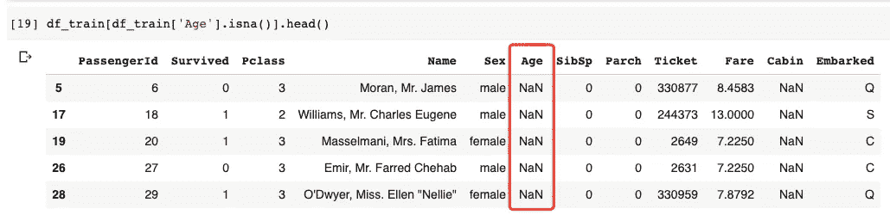

有许多方法可以修复数据缺口，例如

*   如果有任何缺失，请删除整行
*   保持原样(对于某些类型的机器学习算法，空值会导致问题。因此，此选项将不适用)
*   用平均值填补空白(仅适用于数值变量)
*   用模式值填补空白(适用于数值和分类变量)
*   定制的间隙填充算法(可能非常复杂，例如使用另一个机器学习模型来预测缺失值)

在这里，让我们采取相对简单的方法。也就是说，使用平均值填充数值列，然后使用模式填充分类值。

要用均值填充`Age`缺失数据，我们可以如下操作。

```
df_train['Age'] = df_train['Age'].fillna(df_train['Age'].mean())
```

对于`Embarked`列，我们用模式值来填充。这里我们不需要再次寻找模式，因为`describe(include=['O'])`已经告诉我们`'S'`具有最大的频率，即 889 个条目中的 644 个。

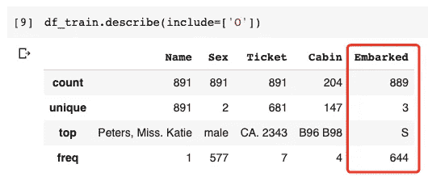

因此，让我们使用`'S'`来填充`Embarked`列中的空值。

```
df_train['Embarked'] = df_train['Embarked'].fillna('S')
```

最后，对于`Cabin`栏，有超过 70%的缺失。这是绝对不能填补的。事实上，对于这样的专栏，我想暂时忽略它。换句话说，我们不会用它来进行模型训练。

# 4.特征工程


[西尔维娅丽塔](https://pixabay.com/users/silviarita-3142410/)在[皮克斯拜](https://pixabay.com/photos/tray-breakfast-muesli-fruit-fruits-2546077/)拍摄的照片

特征工程对于训练一个机器学习模型是非常重要的一步，尤其是对于经典的机器学习算法(不是深度学习)。有时它占据了整个工作流的大部分时间，因为我们可能需要多次重新访问这个阶段来提高模型的性能。

在我们的数据集中，首先我们需要识别一些不可用或无用的特征。

*   `PassengerId`特性需要被拒绝，因为它没有用
*   `Name`功能也应该被拒绝，因为它对乘客能否幸存没有任何影响。
*   `Cabin`特征可以被拒绝，因为有超过 70%的缺失。
*   `Ticket`特性也应该被拒绝，因为它在 EDA 中没有显示任何模式。他们只是另一种“身份”。

对于其余的特性:`Pclass`、`Sex`、`Age`、`SibSp`、`Parch`、`Fare`、`Embarked`，它们似乎都很有用，我们应该选择它们。因为我们将使用决策树，所以如果有任何对模型没有帮助的特征，它们将不太可能被选择来分割树节点。让算法告诉我们。

因此，让我们构建我们的要素数据框和标注系列。

```
features = ['Pclass', 'Sex', 'Age', 'SibSp', 'Parch', 'Fare', 'Embarked']label = 'Survived'df_train_features = df_train[features]s_train_label = df_train[label]
```

# 5.模特培训


照片由 [stevepb](https://pixabay.com/users/stevepb-282134/) 在 [Pixabay](https://pixabay.com/photos/dumbbells-training-fitness-gym-2465478/) 上拍摄

现在，我们可以使用这些特征来训练我们的模型。然而，由于我们将使用 Sci-kit 学习库，并且其决策树算法不接受字符串类型的分类值，因此我们必须对我们的特征数据集进行一次热编码。具体来说，我们的`Sex`和`Embarked`特征是字符串类型的，需要转换成数字。

编码是数据预处理中最重要的技术之一，值得另写一篇文章来介绍。因此，在本文中，我们将跳过一个热门编码的讲座。如果你不明白它是什么，你将能够在网上获得许多优秀的教程。

首先，让我们从 Sci-kit 学习库中导入 One Hot 编码器。

```
from sklearn.preprocessing import OneHotEncoder
```

初始化编码器非常容易。之后，让我们用两个分类特征来拟合编码器:`Sex`和`Embarked`。

```
encoder = OneHotEncoder()
encoded_arr = encoder.fit_transform(df_train_features[['Sex', 'Embarked']]).toarray()
```

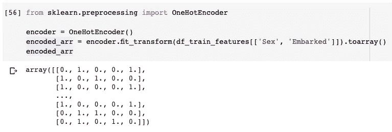

可以看出，我们得到了一个 891×5 的矩阵，这意味着编码的特征集有 5 列。这是因为`Sex`特性有 2 个不同的值:`female`和`male`，`Embarked`特性有 3 个不同的值:`S`，`C`和`Q`。所以，总数是五。

我们可以通过调用编码器的`categories_`得到标签的顺序。

```
encoder.categories_
```

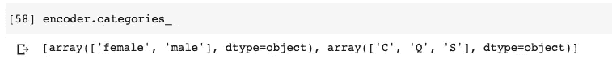

一旦我们知道了新要素的顺序，我们就可以使用新要素标签从编码矩阵生成数据框。

```
df_encoded = pd.DataFrame(encoded_arr, columns=[
    'Sex=female', 'Sex=male', 'Embarked=C', 'Embarked=Q', 'Embarked=S'
]).astype(int)
```

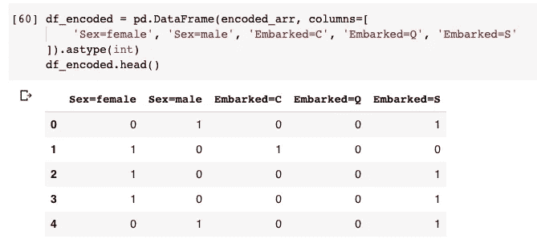

新的编码特性集是有意义的。例如，上述数据框中的第一行显示乘客是一名男性，乘坐的是 s。

现在，我们可以将编码的要素集与原始要素数据框连接起来。不要忘记从原来的列中删除`Sex`和`Embarked`列，因为它们应该被编码的新特性所取代。

```
df_train_features = df_train_features.drop(columns=['Sex', 'Embarked'])
df_train_features = pd.concat([df_train_features, df_encoded], axis=1)
```

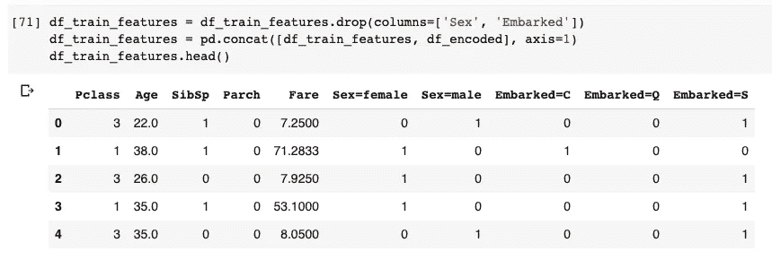

现在，我们可以训练我们的决策树模型。

```
from sklearn.tree import DecisionTreeClassifiermodel = DecisionTreeClassifier()
model.fit(df_train_features, s_train_label)
```

完了！

但是等等，我们的模型长什么样？通常，对于大多数机器学习算法来说，不太容易“看到”模型看起来是什么样子。然而，决策树不在其中。我们可以可视化我们的模型，看看节点是如何分裂的。

```
import matplotlib.pyplot as plt 
from sklearn import treefig, _ = plt.subplots(nrows=1, ncols=1, figsize=(100,50), dpi=300)
tree.plot_tree(
    model,
    feature_names=df_train_features.columns,
    filled=True
)fig.savefig('tree.png')
```

上面的代码将使用 Matplotlib 绘制树，并将图形保存为图像文件。建议检查图像文件中的树，因为如果您使用 Jupyter Notebook，它太大了，无法在网页中显示。

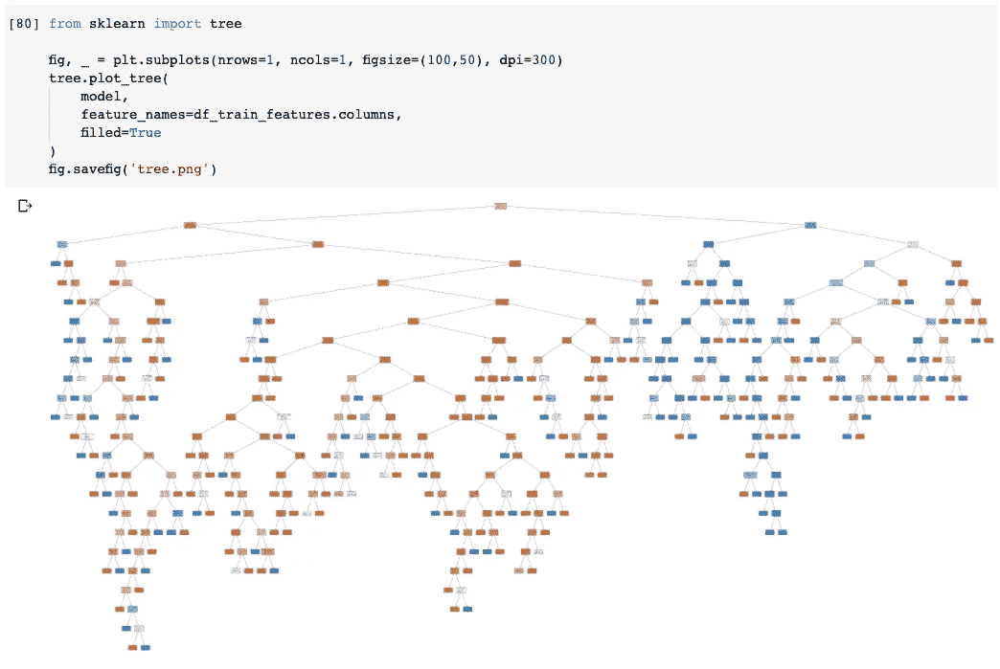

这是“tree.png”图片中的一部分树。

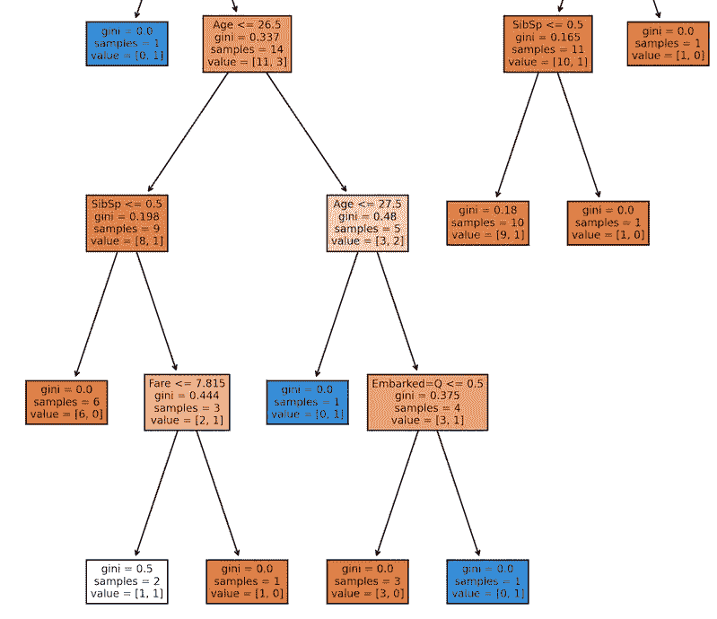

# 6.模型评估


[奇莫诺](https://pixabay.com/users/qimono-1962238/)在 [Pixabay](https://pixabay.com/photos/measurement-millimeter-centimeter-1476919/) 上的照片

在最后阶段，但可能不是我们工作流程的结束，我们需要评估我们的模型。

评估我们的模型的最佳方式是从上面的 Kaggle 页面下载 test.csv 并预测测试数据集的存活率，然后提交它。但是，这是因为 Kaggle 是一个提供这样一个功能的竞赛平台。在实践中，我们通常需要将原始数据集分成训练数据集和测试数据集。

然而，在本文中，我想使用另一种方法来评估我们的模型，这就是交叉验证。

交叉验证的基本思想是评估模型训练方法和超参数，而不是已训练的模型。可以认为是以下步骤。

1.  将数据集分割成大小相等的 *n* 个片段。
2.  使用 *n-1 个*片段训练模型，剩余 1 个片段将用作测试集。
3.  计算模型预测精度。
4.  重复步骤 2-3，使用不同的段作为测试集，直到所有段都被评估。
5.  获取 *n* 个精度数字的平均值，该值将被视为模型的得分。

我们来实施吧。

```
import numpy as np
from sklearn.model_selection import cross_val_scoreaccuracy_list = cross_val_score(model, df_train_features, s_train_label, cv=10)print(f'The average accuracy is {(np.mean(accuracy_list)*100).round(2)}%')
```

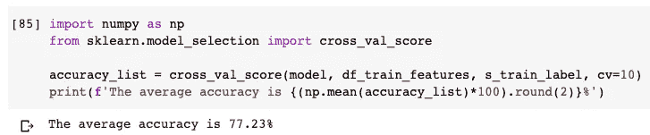

请注意，参数`cv`是提到的段数 *n* 。为此使用 10 是很常见的。

事实证明，结果可能并不理想。在实践中，我们可能会重新访问前面的某个阶段，看看我们是否可以重塑数据集以获得更好的结果，例如在数据清理阶段更改间隙填充机制。

# 摘要


照片由[拉里莎-K](https://pixabay.com/users/larisa-k-1107275/) 在 [Pixabay](https://pixabay.com/photos/spring-tree-flowers-meadow-276014/) 上拍摄

嗯，我要说的是，我们从交叉验证中得到的平均准确度确实不是很理想。你可以去 Kaggle 问题网页上找到其他人已经完成的其他解决方案，其中一些已经达到了非常高的准确率。

在本文中，我展示了机器学习作业的整个典型工作流程。它从问题陈述开始，如何处理数据等等，而不是像大多数其他文章一样直接跳到训练机器学习模型。虽然有太多的细节可以扩展，如 EDA 和功能工程步骤，但我希望本文展示了数据科学家将遵循的典型步骤，并为您提供一个大致的描述。

希望你喜欢阅读！

[](https://medium.com/@qiuyujx/membership) [## 通过我的推荐链接加入 Medium 克里斯托弗·陶

### 作为一个媒体会员，你的会员费的一部分会给你阅读的作家，你可以完全接触到每一个故事…

medium.com](https://medium.com/@qiuyujx/membership) 

如果你觉得我的文章有帮助，请考虑加入 Medium 会员来支持我和成千上万的其他作者！(点击上面的链接)

# 其他相关作品

下面是我之前的一些介绍决策树算法的文章。如果你有兴趣，请去看看！

***【ID3 算法决策树(熵)***

[](/go-out-for-exercise-or-not-let-data-science-decide-34f8f28ce7b4) [## 出去锻炼还是不锻炼？让数据科学来决定

### 决策树机器学习算法简介

towardsdatascience.com](/go-out-for-exercise-or-not-let-data-science-decide-34f8f28ce7b4) 

***决策树采用 C4.5 算法(信息增益比)***

[](/do-not-use-decision-tree-like-this-369769d6104d) [## 不要像这样使用决策树

### 展示 ID3 中信息获取的局限性以及使用 C4.5 的优势

towardsdatascience.com](/do-not-use-decision-tree-like-this-369769d6104d) 

***决策树逐车算法(基尼指数)***

[](/get-your-decision-tree-model-moving-by-cart-82765d59ae09) [## 让您的决策树模型随车移动

### 基尼杂质——另一种决策树节点划分标准

towardsdatascience.com](/get-your-decision-tree-model-moving-by-cart-82765d59ae09) 

***回归问题决策树***

[](https://medium.com/towards-artificial-intelligence/everyone-can-understand-machine-learning-regression-tree-model-28e3541b3e79) [## 每个人都能理解机器学习——回归树模型

### 没有公式、方程和科学陈述回归树模型介绍

medium.com](https://medium.com/towards-artificial-intelligence/everyone-can-understand-machine-learning-regression-tree-model-28e3541b3e79)