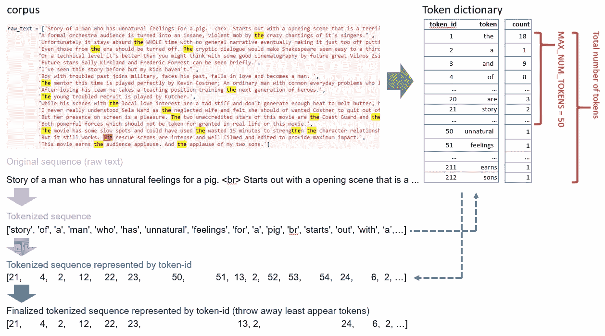
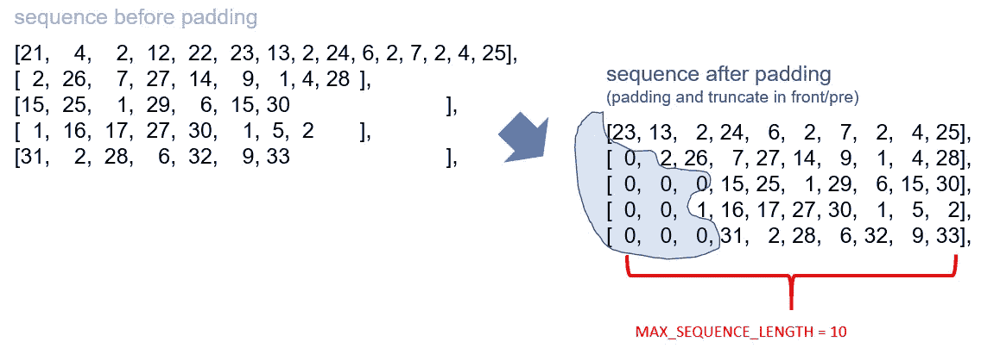
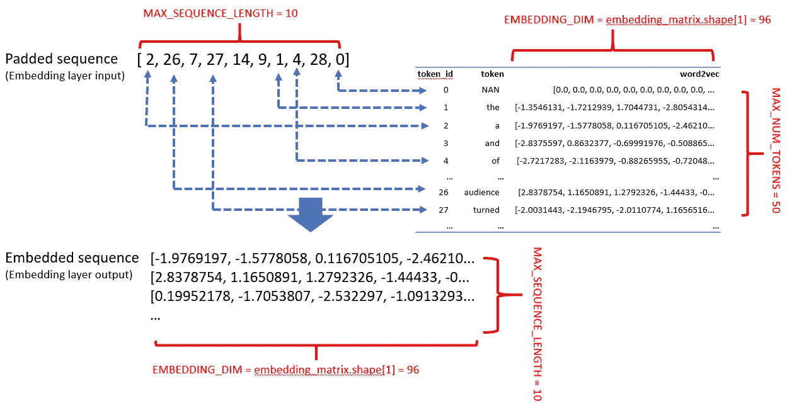

# TensorFlow 2 中的动手 NLP 深度学习模型准备。X

> 原文：<https://towardsdatascience.com/hands-on-nlp-deep-learning-model-preparation-in-tensorflow-2-x-2e8c9f3c7633?source=collection_archive---------22----------------------->

## 这是一个逐步完成 NLP 模型准备流程的教程:标记化、序列填充、单词嵌入和嵌入层设置。


NLP 模型准备步骤，(作者创建)

# 简介:我为什么写这篇文章

NLP 问题中的许多最先进的结果是通过使用 DL(深度学习)实现的，并且很可能您也想使用深度学习风格来解决 NLP 问题。虽然有很多资料讨论如何选择和训练“最佳”神经网络架构，如 RNN，但选择和配置合适的神经网络只是解决实际 NLP 问题的一部分。另一个重要的部分，但经常被低估，是模型准备。NLP 任务通常需要在模型准备阶段进行特殊的数据处理。换句话说，在我们将数据输入神经网络进行训练之前，还有很多事情要做。遗憾的是，没有多少教程给出模型准备的详细指导。

此外，支持最新的 NLP 理论和算法的软件包或 API 通常是最近才发布的，并且更新速度很快。(如 2015 年首次发布 TensorFlow，2016 年发布 PyTorch，2015 年发布 spaCy。)为了获得更好的性能，很多时候，你可能必须在你的深度学习管道中集成几个包，同时防止它们彼此崩溃。

这就是为什么我决定写这篇文章给你一个详细的教程。

*   我将向您介绍从标记原始数据到配置 Tensorflow 嵌入的模型准备流程，以便您的神经网络为训练做好准备。
*   示例代码将帮助您对模型准备步骤有一个坚实的理解。
*   在教程中，我将选择专门研究 NLP 的流行包和 API，并建议参数默认设置，以确保您在 NLP 深度学习之旅中有一个良好的开端。

# 在这篇文章中可以期待什么

*   我们将使用 TensorFlow 2 完成 NLP 模型准备流程。x 和空间。流水线中的四个主要步骤是标记化、填充、单词嵌入、嵌入层设置。
*   将介绍动机(为什么我们需要这个)和直觉(它是如何工作的)，所以如果你是 NLP 或深度学习的新手，不要担心。
*   我将提到模型准备期间的一些常见问题和潜在的解决方案。
*   在 [Colab](https://drive.google.com/file/d/1E7l_XJ1HnhaGXwUo4jpYv5WZwmULqU92/view?usp=sharing) 和 [Github](https://github.com/kefeimo/DataScienceBlog/blob/master/08_06_2020_tf_embedding/tf_nlp_tokenizer_embedding.ipynb) 上有你可以玩的笔记本。虽然我们在示例中使用了一个玩具数据集(取自 [IMDB 电影评论数据集](https://ai.stanford.edu/~amaas/data/sentiment/))，但代码可以应用于更大、更实用的数据集。

事不宜迟，我们从第一步开始。

# 标记化

# 什么是标记化？

在 NLP 中，[记号化](https://en.wikipedia.org/wiki/Lexical_analysis#Tokenization)意味着将原始文本分割成唯一的单元(也称为记号)。令牌可以是句子、短语或单词。每个令牌都有一个唯一的令牌 id。标记化的目的是我们可以使用这些标记(或标记 id)来表示原始文本。这里有一个例子。



符号化插图，(作者创作)

标记化通常包括两个阶段:

**阶段 1:创建一个令牌字典，在这个阶段，**

*   通过首先将原始文本分成句子，然后将句子分解成单词，来选择候选标记(通常是单词)。
*   应该包括某些预处理，例如，小写，标点符号删除等。
*   请注意，令牌应该是唯一的，并被分配给不同的令牌 id，例如，“汽车”和“汽车”是不同的令牌，“汽车”和“汽车”也是不同的令牌。所选择的令牌和相关的令牌 id 将创建一个令牌字典。

**阶段 2:文本表示，在此阶段，**

*   通过参考标记字典，用标记(或相关的标记 id)表示原始文本。
*   有时标记被部分选择用于文本表示(例如，仅选择最频繁的标记。);因此，最终的令牌化序列将只包括这样选择的令牌。

# 在张量流中

我们将使用一个 [IMDB 电影评论数据集](https://ai.stanford.edu/~amaas/data/sentiment/)来演示管道。

```
from tensorflow.keras.preprocessing.text import Tokenizertokenizer = Tokenizer()
tokenizer.fit_on_texts(raw_text)
train_sequences = tokenizer.texts_to_sequences(raw_text) #Converting text to a vector of word indexes
word_index = tokenizer.word_index
print('Found %s unique tokens.' % len(word_index))
print('1st token-id sequnce', train_sequences[0])>>Found 212 unique tokens.
>>1st token-id sequnce [21, 4, 2, 12, 22, 23, 50, 51, 13, 2, 52, 53, 54, 24, 6, 2, 55, 56, 57, 7, 2, 58, 59, 4, 25, 60]
```

现在，让我们看看我们从标记化步骤中得到了什么。

**令牌字典**

```
# display the token dictionary (from most freqent to rarest)
# these are the 2 useful attributes, (get_config will show the rest)
print(tokenizer.word_index)
print(tokenizer.word_counts)
# tokenizer.get_config()>>{'the': 1, 'a': 2, 'and': 3, 'of': 4, 'to': 5, 'with': 6, 'is': 7, 'this': 8, 'by': 9, 'his': 10, 'movie': 11, 'man': 12, 'for': 13, ...
>>OrderedDict([('story', 2), ('of', 8), ('a', 11), ('man', 3), ('who', 2), ('has', 2), ('unnatural', 1), ('feelings', 1), ('for', 3), ('pig', 1), ('br', 1), ('starts', 1), ('out', 2), ('with', 6), ...
```

**说明:**

*   记号赋予器对每个单词(记号)的数量进行计数，并根据计数对记号进行排序。例如,“the”是语料库中最频繁出现的标记，因此排在第一位，将标记 id 关联为“1”。这个排名在一本字典里有描述。我们可以使用`tokenizer.word_index`属性来检查失真。
*   我们可以使用`tokenizer.word_counts`来检查与每个令牌相关的计数。

**重要提示:**使用 TensorFlow Tokenizer 时，0-token-id 保留给 empty-token，即 token-id 从 1 开始，

**令牌标识序列**

```
# compare the number of tokens and tokens after cut-off
train_sequences = tokenizer.texts_to_sequences(raw_text) #Converting text to a vector of word indexes
# print(len(text_to_word_sequence(raw_text[0])), len(train_sequences[0]))
print(raw_text[0])
print(text_to_word_sequence(raw_text[0]))
print()
tokenizer.num_words = None # take all the tokens
print(tokenizer.texts_to_sequences(raw_text)[0])
tokenizer.num_words = 50 # take the top 50-1 tokens
print(tokenizer.texts_to_sequences(raw_text)[0])>>Story of a man who has unnatural feelings for a pig.  <br>  Starts out with a opening scene that is a terrific example of absurd comedy. 
>>['story', 'of', 'a', 'man', 'who', 'has', 'unnatural', 'feelings', 'for', 'a', 'pig', 'br', 'starts', 'out', 'with', 'a', 'opening', 'scene', 'that', 'is', 'a', 'terrific', 'example', 'of', 'absurd', 'comedy']>>[21, 4, 2, 12, 22, 23, 50, 51, 13, 2, 52, 53, 54, 24, 6, 2, 55, 56, 57, 7, 2, 58, 59, 4, 25, 60]
>>[21, 4, 2, 12, 22, 23, 13, 2, 24, 6, 2, 7, 2, 4, 25]
```

**说明:**

*   我们使用`train_sequences = tokenizer.texts_to_sequences(raw_text)`将文本转换成单词索引/id 的向量。转换后的序列将适合管道中的下一步。
*   当有太多令牌时，存储和计算可能是昂贵的。我们可以使用`num_words`参数来决定使用多少标记来表示文本。在本例中，由于我们设置了参数`num_words=50`，这意味着我们将获取前 50-1=49 个令牌。换句话说，像“不自然:50”，“感情:51”这样的记号不会出现在最终的记号化序列中。
*   默认情况下，`num_words=None`，这意味着它将带走所有的令牌。
*   提示:您可以随时设置 num_words，而无需重新安装分词器。

> **注意:**num _ words 值应该是什么，没有简单的答案。但这里是我的建议:构建一个管道，可以先从一个比较小的数字开始，比如说 num _ words = 10,000，进一步分析后再回来修改。(我发现这个堆栈溢出[帖子](https://stackoverflow.com/questions/61760508/how-to-choose-num-words-parameter-for-keras-tokenizer)分享了一些关于如何选择 num_words 值的见解。另外，查看标记器的[文档了解其他参数设置。)](https://www.tensorflow.org/api_docs/python/tf/keras/preprocessing/text/Tokenizer)

# 一个问题:OOV

让我们来看看对深度学习和传统 MLs 都非常有害的标记化中的一个常见问题，以及我们如何处理它。考虑下面的例子，来标记这个序列[《一个女人的故事……']。

```
test_sequence = ['Storys of a woman...'] 
print(test_sequence)
print(text_to_word_sequence(test_sequence[0]))
print(tokenizer.texts_to_sequences(test_sequence))>>['Storys of a woman...']
>>['storys', 'of', 'a', 'woman']
>>[[4, 2]]
```

由于用于训练的语料库不包括单词“storys”或“woman ”,这些单词也不包括在令牌字典中。这是 OOV 词汇之外的问题。虽然 OOV 是难以避免的，但有一些解决方案可以缓解这些问题:

*   一个经验法则是在一个相对大的语料库上训练，以便创建的字典可以覆盖更多的单词，因此不要认为它们是可以丢弃的新单词。
*   设置参数`oov_token=`捕捉 OOV 现象。注意，这个方法只通知你 OOV 在某个地方发生了，但它不能解决 OOV 问题。查看 [Kerras 文档](https://keras.io/api/preprocessing/text/)了解更多详情。
*   在标记化之前执行文本预处理。例如,“storys”可以被拼写纠正或用信号表示为“story ”,其被包括在令牌字典中。有一些 NLP 包为标记化和预处理提供了更健壮的算法。一些好的记号化选项有 [spaCy](https://spacy.io/usage/linguistic-features#native-tokenizers) 和 [Gensim](https://tedboy.github.io/nlps/generated/generated/gensim.utils.tokenize.html) 。
*   采用(并微调)一个预训练的记号赋予器(或变压器)，例如 Huggingface 的[预训练记号赋予器](https://huggingface.co/transformers/main_classes/tokenizer.html)。

# 简短讨论:艰难的开始？

记号化的想法可能看起来非常简单，但是迟早，你会意识到记号化可能比这个例子中看起来要复杂得多。复杂度主要来源于各种预处理方法。预处理的一些常见做法是小写、删除标点、单词单数化、[词干化](https://en.wikipedia.org/wiki/Stemming)和[词条化](https://en.wikipedia.org/wiki/Lemmatisation)。此外，我们还有可选的预处理步骤，如[测试标准化](https://en.wikipedia.org/wiki/Text_normalization)(例如，数字到文本，扩展缩写)[、语言识别](https://en.wikipedia.org/wiki/Language_identification)和[代码混合和翻译](https://en.wikipedia.org/wiki/Code-mixing)；以及高级预处理，如[词性标注](词性标注)(也称为词性标注)、[解析](https://en.wikipedia.org/wiki/Parsing)和[共指消解](https://en.wikipedia.org/wiki/Coreference)。取决于采取什么预处理步骤，标记可以不同，因此标记化的文本也不同。

如果你不知道上面这些令人困惑的名字，也不用担心。事实上，确定在 NLP 管道中包含哪种预处理方法是非常困难的。例如，决定在文本表示中包含哪些标记并不容易。整合大量的候选记号是存储和计算昂贵的。还不清楚哪个标记更重要:最常出现的单词如“the”、“a”对于文本表示来说信息不多，这就是为什么我们需要在预处理中处理[停用词](https://en.wikipedia.org/wiki/Stop_words)。

尽管可以说，我们在这里有一个好消息:深度学习比传统的机器学习算法需要相对较少的预处理。原因是深度学习可以利用传统 ML 模型在预处理和特征工程阶段执行的特征提取的神经网络架构。因此，这里我们可以保持标记化步骤简单，如果需要更多的预处理和/或后处理，稍后再回来。

# 标记化翘曲

虽然大多数深度学习教程仍然使用 list 或 np.array 来存储数据，但我发现使用 DataFrame(例如，Pandas 或 PySpark)来完成工作更加可控和可伸缩。这一步是可选的，但我建议您这样做。下面是示例代码。

```
# store in dataframe
df_text = pd.DataFrame({'raw_text': raw_text})
df_text.head()# updata df_text
df_text['train_sequence'] = df_text.raw_text.apply(lambda x: tokenizer.texts_to_sequences([x])[0])
df_text.head()>>																				raw_text	               train_sequence
0	Story of a man who has unnatural feelings for ...	[21, 4, 2, 12, 22, 23, 13, 2, 24, 6, 2, 7, 2, ...
1	A formal orchestra audience is turned into an ...	[2, 26, 7, 27, 14, 9, 1, 4, 28]
2	Unfortunately it stays absurd the WHOLE time w...	[15, 25, 1, 29, 6, 15, 30]
3	Even those from the era should be turned off. ...	[1, 16, 17, 27, 30, 1, 5, 2]
4	On a technical level it's better than you migh...	[31, 2, 28, 6, 32, 9, 33]
```

这就是你需要了解的记号化。让我们进入下一步:填充。

# 填料

大多数(如果不是全部)神经网络要求输入序列数据具有相同的长度，这就是为什么我们需要填充:将序列截断或填充(通常用 0 填充)成相同的长度。这是一个填充的例子。



填充插图，(作者创作)

让我们看看下面的示例代码，在 TensorFlow 中执行填充。

```
from tensorflow.keras.preprocessing.sequence import pad_sequences# before padding
print(type(train_sequences))
train_sequences
>> <class 'list'>
>>  [[21, 4, 2, 12, 22, 23, 13, 2, 24, 6, 2, 7, 2, 4, 25],
		 [2, 26, 7, 27, 14, 9, 1, 4, 28],
		 [15, 25, 1, 29, 6, 15, 30],
		 [1, 16, 17, 27, 30, 1, 5, 2],
		 [31, 2, 28, 6, 32, 9, 33],
		...MAX_SEQUENCE_LENGTH = 10 # length of the sequence
trainvalid_data_pre = pad_sequences(train_sequences, maxlen=MAX_SEQUENCE_LENGTH, 
                                padding='pre',
                                truncating='pre',)
trainvalid_data_pre>>array([[23, 13,  2, 24,  6,  2,  7,  2,  4, 25],
	       [ 0,  2, 26,  7, 27, 14,  9,  1,  4, 28],
	       [ 0,  0,  0, 15, 25,  1, 29,  6, 15, 30],
	       [ 0,  0,  1, 16, 17, 27, 30,  1,  5,  2],
	       [ 0,  0,  0, 31,  2, 28,  6, 32,  9, 33],
	   ...
```

**解说:**

*   在填充之前，令牌表示的序列具有不同的长度；填充后都是一样长的。
*   参数“maxlen”定义了填充序列的长度。当标记化序列的长度大于“maxlen”时，“maxlen”之后的序列的标记将被截断；当标记化序列的长度小于“maxlen”时，将用“0”填充。
*   截断和填充序列的位置分别由“padding=”和“truncating=”确定。

# 讨论和提示

**前置还是后置？**

默认情况下，pad_sequences 参数设置为 padding='pre '，truncating='pre '。然而，根据 [TensorFlow 文档](https://www.tensorflow.org/guide/keras/masking_and_padding)，建议“在处理 RNN 图层时使用‘后’填充”。(建议在英文中，最重要的信息出现在开头。所以截断或填充后的序列能更好地代表原文。)下面是示例代码。

```
MAX_SEQUENCE_LENGTH = 10
trainvalid_data_post = pad_sequences(train_sequences, maxlen=MAX_SEQUENCE_LENGTH, 
                                padding='post',
                                truncating='post',)
trainvalid_data_post
>>array([[21,  4,  2, 12, 22, 23, 13,  2, 24,  6],
	       [ 2, 26,  7, 27, 14,  9,  1,  4, 28,  0],
	       [15, 25,  1, 29,  6, 15, 30,  0,  0,  0],
	       [ 1, 16, 17, 27, 30,  1,  5,  2,  0,  0],
	       [31,  2, 28,  6, 32,  9, 33,  0,  0,  0],
	     ...
```

**关于马克伦。**

另一个问题是，maxlen 值应该是多少。这里的折衷是，较大的 maxlen 值会导致序列保留更多的信息，但会占用更多的存储空间和更大的计算开销，而较小的 maxlen 值可以节省存储空间，但会导致信息丢失。

*   在管道构建阶段，我们可以选择均值或中值作为 maxlen。当序列的长度变化不大时，它工作得很好。
*   如果序列的长度在很大的范围内变化，那么这是一个个案的决定，一些试错法是可取的。例如，对于 RNN 体系结构，我们可以选择更高端的 maxlen 值(即，大 maxlen ),并利用屏蔽(我们将在后面看到屏蔽)来减少存储和计算浪费。请注意，如果处理不当，用 0 填充序列会给模型带来噪声。使用非常大的 maxlen 值不是一个好主意。如果你不确定使用什么样的神经网络结构，最好坚持使用无填充序列的平均值或中值。

由于我们将令牌序列数据存储在数据帧中，因此获取序列长度统计数据非常简单，下面是示例代码:

```
# ckeck sequence_length stats
df_text.train_sequence.apply(lambda x: len(x))
print('sequence_length mean: ', df_text.train_sequence.apply(lambda x: len(x)).mean())
print('sequence_length median: ', df_text.train_sequence.apply(lambda x: len(x)).median())>> sequence_length mean:  9.222222222222221
>> sequence_length median:  8.5
```

序列填充应该很容易。让我们进入下一步，准备 word2vec 单词嵌入。

# Word2vec 单词嵌入

# 直觉

单词嵌入在人类对语言的理解和机器之间架起了一座桥梁。这对于许多 NLP 问题是必不可少的。你可能听说过“ [word2vec](https://en.wikipedia.org/wiki/Word2vec) ”、“ [GloVe](https://nlp.stanford.edu/projects/glove/) ”和“ [FastText](https://fasttext.cc/) ”这些名字。

如果您不熟悉单词嵌入，也不用担心。我简单介绍一下单词嵌入应该能提供足够的直觉，在 TensorFlow 中应用单词嵌入。

首先，让我们了解一些关键概念:

**嵌入**:对于语料库中的词集，嵌入是来自分布式表示的向量空间到来自分布式表示的向量空间之间的映射。

**向量语义:**这是指一组 NLP 方法，旨在基于大型语料库中单词的分布属性来学习单词表示。

让我们看看一些使用 spaCy 预训练嵌入模型的可靠示例。

```
import spacy
# if first use, download en_core_web_sm
nlp_sm = spacy.load("en_core_web_sm")
nlp_md = spacy.load("en_core_web_md")
# nlp_lg = spacy.load("en_core_web_lg")doc = nlp_sm("elephant")
print(doc.vector.size)
doc.vector
>>96
>>array([ 1.5506991 , -1.0745661 ,  1.9747349 , -1.0160941 ,  0.90996253,
	       -0.73704714,  1.465313  ,  0.806101  , -4.716807  ,  3.5754416 ,
	        1.0041305 , -0.86196965, -1.4205945 , -0.9292773 ,  2.1418033 ,
	        0.84281194,  1.4268254 ,  2.9627366 , -0.9015219 ,  2.846716  ,
	        1.1348789 , -0.1520077 , -0.15381837, -0.6398335 ,  0.36527258,
	...
```

**解说:**

*   使用 spaCy(一个著名的 NLP 包)将单词“elephant”嵌入到一个 96 维向量中。
*   基于要加载的模型，向量将具有不同的维度。(例如“en_core_web_sm”、“en_core_web_md”和“en_core_web_lg”的维数分别为 96、300 和 300。)

现在“大象”这个词已经用向量来表示了，那又如何？不要看别处。一些奇迹即将发生。🧙🏼‍♂️

因为我们可以用向量来表示单词，所以我们可以计算单词之间的相似度(或距离)。考虑下面的代码。

```
# demo1
word1 = "elephant"; word2 = "big"
print("similariy {}-{}: {}".format(word1, word2, nlp_md(word1).similarity(nlp_md(word2))) )
word1 = "mouse"; word2 = "big"
print("similariy {}-{}: {}".format(word1, word2, nlp_md(word1).similarity(nlp_md(word2))) )
word1 = "mouse"; word2 = "small"
print("similariy {}-{}: {}".format(word1, word2, nlp_md(word1).similarity(nlp_md(word2))) )>>similariy elephant-big: 0.3589780131997766
>>similariy mouse-big: 0.17815787869074504
>>similariy mouse-small: 0.32656001719452826# demo2
word1 = "elephant"; word2 = "rock"
print("similariy {}-{}: {}".format(word1, word2, nlp_md(word1).similarity(nlp_md(word2))) )
word1 = "mouse"; word2 = "elephant"
print("similariy {}-{}: {}".format(word1, word2, nlp_md(word1).similarity(nlp_md(word2))) )
word1 = "mouse"; word2 = "rock"
print("similariy {}-{}: {}".format(word1, word2, nlp_md(word1).similarity(nlp_md(word2))) )
word1 = "mouse"; word2 = "pebble"
print("similariy {}-{}: {}".format(word1, word2, nlp_md(word1).similarity(nlp_md(word2))) )>>similariy elephant-rock: 0.23465476998562218
>>similariy mouse-elephant: 0.3079661539409069
>>similariy mouse-rock: 0.11835070985447328
>>similariy mouse-pebble: 0.18301520085660278
```

**评论:**

*   在测试 1 中:“大象”比“老鼠”更像“大”；而“老鼠”更类似于“小”，而不是“大象”更类似于“小”。当提到大象和老鼠的通常尺寸时，这符合我们的常识。
*   在测试 2 中:“大象”与“岩石”的相似度低于“大象”本身与“老鼠”的相似度；同样，“老鼠”与“岩石”的相似程度，不如“老鼠”本身与“大象”的相似程度。这大概可以解释为“大象”和“老鼠”都是动物，而“石头”没有生命。
*   test2 中的向量不仅表示活性的概念，还表示大小的概念:单词“rock”通常用于描述大小更接近于大象和老鼠的物体，因此“rock”更类似于“大象”而不是“老鼠”。同样，“pebble”通常用来形容比“rock”小的东西；因此，“卵石”和“老鼠”之间的相似性大于“岩石”和“老鼠”。
*   请注意，单词之间的相似性可能并不总是与你头脑中的相似性相匹配。一个原因是相似性只是一个度量(即标量)来表示两个向量之间的关系；当相似性将高维向量压缩成标量时，那么多信息都丢失了。同样，一个词可以有几个意思。例如，单词 bank 可以与金融或河流相关；没有背景，很难说我们在谈论什么样的银行。毕竟，语言是一个可以解释的概念。

# 不要掉进兔子洞

Word2Vec 非常强大，是一个相当新的概念(Word2vec 是 2013 年创建并发布的)。有太多的东西要谈，比如

*   你可能想知道向量中的值是如何分配的。什么是跳格？CBOW 是什么？
*   还有其他的单词嵌入模型，像“ [GloVe](https://nlp.stanford.edu/projects/glove/) ”和“ [FastText](https://fasttext.cc/) ”。有什么区别？我们应该使用哪一个？

单词嵌入是一个非常激动人心的话题，但是不要卡在这里。对于不熟悉单词嵌入的读者来说，最重要的是理解

*   单词嵌入的作用:将单词转换成向量。
*   为什么我们需要这些嵌入向量:这样一台机器就可以做令人惊奇的事情；计算单词间的相似度是其中之一，但绝对不止这些。
*   OOV 仍然是单词嵌入的一个问题。考虑以下代码:

```
print(nlp_md("elephan")[0].has_vector)
print(nlp_md("elephan")[0].is_oov)
nlp_md("elephan").vector>>False
>>True
>>array([0., 0., 0., 0., 0., 0., 0., 0., 0., 0., 0., 0., 0., 0., 0., 0., 0.,
	       0., 0., 0., 0., 0., 0., 0., 0., 0., 0., 0., 0., 0., 0., 0., 0., 0.,
....
```

由于单词“elephan”在我们之前加载的 spaCy“en _ core _ web _ MD”模型中不存在，spaCy 返回一个 0 向量。再说一次，治疗 OOV 不是一项简单的任务。但是我们可以使用`.has_vector`或`.is_oov`来捕捉 OOV 现象。

希望您现在对单词嵌入有了很好的理解。让我们回到主轨道，看看我们如何在管道中应用单词嵌入。

# 采用预先训练的单词嵌入模型

预训练的单词嵌入是在一个任务中学习的嵌入，用于解决另一个类似的任务。预先训练的单词嵌入模型也称为变换器。使用预先训练好的单词嵌入模型可以省去我们从头训练一个的麻烦。此外，预先训练的嵌入向量从大数据集生成的事实通常导致更强的生成能力。

应用预先训练的单词嵌入模型有点像在字典中搜索，我们已经在前面使用 spaCy 看到了这样的过程。(例如，输入单词“大象”, spaCy 返回一个嵌入向量。)在这一步的最后，我们将创建一个“嵌入矩阵”,其中嵌入向量与每个令牌相关联。(嵌入矩阵是 TensorFlow 将用来连接令牌序列和单词嵌入表示的矩阵。)

这是代码。

```
# import pandas as pd
# nlp_sm = spacy.load("en_core_web_sm")
df_index_word = pd.Series(tokenizer.index_word)
# df_index_word
df_index_word_valid = df_index_word[:MAX_NUM_TOKENS-1]
df_index_word_valid = pd.Series(["place_holder"]).append(df_index_word_valid)
df_index_word_valid = df_index_word_valid.reset_index()
# df_index_word_valid.head()
df_index_word_valid.columns = ['token_id', 'token']
# df_index_word_valid.head()
df_index_word_valid['word2vec'] = df_index_word_valid.token.apply(lambda x: nlp_sm(x).vector)
df_index_word_valid['is_oov'] = df_index_word_valid.token.apply(lambda x: nlp_sm(x)[0].is_oov)
df_index_word_valid.at[0, "word2vec"] = np.zeros_like(df_index_word_valid.at[0, "word2vec"])
print(df_index_word_valid.head())>>
		token_id token                                           word2vec  is_oov
0         0   NAN  [0.0, 0.0, 0.0, 0.0, 0.0, 0.0, 0.0, 0.0, 0.0, ...    True
1         1   the  [-1.3546131, -1.7212939, 1.7044731, -2.8054314...    True
2         2     a  [-1.9769197, -1.5778058, 0.116705105, -2.46210...    True
3         3   and  [-2.8375597, 0.8632377, -0.69991976, -0.508865...    True
4         4    of  [-2.7217283, -2.1163979, -0.88265955, -0.72048...    True# Embbeding matrix
embedding_matrix = np.array([vec for vec in df_index_word_valid.word2vec.values])
embedding_matrix[1:3]print(embedding_matrix.shape)
>>(50, 96)
```

解释:

*   我们首先使用 spaCy 来寻找与每个令牌相关联的嵌入向量(存储在数据帧中)。经过一些数据角力，我们创建了一个嵌入矩阵(采用 TensorFlow 约定，这次存储在 np.array 中)。
*   嵌入矩阵的行数:总行数为 50，第一行包含一个表示空标记的零向量，其余 50–1 个标记是在标记化步骤中选择的标记。(很快，你就会明白为什么我们在下一节课设置嵌入层的时候要在第一行放一个零向量。)
*   嵌入矩阵的列数:word2vec 维数为 96(使用“en_core_web_sm”时)，所以列数为 96。

这里我们有形状为(50，96)的嵌入矩阵(即 2-d 数组)。该嵌入矩阵将在该 NLP 模型准备流水线的最后一步中被馈入 TensorFlow 嵌入层。

> 注意:您可能会注意到所有的 is_oov 值都是 True。但是你仍然会得到非零的嵌入向量。使用 spaCy“en _ core _ web _ sm”模型会发生这种情况。

# 小贴士:如何看待单词嵌入中的 OOV

与“en_core_web_md”在令牌不在嵌入模型中时返回零向量不同，“en_core_web_sm”的工作方式将使其总是返回一些非零向量。然而，根据 [spaCy 纪录片](https://spacy.io/models/en)，“en_core_web_sm”返回的向量并不像“en_core_web_md”或“en_core_web_lg”那样“精确”。

取决于应用，您可以决定选择“不太精确”的嵌入模型，但总是给出非零向量或模型返回“更精确”的向量，但有时在看到 oov 时是零向量。

在演示中，我选择了“en_core_web_sm”模型，它总是给我一些非零的嵌入向量。一种策略可以是在训练期间使用为子词片段学习的向量，类似于人们通常可以从熟悉的词根中找出单词的要点。有些人把这种策略称为“不精确总比什么都没有好”。(虽然我不确定 spaCy 如何给 OOVs 分配非零值。)

# 最后，嵌入层设置

到目前为止，我们有填充的标记序列来表示原始文本数据。此外，我们还创建了一个嵌入矩阵，每行都与令牌相关联。现在是时候设置 TensorFlow 嵌入层了。

下图总结了嵌入层机制。



嵌入层插图，(作者创作)

**解说:**

嵌入层通过嵌入矩阵(作为权重)在标记序列(作为输入)和单词嵌入表示(作为输出)之间建立桥梁。

*   **嵌入层的输入**:填充后的序列作为嵌入层的输入送入；填充序列的每个位置被指定给一个令牌 id。
*   **嵌入层的权重**:通过查找嵌入矩阵，嵌入层可以找到与 token-id 相关联的单词(令牌)的 word2vec 表示。注意，填充序列使用零来指示空的令牌，从而产生零嵌入向量。这就是为什么我们在嵌入矩阵中为空令牌保存了第一行。
*   **嵌入层的输出**:在遍历输入的填充序列后，嵌入层用代表向量(word2vec)“替换”token-id，并输出嵌入序列。

> **注意:**现代 NLP 特征提取的关键:**如果一切正常，嵌入层的输出应该很好地代表原始文本，所有特征都存储在单词嵌入权重中；这是现代自然语言处理特征提取的核心思想。**你很快就会看到，我们可以通过为嵌入层设置 trainable = True 来微调这个权重。

还要注意，在这个例子中，我们将空令牌的 word2vec 显式指定为零，只是为了进行演示。事实上，一旦嵌入层看到 0-token-id，它将立即为该位置分配一个零向量，而无需查看嵌入矩阵。

# 在张量流中

以下示例代码显示了如何在 TensorFlow 中完成嵌入，

```
from tensorflow.keras.initializers import Constant
from tensorflow.keras.layers import Embedding# MAX_NUM_TOKENS = 50
EMBEDDING_DIM = embedding_matrix.shape[1]
# MAX_SEQUENCE_LENGTH = 10
embedding_layer = Embedding(input_dim=MAX_NUM_TOKENS,
                            output_dim=EMBEDDING_DIM,
                            embeddings_initializer=Constant(embedding_matrix),
                            input_length=MAX_SEQUENCE_LENGTH,
														mask_zero=True,
                            trainable=False)
```

**解说:**

*   与维度相关的参数是“输入尺寸”、“输出尺寸”和“输入长度”。通过参考图示，您应该对如何设置这些参数有很好的直觉。
*   在使用预先训练好的单词嵌入模型时，我们需要使用[tensor flow . keras . initializer . constant](https://www.tensorflow.org/api_docs/python/tf/keras/initializers/Constant)将嵌入矩阵馈入一个嵌入层。否则，嵌入层的权重将用一些随机数初始化，称为“从零开始训练单词嵌入”。
*   `trainable=`在本例中设置为 False，这样在神经网络训练过程中 word2vec 的权重不会改变。这有助于防止过度拟合，尤其是在相对较小的数据集上训练时。但如果你想微调权重，你知道该怎么做。(设置`trainable=True`
*   `mask_zero=`是你应该注意的另一个论点。掩膜是一种告知序列处理层输入中的某些位置缺失的方式，因此在处理数据时应该跳过。通过设置参数`mask_zero=True`，不仅加快了训练速度，而且更好地再现了原文。

我们可以使用一个测试用例来检查嵌入层的输出。嵌入层的输出张量的形状应该是[num_sequence，padded_sequence_length，embedding_vector_dim]。

```
# output
embedding_output = embedding_layer(trainvalid_data_post)
# result = embedding_layer(inputs=trainvalid_data_post[0])
embedding_output.shape>>TensorShape([18, 10, 96])# check if tokens and embedding vectors mathch
print(trainvalid_data_post[1])
embedding_output[1]>>[21  4  2 12 22 23 13  2 24  6]
>><tf.Tensor: shape=(10, 96), dtype=float32, numpy=
array([[-1.97691965e+00, -1.57780576e+00,  1.16705105e-01,
        -2.46210432e+00,  1.27643692e+00,  4.56989884e-01,
         ...
			[ 2.83787537e+00,  1.16508913e+00,  1.27923262e+00,
        -1.44432998e+00, -7.07145482e-02, -1.63411784e+00,
				 ...
```

仅此而已。您已经准备好训练您的文本数据。(您可以参考笔记本，查看使用 RNN 和 CNN 的培训。)

# 摘要

为 NLP 深度学习准备数据，我们经历了很长的路。使用以下清单来测试您的理解程度:

**记号化:**在语料库上进行训练，创建记号字典，并参照创建的记号字典，用记号(或记号-id)表示原文。在 TensorFlow 中，我们可以使用 Tokenizer 进行标记化。

*   在标记化过程中通常需要预处理。虽然使用 Tensorflow 的令牌化器及其默认设置有助于启动管道，但几乎总是建议在令牌化期间执行高级预处理和/或后处理。
*   词汇外(OOV)是标记化的一个常见问题。潜在的解决方案包括在更大的语料库上训练或使用预先训练的标记器。
*   在 TensorFlow 约定中，0-token-id 保留给空令牌，而其他 NLP 包可能会将令牌分配给 0-token-id。小心这种冲突，如果需要的话，调整令牌 id 命名。

**填充:**将序列填充或截断至相同长度，即填充后的序列具有相同数量的标记(包括空标记)。在 TensorFlow 中，我们可以使用 pad_sequences 进行填充。

*   对于 RNN 体系结构，建议在(设置为“post”)之后填充和截断序列。
*   填充序列长度可以设置为填充(或截断)前序列的平均值或中值。

**单词嵌入:**可以通过参考嵌入模型，例如 word2vec，将记号映射到向量。嵌入向量拥有人类和机器都能理解的信息。我们可以使用 spaCy“en _ core _ web _ sm”、“en_core_web_md”或“en_core_web_lg”进行单词嵌入。

*   使用预先训练的单词嵌入模型是一个好的开始。不需要找到“完美的”预训练单词嵌入模型；首先，就拿一个。由于 Tensorflow 还没有 word embeddings API，所以选择一个可以在深度学习管道中轻松应用的包。在此阶段，构建管道比实现更好的性能更重要。
*   对于使用预训练模型的单词嵌入，OOV 也是一个问题。处理 OOV 的一个潜在解决方案是通过使用在训练期间为子词片段学习的向量。如果可能的话，这种“猜测”通常比使用零向量来预测 oov 给出更好的结果，因为零向量会给模型带来噪声。

**TensorFlow 中的嵌入层:**为了利用预训练的单词嵌入，tensor flow 中的嵌入层的输入包括由 token-id 表示的填充序列，以及存储与填充序列内的令牌相关联的嵌入向量的嵌入矩阵。输出是一个三维张量，其形状为[数字序列，填充序列长度，嵌入向量尺寸]。

*   嵌入层有许多参数设置。使用玩具数据集来确保嵌入图层的行为符合您的理解。应该特别注意输入和输出张量的形状。
*   我们可以通过设置 trainable = True 来微调嵌入矩阵。
*   通过设置 mask_zero=True，可以加快训练速度。此外，它更好地再现了原文，尤其是在使用 RNN 式建筑的时候。例如，机器将跳过零数据，并且无论如何都将相关重量保持为 0，即使 trainable = True。

如果你还没有检查过笔记本，这里有链接:

[](https://drive.google.com/file/d/1E7l_XJ1HnhaGXwUo4jpYv5WZwmULqU92/view?usp=sharing) [## TF _ NLP _ tokenizer _ embedding . ipynb

### 合作笔记本

drive.google.com](https://drive.google.com/file/d/1E7l_XJ1HnhaGXwUo4jpYv5WZwmULqU92/view?usp=sharing) 

我希望你喜欢这篇文章。下次见。

## 参考:

*   实用自然语言处理:构建真实世界自然语言处理系统的综合指南-Oreilly&Associates Inc(2020)
*   [自然语言处理实践:使用 Python-Manning 出版物理解、分析和生成文本(2019)](https://www.manning.com/books/natural-language-processing-in-action)
*   [深度学习与 Python-Manning 出版物(2018)](https://www.manning.com/books/deep-learning-with-python)