# 使用 Python 进行实际时间序列预测

> 原文：<https://towardsdatascience.com/hands-on-time-series-forecasting-with-python-d4cdcabf8aac?source=collection_archive---------4----------------------->

## 建立 SARIMA 模型的 Box-Jenkins 建模策略


布莱恩·苏曼在 [Unsplash](https://unsplash.com?utm_source=medium&utm_medium=referral) 上的照片

[时间序列](https://en.wikipedia.org/wiki/Time_series)分析是从按时间顺序排列的数据点中提取有意义的摘要和统计信息的努力。它们广泛用于应用科学和工程，涉及时间测量，如信号处理、模式识别、数学金融、天气预报、控制工程、医疗数字化、智能城市应用等。

随着我们不断监测和收集时间序列数据，应用时间序列分析和预测的机会正在增加。

在本文中，我将展示如何用 Python 开发一个带有季节成分的 ARIMA 时间序列预测模型。我们将遵循 Box-Jenkins 三阶段建模方法，以得出预测的最佳模型。

我鼓励任何人查看我的 GitHub 上的 [Jupyter 笔记本](https://github.com/Idilismiguzel/Time-Series/blob/master/SARIMA-forecasting.ipynb)以获得完整的分析。

在时间序列分析中， [Box-Jenkins 方法](https://en.wikipedia.org/wiki/Box%E2%80%93Jenkins_method)以统计学家 George Box 和 Gwilym Jenkins 命名，他们应用 ARIMA 模型来寻找时间序列模型的最佳拟合。

该模型分为 3 个步骤:模型识别、参数估计和模型验证。

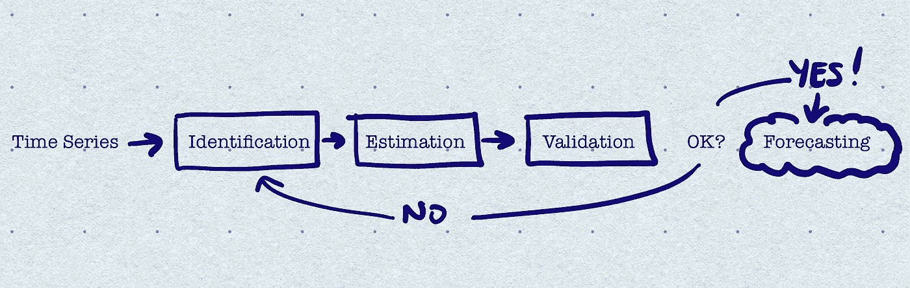

# **时间序列**

作为数据，我们将使用[每月牛奶产量数据集。](https://bigml.com/user/czuriaga/gallery/dataset/5a8dacbd2a834705180000ec)它包括 1962 年至 1975 年间每头奶牛的月生产记录(磅)。

```
df = pd.read_csv('./monthly_milk_production.csv', sep=',',                            parse_dates=['Date'], index_col='Date')
```

## 时间序列数据检验

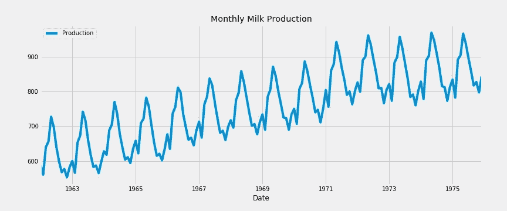

正如我们从上面的图中可以观察到的，我们的数据有增长的趋势和很强的季节性。

我们将使用 Python 的 [statsmodels](https://www.statsmodels.org/stable/index.html) 库来执行时间序列分解。时间序列分解是将时间序列解构为其**趋势、季节**和**残差分量的统计方法。**

```
import statsmodels.api as sm
from statsmodels.tsa.seasonal import seasonal_decomposedecomposition = seasonal_decompose(df['Production'], freq=12)
decomposition.plot()
plt.show()
```

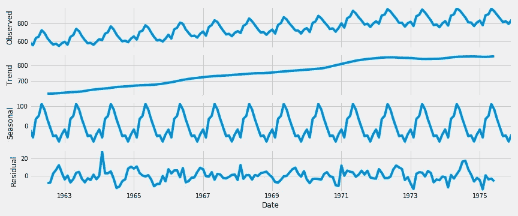

分解图表明，每月产奶量具有增长趋势和季节性模式。

如果我们想更精确地观察季节性成分，我们可以根据月份来绘制数据。

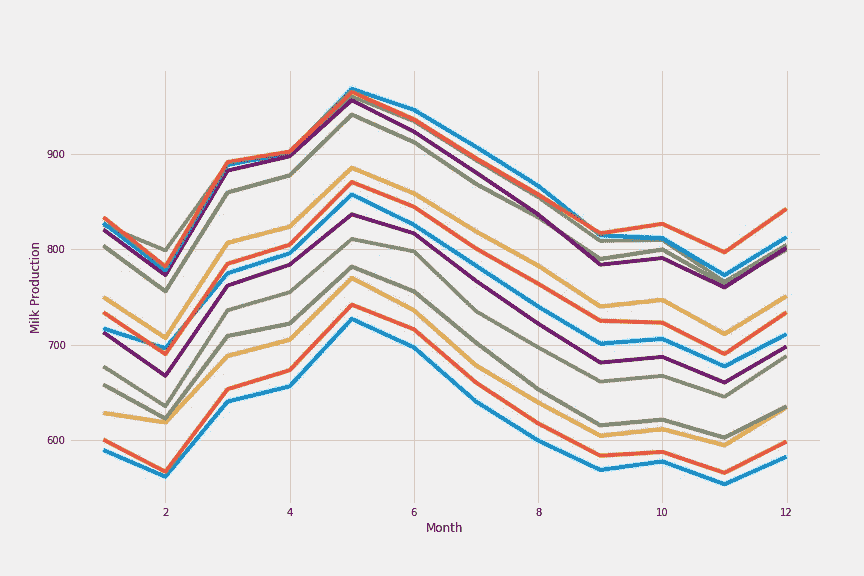

# 1.模型识别

在这一步，我们需要检测时间序列是否是平稳的，如果不是，我们需要了解需要什么样的变换才能使其平稳。

当时间序列的统计属性(如均值、方差和自相关)随时间保持不变时，该时间序列就是稳定的。换句话说，当时间序列不依赖于时间并且没有趋势或季节效应时，它就是平稳的。大多数统计预测方法都是基于时间序列是(近似)平稳的假设。

想象一下，我们有一个随着时间持续增长的时间序列，样本均值和方差将随着样本的大小而增长，他们总是会低估未来期间的均值和方差。这就是为什么，我们需要从一个平稳的时间序列开始，从它的时间相关的趋势和季节成分中去除。

我们可以使用不同的方法来检查平稳性:

*   我们可以从图中了解到，比如我们之前看到的分解图，我们已经观察到了趋势和季节性。
*   我们可以绘制[自相关函数](https://en.wikipedia.org/wiki/Autocorrelation)和[偏自相关函数](https://en.wikipedia.org/wiki/Partial_autocorrelation_function)图，它们提供了关于时间序列值对其先前值的依赖性的信息。如果时间序列是平稳的，那么 ACF/PACF 图将在少量滞后之后显示出一个快速截止点。

```
from statsmodels.graphics.tsaplots import plot_acf, plot_pacfplot_acf(df, lags=50, ax=ax1)
plot_pacf(df, lags=50, ax=ax2)
```

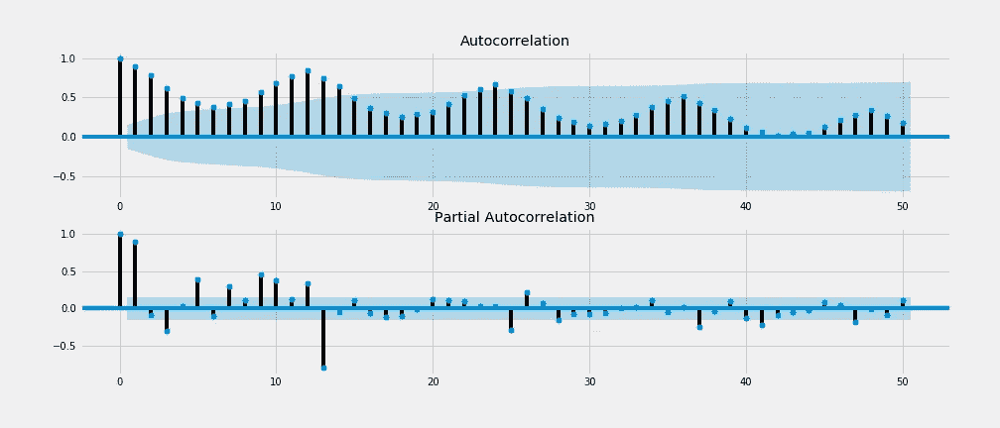

这里我们看到 ACF 和 PACF 图都没有显示快速切入 95%置信区间区域(蓝色)，这意味着时间序列不是静止的。

*   我们可以应用统计检验和扩大的 Dickey-Fuller 检验是广泛使用的一种。检验的零假设是时间序列有一个单位根，这意味着它是非平稳的。我们使用测试的 p 值来解释测试结果。如果 p 值低于阈值(5%或 1%)，我们拒绝零假设，时间序列是平稳的。如果 p 值高于阈值，我们无法拒绝零假设，时间序列是非平稳的。

```
from statsmodels.tsa.stattools import adfullerdftest = adfuller(df['Production'])dfoutput = pd.Series(dftest[0:4], index=['Test Statistic','p-value','#Lags Used','Number of Observations Used'])
for key, value in dftest[4].items():
    dfoutput['Critical Value (%s)'%key] = value
print(dfoutput)
```

> Dickey-Fuller 检验的结果:
> 检验统计量-1.303812
> p 值 0.627427
> #Lags 使用 13.000000
> 观察次数使用 154.000000
> 临界值(1%) -3.473543
> 临界值(5%) -2.880498
> 临界值(10%) -2.

p 值大于阈值，我们无法拒绝零假设，时间序列是非平稳的，它具有时间相关的成分。

所有这些方法都表明**我们拥有非平稳数据。现在，我们需要找到一种方法让它静止不动。**

非平稳时间序列背后有两大原因；趋势和季节性。我们可以应用差分法，从当前观测值中减去以前的观测值，使时间序列平稳。这样我们将消除趋势和季节性，并稳定时间序列的平均值。由于趋势和季节性因素，我们应用了一个非季节性差异`diff()`和一个季节性差异`diff(12)`。

```
df_diff = df.diff().diff(12).dropna()
```

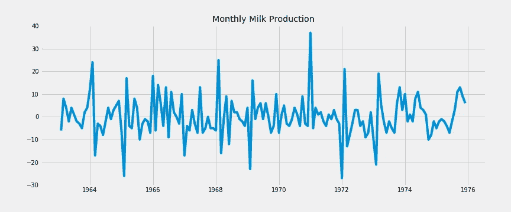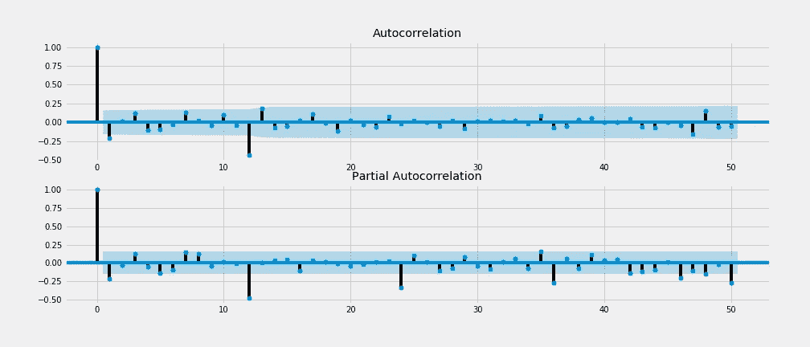

> Dickey-Fuller 检验结果:
> 检验统计量-5.038002
> p 值 0.000019
> #Lags 使用 11.000000
> 观察次数使用 143.000000
> 临界值(1%) -3.476927
> 临界值(5%) -2.881973
> 临界值(10%) -2.

应用前面列出的平稳性检查，我们注意到差分时间序列图没有揭示任何特定的趋势或季节行为，ACF/PACF 图有一个快速截止点，ADF 测试结果返回 p 值几乎为 0.00。其低于阈值。所有这些检查表明**差异数据是稳定的。**

我们将应用季节性自回归综合移动平均(SARIMA 或季节性 ARIMA ),这是 ARIMA 的扩展，支持带有季节性成分的时间序列数据。ARIMA 代表自回归综合移动平均，是时间序列预测最常用的技术之一。

ARIMA 模型用 ARIMA(p，D，Q)的顺序表示，而萨里玛模型用萨里玛(P，D，q)(P，D，Q)m 的顺序表示

**AR(p)** 是一个回归模型，它利用了一个观测值和一些滞后观测值之间的依赖关系。

**I(d)** 是使时间序列平稳的差分阶。

**MA(q)** 是一种利用观测值与应用于滞后观测值的移动平均模型的残差之间的相关性的模型。

(P，D，Q)m 是专门描述模型的季节性组件的附加参数集。p、D 和 Q 代表季节回归、差分和移动平均系数，m 代表每个季节周期中的数据点数。

# 2.模型参数估计

我们将使用 Python 的 pmdarima 库，为我们的季节性 arima 模型自动提取最佳参数。在 auto_arima 函数中，我们将指定`d=1`和`D=1`，因为我们一次区分趋势，一次区分季节性，`m=12`因为我们有月度数据，`trend='C'`包括常数，`seasonal=True`适合季节性 arima。此外，我们指定`trace=True`来打印配合的状态。这有助于我们通过比较 AIC 分数来确定最佳参数。

```
import pmdarima as pmmodel = pm.auto_arima(df['Production'], d=1, D=1,
                      m=12, trend='c', seasonal=True, 
                      start_p=0, start_q=0, max_order=6, test='adf',
                      stepwise=True, trace=True)
```

[AIC](https://en.wikipedia.org/wiki/Akaike_information_criterion) (Akaike 信息准则)是样本外预测误差和我们模型的相对质量的估计量。期望的结果是找到尽可能低的 AIC 分数。

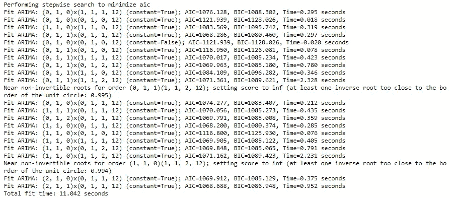

具有各种(P，D，q)(P，D，Q)m 参数的 auto_arima 函数的结果表明，当参数等于(1，1，0)(0，1，1，12)时，获得最低的 AIC 分数。


我们将数据集分成训练集和测试集。在这里，我用 85%作为火车分裂的大小。我们用建议的参数在列车组上创建一个 SARIMA 模型。我们使用的是 statsmodel 库中的 SARIMAX 函数(X 描述的是外生参数，这里不加任何)。拟合模型后，我们还可以打印汇总统计数据。

```
from statsmodels.tsa.statespace.sarimax import SARIMAXmodel = SARIMAX(train['Production'],
                order=(1,1,0),seasonal_order=(0,1,1,12))
results = model.fit()
results.summary()
```

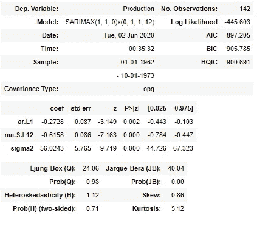

# 3.模型验证

该模型主要关注的是确保残差正态分布，均值为零且不相关。

为了检查残差统计，我们可以打印模型诊断:

```
results.plot_diagnostics()
plt.show()
```

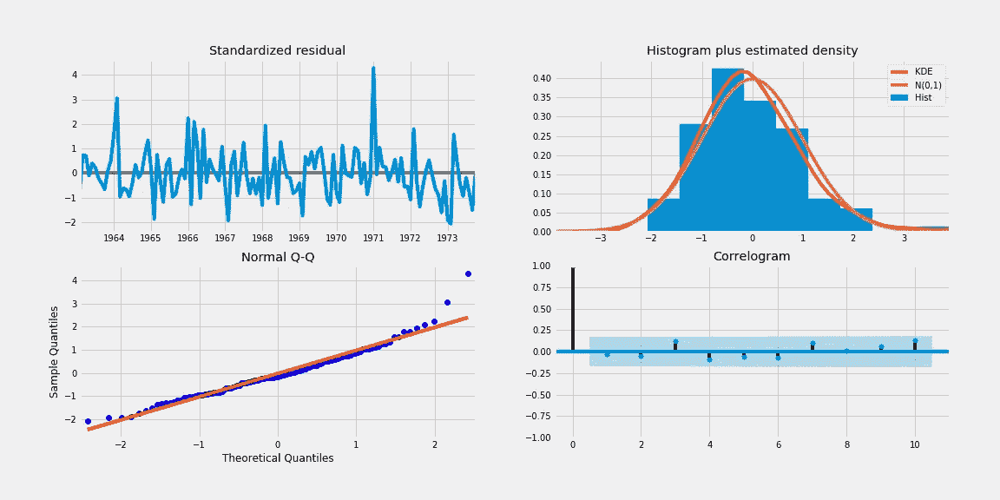

*   左上角的图显示了一段时间内的残差，它似乎是一个没有季节性成分的白噪声。
*   右上角的图显示 kde 线(红色)紧密跟随 N(0，1)线，N(0，1)线是均值为零、标准差为 1 的正态分布的标准符号，表明残差是正态分布的。
*   左下方的正态 QQ 图显示残差的有序分布(蓝色)紧密遵循从标准正态分布中提取的样本的线性趋势，表明残差呈正态分布。
*   右下角是相关图，表明残差与滞后版本的相关性较低。

所有这些结果都表明残差呈低相关性正态分布。

为了衡量预测的准确性，我们将测试集上的预测值与其真实值进行比较。

```
forecast_object = results.get_forecast(steps=len(test))
mean = forecast_object.predicted_mean
conf_int = forecast_object.conf_int()
dates = mean.index
```

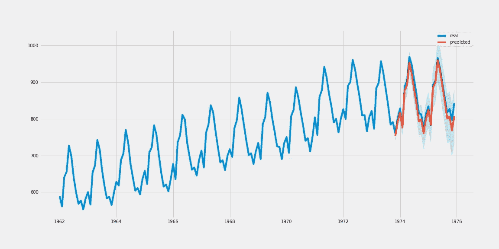

从图中，我们看到模型预测几乎与测试集的真实值相匹配。

```
from sklearn.metrics import r2_scorer2_score(test['Production'], predictions)>>> 0.9240433686806808
```

模型的 **R 的平方**为 0.92，表明模型的决定系数为 92%。

```
mean_absolute_percentage_error = np.mean(np.abs(predictions - test['Production'])/np.abs(test['Production']))*100>>> 1.649905
```

**平均绝对百分比误差** (MAPE)是最常用的精度指标之一，以误差的百分比来表示精度。模型的 MAPE 得分等于 1.64，表明预测误差 1.64%，准确率为 98.36%。

由于诊断测试和准确性指标都表明我们的模型近乎完美，我们可以继续进行未来预测。

这是未来 60 个月的预测。

```
results.get_forecast(steps=60)
```

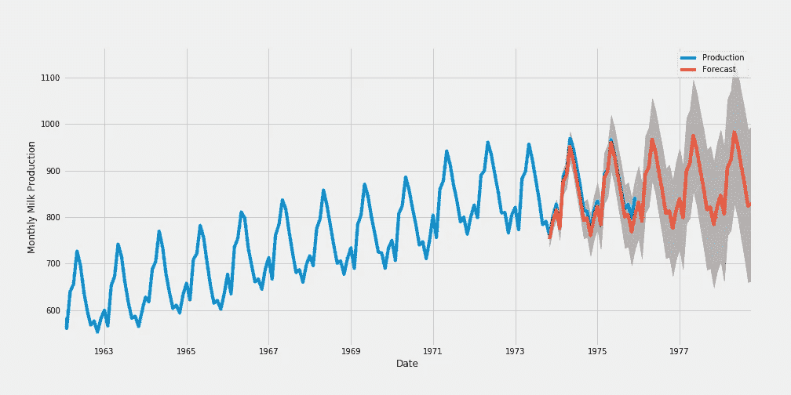

我希望您喜欢学习本教程并在 Python 中构建时间序列预测。

*如果你喜欢这篇文章，你可以* [***在这里阅读我的其他文章***](https://medium.com/@idilismiguzel)**和* [***关注我上媒***](http://medium.com/@idilismiguzel/follow)*如果有任何问题或建议，请告诉我。✨**

**喜欢这篇文章吗？ [**成为会员求更！**](https://idilismiguzel.medium.com/membership)**