# 动手变形金刚(Kaggle 谷歌 QUEST 问答标注)。

> 原文：<https://towardsdatascience.com/hands-on-transformers-kaggle-google-quest-q-a-labeling-affd3dad7bcb?source=collection_archive---------25----------------------->

## 《变形金刚》第 3/3 部 vs 谷歌 QUEST 问答标注(Kaggle top 5%)。


作者图片

*这是一个由 3 部分组成的系列，我们将经历变形金刚、伯特和动手 Kaggle 挑战—*[*Google QUEST Q&A Labeling*](https://www.kaggle.com/c/google-quest-challenge/)*来观看变形金刚的行动(在排行榜上排名第 4.4%)。在这部分(3/3 ),我们将会看到谷歌在 Kaggle 上的一个实践项目。由于这是一个 NLP 挑战，我在这个项目中使用了变形金刚。我在这一部分没有详细介绍变形金刚，但是如果你愿意的话，你可以看看这个系列的 1/3 部分，在那里我详细讨论了变形金刚。*

# 博客的鸟瞰图:

为了方便阅读，我把博客分成了不同的子主题-

*   问题陈述和评估标准。
*   关于数据。
*   探索性数据分析(EDA)。
*   建模(包括数据预处理)。
*   建模后分析。

# 问题陈述和评估指标:

计算机非常擅长用单一的、可验证的答案来回答问题。但是，人类通常更善于回答关于观点、建议或个人经历的问题。

人类更擅长解决需要对背景有更深层次、多维度理解的主观问题。问题可以有多种形式——有些是多句子的阐述，有些可能是简单的好奇或者是一个完全成熟的问题。他们可以有多种意图，或者寻求建议和意见。有些可能是有帮助的，有些可能是有趣的。有些是简单的对错。

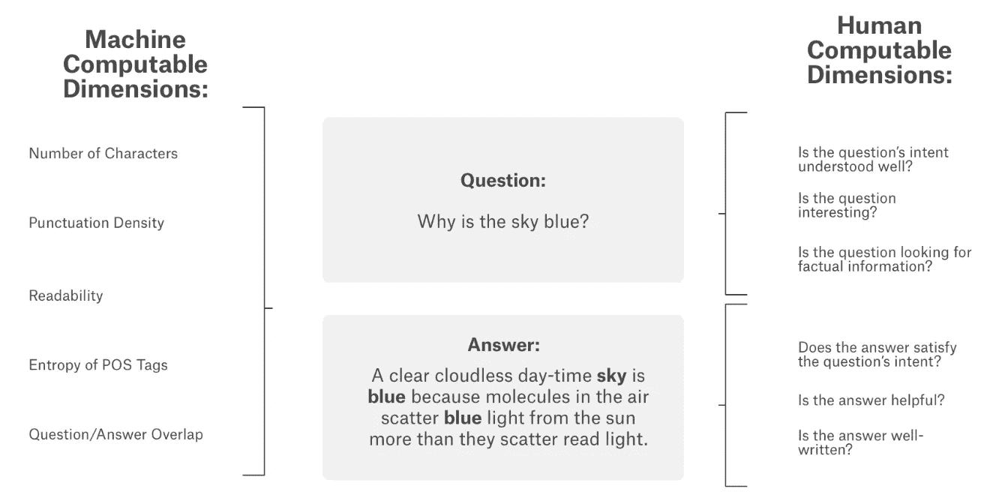

不幸的是，由于缺乏数据和预测模型，很难建立更好的主观问答算法。这就是为什么谷歌研究的[众包](https://crowdsource.google.com/)团队，一个致力于通过众包推进 NLP 和其他类型的 ML 科学的团队，已经收集了许多这些质量评分方面的数据。

在这场比赛中，我们面临的挑战是使用这个新的数据集为问答的不同主观方面构建预测算法。这些问答配对是从近 70 个不同的网站上以“常识”的方式收集来的。评分者接受的指导和培训很少，很大程度上依赖于他们对提示的主观理解。因此，每个提示都是以最直观的方式制作的，这样评分者可以简单地利用他们的常识来完成任务。

证明这些主观标签可以被可靠地预测，可以为这一研究领域带来新的曙光。这次比赛的结果将告知未来智能问答系统的构建方式，希望有助于它们变得更像人类。

**评估指标:**根据平均列相关系数 [Spearman 相关系数](https://en.wikipedia.org/wiki/Spearman%27s_rank_correlation_coefficient)对提交的内容进行评估。为每个目标列计算 Spearman 等级相关性，并为提交分数计算这些值的平均值。

# 关于数据:

此竞赛的数据包括来自各种 StackExchange 属性的问题和答案。我们的任务是预测每个问答对的 30 个标签的目标值。
30 个目标标签的列表与`sample_submission.csv`文件中的列名相同。前缀为`question_`的目标标签与数据中的`question_title`和/或`question_body`特征相关。带有前缀`answer_`的目标标签与`answer`特征相关。
每一行都包含一个问题和该问题的一个答案，以及附加功能。训练数据包含带有一些重复问题(但答案不同)的行。测试数据不包含任何重复的问题。
目标标签可以有范围`[0,1]`内的连续值。因此，预测也必须在该范围内。
提供的文件有:

*   train.csv —训练数据(目标标签是最后 30 列)
*   test.csv —测试集(您必须为每个测试集行预测 30 个标签)
*   sample_submission.csv —格式正确的示例提交文件；列名是 30 个目标标签

您可以使用[这个](https://www.kaggle.com/c/google-quest-challenge/data)链接来检查数据集。

# **探索性数据分析(EDA)**

***Check-out 深入 EDA +数据抓取的笔记本(*** [***Kaggle 链接***](https://www.kaggle.com/sarthakvajpayee/top-4-4-in-depth-eda-feature-scraping?scriptVersionId=40263047) ***)。***

训练数据包含 6079 个列表，每个列表有 41 列。在这 41 列中，前 11 列/特征必须用作输入，后 30 列/特征是目标预测。
让我们来看看输入和目标标签:

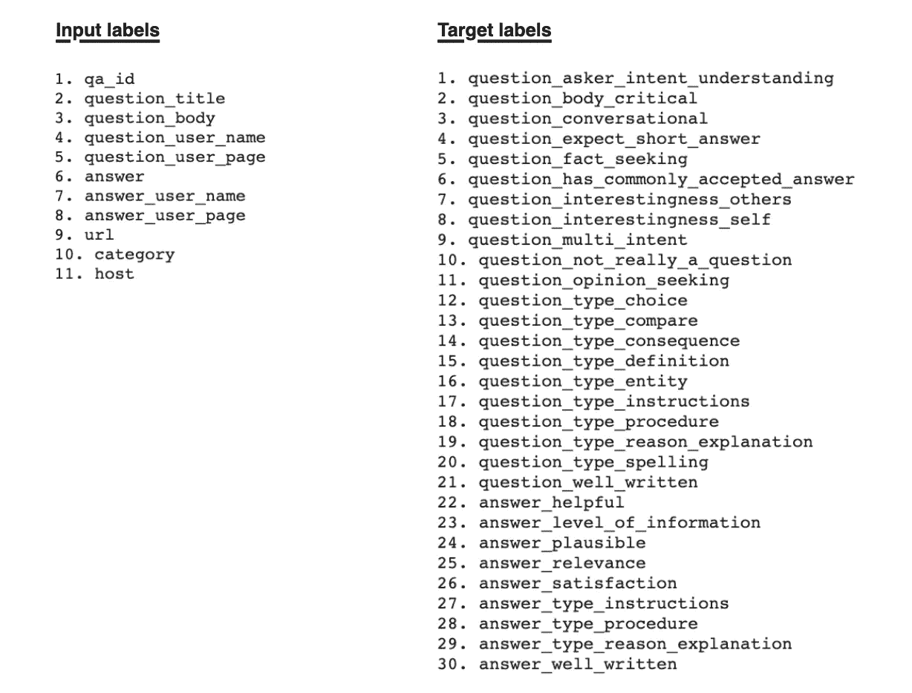

作者图片

输出特征都是介于 0 和 1 之间的浮点类型。

让我们一个一个地探索输入标签。

## qa_id

问题答案 id 表示给定数据集中特定数据点的 ID。每个数据点都有一个唯一的 qa_id。此功能不用于培训，稍后将在向 Kaggle 提交输出时使用。

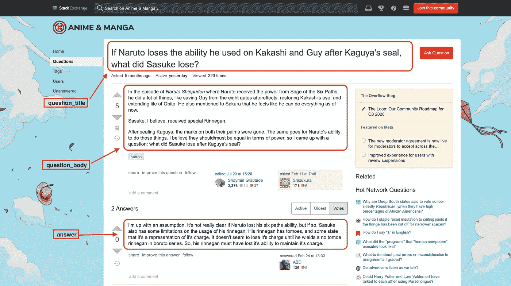

[https://anime . stack exchange . com/questions/56789/if-naruto-loss-the-ability-he-used-on-kakashi-and-guy-after-kaguyas-seal-what](https://anime.stackexchange.com/questions/56789/if-naruto-loses-the-ability-he-used-on-kakashi-and-guy-after-kaguyas-seal-what)

## 问题 _ 标题

这是一个字符串数据类型功能，保存所提问题的标题。
为了分析 question_title，我将绘制这个特性的字数直方图。

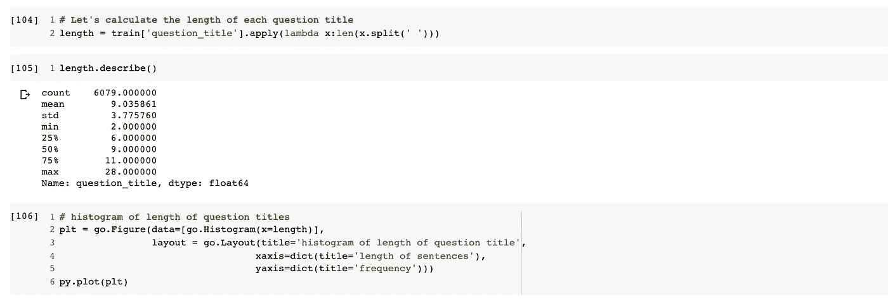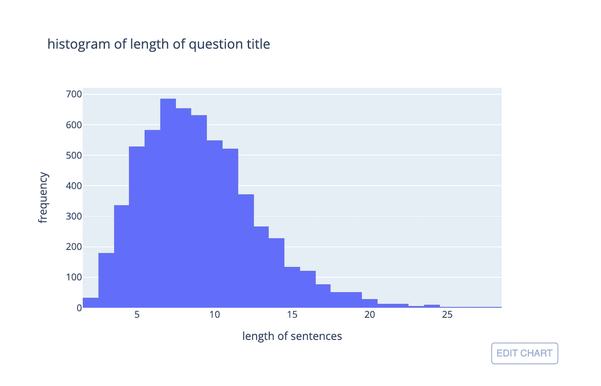

从分析来看，很明显:
——大部分 question_title 特征的词长在 9 左右。
-最小问题长度为 2。
-最大问题长度为 28 个。
- 50%的问题标题的长度在 6 到 11 之间。
- 25%的问题标题长度在 2 到 6 之间。
- 25%的问题标题长度在 11 到 28 之间。

## 问题 _ 正文

这也是一个字符串数据类型特性，保存所提问题的详细文本。
为了分析 question_body，我将绘制这个特性的字数直方图。


从分析来看，很明显:
——大部分 question_body 特征的词长在 93 左右。
-最小问题长度为 1。
-最大问题长度为 4666。
- 50%的问题标题长度在 55 到 165 之间。
- 25%的问题标题长度在 1 到 55 之间。
- 25%的问题标题长度在 165 到 4666 之间。

该分布看起来像幂律分布，可以使用 log 将其转换为高斯分布，然后用作工程特征。

## 问题 _ 用户名

这是一个字符串数据类型功能，表示提出问题的用户的姓名。
为了分析 question_answer，我将绘制这个特性中单词数量的直方图。


我没有发现这个特性有多大用处，所以我不会用它来建模。

## 问题 _ 用户 _ 页面

这是一个字符串数据类型特性，它保存了提问用户的个人资料页面的 URL。

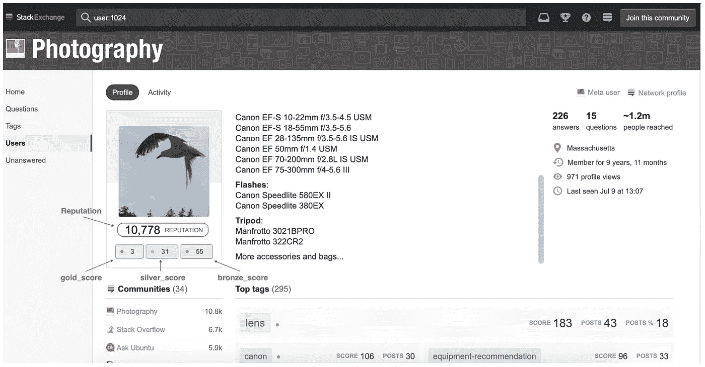

在个人资料页面上，我注意到了 4 个有用的特性，它们可能会有助于做出正确的预测。特征有:
-信誉:表示用户的信誉。
- gold_score:颁发的金牌数。
- silver_score:颁发的银牌数。
- bronze_score:颁发的铜牌数量。

## 回答

这也是一个字符串数据类型特性，它保存问题答案的详细文本。
为了对*答案*进行分析，我将绘制这个特征的字数直方图。

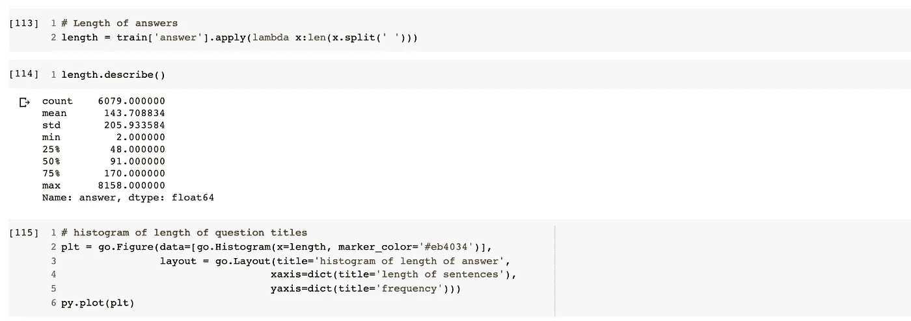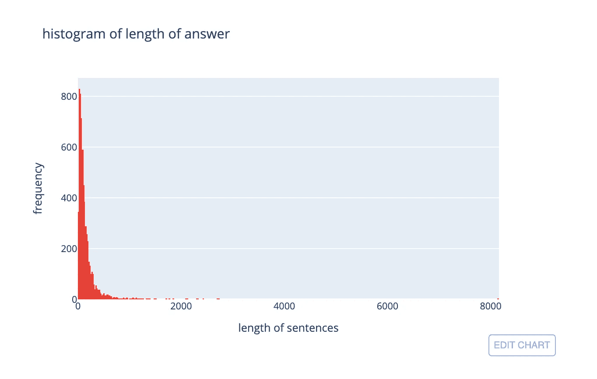

从分析来看，很明显:
-大部分的 question_body 特征的词长在 143 左右。
-最小问题长度为 2。
-最大问题长度为 8158。
- 50%的问题标题长度在 48 到 170 之间。
- 25%的问题标题长度在 2 到 48 之间。
- 25%的问题标题长度在 170 到 8158 之间。

这种分布看起来也像幂律分布，也可以使用对数转换为高斯分布，然后用作工程特征。

## 答案用户名

这是一个字符串数据类型功能，表示回答问题的用户的姓名。


我没有发现这个特性有多大用处，所以我不会用它来建模。

## 答案 _ 用户 _ 页面

这是一个字符串数据类型特性，类似于特性“question_user_page ”,它保存了提问用户的个人资料页面的 URL。

我还使用这个特性中的 URL 从用户的个人资料页面中抓取外部数据，类似于我对特性‘question _ user _ page’所做的。

## 全球资源定位器(Uniform Resource Locator)

此功能保存 StackExchange 或 StackOverflow 上的问答页面的 URL。下面我打印了来自 train.csv 的前 10 个 *url* 数据点


需要注意的一点是，这个功能会把我们带到问答页面，而这个页面通常会包含更多的数据，比如评论、投票、其他答案等等。如果模型由于训练中的数据较少而表现不佳，则可以使用它来生成更多的特征。csv
让我们看看数据是否存在，以及可以从问答页面中获取哪些附加数据。


[网页来源](https://anime.stackexchange.com/questions/3281/whos-inside-the-third-coffin-that-orochimaru-tried-to-summon?rq=1)

在上面附加的快照中，*帖子 1* 和*帖子 2* 包含对所提问题的回答、支持投票和评论，按支持投票的降序排列。带有绿色勾号的帖子包含 train.csv 文件中提供的答案。

每个问题可能有不止一个答案。我们可以收集这些答案，并将其用作额外的数据。

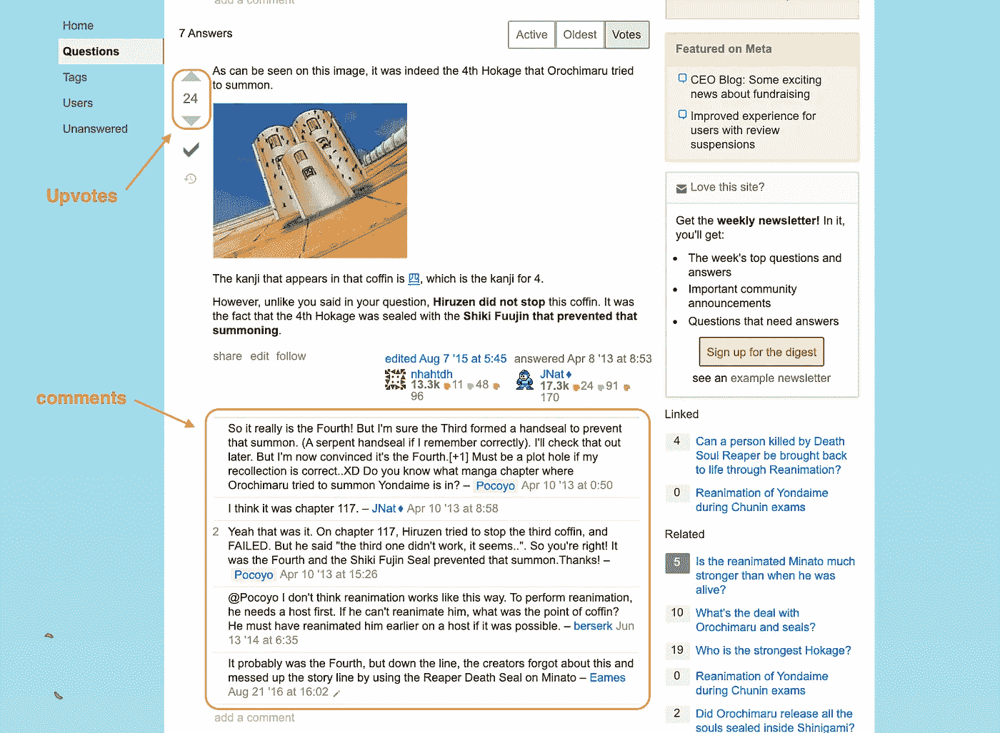

[网页来源](https://anime.stackexchange.com/questions/3281/whos-inside-the-third-coffin-that-orochimaru-tried-to-summon?rq=1)

上面的快照定义了一篇文章的结构。我们可以收集有用的特征，如 *upvotes* 和 *comments* 并将其用作附加数据。

下面是从 URL 页面抓取数据的代码。

我刮到了 8 个新功能-
- upvotes:所提供答案的 upvotes 数。
- comments_0:对所提供答案的评论。
-答案 1:除了提供的答案之外，投票最多的答案。
-评论 _1:回答 _1 的置顶评论。
-答案 2:第二多的投票答案。
-评论 _2:回答 _2 的置顶评论。
-答案 _3:票数第三的答案。
-评论 _3:回答 _3 的置顶评论。

## 种类

这是一个分类特征，它告诉问题和回答对的类别。下面我打印了来自 train.csv 的前 10 个*类别*数据点


下面是绘制类别饼图的代码。


图表告诉我们，大部分分属于*技术类*，最少属于*生活 _ 艺术类*(6079 分中的 709 分)。

## 宿主

此功能保存 StackExchange 或 StackOverflow 上的问答页面的主机或域。下面我打印了来自 train.csv 的前 10 个*主机*数据点


下面是绘制唯一主机条形图的代码。


看起来在训练数据中并不多，只有 63 个不同的子域。大多数数据点来自 StackOverflow.com，而最少来自 meta.math.stackexchange.com

## 目标值

我们来分析一下需要预测的目标值。但是首先，为了更好的解释，请使用[链接](https://www.kaggle.com/c/google-quest-challenge/data?select=train.csv)查看 kaggle 上的完整数据集。

下面是显示目标值统计描述的代码块。这些只是全部 30 个特性中的前 6 个特性。
所有特性的值都是浮点型的，并且在 0 和 1 之间。


请注意第二个代码块，它显示了数据集中存在的唯一值。0 和 1 之间只有 25 个唯一值。这在以后微调代码时会很有用。

最后，让我们检查目标特性的分布及其相关性。

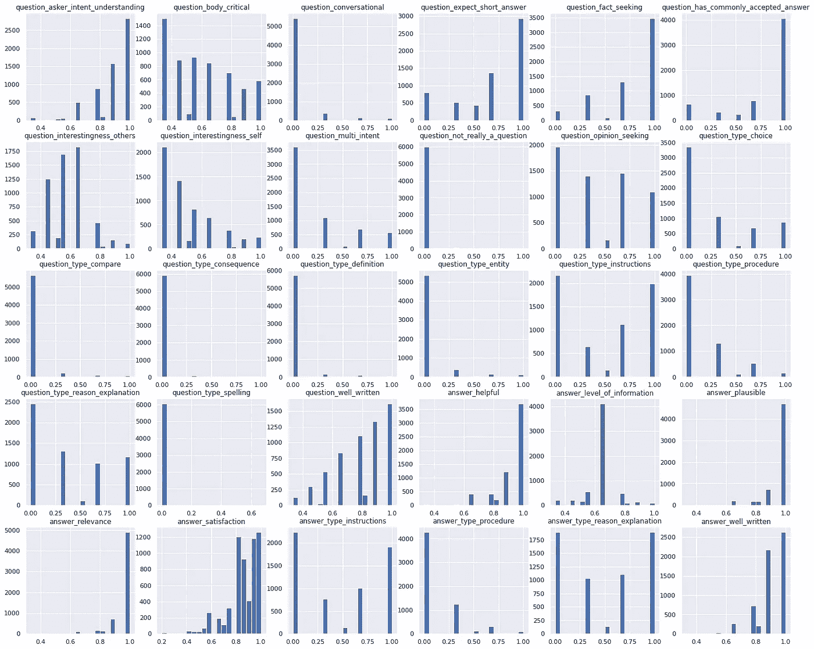

目标特征的直方图。

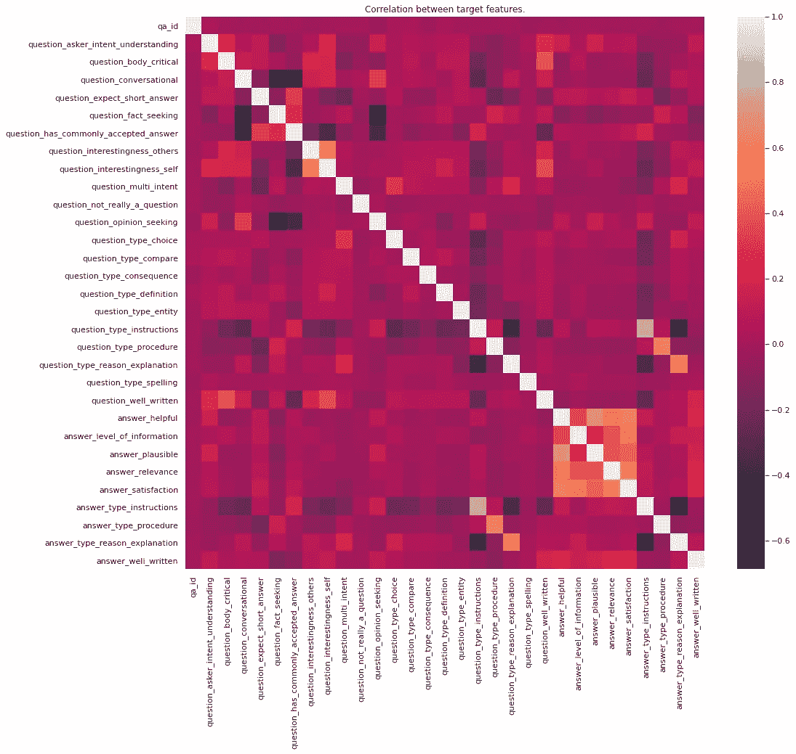

目标特征之间相关性的热图。

# 建模

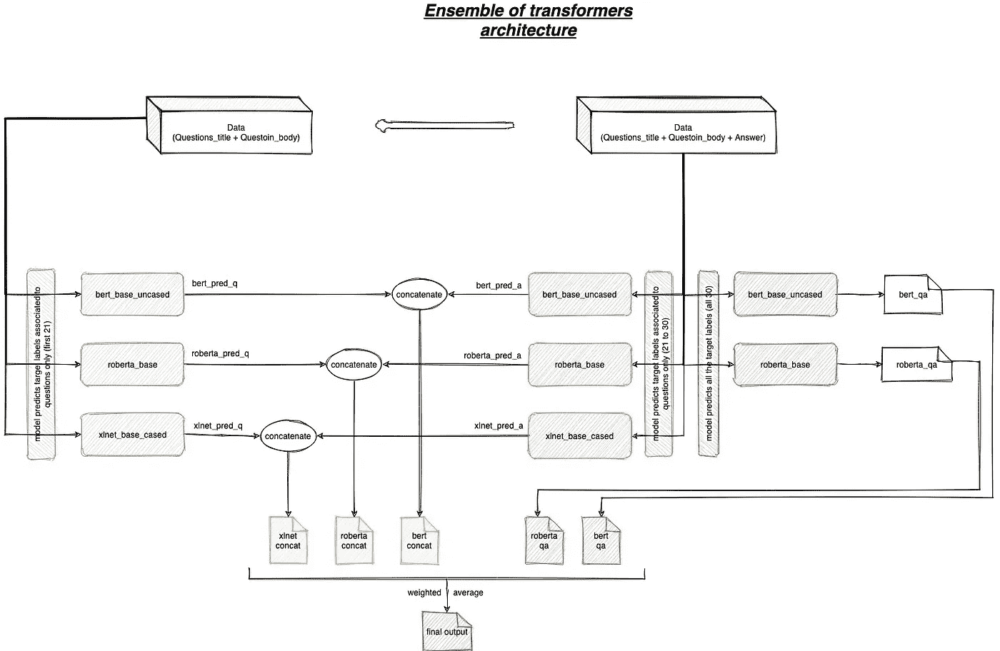

作者图片

现在我们通过 EDA 更好地了解了我们的数据，让我们从建模开始。下面是我们将在这一部分讨论的副主题-

*   **架构概述:**总体架构及其不同组件的快速概述。
*   **基础学习者:**集合中使用的基础学习者的概述。
*   **准备数据:**数据清理和建模准备。
*   **集合:**创建训练模型，并进行预测。将数据准备、模型训练和模型预测步骤流水线化。
*   **从 Kaggle 获取分数:**在 Kaggle 上提交测试数据的预测目标值，并生成排行榜分数，以查看整体表现如何。

我尝试了各种深度神经网络架构，包括 GRU、Conv1D、密集层，以及竞争对手的不同功能，但 8 个变压器的组合(如上所示)似乎效果最佳。
在这一部分中，我们将关注所使用的整体的最终架构，对于我实验的其他基线模型，你可以查看我的 github repo。

> **架构概述:**

记住我们的任务是给定 ***问题标题、问题正文和答案*** *、*，我们必须预测 30 个目标标签。
现在出来的这 30 个目标标签中，前 21 个都与 ***问题 _ 标题*** 和*问题 _ 正文* 和 ***答案*** 没有关系，而最后 9 个目标标签都只与 ***答案*** 有关，但在这 9 个当中，有些还带 ***问题 _ 标题*
例如，像*答案 _ 相关性*和*答案 _ 满意度*这样的特征只能通过看问题和答案来评级。**

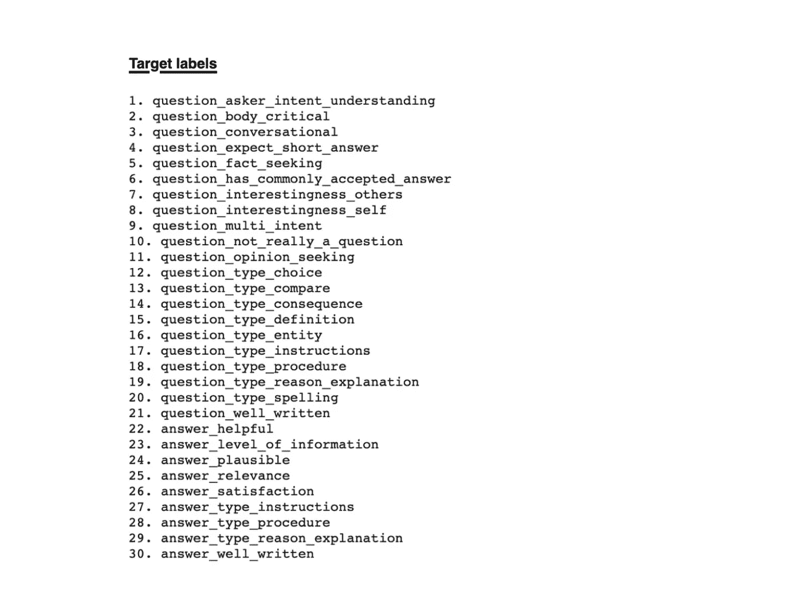

通过一些实验，我发现基础学习者(BERT_base)在预测前 21 个目标特征(仅与问题相关)方面表现得非常好，但是在预测后 9 个目标特征方面表现得不太好。注意到这一点，我构建了 3 个专门的基础学习者和 2 个不同的数据集来训练他们。

1.  第一个基础学习者只致力于预测与问题相关的特征(前 21 个)。用于训练该模型的数据集仅由特征 ***问题 _ 标题*** 和 ***问题 _ 正文*** 组成。
2.  第二个基础学习者只致力于预测与答案相关的特征(最后 9 个)。用于训练该模型的数据集由特征 ***问题 _ 标题*** 、 ***问题 _ 正文、*** 和 ***答案*** 组成。
3.  第三个基础学习者致力于预测所有 30 个特征。用于训练该模型的数据集再次由特征 ***问题 _ 标题*** 、 ***问题 _ 正文、*** 和 ***答案*** 组成。

为了使架构更加健壮，我使用了 3 种不同类型的基础学习者——BERT、RoBERTa 和 XLNet。
我们将在本博客稍后讨论这些不同的变压器模型。

在上面的系综图中，我们可以看到—

*   由**【问题标题+问题正文】**和**【问题标题+问题正文+答案】**组成的 2 个数据集分别用于训练不同的基础学习者。
*   然后，我们可以看到 3 个不同的基础学习者 **(BERT、RoBERTa 和 XLNet)** 致力于使用数据集**[question _ title+question _ body]**预测仅**问题相关特征的蓝色**(前 21 个)
*   接下来，我们可以看到 3 个不同的基础学习者 **(BERT、RoBERTa 和 XLNet)** 专门使用数据集**[question _ title+question _ body+answer]预测仅**答案相关的特征**(最后 9 个)以绿色显示。**
*   最后，我们可以看到 2 个不同的基础学习器 **(BERT 和 RoBERTa)** 致力于使用数据集**[question _ title+question _ body+answer]预测**所有 30 个红色特征**。**

在下一个步骤中，来自仅专用于预测**问题相关特征的模型的预测数据**(表示为 ***bert_pred_q，roberta_pred_q，xlnet _ pred _ q***)**和来自仅专用于预测**答案相关特征的模型的预测数据**(表示为 ***bert_pred_a，Roberta _ a 这些连接的特征被表示为 ***xlnet_concat、roberta_concat、*** 和 ***bert_concat。********

**类似地，收集来自专用于预测所有 30 个特征****模型的预测数据(表示为 ***bert_qa，roberta_qa*** )。请注意，我在这里没有使用 XLNet 模型来预测所有 30 个特性，因为分数没有达到标准。******

**最后，在收集了所有不同的预测数据—***【xlnet _ concat，roberta_concat，bert_concat，bert_qa，和 roberta_qa】，*** 之后，通过取所有不同预测值的平均值来计算最终值。**

> ****基础学习者****

**现在，我们将看看作为基础学员使用的 3 种不同的变压器模型。**

1.  ****bert_base_uncased:****

**[Bert](https://arxiv.org/abs/1810.04805) 是由谷歌人工智能在 2018 年底提出的，从那时起，它已经成为广泛的自然语言处理任务的最先进技术。
它使用一种源自 transformers 的架构，对大量未标记的文本数据进行预训练，以学习一种语言表示，可用于微调特定的机器学习任务。BERT 在几个具有挑战性的任务上超过了 NLP 的最新水平。BERT 的这种性能可以归因于 transformer 的编码器架构、非常规的训练方法，如掩蔽语言模型(MLM)、下一句预测(NSP)以及它所训练的海量文本数据(所有维基百科和书籍语料库)。BERT 有不同的尺寸，但在这个挑战中，我使用了 *bert_base_uncased。***

****

**作者图片**

***bert_base_uncased* 的架构由 12 个编码器单元组成，每个编码器单元中有 8 个注意头。默认情况下，它接受大小为 512 的输入并返回 2 个值，输出对应于第一个输入令牌[CLS]，其维度为 786，另一个输出对应于所有 512 个输入令牌，其维度为(512，768) aka pooled_output。
但除此之外，我们还可以通过将***output _ hidden _ States = True***作为参数之一来访问 12 个编码器单元中的每一个返回的隐藏状态。
BERT 接受几组输入，在这次挑战中，我将使用三种类型的输入:**

*   *****input _ ids****:*标记嵌入是输入句子中单词的数字表示。还有一种叫做子词标记化的东西，BERT 使用它首先将较大或复杂的单词分解为简单的单词，然后将它们转换为标记。例如，在上图中，在生成令牌嵌入之前，看看单词“playing”是如何被分解为“play”和“##ing”的。标记化中的这一调整创造了奇迹，因为它利用了一个复杂单词的子单词上下文，而不是像对待一个新单词一样对待它。**
*   *****attention _ mask****:*片段嵌入用于帮助 BERT 区分单个输入中的不同句子。对于来自同一个句子的单词，这个嵌入向量的元素都是相同的，并且如果句子不同，该值也会改变。
    让我们考虑一个例子:假设我们要将两个句子*“我有一支笔”*和*“笔是红色的”*传递给 BERT。分词器首先将这些句子分词为:
    **['[CLS]'，'我'，' have '，' a '，' pen '，'[SEP]'，' The '，' pen '，' is '，' red '，'[SEP]']** 并且这些句子的段嵌入将看起来像:
    **【0，0，0，0，0，0，0，1，1，1，1，1，1]** 注意对应于第一个句子中的单词的所有元素如何具有**
*   ****由于 BERT 采用 512 维输入，并且假设我们只有 10 个单词的输入。为了使标记化的单词与输入大小兼容，我们将在末尾添加大小为 512–10 = 502 的填充。连同填充符一起，我们将生成大小为 512 的屏蔽令牌，其中对应于相关单词的索引将具有 **1** s，对应于填充符的索引将具有 **0** s。****

****2。XLNet_base_cased:****

**[XLNet](https://arxiv.org/abs/1906.08237) 由谷歌人工智能大脑团队和 CMU 的研究人员在 2019 年年中提出。它的架构比 BERT 更大，并使用改进的方法进行训练。它在更大的数据上进行训练，在许多语言任务中表现出比 BERT 更好的性能。 **BERT** 和 XLNet 之间的概念差异在于，在训练 BERT 时，按照前一个预测单词有助于下一个单词预测的顺序预测单词，而 **XLNet** 学习按照任意顺序但以自回归方式(不一定是从左到右)预测单词。**

**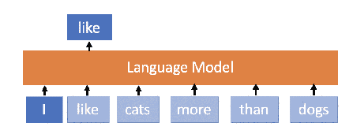**

***传统语言模型的预测方案。阴影单词作为输入提供给模型，而非阴影单词被屏蔽掉。***

**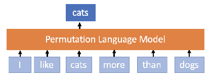**

***一个置换语言模型如何预测某个置换的记号的例子。阴影单词作为输入提供给模型，而非阴影单词被屏蔽掉。***

**这有助于模型学习双向关系，从而更好地处理单词之间的依赖性和关系。
除了训练方法之外，XLNet 使用基于 Transformer XL 的架构和两个主要的关键思想:*相对位置嵌入*和*递归机制*，即使在没有基于排列的训练的情况下也表现出良好的性能。
XLNet 用超过 130 GB 的文本数据和运行 2.5 天的 512 个 TPU 芯片进行训练，这两个数据都比 BERT 大得多。**

**对于 XLNet，我将只使用 **input_ids** 和 **attention_mask** 作为输入。**

****3。罗伯塔 _ 基地:****

**罗伯塔是脸书在 2019 年年中提出的。这是一种鲁棒优化的方法，用于预处理自然语言处理(NLP)系统，改进了 BERT 的自监督方法。
RoBERTa 基于 BERT 的语言掩蔽策略，其中系统学习预测未标注语言示例中有意隐藏的文本部分。RoBERTa 修改了 BERT 中的关键超参数，包括删除 BERT 的下一句预测(NSP)目标，以及使用更大的小批量和学习率进行训练。与 BERT 相比，这允许 RoBERTa 改进屏蔽语言建模目标，并导致更好的下游任务性能。罗伯塔也比伯特接受了更多的数据和更长的时间的训练。使用的数据集来自现有的未标注的 NLP 数据集以及 CC-News，这是一个从公共新闻文章中提取的新数据集。**

**对于 RoBERTa_base，我将只使用 **input_ids** 和 **attention_mask** 作为输入。**

*****最后这里是伯特、XLNet、罗伯塔的对比:*****

**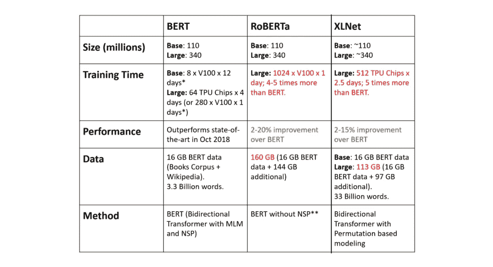******

**[来源链接](https://www.google.com/url?sa=i&url=https%3A%2F%2Ftowardsdatascience.com%2Fbert-roberta-distilbert-xlnet-which-one-to-use-3d5ab82ba5f8&psig=AOvVaw2cf6K31PfXF2YtrANVGKZe&ust=1596463051519000&source=images&cd=vfe&ved=0CAIQjRxqFwoTCJDg_rrW_OoCFQAAAAAdAAAAABAD)**

> ****准备数据****

**现在我们已经对架构有了一些了解，让我们看看如何为基础学习者准备数据。**

*   **作为预处理步骤，我刚刚处理了特性中的 HTML 语法。我使用 html.unescape()从 HTML DOM 元素中提取文本。
    在下面的代码片段中，函数 **get_data()** 读取训练和测试数据，并对特征 ***question_title、*** 和 ***答案进行预处理。*****

*   **下一步是从输入句子中创建 ***输入 _ 标识、注意 _ 掩码、*** 和 ***令牌 _ 类型 _ 标识*** 。
    在下面的代码片段中，函数 **get_tokenizer()** 为不同的 base_learners 收集预训练的 tokenizer。
    第二个函数 **fix_length()** 检查生成的问题令牌和答案令牌，并确保令牌的最大数量为 512。确定记号数量的步骤如下:
    -如果输入句子的记号数量为> 512，则将句子削减至 512。
    -为了削减令牌的数量，从开始的 256 个令牌和从结束的 256 个令牌被保留，其余的令牌被丢弃。
    -例如，假设一个答案有 700 个记号，为了将其减少到 512 个，从开头取 256 个记号，从结尾取 256 个记号，并连接起来得到 512 个记号。位于答案中间的其余[700-(256+256) = 288]个标记将被丢弃。
    -这种逻辑是有道理的，因为在一篇大文章中，开头部分通常描述文章的全部内容，结尾部分描述文章的结论。**

**接下来是用于生成**输入 _ 标识、注意 _ 屏蔽、**和**令牌 _ 类型 _ 标识的代码块。**我使用了一个条件来检查函数是否需要返回为依赖数据集**【问题标题+问题正文】**或数据集**【问题标题+问题正文+答案】的基础学习者生成的数据。****

**最后，这个函数利用上面初始化的函数，为所提供数据中的每个实例生成 **input_ids、attention_masks、**和 **token_type_ids** 。**

**为了使模型训练变得容易，我还创建了一个类，它在使用 KFlod CV 时，在上面指定的函数的帮助下，基于折叠生成训练和交叉验证数据。**

> ****组装****

**在数据预处理之后，让我们从基础学习者开始创建模型架构。**

**下面的代码将模型名称作为输入，根据输入名称收集预训练模型及其配置信息，并创建基本学习者模型。注意**output _ hidden _ States = True**在添加配置数据后通过。**

**下一个代码块是创建整体架构。该函数接受两个参数 name 和 model_type，name 表示我们要训练的模型的名称，model _ type 表示我们要训练的模型的类型。模型类型可以是 **bert-base-uncased、roberta-base** 或 **xlnet-base-cased** ，而模型类型可以是**问题、答案、**或**问题 _ 答案。** 函数 **create_model()** 采用 model_name 和 model_type，生成一个可以根据指定数据进行训练的模型。**

**现在让我们创建一个用于计算评估指标 [Spearman 相关系数](https://en.wikipedia.org/wiki/Spearman%27s_rank_correlation_coefficient)的函数。**

**现在，我们需要一个功能，可以收集基础学习者模型，根据基础学习者模型的数据，并训练模型。
我用了 5 折的 K 折交叉验证进行训练。**

**现在，一旦我们训练了模型并生成了预测值，我们就需要一个函数来计算加权平均值。这是代码。
*加权平均值中的权重均为 1。**

**在把所有东西放在一起之前，我还使用了一个函数来处理最终的预测值。记得在 EDA 部分有一个目标值分析，我们注意到目标值只有 25 个介于 0 和 1 之间的唯一浮点数。为了利用这些信息，我计算了 61 个(超参数)均匀分布的百分位值，并将它们映射到 25 个唯一值。这在目标值的上限和下限之间创建了 61 个均匀间隔的箱。现在，为了处理预测的数据，我使用这些容器来收集预测值，并将它们放在正确的位置/顺序。这一招在一定程度上帮助提高了最终提交排行榜的分数。**

**最后，为了将数据预处理、模型训练和后处理结合在一起，我创建了收集数据的 **get_predictions()** 函数。
-创建 8 个基础学习者。
-为基础学员准备数据。
-训练基础学习者并从他们那里收集预测值。
-计算预测值的加权平均值。
-处理加权平均预测。
-将最终预测值转换成 Kaggle 要求的数据帧格式提交并返回。**

> ****从 Kaggle 获取分数****

**一旦代码编译运行成功，就会生成一个输出文件，可以提交给 Kaggle 进行**分数**计算。排行榜上代码的排名是使用**分数生成的。** 合奏模特获得 **0.43658** 的公众评分，在排行榜上位列前 4.4%。**

# **建模后分析**

*****检出完成后建模分析的笔记本(*** [***Kaggle 链接***](https://www.kaggle.com/sarthakvajpayee/top-4-4-post-modeling-analysis?scriptVersionId=40262842) ***)。*****

****

**是时候进行一些后建模分析了！**

**在这一节中，我们将分析训练数据，以找出模型在数据的哪些部分表现良好，在数据的哪些部分表现不佳。
这一步背后的主要思想是了解训练模型的能力，如果应用得当，它可以很好地微调模型和数据。
但在本节中，我们不会进入微调部分，我们将使用列车数据的预测目标值对列车数据执行一些基本的 EDA。我将逐一介绍这些数据。以下是我们将要进行分析的主要功能-**

*   **问题标题、问题正文和答案。**
*   **问题标题、问题正文和答案的单词长度。**
*   **主持**
*   **种类**

**首先，我们必须将数据分为好数据和坏数据。好数据将是模型获得好分数的数据点，而坏数据将是模型获得坏分数的数据点。
现在为了评分，我们将比较训练数据的实际目标值和训练数据的模型预测目标值。我使用**均方差(MSE)** 作为评分标准，因为它关注的是实际值和目标值的接近程度。记住 MSE 分数越大，数据点就越差。计算 MSE 分数相当简单。代码如下:**

```
# Generating the MSE-score for each data point in train data.
from sklearn.metrics import mean_squared_errortrain_score = [mean_squared_error(i,j) for i,j in zip(y_pred, y_true)]# sorting the losses from minimum to maximum index wise.
train_score_args = np.argsort(train_score)
```

> ****问题 _ 标题、问题 _ 正文和答案****

**从第一组特征开始，它们都是文本类型的特征，我将用它们来绘制单词云。计划是从得分最低的 5 个数据点和得分最高的另外 5 个数据点中分割出这些特征。**

**绘制单词云的功能**

**让我们运行代码，看看结果是什么样的。**

**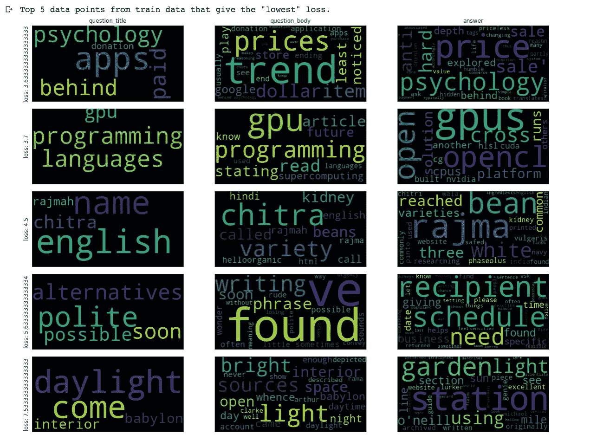****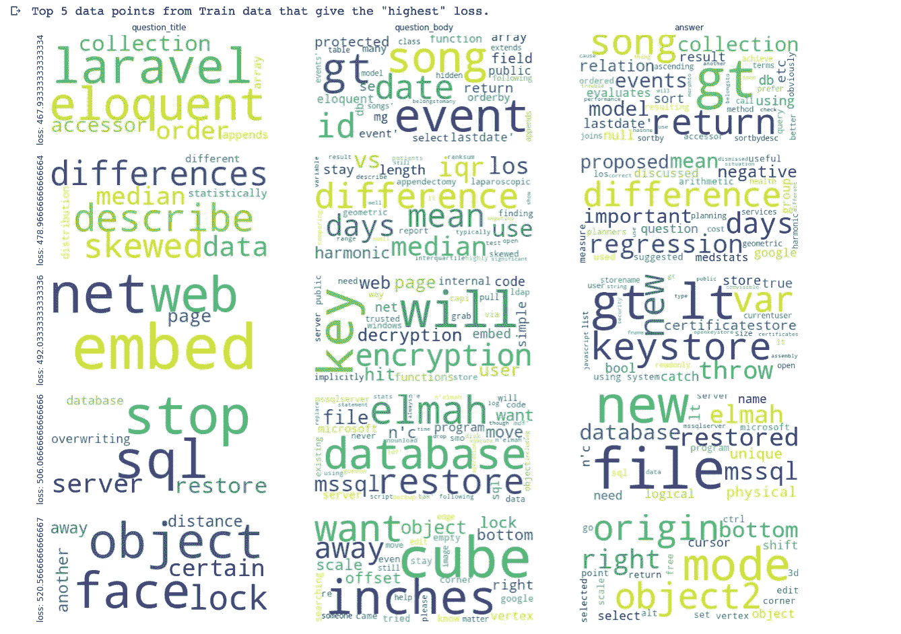**

> ****问题标题、问题正文和答案的单词长度****

**接下来的分析是关于问题标题、问题正文和答案的单词长度。为此，我将为问题标题、问题正文和答案这三个特征中的每一个选择 30 个 MSE 分数最低的数据点和 30 个 MSE 分数最高的数据点。接下来，我将计算所有 3 个特征的这 30 个数据点的单词长度，并绘制它们以观察趋势。**

********

**如果我们查看 question_title、question_body 和 answer 中的字数，我们可以观察到，产生高损失的数据具有高字数，这意味着问题和答案有点彻底。所以，当问题和答案简洁时，模型做得很好。**

> ****主持人****

**下一个分析是关于特性主机的。对于这个特性，我将挑选 100 个具有最低 MSE 分数的数据点和 100 个具有最高 MSE 分数的数据点，并选择特性主机中的值。然后，我将绘制这一分类特征的直方图，以查看分布情况。**

********

***我们可以看到，来自英语、生物、科幻、物理领域的大量数据点造成了较小的损失值，而来自 drupal、程序员、tex 的大量数据点造成了较大的损失。***

**让我们也来看看造成低分和高分的独特主机值的词云。使用顶部和底部的 100 个数据点再次进行该分析。**

****

> ****类别****

**最后分析的是特征类别。对于这个特性，我将挑选 100 个具有最低 MSE 分数的数据点和 100 个具有最高 MSE 分数的数据点，并选择特性类别中的值。然后我会绘制一个这种分类特征的饼状图来查看比例。**

****

**我们可以注意到，类别为技术的数据点占了模型不能很好预测的数据的 50%,而像生活艺术、科学和文化这样的类别对坏预测的贡献要小得多。
对于良好的预测，所有 5 个类别的贡献几乎相同，因为在比例上没有重大差异，但我们仍然可以说，以 StackOverflow 作为类别的数据点贡献最小。**

**至此，我们已经结束了这个博客和 3 部分系列。希望阅读愉快。
你可以使用 [***这个链接***](https://www.kaggle.com/sarthakvajpayee/top-4-4-bert-roberta-xlnet) *在 Kaggle 上查看完整的笔记本，如果发现我的工作有用，可以留下一个向上的投票。我要感谢所有的创作者，感谢他们创作了我写这篇博客时提到的精彩内容。***

***参考链接:***

*   ***应用人工智能课程:*[*【https://www.appliedaicourse.com/】*](https://www.appliedaicourse.com/)**
*   **[https://www.kaggle.com/c/google-quest-challenge/notebooks](https://www.kaggle.com/c/google-quest-challenge/notebooks)**
*   **[*http://jalammar.github.io/illustrated-transformer/*](http://jalammar.github.io/illustrated-transformer/)**
*   **[*https://medium . com/inside-machine-learning/what-a-transformer-d 07 DD 1 fbec 04*](https://medium.com/inside-machine-learning/what-is-a-transformer-d07dd1fbec04)**
*   **[https://towards data science . com/Bert-Roberta-distil Bert-xlnet-one-to-use-3d 5 ab 82 ba 5 f 8](/bert-roberta-distilbert-xlnet-which-one-to-use-3d5ab82ba5f8)**

> ****最终注释****

**感谢您阅读博客。我希望它对那些渴望做项目或学习 NLP 新概念的人有用。**

**在第 1/3 部分中，我们报道了变形金刚如何在各种现代自然语言处理任务及其工作中成为最先进的。**

**在第 2/3 部分中，我们讨论了 BERT(变压器的双向编码器表示)。**

**Kaggle 深入 EDA 笔记本链接:[https://www . ka ggle . com/sarthakvajpayee/top-4-4-深入 eda-feature-scraping？scriptVersionId=40263047](https://www.kaggle.com/sarthakvajpayee/top-4-4-in-depth-eda-feature-scraping?scriptVersionId=40263047)**

**Kaggle 建模笔记本链接:[https://www . ka ggle . com/sarthakvajpayee/top-4-4-Bert-Roberta-xlnet](https://www.kaggle.com/sarthakvajpayee/top-4-4-bert-roberta-xlnet)**

**Kaggle 后建模笔记本链接:[https://www . ka ggle . com/sarthakvajpayee/top-4-4-后建模-分析？scriptVersionId=40262842](https://www.kaggle.com/sarthakvajpayee/top-4-4-post-modeling-analysis?scriptVersionId=40262842)**

**在 LinkedIn 上找到我:[www.linkedin.com/in/sarthak-vajpayee](http://www.linkedin.com/in/sarthak-vajpayee)**

**在 Github 上找到这个项目:[https://github.com/SarthakV7/Kaggle_google_quest_challenge](https://github.com/SarthakV7/Kaggle_google_quest_challenge)**

**和平！☮**