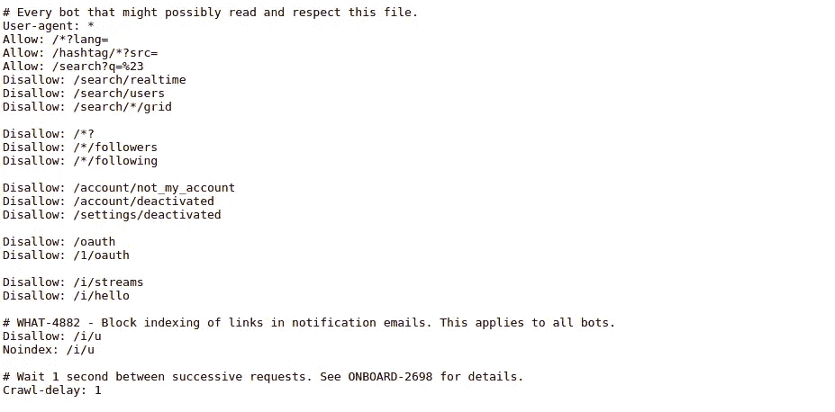
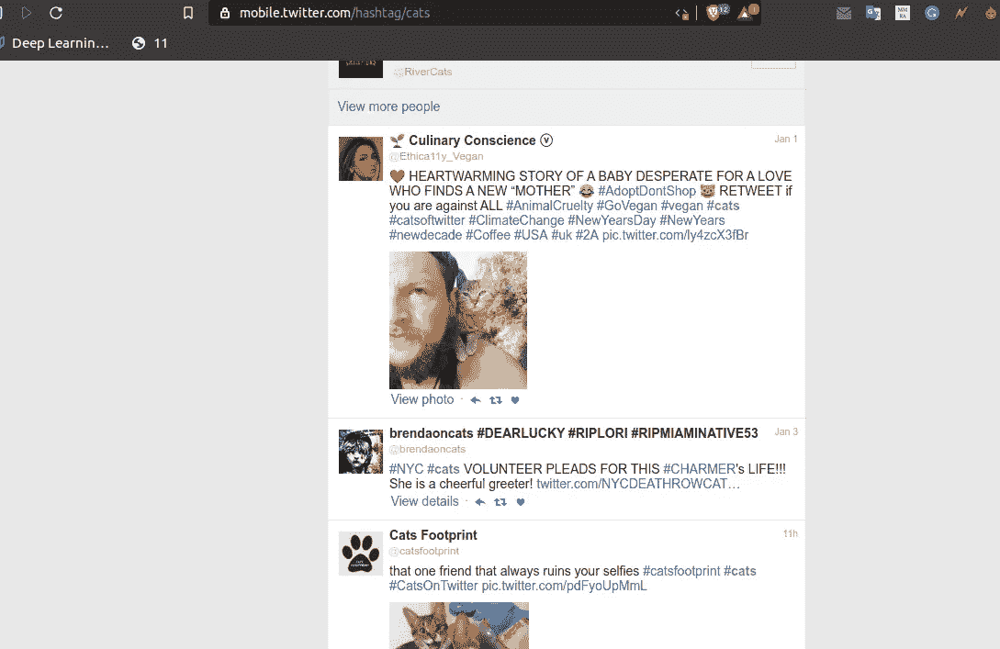
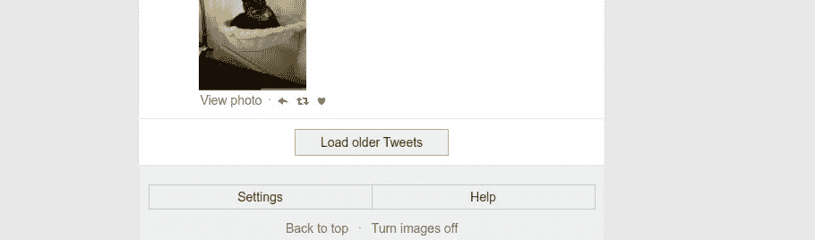
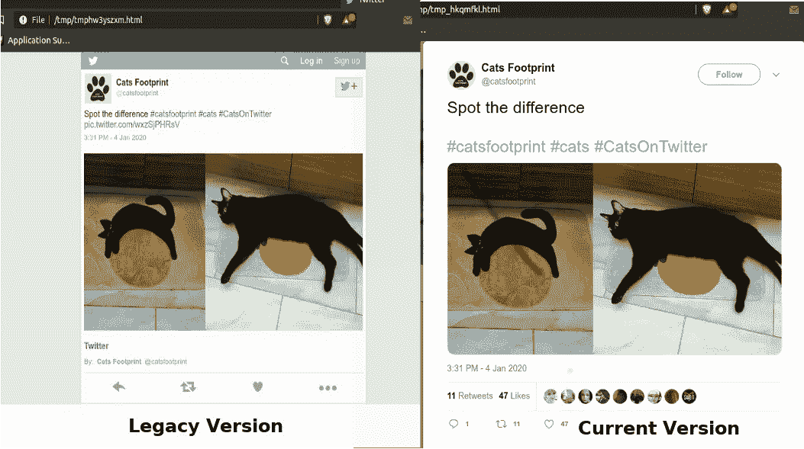
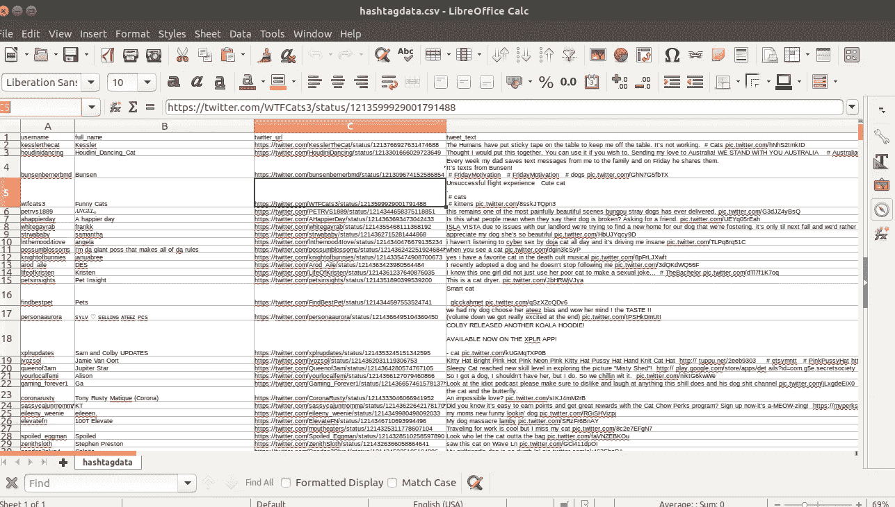
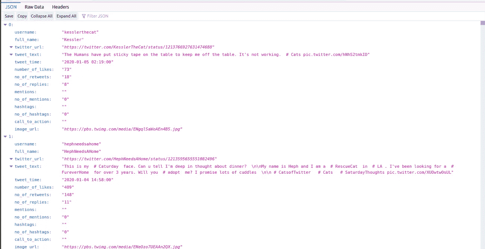

# 动手抓取网页:用 python 和 scrapy 构建你的 Twitter 数据集

> 原文：<https://towardsdatascience.com/hands-on-web-scraping-building-your-own-twitter-dataset-with-python-and-scrapy-8823fb7d0598?source=collection_archive---------1----------------------->

我明白了——你厌倦了为你的机器学习项目在网上搜索数据集，或者可能是为了分析流行的 Twitter 趋势。

今天我们将学习如何使用 hashtag 搜索从 Twitter 生成您自己的自定义数据集。据 internetlivestats.com 的[报道，平均每秒钟，大约有 6000 条推文被发布，相当于每分钟超过 35 万条推文，每天有 5 亿条推文。这使得 Twitter 成为一个为您的项目获取数据的绝佳场所，因为 Tweets 是当今社交媒体上自然语言的准确表达。](https://www.internetlivestats.com/twitter-statistics/)


想跳过帖子直接看好东西？这是给你的 [Github 回购](https://github.com/amitupreti/Hands-on-WebScraping/tree/master/project1_twitter_hashtag_crawler)

## 了解机器人的 Twitter 政策

首先，让我们确保遵守 twitter.com 为机器人爬行制定的政策，这样我们就不会遇到任何法律问题。这可以在[https://twitter.com/robots.txt](https://twitter.com/robots.txt)找到



面向所有用户代理的 robots.txt for twitter

我们可以从 User-agent 和 Allow 部分(第 1-4 行)看到，Twitter 允许所有的机器人访问标签和搜索 URL，在抓取请求之间有 1 秒钟的延迟。

```
User-agent: *
Allow: /hashtag/*?src=
Crawl-delay: 1
```

# 我们如何刮推特？让我们看一下代码。

*这里假设你有一些 python 和 scrapy 的基础知识。如果您只对生成数据集感兴趣，请跳过这一部分，转到*[*GitHub repo*](https://github.com/amitupreti/Hands-on-WebScraping/tree/master/project1_twitter_hashtag_crawler)*上的样本抓取部分。*

## 通过搜索标签收集 tweets URL

为了搜索推文，我们将使用传统的 Twitter 网站。让我们试着搜索#猫[https://mobile.twitter.com/hashtag/cats](https://mobile.twitter.com/hashtag/cats)。我们希望使用这个遗留版本来收集 tweets URLs，因为它加载数据而不使用 javascript，这使得我们的工作非常容易。

> 我选择一个懒惰的人去做艰苦的工作。因为一个懒惰的人会找到一个简单的方法去做。
> 
> ―比尔·盖茨



twitter 的传统版本

**查找我们标签搜索的所有 tweet URL—***find _ tweets()函数*

scrapy 爬虫的 find_tweets 功能

**解释**:我们将使用[XPath](https://www.tutorialspoint.com/xpath/index.htm)找到当前页面中的所有 tweets URL，并抓取这些 URL，然后将响应发送给我们的第二个函数`parse_tweet ()`

```
tweets = response.xpath('//table[@class="tweet  "]/@href').getall()    logging.info(f'{len(tweets)} tweets found')    
for tweet_id in tweets:        
    tweet_id = re.findall("\d+", tweet_id)[-1]        
    tweet_url = 'https://twitter.com/anyuser/status/'+str(tweet_id)           
    yield scrapy.Request(tweet_url, callback=self.parse_tweet)
```

现在我们将找到`**Load older Tweets**`按钮的下一个 URL，抓取它并将响应发送给我们当前的`find_tweets()`函数。这样，我们的爬虫将不断递归地点击`**Load older Tweet**`按钮，如果它在每次爬行时可用的话。这意味着我们将逐一访问所有结果页面。



加载旧推文

```
next_page = response.xpath(
    '//*[@class="w-button-more"]/a/@href').get(default='')
logging.info('Next page found:')
if next_page != '':
    next_page = 'https://mobile.twitter.com' + next_page
    yield scrapy.Request(next_page, callback=self.find_tweets)
```

**从单个 tweet 中查找所有数据— *parse_tweet()函数***

**解释**:在这里，我们将使用 Twitter 的当前版本(示例:[https://Twitter . com/catsfootprint/status/1213603795663491075](https://twitter.com/catsfootprint/status/1213603795663491075?p=v))，因为当前版本加载了所有数据，如赞数、转发数、评论数和其他元数据。下面是在旧版和当前版本的 twitter 中加载上述 tweet 的比较。



parse tweet()函数

# 让我们来看看数据集。

我们的数据集将由 14 列组成，其中包含了几乎所有可以从 tweet 中抓取的数据。目前爬虫不收集评论。数据集还将包括列`hashtags`和`mentions`，这是通过解析 tweet 文本并搜索开头带有#的单词(用于查找标签)和开头带有@的单词(用于查找提及)获得的。



示例数据截图 CSV



示例 twitter 数据 JSON

## 您可以在哪里使用这些数据？

您可能希望通过以下几种方式使用该数据集:

*   流行 twitter 趋势的情感分析
*   竞争对手分析(例如，人们可以找到并分析竞争对手的推文)
*   通过标签建立你的推文数据库
*   分析一个流行趋势。例如，人们可以使用#globalwarmingto 查找和分析推文，以了解人们的意见。

## 结论

目前，我们可以看到 Twitter 允许抓取其内容搜索结果，即推文和标签，并且对我们可以抓取的页面数量没有限制。因此，我们的爬行器不受任何速率限制的影响，我们能够使用这个简单的脚本，使用标签和 tweet 搜索方法来爬行数百万条 tweet。为了收集大量的推文，我建议你使用数百个标签，并在 VPS 服务器或[垃圾云](https://scrapinghub.com/scrapy-cloud)上运行爬虫，以避免任何形式的中断。

如果你有建议或发现一些问题。欢迎您在 GitHub 上[开问题](https://github.com/amitupreti/Hands-on-WebScraping/issues/new)或[拉请求](https://github.com/amitupreti/Hands-on-WebScraping/compare)。

爬行愉快。

# 你真棒