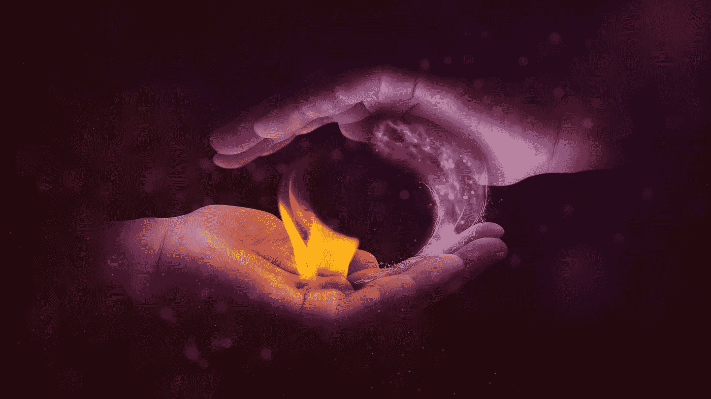
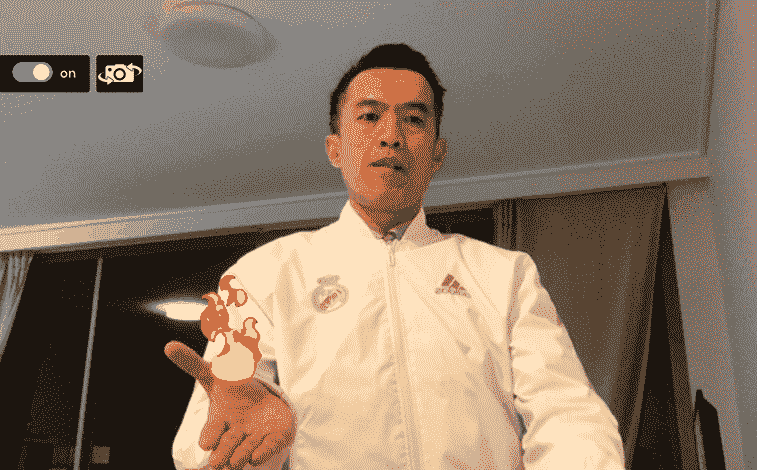

# Handtrack.js —让火焰在你手中舞动

> 原文：<https://towardsdatascience.com/handtrack-js-let-the-flames-dancing-in-your-hands-77419dca22b6?source=collection_archive---------47----------------------->

## 从网络摄像头流中检测手，并将您的手掌放在火上



图片由[com break](https://pixabay.com/users/Comfreak-51581/?utm_source=link-attribution&utm_medium=referral&utm_campaign=image&utm_content=1947878)来自 [Pixabay](https://pixabay.com/?utm_source=link-attribution&utm_medium=referral&utm_campaign=image&utm_content=1947878)

魔术师走上舞台，伸出左手——嗖——一个火球出现了！这是一个你通常在舞台上看到的把戏，但今天我将在你的网络摄像头中向你展示这个魔法，通过手跟踪技术来实现。

让我们建立一个网络应用程序，可以从网络摄像头检测手，并把你的手掌着火！打开你的网络摄像头，举起你的手，让火焰在你手中舞动。



点击下面的链接亲自尝试一下:

[](https://bensonruan.com/magic-fire-in-your-hand-with-handtrack-js/) [## handtrack.js - Benson 技术让魔法之火在你手中

### 魔术师走上舞台，伸出左手，嗖的一声，一个火球出现了！那是一个你通常…

bensonruan.com](https://bensonruan.com/magic-fire-in-your-hand-with-handtrack-js/) 

太酷了，对吧？你玩得开心吗，把这神奇的火给你的朋友看？我希望你喜欢它，这个演示利用了一种叫做手跟踪的先进技术，它可以在图像或视频流中识别人手。

感谢 [handtrack.js](https://github.com/victordibia/handtrack.js/) ，这是一个很棒的 javascript 库，它使用 [TensorFlow.js](https://www.tensorflow.org/js) 对象检测 API 来支持浏览器中的手部跟踪。如果你有兴趣构建自己的手部跟踪应用，请在下面跟随我，了解我是如何实现它的。

# 履行

## #步骤 1:包含 handtrack.js

首先，简单的在 html 文件的<头>部分包含脚本`handtrack.js`。

```
<script src="[https://cdn.jsdelivr.net/npm/handtrackjs/dist/handtrack.min.js](https://cdn.jsdelivr.net/npm/handtrackjs/dist/handtrack.min.js)"> </script>
```

或者您可以通过 npm 安装它，以便在 TypeScript / ES6 项目中使用

```
npm install --save handtrackjs
```

## #步骤 2:将网络摄像头传输到浏览器

为了将您的网络摄像头传输到浏览器中，我使用了 npm JavaScript 模块`webcam-easy.js`，它提供了一个易于使用的模块，可以访问网络摄像头并拍照。要了解更多细节，请参考我之前的博客:

[](https://medium.com/swlh/how-to-access-webcam-and-take-picture-with-javascript-b9116a983d78) [## 如何使用 JavaScript 访问网络摄像头并拍照

### 介绍网络摄像头-简易 npm 模块

medium.com](https://medium.com/swlh/how-to-access-webcam-and-take-picture-with-javascript-b9116a983d78) 

## #第 3 步:加载扶手模型

为了执行手部跟踪，我们首先需要通过调用`handTrack.load(modelParams)`的 API 来加载预先训练好的手部跟踪模型。HandTrack 带有几个可选的模型参数:

*   flipHorizontal —翻转，例如对于视频，默认值:True
*   imageScaleFactor 减小输入图像大小以提高速度，默认值:0.7
*   maxNumBoxes —要检测的最大盒子数，默认值:20
*   iouThreshold —非最大抑制的 ioU 阈值，默认值:0.5
*   scoreThreshold 预测的置信度阈值，默认值为 0.99

```
const modelParams = {
 flipHorizontal: true, 
 maxNumBoxes: 20, 
 iouThreshold: 0.5,
 scoreThreshold: 0.8
}**handTrack.load(modelParams)**.then(mdl => { 
 model = mdl;
 console.log("model loaded");
});
```

## #步骤 4:手部检测

接下来，我们通过调用`model.detect(video)`的 API，开始通过 HandTrack 模型馈送网络摄像头流来执行手检测。它接受一个输入图像元素(可以是一个`img`、`video`、`canvas`标签)，并返回一个包含类名和可信度的边界框数组。

```
**model.detect(webcamElement)**.then(predictions => {
 console.log("Predictions: ", predictions);
 showFire(predictions);
});
```

预测的返回看起来像:

```
[{
  bbox: [x, y, width, height],
  class: "hand",
  score: 0.8380282521247864
}, {
  bbox: [x, y, width, height],
  class: "hand",
  score: 0.74644153267145157
}]
```

## #第五步:展示魔法之火

在上面的函数中，我们得到了手的位置的包围盒，现在我们可以用它来显示你手中的火焰 GIF 图像。

***HTML***

在`webcam`元素上叠加`canvas`层

```
<video id="webcam" autoplay playsinline width="640" height="480"></video><div id="canvas" width="640" height="480"></div>
```

***JavaScript***

设置`fireElement`的大小和位置，并将其添加到`canvas`层。

```
function showFire(predictions){
    if(handCount != predictions.length){
        $("#canvas").empty();
        fireElements = [];
    }   
    handCount = predictions.length;

    for (let i = 0; i < predictions.length; i++) {
        if (fireElements.length > i) { 
            fireElement = fireElements[i];
        }else{
            **fireElement = $("<div class='fire_in_hand'></div>");
            fireElements.push(fireElement);
            fireElement.appendTo($("#canvas"));**
        }
        var fireSizeWidth = fireElement.css("width").replace("px","");
        var fireSizeHeight = fireElement.css("height").replace("px","");
        var firePositionTop = hand_center_point[0]- fireSizeHeight;
        var firePositionLeft = hand_center_point[1] - fireSizeWidth/2;
        **fireElement.css({top: firePositionTop, left: firePositionLeft, position:'absolute'});**
    }
}
```

***CSS***

将`background-image`设置为`fire.gif`图像

```
.fire_in_hand {
    width: 300px;
    height: 300px;
    **background-image: url(../images/fire.gif);**
    background-position: center center;
    background-repeat: no-repeat;
    background-size: cover;
}
```

代码就这么多了！现在你应该可以开始展示你手中的魔法之火了！

# GitHub 知识库

您可以通过下面的链接下载上述演示的完整代码:

[](https://github.com/bensonruan/Hand-Track) [## 本森阮/手动轨道

### 在浏览器中使用 javascript 库 handtrack.js 流网络摄像头在台式计算机上从网络摄像头进行手部跟踪，或者…

github.com](https://github.com/bensonruan/Hand-Track) 

感谢您的阅读。如果你喜欢这篇文章，请在脸书或推特上分享。如果你有任何问题，请在评论中告诉我。在 [GitHub](https://github.com/bensonruan/) 和 [Linkedin](https://www.linkedin.com/in/benson-ruan/) 上关注我。