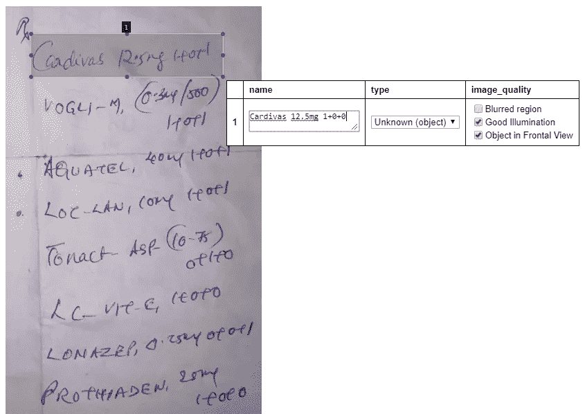
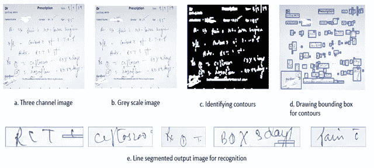
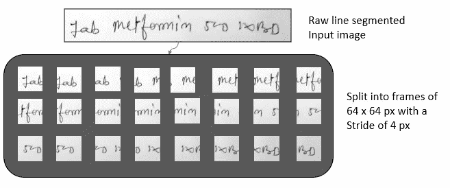
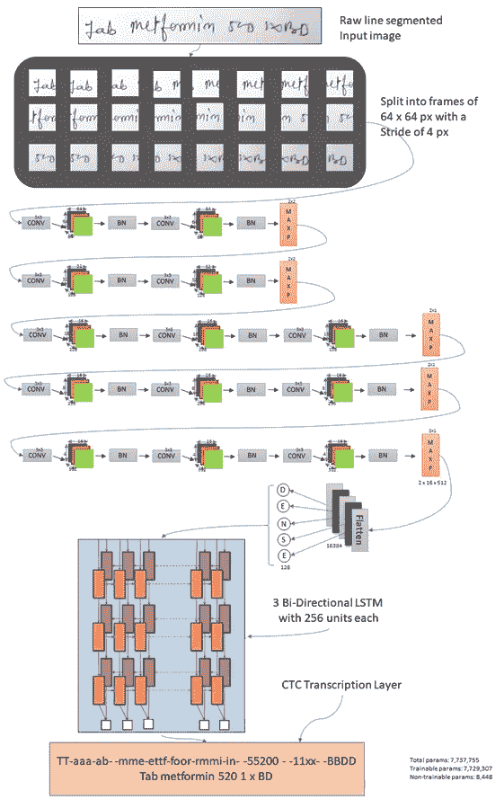

# 使用具有 CTC 丢失功能的时间分布 CNN 和 LSTM 的手写到文本转换

> 原文：<https://towardsdatascience.com/handwriting-to-text-conversion-using-time-distributed-cnn-and-lstm-with-ctc-loss-function-a784dccc8ec3?source=collection_archive---------12----------------------->

## 一种使用深度学习框架 Keras 进行手写字符到文本转换的光学字符识别(OCR)方法。

尼克·莫里森在 [Unsplash](https://unsplash.com?utm_source=medium&utm_medium=referral) 上拍摄的照片

这篇文章是我们为印度商学院的[商业分析项目](https://www.isb.edu/ampba/admissions)Co’2019 年夏季所做的项目的一部分，由 [Jan Elaaj](https://janelaaj.com/home) 赞助。

**简介:**

T 该项目的动机来自于这样一个事实，即许多人仍然喜欢用笔在纸上书写，如果数字化，它会增加许多要长期存储的价值，并用于下游系统进行分析。一个这样的例子是在医学领域，在印度，大多数医生仍然将患者处方写在纸上，我们的赞助商需要将其数字化，以便可以将其输入到患者健康记录系统中。通过这个项目，我们演示了如何用标记数据训练一个手写识别系统。具体而言，我们在来自特定医生处方数据集的手动标记的文本行数据上训练深度卷积递归神经网络(CRNN)系统，并提出一种增量训练程序，该程序在可用时覆盖其余数据，以便以最高精度执行模型，从而能够适应单个医生的笔迹。

# 项目的各个部分:

该项目由下述多个部分组成:

1.  使用影像注记工具标注数据
2.  原始图像转换为线分割图像
3.  将图像分割成不同的帧
4.  时间分布卷积回归神经网络
5.  连接主义时间分类(CTC)损失函数的实现
6.  使用 Levenshtein 距离(也称为编辑距离)的最近单词预测

## 第 1 部分:使用图像标注工具标注数据

这是项目的第一步，也是最耗时的一步。为此，我们尝试并评估了多种工具，发现牛津的 [VGG 图像注释器](http://www.robots.ox.ac.uk/~vgg/software/via/via_demo.html)最适合我们的目的。该工具允许我们通过为单词绘制边界框，并通过输入对应于所选区域的注释来选择处方中的区域。注释完成后，我们将能够下载 CSV 格式的注释，以便用 Python 进行进一步处理。下载的文件提供了 x 和 y 坐标中的注释区域、文件名和区域属性等信息，这是单词本身的实际注释。下面是一个示例注释的样子:

## 第 2 部分:原始图像到线分割图像

这是在 python 中 OpenCV 库的帮助下完成的。该过程以原始分辨率读取原始图像。然后它被转换成灰度值。因为对于手写识别系统的输入，如果我们以灰度值或三个通道给出图像，这并不重要。一旦完成，图像中的轮廓就被识别。轮廓有助于识别具有相同颜色或强度的像素的边界。在画出边界框后，我们裁剪图像以取出单独的线分割图像。
在获取适当的线分割数据的过程中，我们忽略所有具有低于某个阈值限制的高度包围盒的图像。通过实验，我们发现使用 64 的值可以得到我们想要的输出。
此外，保持所获取图像的顺序也非常重要。为此，我们确保根据图像的起始像素值从轮廓读取图像。因此，将从左上角到右下角读取图像。

## 第 3 部分:将图像分割成不同的帧

我们使用 Keras wrapper[time distributed](https://keras.io/layers/wrappers/)来为 CNN 各层提供信息。这样做的目的是获取不同的输入帧，并逐帧进行处理。然后，从输入图像中获得 64×64 像素图像的帧，对于每个后续帧，步长为 4。滑动窗口应用于从左到右的书写方向。Keras 时间分布式包装器用于将输入帧传递到 CNN 层。时间分布式包装器有助于保存我们从输入中获得的图像帧的时间序列。本质上，输入和输出将如下所示:

## 第四部分:时间分布卷积回归神经网络(CRNN)

这个项目的核心是一个受 VGG16 架构启发的深度 [CRNN](https://keras.io/examples/conv_lstm/) 。我们使用堆叠的 13 个卷积层，然后是三个双向 LSTMs，每个方向由 256 个单元组成。在一些卷积层之后应用最大池，总共应用 5 个最大池层。为了在卷积层中引入非线性，使用激活函数 ReLU。卷积层的权重被初始化为 he-normal，并且在所有卷积层之后使用批量归一化层来归一化权重，这将有助于网络的更快收敛。在每个 LSTM 层中，训练的辍学率被设置为 0.25。在 CNN 的输出和 LSTMs 的输入之间有一个密集层，这对于减少用于我们训练的参数数量非常有效。

我们将适用于我们问题的输出类的总数设置为 91 (A-Z，A-Z，0–9，英语键盘上的所有标准特殊字符，外加一个未知的附加类)。因此，神经网络的最后一层对于 LSTM 框架的每个输出有 91 个权重。在最终层中使用 softmax 层来获得在一帧中具有最高概率的输出类。

## 第 5 节:连接主义者时间分类(CTC)损失函数的实现

用于最小化损失的目标函数是[连接主义者时间分类](/intuitively-understanding-connectionist-temporal-classification-3797e43a86c) (CTC)损失函数。当其他损失函数优化单个目标函数时，CTC 损失被特别设计来优化预测序列的长度和预测序列的类别，因为输入图像本质上是变化的。卷积滤波器和 LSTM 权重在反向传播过程中被共同学习。Adam optimizer 用于初始学习率为 0.001 的训练。

这些模型是在取自谷歌云服务的 GPU 服务器上训练的。系统配置为 32GB RAM、8 核处理器和 4 个 Tesla K80 GPUs。

**完整建筑:**

## 第 6 部分:使用 Levenshtein 距离的最近单词预测

用于跟踪网络性能的度量是 [Levenshtein distance](https://en.wikipedia.org/wiki/Levenshtein_distance) (也称为编辑距离)，这是一种常用的度量，通过测量观察序列和预测序列之间的差异来测量字符串度量。

为此，我们构建了输入中所有单词的词汇表。CTC 丢失函数实际上并没有正确给出整个字，因为在使用时间分布包装器馈送的帧之间存在重叠。由于单个字母表可能出现在多个帧中，因此输出将包含单词的重复。因此，我们必须使用编辑距离作为度量，以找出在我们的整个语料库中与作为输出给定的单词最匹配的最近的单词。

## 结论和进一步的工作:

将所有的部分放在一起，模型的输出以 0.75 的精度预测测试数据集，并以大约 0.80 的精度预测训练数据集。预测将被逐行馈送到 CRNN，并且 CTC 层的输出将与我们的语料库中最接近的单词相匹配，以便使用编辑距离度量用实际单词来检查预测。
此外，我们希望在 CNN 层试验 RESNET 架构，而不是最初为该项目选择的 VGG-16 架构，但是从头开始重新培训将非常耗时耗力，因为顶点计划即将结束，我们没有机会这样做。
至于该项目的实际应用，我们希望将它与一个题字板集成，您可以在上面放置一张纸并进行书写，在后端，我们的系统会自动将整个页面分成行，行分成词，并输入到 CRNN 架构，并自动给出与手写字母相对应的词。

GitHub 回购链接:【https://github.com/GireeshS22/Handwriting-CNN-LSTM 

作者:[吉瑞什·孙达拉姆](https://www.linkedin.com/in/gireeshsundaram/)、[巴拉吉·文克泰什](https://www.linkedin.com/in/balaji-venktesh-6a3a5321/)、[苏米亚·帕尼格拉希](https://www.linkedin.com/in/soumya-panigrahi-69a107127/)、[维尼特·卡普尔](https://www.linkedin.com/in/vineet-kapoor-/)