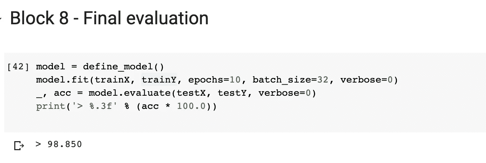

# 手写数字分类器——5 分钟内您的第一个端到端 CNN

> 原文：<https://towardsdatascience.com/handwritten-digit-classifier-your-first-end-to-end-cnn-in-5-minutes-5be3d9c6c4c0?source=collection_archive---------44----------------------->


乔恩·泰森在 [Unsplash](https://unsplash.com?utm_source=medium&utm_medium=referral) 上的照片

> *数字分类器显然是新的 Hello World！*

没错，这是最基本的卷积神经网络例子。因此，理解这一点至关重要。因此，每当我们开始一些新的东西，运行我们的第一个 ***hello* world** 程序可能看起来很容易，但有很多摩擦。成功运行它有时可能需要几天时间——主要是因为涉及到的设置，陷入在我们看来像陌生文本的错误中，等等。

> 所以，我写这篇文章背后的主要动机是帮助你消除这种摩擦——这样你就可以在短短 5 分钟内在 CNN 上运行你的第一个节目。

## 先决条件

1.  应该知道 CNN 的基本知识。我强烈建议做一个谷歌搜索，了解卷积层和最大池层。
2.  你应该对它背后的数学有很好的理解。为此，我强烈推荐阅读我以前的[文章](/convolution-neural-network-maths-intuition-6b047cb48e90)。
3.  通过 [Google Colab](https://colab.research.google.com/drive/1qJfc5bOveudc5wZ8gMGZ-ml2UDa7mHnG?usp=sharing) 运行该程序。

> 有人刚刚运行了他们的第一个 CNN 节目吗？！恭喜🎉

感觉如何？！如果您还没有运行它，我强烈建议您这样做。Google Colab 是一个非常简单易用的软件，它消除了在我们的机器上进行设置的所有不必要的需求。如果你还在学习深度学习，强烈推荐。现在，让我们分解它，了解每一个组件。

# 从 MNIST 数据集中加载数据


作者图片

修改的国家标准和技术研究所(MNIST)数据集包括 70，000 幅 28 * 28 像素的灰度图像，包含一个 0 到 9 之间的手写数字。

***作为一个经验法则，总是在训练和测试集中划分你的数据。*** *为什么会这样？因此，您可以在训练集上训练您的模型，并在测试集上测试它。如果它在训练集上表现良好，但在测试数据上表现不佳，我们就可以知道我们的模型过度拟合了。因此，在测试数据上测试它有助于您独立于训练数据来测试您的模型，并更加确定您的模型。*

如您所见，训练数据有 60000 个条目，测试数据有 10000 个条目。此外，为了便于理解，我绘制了一张 28*28 像素的图像。

# 预处理

清理数据是所有模型中的主要步骤之一。有各种各样的技术可以做到这一点。但是，对于这一个，我们将只关注其中的 3 个。


作者图片

*   ***重塑*** *:我们的模型由[28*28]矩阵的 60k 个条目组成对吗？但是，如果你记得 CNN 在频道上工作。如果是灰度图像，有一个通道，如果是彩色图像，有 3 个通道。因为它是灰度图像，我们可以把它重写为单通道矩阵。于是，[60k，28，28] - > [60k，28，28，1]。*
*   ***一热编码:*** *现在，我们的 NN 会是什么样子？因为它是一个多类分类器，类从 0 到 9，我们可以有把握地假设在最后一步之后将有 10 个输出。还记得 softmax 吗？这种系统将有 10 个输出，其预测的数字的概率最高。所以，我们应该把我们的输出从[60k，1]->，[60k，10]。这就是通过一键编码完成的。因此，假设输出值为 1，将被重写为[0，1，0，0，0，0，0，0，0]。无论哪一个是将由 1 表示的输出，其他的由 0 表示。简单，嗯？！*
*   ***归一化*** *:每个矩阵都会有[0–255]之间的值对吗？因此，为了便于计算，所有值都从[0–255]移动到[0–1]范围。这可以简单地通过将所有值除以 255 来实现。*

# 定义模型


作者图片

是时候修改 CNN 了！随机创建一个你认为性能足够好的模型。例如，这里我们创建了上面的模型，它具有:

*   ***卷积层*** *有 32 个大小为[3*3]的内核，输入大小为[28*28*1]。*
*   ***最大汇集层*** *同【2 * 2】*
*   ***展平*** *输出，并将其传递给一个全连接层。*
*   ***全连通层*** *有 100 个隐藏节点和 10 个输出节点。*
*   ***优化功能*** *—该功能定义如何重新计算权重。*
*   ***损失函数*** *—这是我们用来定义实际值和预测值之间差异的误差函数。*
*   ***激活功能*** *—在每个隐藏节点后，该功能用于将非线性成分添加到我们的输出中。*

关于这些函数的可能值，我会有一篇单独的文章。现在，让我们只是使用它们，因为不知何故已经告诉我们这样做。

# 模型评估


作者图片

现在，这是最棘手的部分。因此，*我们只在训练集上训练我们的模型。我们根本不会使用我们的测试集。*这里我们需要理解两个概念:

*   ***验证数据:*** *我们将我们的训练集进一步分为 2 个集——训练集和测试集。所以基本上我们是在第一组上训练我们的模型，并在测试组上测试它。这有助于我们在不涉及原始测试集的情况下检查模型的准确性。*
*   ***K-Fold:*** *基本上，这里我们将训练集分成 K 个集合，而不仅仅是 2 个。从中我们随机选择一组作为训练组，另一组作为测试组。更多可以在这里阅读*[](https://machinelearningmastery.com/k-fold-cross-validation/#:~:text=Cross%2Dvalidation%20is%20a%20resampling,is%20to%20be%20split%20into.)**。**

```
***Example: 3-Fold****Array:** [1,2,3,4,5,6]
**Fold 1:** [1, 2]
**Fold 2:** [3, 4]
**Fold 3:** [5, 6]So, 
**1st Iteration:** Training on Fold 1 + Testing on Fold 2
**2nd Iteration:** Training on Fold 2 + Testing on Fold 3
**3rd Iteration:** Training on Fold 3 + Testing on Fold 1*
```

*我将在下一篇文章中讨论 Keras 的批量大小。*

# ***绘制学习曲线***

**

*作者图片*

*在这里，我们正在绘制我们的损失和准确性。 ***首先，我们为什么要在 al* l 处绘制它们？这让我们可以直观地了解我们的模型在不同配置下的表现。在这种情况下，只是不同的训练数据和测试数据。但是，我们可以为一个模型配置不同的隐藏节点，或者卷积层中的不同层，等等。这通常有助于我们从视觉上看出我们的模型是过度拟合、欠拟合还是非常拟合。***

*上面的图像表明，它在两个训练集上表现相同，因此非常适合。*

**

*作者图片*

*这只是另一种方式来看看我们的分数表现如何。*

# *最终测试*

**

*作者图片*

*这是最后一步，我们将使用我们定义的模型对测试数据进行测试，并计算最终的准确性。*

*这篇文章的主要焦点是消除摩擦，让你们开始在 CNN 的美丽旅程。这篇博客深受这篇文章的启发🙏。*