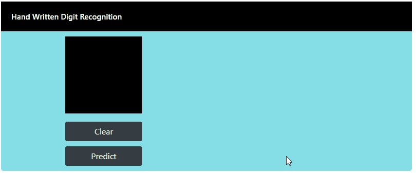
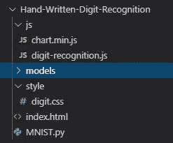

# Tensorflow.js 手写数字识别

> 原文：<https://towardsdatascience.com/handwritten-digit-recognition-with-tensorflow-js-6ddb22ae195f?source=collection_archive---------15----------------------->

## 机器如何预测你画的数字？


照片由[思想目录](https://unsplash.com/@thoughtcatalog?utm_source=medium&utm_medium=referral)在 [Unsplash](https://unsplash.com?utm_source=medium&utm_medium=referral) 上拍摄

手写识别使我们能够将手写文档转换成数字形式。这项技术现在被广泛应用:读取邮政地址、银行支票金额、数字化历史文献。

感谢 tensorflow.js，它将这项强大的技术带入了浏览器。在本文中，我们将构建一个 web 应用程序，它可以预测您在画布上绘制的数字。

下面是 web 应用程序的最终结果，正如你所看到的，我们得到了一个很好的结果，它预测我已经抽取了数字 **5** 有 **99%** 的置信度



手写数字识别演示

点击下面的链接亲自尝试一下:

[](https://bensonruan.com/handwritten-digit-recognition-with-tensorflow-js/) [## 使用 Tensorflow.js 进行手写数字识别-技术游乐场

### 手写识别使我们能够将手写内容转换成数字形式，在本文中，我们将构建一个 web 应用程序…

bensonruan.com](https://bensonruan.com/handwritten-digit-recognition-with-tensorflow-js/) 

# 履行

这个应用首先使用 Python 脚本训练并保存模型，然后使用 JavaScript 库 tensorflow.js 将模型加载到浏览器中，并预测手绘数字是什么数字。请在下面关注我，进一步探索它是如何构建的。

## 文件夹结构

让我们从用适当的文件夹结构设置项目开始



手写数字识别项目

*   js —包含 JavaScript 文件
*   chart . min . js-图表显示 JavaScript 库
*   digit-recognition.js —主应用程序 JavaScript
*   模型(models )-包含保存的模型和权重
*   样式—包含 css 样式文件
*   index.html—主 html 文件
*   MNIST.py 用于训练和保存模型的 Python 脚本

## #步骤 1:训练并保存模型

为了开始我们的旅程，我们将编写一个 Python 脚本，在著名的 MNIST 数据集上训练 CNN(卷积神经网络)模型。

MNIST 是一个由手写数字组成的计算机视觉数据库，带有识别数字的标签。每个 MNIST 数据点都有两个部分:一个手写数字的图像和一个相应的标签。

**导入库**

**加载 MNIST 数据集**

MNIST 数据集由 60，000 个例子组成，我们将它们分成训练和测试数据集。之后，它需要一些预处理才能进入 CNN。

首先，你**将输入向量整形为一个 4 维数组**

接下来，我**通过将 RGB 代码划分为 255 来标准化**输入

**定义 CNN 模型**

下面我用一个常见的模式定义卷积基:Conv2D 和 MaxPooling2D 层的堆栈。

*   第一层将有 32–5x 5 个过滤器，
*   第二层将有 64–5x 5 个过滤器

此外，还有两个最大池层，每个大小为 2 x 2。

**训练模型**

It 培训可能需要几分钟，我们可以在测试集上获得 98.5%的正确率。

**将模型保存为 tfjs 格式**

现在我们有了一个模型，我们需要将它保存为某种 tensorflowjs 可以加载到浏览器中的格式。

```
tfjs.converters.save_keras_model(model, 'models')
```

该模型将被保存到“models”文件夹中，其中包含一个 model.json 文件和一些其他权重文件。

## #第二步:包含 [tensorflow.js](https://www.tensorflow.org/js)

简单地将`tfjs` 的脚本包含在 html 文件的<头>部分中。我还包括 jquery 库和图表库。

## #步骤 3:设置画布

为了让用户在桌面上使用鼠标或在移动设备上使用手指来绘制数字，我们需要创建一个名为 canvas 的 HTML5 元素。在画布内部，用户将绘制数字。我们会将用户绘制的数字输入到我们创建的深度神经网络中进行预测。

**HTML—index.html**

添加一个占位符

来包含您可以在其上绘制数字的画布

```
<div id="canvas_box" class="canvas-box"></div>
```

添加“预测”按钮以获得手写数字预测的结果，“清除”按钮擦除画布并再次开始绘制

```
<button id="clear-button" class="btn btn-dark">Clear</button><button id="predict-button" class="btn btn-dark">Predict</button>
```

在的末尾，包含主 JavaScript 文件 digit-recognition.js

```
 <script src="js/digit-recognition.js"></script> </body></html>
```

**JavaScript—digit-recognition . js**

初始化变量

创建画布并将其附加到占位符上以进行显示

在移动和桌面环境中，在画布内部绘图有点棘手。我们需要了解所有适用于鼠标和触摸的 jQuery 处理程序。下面是我们将使用的 jQuery 事件处理程序。

适用于台式机和笔记本电脑

*   鼠标按下
*   鼠标移动
*   鼠标抬起
*   老鼠离开

对于移动设备

*   触摸开始
*   触摸移动
*   触摸端
*   触球

## #步骤 4: Tensorflow.js 负载建模和预测

现在，我们需要使用 TensorFlow.js 来加载我们之前在 Python 中训练的模型，并使用它来预测我们在画布上绘制的数字。

**负荷模型**

函数 loadModel()来调用 tensorflow.js API `tf.loadLayersModel`

**预处理画布**

函数 preprocessCanvas 在将用户绘制的画布馈送到 CNN 模型之前对其进行预处理

**预测**

当点击“预测”按钮时，我们从画布中获取图像数据，将其作为张量进行预处理，然后将其送入 API `model.predict`以获得预测结果。

**显示结果**

函数 loadChart 利用 [Chart.js](https://github.com/chartjs/Chart.js) 库将预测结果显示为可视化条形图。

# GitHub 知识库

您可以通过下面的链接下载上述演示的完整代码:

[](https://github.com/bensonruan/Hand-Written-Digit-Recognition) [## 本森阮/手写数字识别

### 使用 javascript 库 tensorflowjs 的手写数字识别…

github.com](https://github.com/bensonruan/Hand-Written-Digit-Recognition) 

由[凯文·Ku](https://unsplash.com/@ikukevk?utm_source=medium&utm_medium=referral)在 [Unsplash](https://unsplash.com?utm_source=medium&utm_medium=referral) 上拍摄的照片

# 结论

毫无疑问，在手写识别领域已经进行了大量的研究。和 tensorflow.js 使这些预先训练的深度模型可以在浏览器中访问。我希望你能从这篇文章中得到乐趣，并鼓励你更多地了解这个库。我迫不及待地想看到更多创造性的想法出现，将这项尖端技术投入实际应用。

感谢您的阅读。如果你喜欢这篇文章，请在脸书或推特上分享。如果你有任何问题，请在评论中告诉我。在 [GitHub](https://github.com/bensonruan/) 和 [Linkedin](https://www.linkedin.com/in/benson-ruan/) 上关注我。