# 手写高棉数字识别

> 原文：<https://towardsdatascience.com/handwritten-khmer-digit-recognition-860edf06cd57?source=collection_archive---------43----------------------->

## 线性判别分析方法

# 手写识别

手写识别是将给定的手写模式分类成组(类别)的任务。有许多方法可以实现这项任务，从传统的机器学习方法到深度学习，如卷积神经网络(CNN)。

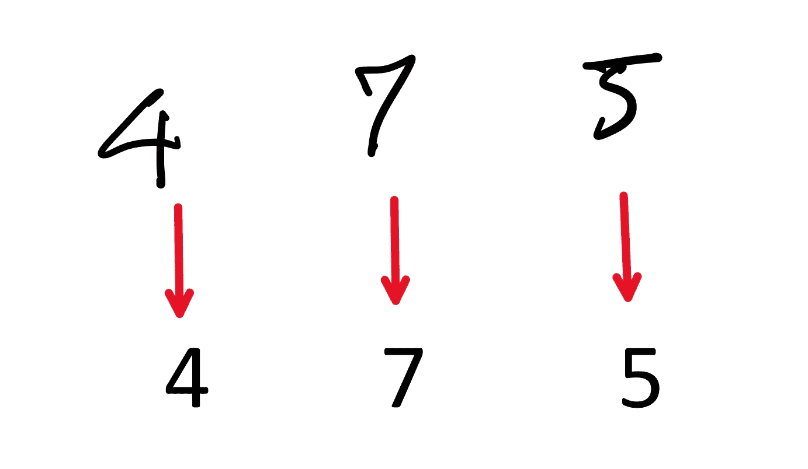

图 1 手写数字识别示例

本文介绍一种简单的模式识别方法——高斯极大似然估计线性判别分析。我们以手写高棉数字识别任务为例。

# 高棉数字

高棉语是柬埔寨的官方语言。大约有 1600 万人说这种语言，主要分布在柬埔寨以及越南和泰国的部分地区。在高棉语中，图 2 所示的一组数字用于数字系统。

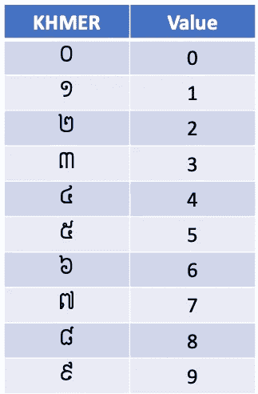

图 2 高棉数字

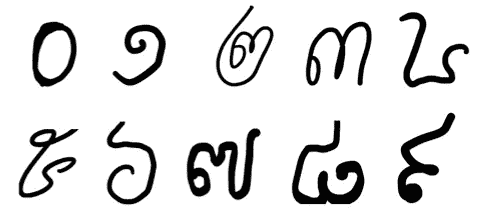

图 3 手写高棉数字

# 线性判别分析(LDA)

假设我们有模式 x 及其类别 y 的样本，{(x_i，y_i)} (i=1，…，n)，其中 n 是训练样本的数量。设 n_y 是 y 范畴中模式的个数。

为了定义给定模式 x 的相应类别，我们选择具有最大后验概率值 p(y|x)的 y。这里 p(y|x)是给定 x 的 y 的一个条件概率，这个判定规则叫做最大后验概率规则。

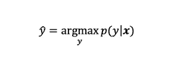

根据贝叶斯理论，后验概率可以通过下式计算

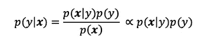

在上面的表达式中，p(x)不依赖于 y。因此，我们可以忽略分母。

现在我们需要估计 p(y)和 p(x|y)。对于 y，由于它是一个离散的概率变量(y 是一个类别)，我们可以简单地用 y 类别中模式的个数与样本总数的比值来估计它的概率。

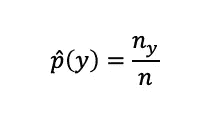

x 是一个连续的概率变量，我们不能直接应用于 y 的方法。这里，我们将介绍一种参数化方法。

假设模式 x 由高斯分布独立且同分布，我们将对高斯模型应用最大似然估计来估计其参数并计算条件概率 p(x|y)。

通常，具有 d 维高斯分布的 x 的高斯模型由下式给出

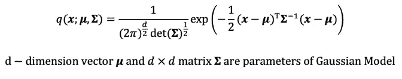

使用最大似然估计，高斯模型参数的估计为

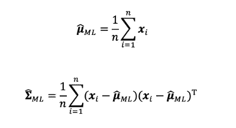

现在，p(x|y)的估计值可以通过下式计算

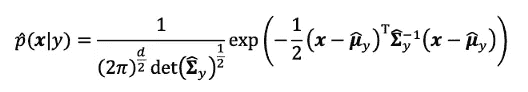

将估计的 p(x|y)和 p(y)代入 p(y|x)表达式，我们可以得到给定模式 x 的类别 y 的后验概率，然而，为了使它更简单，我们在下面的计算中使用了对数函数。因为对数函数是单调递增的，所以与 p(y|x)的关系没有区别。

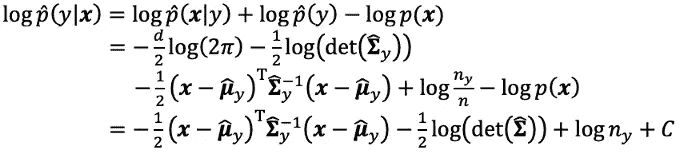

为了简化这个对数后验概率，在线性判别分析中，我们做如下假设:每一类的方差-协方差矩阵相等。在这种情况下，常见的方差-协方差矩阵为

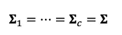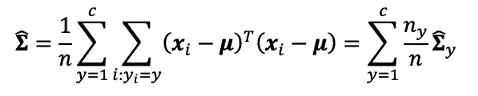

log p(y|x)是

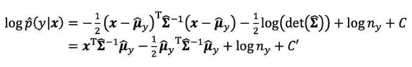

因此，给定模式 x 的类别 y 可以通过选择其 log p(y|x)在所有类别中保持最大值的 y 来预测。

# 资料组

现在让我们将这种 LDA 方法应用于手写高棉数字识别。

在这种情况下，手写数字的数字图像是模式 x，而
0–9 是类别 y。我们使用 1500 个 64x64 灰度图像作为数据集。我们将这个数据集分成 1200 个用于训练数据，300 个用于测试数据。

对于模式 x，我们简单地将 64x64 灰度图像整形为 4096 维向量。因此，我们将 LDA 应用于具有 4096 维高斯分布的高斯模型。

# 用 Python 实现

## o 将数据集分成训练集和测试集

```
X_train, X_test, y_train, y_test = train_test_split(X, y, test_size=0.2)
```

## o 估计模型的参数(训练)

```
means = np.zeros((10, nD*nD))
cov = np.zeros((nD*nD, nD*nD))
count = [sum(map(lambda x : x == i, y_train)) for i in range(0,10)]for i in range(10):
    cov_array = []
    for j in range(len(y_train)):
        if int(y_train[j]) == i:
            means[i] = means[i] + X_train[j]
            cov_array.append(X_train[j])

    cov = cov + np.cov(np.array(cov_array).T) * (count[i]/len(y_train))means = means / len(y_train)
inv_cov = np.linalg.inv(cov + 0.00001*np.eye(nD*nD))
```

## o 评估

```
ans = np.zeros((10, 10),dtype='int')
total = 0
errors = []for i in range(10):
    for j in range(len(y_test)):
        if int(y_test[j]) == i:
            p = np.zeros(10)
            for k in range(len(p)):
                p[k] = np.dot(np.dot(means[k].T, inv_cov), X_test[j]) - (np.dot(np.dot(means[k].T, inv_cov), means[k])) / 2 + np.log(count[i])m = p.argmax()
            if m!=y_test[j]:
                errors.append((j,m))
            ans[m][int(y_test[j])] = int(ans[m][int(y_test[j])] + 1)
```

## 密码

[https://github.com/loem-ms/PatternRecognition.git](https://github.com/loem-ms/PatternRecognition.git)

# 结果和讨论

## o 混淆矩阵

```
 **0   1   2   3   4   5   6   7   8   9**
**0**  28   0   0   0   0   0   0   0   0   0
**1**   2  27   0   0   0   0   0   0   0   0
**2**   0   0  37   0   0   0   0   0   0   0
**3**   0   0   0  29   0   0   0   0   0   0
**4**   0   0   0   0  33   0   0   0   1   0
**5**   0   0   0   0   0  25   0   0   0   0
**6**   0   0   0   0   0   0  26   0   0   0
**7**   0   0   0   0   0   0   0  28   0   0
**8**   0   0   0   0   0   0   0   0  38   0
**9**   0   0   0   0   0   0   0   0   0  26
```

## o 测试准确度

```
0.99
```

有用！

## o 错误案例

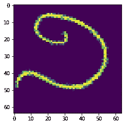

类别:១；预测:០

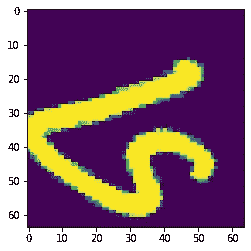

类别:៤；预测:៨

与其他基于深度学习的方法中的黑盒概念不同，使用 LDA，我们可以简单地理解使用数据的统计特征的学习过程。

然而，由于它是基于线性的模型，在某些情况下，它不能被线性判别函数识别，性能将明显下降。

另一个问题是输入模式 x 的维数。在本例中，我们使用 4096 维向量(64x64)作为输入，估计模型参数需要 7.17 秒(注意 PC)。当将输入图像增加到 128x128 时，这意味着使用 16384 维向量作为输入，这需要 470.80 秒。增加输入向量的维数导致在计算方差-协方差矩阵的逆矩阵时的巨大时间复杂度。