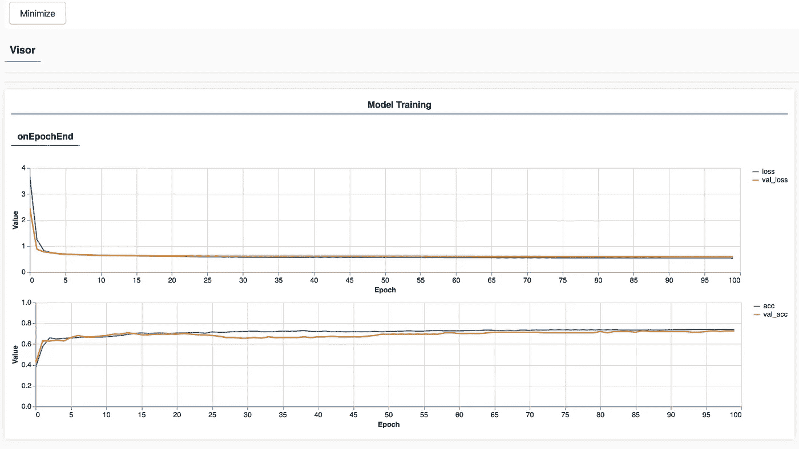

# 用于客户端 ML 开发的便捷 TensorFlow.js API

> 原文：<https://towardsdatascience.com/handy-tensorflow-js-api-for-client-side-ml-development-5256ed88e6f1?source=collection_archive---------24----------------------->

## TensorFlow.js 提供了一组丰富的 API 方法来处理训练数据，在客户端执行训练和推理。这篇文章通过一个简单实用的例子解释了如何使用这个 API。


来源:Pixabay

让我们研究一下 TensorFlow.js API，用于训练数据处理、训练执行和推理。TensorFlow.js 非常棒，因为它将机器学习带到了 Web 开发人员的手中，这提供了互利。机器学习领域得到了更多的开发者和支持者，而 Web 开发在机器学习的支持下变得更加强大。

我过去有一个关于 TensorFlow.js 的帖子— [综合 TensorFlow.js 举例](/comprehensive-tensorflow-js-example-96367625fab7)。本文旨在展示如何使用 TensorFlow.js 构建实际用例。今天，我将重点介绍 TensorFlow.js API，并展示如何使用开箱即用的 API 获取数据、训练模型和运行预测。

我想让示例应用程序尽可能简单，不使用任何特定的 JavaScript 框架/工具包。这将允许您下载示例代码并快速运行它。示例应用程序( [GitHub](https://github.com/abaranovskis-redsamurai/automation-repo/tree/master/tfjs-simple) repo)作为 HTML 页面运行，要在本地测试它，您需要使用 HTTP 服务器。我会推荐使用 NPM 的 [HTTP-Server](https://www.npmjs.com/package/http-server) 。转到包含 HTML 文件的文件夹，运行 *http-server* 命令。在浏览器中导航到端口 8080 并单击 HTML 文件，这将加载示例应用程序。

示例应用程序基于[皮马印第安人糖尿病](https://www.kaggle.com/uciml/pima-indians-diabetes-database)数据集(可在 Kaggle 上获得)。数据被分成训练集和测试集。

第一步是加载数据。通常，数据来自 CSV，有一个帮助器 TensorFlow.js 函数从 CSV 文件中读取数据— [tf.data.csv](https://js.tensorflow.org/api/latest/#data.csv) :

```
const trainingUrl = 'diabetes-train.csv';
const trainingData = tf.data.csv(trainingUrl, {
      columnConfigs: {
          Outcome: {
              isLabel: true
          }
      }
});
```

我们可以指定属性名，哪个将被用作训练目标。

接下来，我们转换数据集，为训练做好准备(这里我们可以对分类数据进行一次性编码)。将数据转换为数组形式:

```
const convertedTrainingData =
   trainingData.map(({ xs, ys }) => {
       return { xs: Object.values(xs), ys: Object.values(ys) };
   }).batch(30);
```

这就是模型的构建方式。有三层，分别有 12、8 和 1 个神经元。最后一层包含 1 个神经元，并通过 sigmoid 激活设置为返回 0/1。模型被编译以支持二进制分类任务:

```
const numOfFeatures = (await trainingData.columnNames()).length - 1;const model = tf.sequential();
model.add(tf.layers.dense({
    inputShape: [numOfFeatures],
    units: 12,
    activation: 'relu'
}));
model.add(tf.layers.dense({
    units: 8,
    activation: 'relu'
));
model.add(tf.layers.dense({
    units: 1,
    activation: 'sigmoid'
}));model.compile({ optimizer: tf.train.adam(0.001), loss: 'binaryCrossentropy', metrics: 'accuracy' });
```

我使用的是 [fitDataset](https://js.tensorflow.org/api/latest/#tf.Sequential.fitDataset) 函数，它直接根据之前准备的数据进行训练。这非常方便，省去了繁琐的数据操作过程:

```
const metrics = ['loss', 'val_loss', 'acc', 'val_acc'];
const container = { name: 'Model Training', styles: { width: '1200px' } };
const fitCallbacks = tfvis.show.fitCallbacks(container, metrics, {callbacks: ['onEpochEnd'], width: 1200});await model.fitDataset(convertedTrainingData,
     {
         epochs: 100,
         validationData: convertedTestingData,
         callbacks: fitCallbacks
     });
```

我正在使用 [tfjs-vis](https://js.tensorflow.org/api_vis/1.4.0/) 回调来可视化培训过程:



最后，我们执行预测函数来计算标签(训练目标)。TensorFlow.js 预测函数期望 *tf.tensor2d* 变量。[1，8]表示 1 维，8 个输入，用于描述我们传递给预测函数的数据的形状:

```
const testVal = tf.tensor2d([2, 108, 64, 0, 0, 30.8, 0.158, 21], [1, 8]);
const prediction = model.predict(testVal);
outcome = prediction.dataSync()[0];
prediction.dispose();
```

样本代码可以在我的 GitHub repo 上找到。