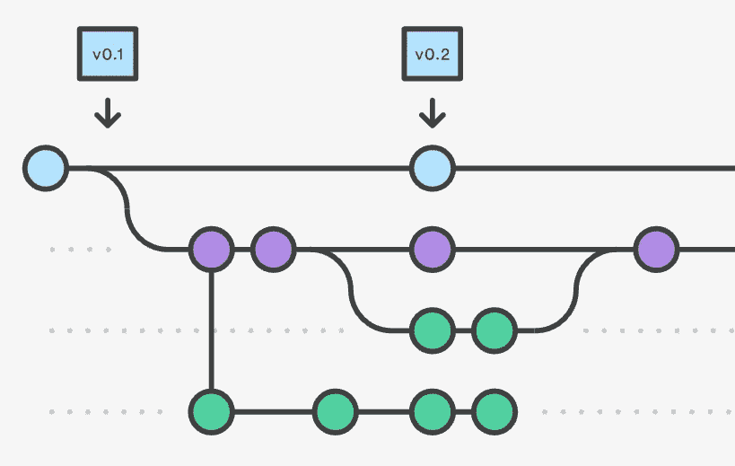
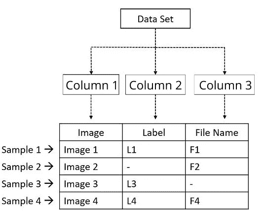

# 机库教程(1/2):将数据添加到机库

> 原文：<https://towardsdatascience.com/hangar-tutorial-1-2-adding-your-data-to-hangar-d7f039265455?source=collection_archive---------38----------------------->



来源:https://www.tech101.in/how-version-control-works/

## 一步一步的指南，以建立一个机库回购和添加您的数据。

***更新:*** *机库 0.5 版本发布不久，它已经将 arraysets 重命名为 columns，现在支持在这些列中存储字符串，不仅支持 numpy 数组，还移除了元数据。这将是今后使用的惯例，博客已经更新以应对这些变化。这些变化已被注意到了。*

数据可以说是机器学习中最重要的一块。每时每刻收集的大量数据是在巨大的计算资源上运行的深度学习算法的燃料，以模仿任何形式的智能。因此，收集、存储和维护这些不断增长的数据对于训练更好的深度学习算法非常重要。

这就是机库的用武之地。

**hanger 是对张量数据的版本控制。它就像 git，但是对于你的 tensors 来说就是数字数据。使用 hangar，您可以在数据集的演变过程中进行时间旅行，创建不同的分支进行实验而无需任何开销，与组织中的多人合作创建数据集，创建仅包含数据子集的本地副本等等。Hangar 使处理数据集变得轻而易举。**


冷静的人…机库让你回来了！(来源:quickmeme.com)

# 核心概念

1.  **数据集:**这是用于训练的数据样本的集合。数据集中的每个样本都是最小的个体实体，当单独考虑时仍然有意义。这个样本可以进一步分解成更小的属性，这些属性中的每一个都可以单独存储。例如，在 MNIST 数据集的情况下，单个 28x28 图像是样本，而在类似 Kaggle 中的 [Titanic 数据集](https://www.kaggle.com/c/titanic)的表格数据集的情况下，每一行是样本，每一列是属性。
2.  **列:**一个数据集可以被分解成列，这就是它们在 Hangar 中的存储方式。这类似于表中的列。数据集中的每个样本都细分为代表该样本不同属性的列。只有当所有的属性(列)结合在一起时，才能完整地描述样本。



解释机库柱子的插图

机库提供两种类型的立柱

1.  数值列(ndarray):这些列用于在类似 numpy 的数组中存储数值数据。
2.  字符串列(str):这些列存储字符串类型的数据。

注意:在*机库 0.5 之前的版本中，*列曾被称为 arraysets，仅用于存储数值数据，而元数据现在被称为 String 列，用于存储字符串。

3.**存储库:**这是数据存储的地方，作为提交的时间列表，由不同的贡献者在不同的分支中处理。它类似于 git 存储库。我们通常为每个数据集使用一个存储库。每个数据样本都存储在列中。也可以有远程存储库

如果你想了解更多的概念，我强烈推荐你查阅[文档](https://hangar-py.readthedocs.io/en/stable/concepts.html)。

# 设置存储库和列

对于本教程，我们将在 [MNIST 数据集](https://github.com/mnielsen/neural-networks-and-deep-learning/raw/master/data/mnist.pkl.gz)上设置 Hangar(下载数据集并保存在您的工作目录中)。我们将把数据集添加到机库，并在这个过程中学习机库的基本功能和用法。需要注意的一点是，与 git 不同，git 与版本控制系统的主要交互是 CLI，这里最常用的访问点是通过 python APIs。这使得数据集版本化可以与大型数据集管道无缝协作。

安装很简单，如果使用 anaconda，只需运行`pip install hangar`或`conda install -c conda-forge hangar`即可。对于从源代码安装，只需运行

```
$ git clone [https://github.com/tensorwerk/hangar-py.git](https://github.com/tensorwerk/hangar-py.git)
$ cd hangar-py
$ python setup.py install
```

## **初始化储存库**

每次使用新的数据集时，我们都必须创建一个新的存储库。我们使用存储库`init()`方法来初始化一个存储库。您可以在这里向 Hangar 提供您的姓名和电子邮件地址，这些信息将在提交日志中使用。

这将生成存储库，并在. hangar 文件夹中创建下划线文件。

```
Hangar Repo initialized at: /home/jjmachan/jjmachan/hangar_examples/mnist/.hangarOut []:Hangar Repository               
    Repository Path  : /home/jjmachan/jjmachan/hangar_examples/mnist               
    Writer-Lock Free : True
```

现在，我们必须创建回购的签出，以访问其中的数据。有两种结账模式。

1.  可写签出:在这种模式下，所有操作都在临时区域的当前状态下执行。在给定时间内，只能有一个可写签出处于活动状态，并且必须在退出前正确关闭。
2.  只读签出:此模式用于仅从回购中读取。在给定时间内，可以有多个签出处于活动状态。

现在，我们必须创建回购的签出，以访问其中的数据。有两种结账模式。
可写签出:在此模式下，所有操作都在暂存区的当前状态下执行。在给定时间内，只能有一个可写签出处于活动状态，并且必须在退出前正确关闭。
只读签出:该模式用于只从回购中读取。在给定时间内，可以有多个签出处于活动状态。

这将创建一个可写的签出。

```
Out[]:Hangar WriterCheckout                
    Writer       : True                
    Base Branch  : master                
    Num Columns  : 0
```

如前所述，数据集存储为包含描述样本的不同属性的列。要初始化一个列，我们需要*名称、dtype(数据类型)*和*形状*。我们还可以向它展示一个*原型*，这是一个示例数组，具有与示例数据相同的正确的 *dtype* 和 *shape* ，并且 hangar 将从中推断出列的 *shape* 和 *dtype* 。

一个数字列由`add_ndarray_column()`方法初始化，而一个新的字符串列由`add_str_column( )`初始化。它接受样本的名称和原型。

在本例中，我们正在对 [MNIST 数据集](https://github.com/mnielsen/neural-networks-and-deep-learning/raw/master/data/mnist.pkl.gz)进行版本控制。要继续本教程，请下载数据集并将其放在工作目录中。然后运行以下代码来加载数据集，并为初始化列创建一个原型。

现在我们有了样本图像(sample_trimg)和标签(sample_trlabel)来初始化列。

```
Out []:Hangar FlatSampleWriter                 
    Column Name              : mnist_training_images                
    Writeable                : True                
    Column Type              : ndarray                
    Column Layout            : flat                
    Schema Type              : fixed_shape                
    DType                    : float32                
    Shape                    : (784,)                
    Number of Samples        : 50000                
    Partial Remote Data Refs : False
```

## 添加数据

当初始化一个列时，将返回一个列访问器对象，我们可以使用该对象访问列中的示例。我们还可以使用 repo 的 checkout 实例来访问 Column 访问器对象。

`checkout[*column_name*]` →专栏

样本数据以类似字典的方式存储，带有一个键和值。可以像在 python 字典中添加数据一样添加新样本

`column_1[key] = value`

密钥可以是 **int** 或 **str** 。这些关键字充当检索相应样本的索引。如果没有找到数据，可以对返回 None 的列使用 get()函数，而不是抛出一个 KeyExeption。

`column_1[key]`

`column_1.get(key)`

`checkout[*column_name, key]*`

关于机库中的上下文管理器。从第一天起，安全就是机库的一大焦点。hanger 锁定并检查用于访问存储数据的方法，这样无论 hanger 以何种规模运行，数据都不会被破坏。每次我们试图检索或设置数据时，Hangar 都会执行一些检查，然后才执行操作。当执行大量读写任务时，这可能是一个很大的开销。因此，为了克服这个问题，建议使用 python 上下文管理器，使用`*with*`关键字。使用它可以确保对每个读/写会话执行检查，而不是单独对每个操作执行检查。

现在我们有了将 MNIST 数据添加到列中的最终代码。

作为一个练习，尝试在没有上下文管理器的情况下执行代码( ***带 img_col* ，label_col** *:* 行)，并查看性能差异。

**提交更改**

添加完数据后，您可以使用`commit()`方法将添加内容提交给回购。它将提交消息作为参数。提交所有更改后，请确保关闭连接，尤其是在执行可写签出时。

```
Out []:'a=3f4c4497c93982d0d182110277841ed37d1bbf8e'
```

与此同时，我们的数据被散列和安全地存储在机库。

要查看存储库的日志和详细信息，我们可以使用存储库对象。使用`repo.log()`获取回购提交消息的日志。`repo.summary()`返回关于存储库的最重要的信息。

```
Out []:Summary of Contents Contained in Data Repository 

================== 
| Repository Info 
|----------------- 
|  Base Directory: /home/jjmachan/jjmachan/hangar_examples/mnist 
|  Disk Usage: 105.90 MB 

=================== 
| Commit Details 
------------------- 
|  Commit: a=41f88d0fe944f431339d3c0b3935e787328d01cd 
|  Created: Mon Apr 13 13:12:04 2020 
|  By: jjmachan 
|  Email: jjmachan@g.com 
|  Message: added all the mnist datasets 

================== 
| DataSets 
|----------------- 
|  Number of Named Columns: 6 
|
|  * Column Name: ColumnSchemaKey(column="mnist_test_images", layout="flat") 
|    Num Data Pieces: 10000 
|    Details: 
|    - column_layout: flat 
|    - column_type: ndarray 
|    - schema_hasher_tcode: 1 
|    - data_hasher_tcode: 0 
|    - schema_type: fixed_shape 
|    - shape: (784,) 
|    - dtype: float32 
|    - backend: 00 
|    - backend_options: {'complib': 'blosc:lz4hc', 'complevel': 5, 'shuffle': 'byte'} 
|
|  * Column Name: ColumnSchemaKey(column="mnist_test_labels", layout="flat") 
|    Num Data Pieces: 10000 
|    Details: 
|    - column_layout: flat 
|    - column_type: ndarray 
|    - schema_hasher_tcode: 1 
|    - data_hasher_tcode: 0 
|    - schema_type: fixed_shape 
|    - shape: (1,) 
|    - dtype: int64 
|    - backend: 10 
|    - backend_options: {} 
|
|  * Column Name: ColumnSchemaKey(column="mnist_training_images", layout="flat") 
|    Num Data Pieces: 50000 
|    Details: 
|    - column_layout: flat 
|    - column_type: ndarray 
|    - schema_hasher_tcode: 1 
|    - data_hasher_tcode: 0 
|    - schema_type: fixed_shape 
|    - shape: (784,) 
|    - dtype: float32 
|    - backend: 00 
|    - backend_options: {'complib': 'blosc:lz4hc', 'complevel': 5, 'shuffle': 'byte'} 
|
|  * Column Name: ColumnSchemaKey(column="mnist_training_labels", layout="flat") 
|    Num Data Pieces: 50000 
|    Details: 
|    - column_layout: flat 
|    - column_type: ndarray 
|    - schema_hasher_tcode: 1 
|    - data_hasher_tcode: 0 
|    - schema_type: fixed_shape 
|    - shape: (1,) 
|    - dtype: int64 
|    - backend: 10 
|    - backend_options: {} 
|
|  * Column Name: ColumnSchemaKey(column="mnist_validation_images", layout="flat") 
|    Num Data Pieces: 10000 
|    Details: 
|    - column_layout: flat 
|    - column_type: ndarray 
|    - schema_hasher_tcode: 1 
|    - data_hasher_tcode: 0 
|    - schema_type: fixed_shape 
|    - shape: (784,) 
|    - dtype: float32 
|    - backend: 00 
|    - backend_options: {'complib': 'blosc:lz4hc', 'complevel': 5, 'shuffle': 'byte'} 
|
|  * Column Name: ColumnSchemaKey(column="mnist_validation_labels", layout="flat") 
|    Num Data Pieces: 10000 
|    Details: 
|    - column_layout: flat 
|    - column_type: ndarray 
|    - schema_hasher_tcode: 1 
|    - data_hasher_tcode: 0 
|    - schema_type: fixed_shape 
|    - shape: (1,) 
|    - dtype: int64 
|    - backend: 10 
|    - backend_options: {} 
```

# 结论

就像我之前提到的，python APIs 是 hanger 最常用的接口，但是 hanger 也提供了一个直观的 CLI。你可以创建，删除列，管理各种分支和远程数据源，从远程推送和获取数据，管理机库服务器等。有关更多详情，请查看[官方文件。](https://hangar-py.readthedocs.io/en/stable/cli.html)

现在，我们已经成功地将 MNIST 数据集添加到了机库，在下一部分中，我们将创建一个数据加载器来从机库获取数据，并使用它来训练一个模型。