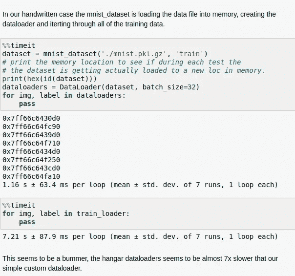

# 机库教程(2/2):使用版本化数据训练模型

> 原文：<https://towardsdatascience.com/hangar-tutorial-2-2-training-a-model-with-the-versioned-data-78460404c55?source=collection_archive---------51----------------------->

## 如何从机库获取数据并训练 PyTorch 模型？

在上一篇教程中，我们介绍了[hanger](https://hangar-py.readthedocs.io/en/stable/)，这是一个 python 库，可以帮助你对数据进行版本控制。数据是新的石油，正确管理和传输数据流对您的公司至关重要。Hangar 是您工具箱中的一个很好的工具，它带来了从软件开发到 ML 工程的版本控制等最佳实践，从而帮助您为客户提供强大的 ML 服务。如果你还没看过[之前的博客](/hangar-tutorial-1-2-adding-your-data-to-hangar-d7f039265455)，那就去看看吧。我讨论了机库的核心概念，以及如何在那里创建自己的机库回购。

ML 工作流程变得越来越复杂，我认为 Hangar 是你工具箱中非常重要的工具(via [*Giphy*](https://giphy.com/gifs/HUplkVCPY7jTW) )

***注:*** *随附的 GitHub repo 中有一些详细的笔记本，解释了所有讨论的概念。您可以在本教程中尝试一下。【* [*链接*](https://github.com/jjmachan/hangar_tutorials)*】*

# 我们说到哪了..？

因此，我们已经学习了机库的核心概念，我们将玩具数据集(MNIST)添加到了机库中。今天，我们将从我们停止的地方继续，并根据我们添加到 Hangar 的数据训练一个模型。首先我们来连线机库回购。

将所有制表符转换为空格 vim

让我们快速浏览一下摘要，了解一下我们回购中的数据。

```
Summary of Contents Contained in Data Repository 

================== 
| Repository Info 
|----------------- 
|  Base Directory: /home/jjmachan/jjmachan/hangar_tutorial 
|  Disk Usage: 105.88 MB 

=================== 
| Commit Details 
------------------- 
|  Commit: a=39a36c4fa931e82172f03edd8ccae56bf086129b 
|  Created: Fri May  1 18:23:19 2020 
|  By: jjmachan 
|  Email: jjmachan@g.com 
|  Message: added all the mnist datasets 

================== 
| DataSets 
|----------------- 
|  Number of Named Columns: 6 
|
|  * Column Name: ColumnSchemaKey(column="mnist_test_images", layout="flat") 
|    Num Data Pieces: 10000 
|    Details: 
|    - column_layout: flat 
|    - column_type: ndarray 
|    - schema_hasher_tcode: 1 
|    - data_hasher_tcode: 0 
|    - schema_type: fixed_shape 
|    - shape: (784,) 
|    - dtype: float32 
|    - backend: 00 
|    - backend_options: {'complib': 'blosc:lz4hc', 'complevel': 5, 'shuffle': 'byte'} 
|
|  * Column Name: ColumnSchemaKey(column="mnist_test_labels", layout="flat") 
|    Num Data Pieces: 10000 
|    Details: 
|    - column_layout: flat 
|    - column_type: ndarray 
|    - schema_hasher_tcode: 1 
|    - data_hasher_tcode: 0 
|    - schema_type: fixed_shape 
|    - shape: (1,) 
|    - dtype: int64 
|    - backend: 10 
|    - backend_options: {} 
|
|  * Column Name: ColumnSchemaKey(column="mnist_training_images", layout="flat") 
|    Num Data Pieces: 50000 
|    Details: 
|    - column_layout: flat 
|    - column_type: ndarray 
|    - schema_hasher_tcode: 1 
|    - data_hasher_tcode: 0 
|    - schema_type: fixed_shape 
|    - shape: (784,) 
|    - dtype: float32 
|    - backend: 00 
|    - backend_options: {'complib': 'blosc:lz4hc', 'complevel': 5, 'shuffle': 'byte'} 
|
|  * Column Name: ColumnSchemaKey(column="mnist_training_labels", layout="flat") 
|    Num Data Pieces: 50000 
|    Details: 
|    - column_layout: flat 
|    - column_type: ndarray 
|    - schema_hasher_tcode: 1 
|    - data_hasher_tcode: 0 
|    - schema_type: fixed_shape 
|    - shape: (1,) 
|    - dtype: int64 
|    - backend: 10 
|    - backend_options: {} 
|
|  * Column Name: ColumnSchemaKey(column="mnist_validation_images", layout="flat") 
|    Num Data Pieces: 10000 
|    Details: 
|    - column_layout: flat 
|    - column_type: ndarray 
|    - schema_hasher_tcode: 1 
|    - data_hasher_tcode: 0 
|    - schema_type: fixed_shape 
|    - shape: (784,) 
|    - dtype: float32 
|    - backend: 00 
|    - backend_options: {'complib': 'blosc:lz4hc', 'complevel': 5, 'shuffle': 'byte'} 
|
|  * Column Name: ColumnSchemaKey(column="mnist_validation_labels", layout="flat") 
|    Num Data Pieces: 10000 
|    Details: 
|    - column_layout: flat 
|    - column_type: ndarray 
|    - schema_hasher_tcode: 1 
|    - data_hasher_tcode: 0 
|    - schema_type: fixed_shape 
|    - shape: (1,) 
|    - dtype: int64 
|    - backend: 10 
|    - backend_options: {}
```

如您所见，数据存储在 6 个 ndarray 列中。2 列各存储 3 个数据分割、训练、测试和验证的图像和目标对。现在让我们从主分支创建一个只读签出来访问列。

```
* Checking out BRANCH: master with current HEAD: a=39a36c4fa931e82172f03edd8ccae56bf086129b
```

# 数据加载器

现在，让我们从 Hangar 加载数据，将其输入我们的神经网络进行训练。尽管您可以使用 checkout 直接访问数据，但推荐的方法是使用 make_torch_dataset。它提供了更多可配置的选项，并使其更有效、更容易地加载到 PyTorch 中。

***make _ torch _ dataset*(列**，*key:Sequence[str]= None*， *index_range: slice = None* ，*field _ names:Sequence[str]= None***)**

*make_torch_dataset* 创建一个 PyTorch 数据集，将列传递给它。在我们的示例中，如果我们要传递“mnist_training_images”列和“mnist_training_labels”列。现在，make_torch_dataset 将为每个索引返回一个元组，其中包含与该索引对应的图像和标签。

因为它返回一个 PyTorch 数据集，所以我们可以将它传递给 PyTorch 数据加载器来执行混洗、批处理等操作。

现在，遍历 trainDataloader 将为我们提供成批的数据，并作为张量准备用于训练。

# 培养

我们不会深入模型是如何定义和训练的细节。如果你觉得下面的代码很难跟上，我强烈建议你看看 [Pytorch 教程](https://pytorch.org/tutorials/beginner/deep_learning_60min_blitz.html)

我们将为 MNIST 定义一个简单的 3 层全连接神经网络。

现在，使用 dataloader，我们通过批处理进行迭代，进行正向传播，计算损耗，通过反向传播找到梯度，并调整模型参数，这就是您所熟悉的标准神经网络训练。

```
[EPOCH 0/10] Train Loss: 1.2083537247954312
Test Loss: 0.47797256113050846 Accuracy: 0.865814696485623
[EPOCH 1/10] Train Loss: 0.3944594695549208
Test Loss: 0.3467818654228609 Accuracy: 0.897064696485623
[EPOCH 2/10] Train Loss: 0.31767420198765994
Test Loss: 0.2960374093682954 Accuracy: 0.9107428115015974
[EPOCH 3/10] Train Loss: 0.27709063706813486
Test Loss: 0.2613061714274719 Accuracy: 0.9223242811501597
[EPOCH 4/10] Train Loss: 0.24662601495887404
Test Loss: 0.234231408689909 Accuracy: 0.9306110223642172
[EPOCH 5/10] Train Loss: 0.22161395768786918
Test Loss: 0.21181030162928488 Accuracy: 0.9365015974440895
[EPOCH 6/10] Train Loss: 0.20021527176466666
Test Loss: 0.19286749035137862 Accuracy: 0.9421924920127795
[EPOCH 7/10] Train Loss: 0.18172580767267993
Test Loss: 0.1767021114335428 Accuracy: 0.946685303514377
[EPOCH 8/10] Train Loss: 0.16573666792806246
Test Loss: 0.16299303889887545 Accuracy: 0.9507787539936102
[EPOCH 9/10] Train Loss: 0.1518441192202165
Test Loss: 0.15127997121999795 Accuracy: 0.954073482428115
```

瞧！

我们已经成功地使用来自机库的数据训练了我们的模型。

# 结论

到目前为止，您应该已经学习了 Hangar 的基础知识，如何根据您的数据集定义列，向这些列添加数据，并从中加载数据以在 PyTorch 中训练模型。hangle 还有其他一些很酷的功能，比如[远程仓库](https://hangar-py.readthedocs.io/en/stable/Tutorial-003.html)、[从这些远程仓库部分下载](https://hangar-py.readthedocs.io/en/stable/Tutorial-003.html#Partial-Fetching-and-Clones)数据、[hangle 外部](https://hangar-py.readthedocs.io/en/stable/externals.html)是 hangle 的一个高级接口，当你将 hangle 与现有数据流集成时可以使用。我已经链接了相关的文档，并且我建议你去看看这些文档，了解一下 Hangar 提供的所有功能。

随着越来越多的公司正在寻找新的方法将机器学习的力量融入他们的产品，我们将一些最佳实践融入其中以避免积累技术债务是很重要的。这仍然是一个不断发展的领域，每个人都仍然在弄清楚这些“最佳实践”是什么，以及哪些工作流可能最适合他们。对您的数据进行版本控制就是这样一种实践，可以添加它来确保可再现性、协作和更好的管理。像 Hangar 和 DVC 这样的工具是最好的选择，尽管还有很多工作要做。Hangar 非常容易添加到你现有的 ML 工作流程中，希望这篇教程能让你更好的理解它。

干杯

# *辅助*

这是一个比较两方面机库的辅助部分

1.  存储在机库之前和之后数据集的大小
2.  使用 Hangar 和一个简单数据加载器的数据加载器的速度，该数据加载器采用我们定义的 mnist_dataset。

现在，这些是我个人的实验和基准，所以你可以自己尝试一下，看看我下面讨论的结果是否相同。如果现在你能把它分享给每个人，我会很高兴的！该代码可在 [GitHub repo 上获得。](https://github.com/jjmachan/hangar_tutorials)

首先，让我们谈谈数据集的大小。现在，内部机库在将数据保存到磁盘时，在处理数据方面做得非常好。在我们的例子中，原来的 MNIST 文件是 210 兆，但在机库它只占 105 兆。但我说的是未压缩版的 MNIST。压缩版只有 17Mb，这是一个很大的容量。这是我见过的 Hangar 最大的问题之一。它在压缩数字数据方面做得很好，但最有可能的是，有其他格式的数据可能会提供显著的大小缩减。这在把 jpeg 文件保存在机库时变得非常明显，它们占据了大量的空间。

现在有办法通过手动调整库选择保存数据的后端来提高效率。但是这是以更高的读取时间为代价的。据开发商称，这是出于好意。存储很便宜，但时间不便宜。

第二是从磁盘加载用于训练。差不多要多花 7 倍的时间，很多！同样在这个例子中，我在将数据加载到内存之前执行解压缩，仍然只需要大约 1 秒。

这是我系统的输出。



显示结果的屏幕截图

这又回到了后端选择。所有这些结果都是默认设置，但可以调整。所以问题是我们如何调整这些。一份官方指南正在制作中。当它出来的时候，我会更多的评论后端选择。

同时，你检查一下，告诉我你的结果。很想听听！