# 幸福和生活满意度

> 原文：<https://towardsdatascience.com/happiness-and-life-satisfaction-ecdc7d0ab9a5?source=collection_archive---------5----------------------->

## 世界幸福报告的探索性数据分析。


照片由[弗雷迪·多](https://unsplash.com/@freddydo)在 [Unsplash](https://unsplash.com?utm_source=medium&utm_medium=referral) 上拍摄

人生的目的是什么？那是幸福吗？为什么人们要经历所有的痛苦和艰难？是为了通过某种方式达到快乐吗？

我不是唯一相信生活的目的是幸福的人。环顾四周，大多数人的生活都在追求幸福。

3 月 20 日，全世界庆祝国际幸福日。2020 年的报告根据公民对自己生活的评价，对 156 个国家的幸福程度进行了排名。国民幸福排名是基于坎特里尔阶梯调查。全国范围内有代表性的受访者被要求想出一个阶梯，对他们来说最好的生活可能是 10，最差的可能是 0。然后他们被要求在 0 到 10 的范围内给自己目前的生活打分。该报告将结果与各种生活因素联系起来。在这些报告中，经济学、心理学、调查分析和国家统计方面的专家描述了如何有效地使用福祉测量来评估国家的进步和其他主题。

那么，今天的人们有多幸福呢？以前的人是不是更舒服？不同社会的人对自己的生活有多满意？我们的生活条件是如何影响这一切的？

# 分析的特征

*   **GDP** :人均 GDP 是衡量一个国家经济产出占其人口数量的指标。
*   **支持**:社会支持意味着有朋友和其他人，包括家人，在需要或危机的时候向你求助，给你更广泛的关注和积极的自我形象。社会支持提高了生活质量，并为不良生活事件提供了缓冲。
*   **健康**:健康预期寿命是指新生儿可以预期生活在“完全健康”状态下的平均年数——换句话说，不受致残疾病或伤害的影响。
*   **自由:**选择的自由描述了个人从至少两个可用选项中选择行动的机会和自主性，不受外部各方的约束。
*   **慷慨度**:被定义为对“你在过去几个月里是否向慈善机构捐过钱？”这一问题的全国平均回答进行回归后的残差论人均 GDP。
*   **腐败**:清廉指数(CPI)是透明国际自 1995 年以来每年发布的一项指数，它“根据专家评估和民意调查确定的公共部门腐败程度”对各国进行排名

# 大纲:

1.  导入模块，读取数据集并定义评估表
2.  定义一个函数来计算调整后的 R
3.  幸福分数是如何分布的
4.  不同特征与幸福得分的关系。
5.  可视化和检查数据
6.  多元线性回归
7.  结论

给自己拿杯咖啡，和我一起踏上预测幸福的旅程吧！

# 1.导入模块，读取数据集并定义评估表

为了进行一些分析，我们需要设置我们的环境。首先，我们介绍一些模块并读取数据。下面的输出是数据的头，但是如果你想看到更多的细节，你可以去掉`df_15.describe()`和`df_15.info()`前面的#号

```
# FOR NUMERICAL ANALYTICS
import numpy as np# TO STORE AND PROCESS DATA IN DATAFRAME
import pandas as pd
import os# BASIC VISUALIZATION PACKAGE
import matplotlib.pyplot as plt# ADVANCED PLOTING
import seaborn as seabornInstance# TRAIN TEST SPLIT
from sklearn.model_selection import train_test_split# INTERACTIVE VISUALIZATION
import chart_studio.plotly as py 
import plotly.graph_objs as go
import plotly.express as px
from plotly.offline import download_plotlyjs, init_notebook_mode, plot, iplot
init_notebook_mode(connected=True)import statsmodels.formula.api as stats
from statsmodels.formula.api import ols
from sklearn import datasets
from sklearn.linear_model import LinearRegression
from sklearn.metrics import mean_squared_error
from discover_feature_relationships import discover#2015 data
df_15 = pd.read_csv('2015.csv')
#df_15.describe()
#df_15.info()
usecols = ['Rank','Country','Score','GDP','Support',
                'Health','Freedom','Generosity','Corruption']
df_15.drop(['Region','Standard Error', 'Dystopia Residual'],axis=1,inplace=True) 
df_15.columns = ['Country','Rank','Score','Support',
                'GDP','Health',
                'Freedom','Generosity','Corruption']
df_15['Year'] = 2015 #add year column
df_15.head()
```

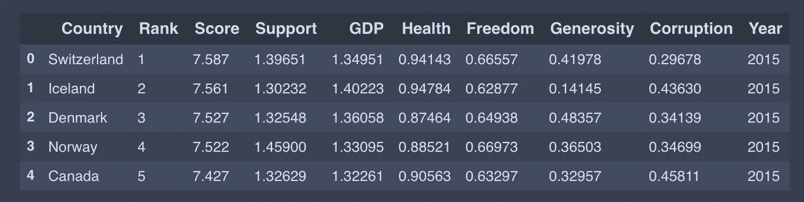

输出

我只呈现 2015 年的数据代码作为例子；你可以在其他年份做类似的事情。
以`Happiness`、`Whisker`、`Dystopia`开头的零件。`Residual`目标不同。将每个国家的分数与世界上最不幸福的国家进行比较。由于这些年的数据有一点不同的命名约定，我们将把它们抽象成一个通用名称。

```
target = ['Top','Top-Mid', 'Low-Mid', 'Low' ]
target_n = [4, 3, 2, 1]df_15["target"] = pd.qcut(df_15['Rank'], len(target), labels=target)
df_15["target_n"] = pd.qcut(df_15['Rank'], len(target), labels=target_n)
```

然后我们将所有数据文件合并到`finaldf`

```
# APPENDING ALL TOGUETHER
finaldf = df_15.append([df_16,df_17,df_18,df_19])
# finaldf.dropna(inplace = True)#CHECKING FOR MISSING DATA
finaldf.isnull().any()# FILLING MISSING VALUES OF CORRUPTION PERCEPTION WITH ITS MEAN
finaldf.Corruption.fillna((finaldf.Corruption.mean()), inplace = True)
finaldf.head(10)
```

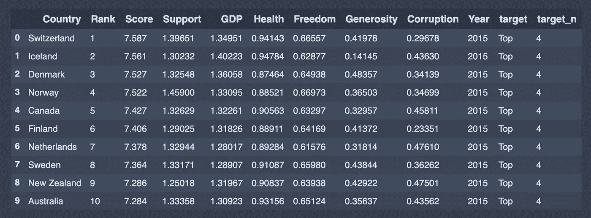

通过使用 describe()函数，我们可以看到数据集的统计细节:

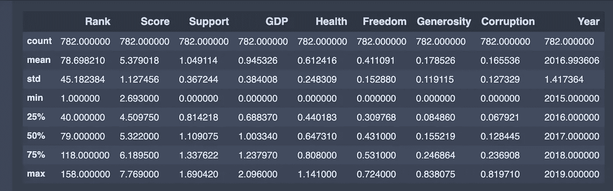

进一步，我们定义一个空的`dataframe`。这个`dataframe`包括`Root Mean Squared Error (RMSE)`、`R-squared`、`Adjusted R-squared`、`mean of the R-squared values obtained by the k-Fold Cross-Validation`，是比较不同车型的必备指标。R 平方值越接近 1，RMSE 越小，表示拟合越好。在接下来的部分中，我们将用结果填充这个`dataframe`。

```
evaluation = pd.DataFrame({'Model':[],
                          'Details':[],
                          'Root Mean Squared Error (RMSE)': [],
                          'R-squared (training)': [],
                          'Adjusted R-squared (training)': [],
                          'R-squared (test)':[],
                          'Adjusted R-squared(test)':[],
                           '5-Fold Cross Validation':[]
                        })
```

# 2.定义一个函数来计算调整后的 R

[当特征数量增加时，R 平方](https://en.wikipedia.org/wiki/Coefficient_of_determination)增加。有时，更强大的评估工具更适合用来比较不同模型之间的性能。该评估器称为调整后的 R 平方，只有当变量的增加降低了 MSE 时，它才会增加。调整后的 R 的定义是:

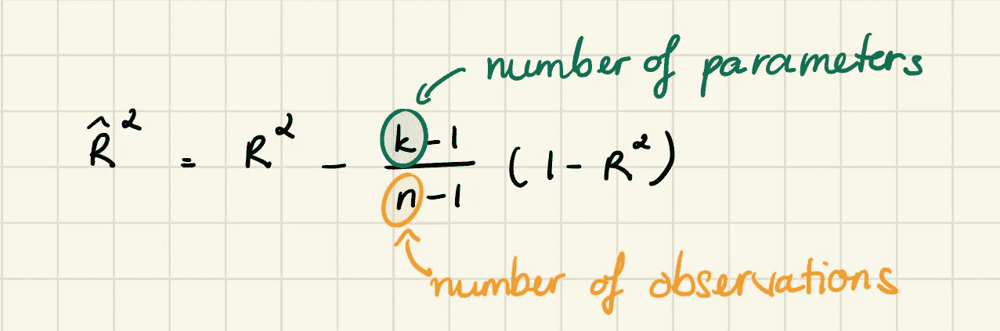

# 3.幸福分数是如何分布的

正如我们在下面看到的，幸福分数的值在 2.85 以上和 7.76 以下。所以没有一个国家的幸福指数高于 8。

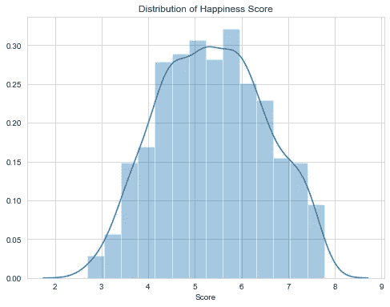

# 4.不同特征与幸福得分的关系

我们要预测幸福得分，所以我们这里的因变量是`Score`其他特征如`GPD` `Support` `Health`等。，是我们的自变量。

## 人均国内生产总值

我们首先使用散点图来观察变量之间的关系。


作者 Gif

```
'''Happiness score vs gdp per capital'''
px.scatter(finaldf, x="GDP", y="Score", animation_frame="Year",
           animation_group="Country",
           size="Rank", color="Country", hover_name="Country",
           trendline= "ols")train_data, test_data = train_test_split(finaldf, train_size = 0.8, random_state = 3)
lr = LinearRegression()
X_train = np.array(train_data['GDP'],
                   dtype = pd.Series).reshape(-1,1)
y_train = np.array(train_data['Score'], dtype = pd.Series)
lr.fit(X_train, y_train)X_test = np.array(test_data['GDP'], 
                    dtype = pd.Series).reshape(-1,1)
y_test = np.array(test_data['Score'], dtype = pd.Series)pred = lr.predict(X_test)#ROOT MEAN SQUARED ERROR
rmsesm = float(format(np.sqrt(metrics.mean_squared_error(y_test,pred)),'.3f'))#R-SQUARED (TRAINING)
rtrsm = float(format(lr.score(X_train, y_train),'.3f'))#R-SQUARED (TEST)
rtesm = float(format(lr.score(X_test, y_test),'.3f'))cv = float(format(cross_val_score(lr,finaldf[['GDP']],finaldf['Score'],cv=5).mean(),'.3f'))print ("Average Score for Test Data: {:.3f}".format(y_test.mean()))
print('Intercept: {}'.format(lr.intercept_))
print('Coefficient: {}'.format(lr.coef_))r = evaluation.shape[0]
evaluation.loc[r] = ['Simple Linear Regression','-',rmsesm,rtrsm,'-',rtesm,'-',cv]
evaluation
```

通过使用这些值和下面的定义，我们可以手动估计幸福分数。我们用于估计的方程称为假设函数，定义如下

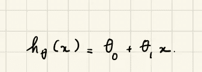

我们还打印了简单线性回归的截距和系数。

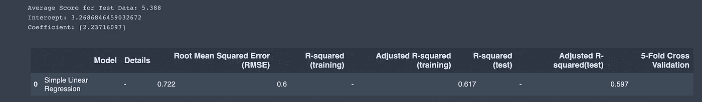

让我们展示结果，好吗？

因为在简单回归中我们只有两个维度，所以很容易画出来。下图确定了简单回归的结果。它看起来不像是完美的拟合，但当我们处理真实世界的数据集时，获得理想的拟合并不容易。

```
seabornInstance.set_style(style='whitegrid')plt.figure(figsize=(12,6))
plt.scatter(X_test,y_test,color='blue',label="Data", s = 12)
plt.plot(X_test,lr.predict(X_test),color="red",label="Predicted Regression Line")
plt.xlabel("GDP per Captita", fontsize=15)
plt.ylabel("Happiness Score", fontsize=15)
plt.xticks(fontsize=13)
plt.yticks(fontsize=13)
plt.legend()plt.gca().spines['right'].set_visible(False)
plt.gca().spines['top'].set_visible(False)
```

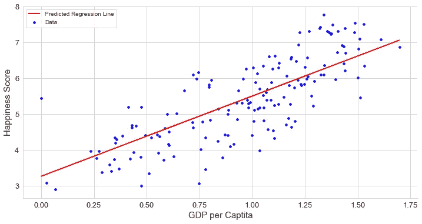

人均 GDP(国家的经济)的关系与幸福得分有很强的正相关关系，即如果一个国家的人均 GDP 高于该国的幸福得分，也更有可能高。

## 支持

> 为了保持文章简短，我不会在这部分包含代码。代码类似于上面的 GDP 特性。我建议你自己努力实现。我会在本文末尾附上链接，以供参考。

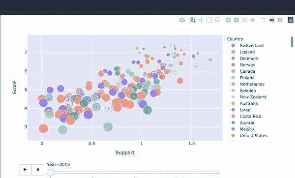

国家的社会支持与幸福得分也有很强的正相关关系。所以，我们需要社会支持来获得幸福是有道理的。人们也有情绪，我们在社会环境中体验这些情绪。

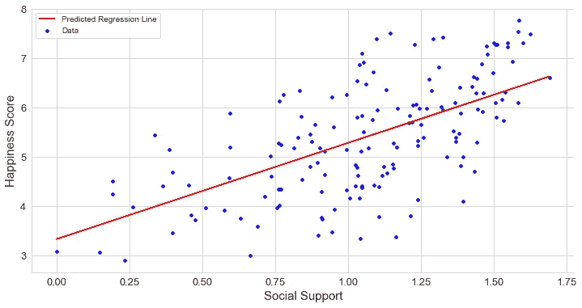

## 健康预期寿命

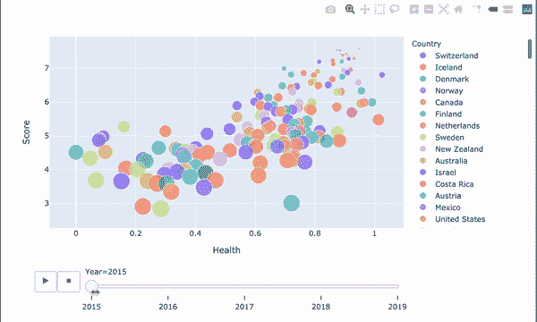

健康的预期寿命与幸福指数有很强的正相关关系，也就是说，如果一个国家的预期寿命很高，它也可以有很高的幸福指数。快乐不仅仅是提高一个人的生活质量。它也可以增加我们生活的质量。如果我健康长寿，我也会很开心。你呢。

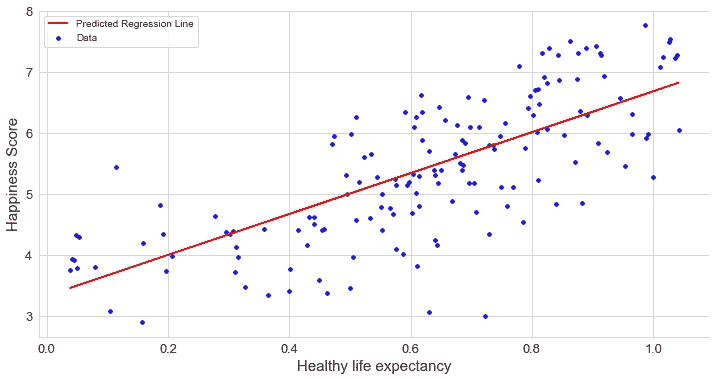

## 做出人生选择的自由

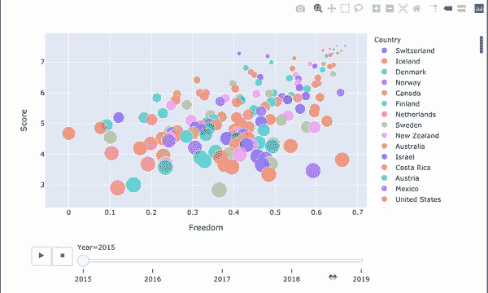

做出生活选择的自由与幸福指数成正相关。与拥有大量金钱相比，选择和自主与幸福更直接相关。它给了我们选择去追求生活的意义，去寻找刺激我们的活动。这是感到快乐的一个重要方面。

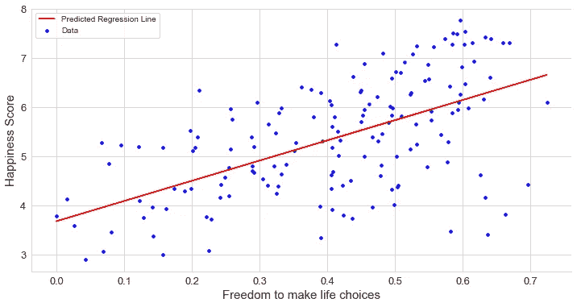

**慷慨**

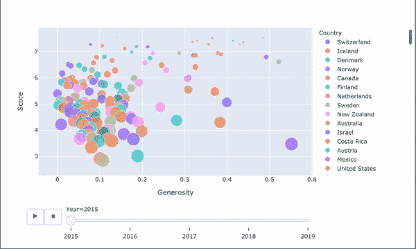

慷慨与幸福分数之间存在脆弱的线性关系。为什么慈善和幸福得分没有直接关系？慷慨度得分是根据世界上向非营利组织捐赠最多的国家来计算的。不慷慨的国家并不意味着他们不快乐。

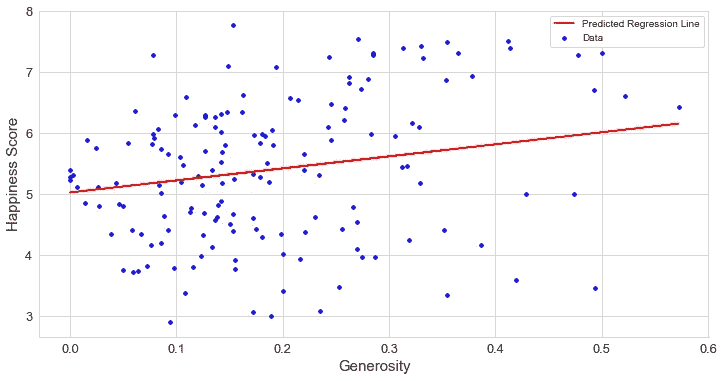

**对腐败的看法**

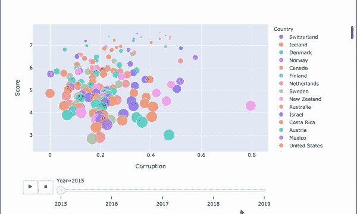

对腐败看法的分布是正确的，这意味着对腐败有高度看法的国家很少。这意味着该国大部分地区都存在腐败问题。


**腐败特征如何影响幸福得分？**

对腐败数据的看法高度扭曲，难怪这些数据的线性关系很弱。尽管如此，正如我们在散点图中看到的，大多数数据点都在左侧，大多数对腐败看法较低的国家的幸福指数都在 4 到 6 之间。感知分高的国家，幸福分也高，在 7 分以上。

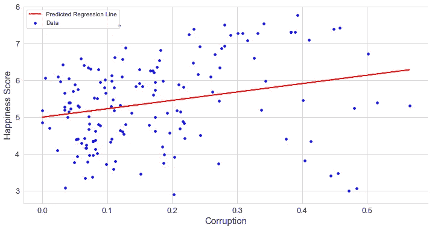

# 5.可视化和检查数据

我们没有包含太多功能的大数据。因此，我们有机会绘制出它们中的大部分，并得出一些有用的分析结果。在应用模型之前绘制图表并检查数据是一个很好的做法，因为我们可能会检测到一些可能的异常值或决定进行归一化。这一步不是必须的，但是要知道数据总是有用的。我们从`dataframe`的直方图开始。

```
# DISTRIBUTION OF ALL NUMERIC DATA
plt.rcParams['figure.figsize'] = (15, 15)
df1 = finaldf[['GDP', 'Health', 'Freedom',
              'Generosity','Corruption']]h = df1.hist(bins = 25, figsize = (16,16),
             xlabelsize = '10', ylabelsize = '10')
seabornInstance.despine(left = True, bottom = True)
[x.title.set_size(12) for x in h.ravel()];
[x.yaxis.tick_left() for x in h.ravel()]
```

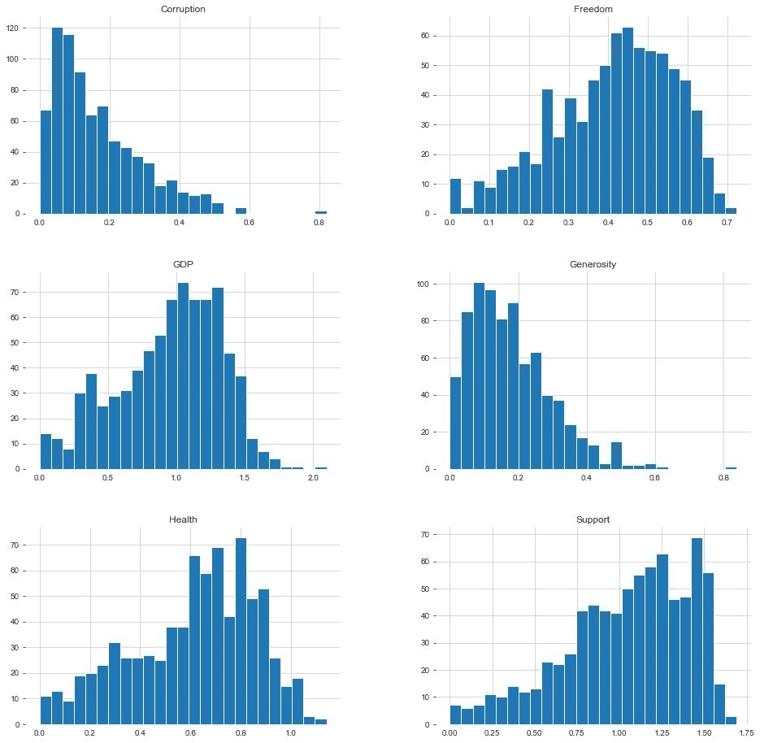

接下来，为了让我们更直观地了解每个国家在世界排名报告中的排名，我们使用深蓝色代表在报告中排名最高的国家(即“最幸福”)，而浅蓝色代表排名较低的国家。我们可以看到，欧洲和美洲地区的国家比亚洲和非洲地区的国家排名要高。

```
'''World Map
Happiness Rank Accross the World'''happiness_rank = dict(type = 'choropleth', 
           locations = finaldf['Country'],
           locationmode = 'country names',
           z = finaldf['Rank'], 
           text = finaldf['Country'],
           colorscale = 'Blues_',
           autocolorscale=False,
           reversescale=True,
           marker_line_color='darkgray',
           marker_line_width=0.5)
layout = dict(title = 'Happiness Rank Across the World', 
             geo = dict(showframe = False, 
                       projection = {'type': 'equirectangular'}))
world_map_1 = go.Figure(data = [happiness_rank], layout=layout)
iplot(world_map_1)
```

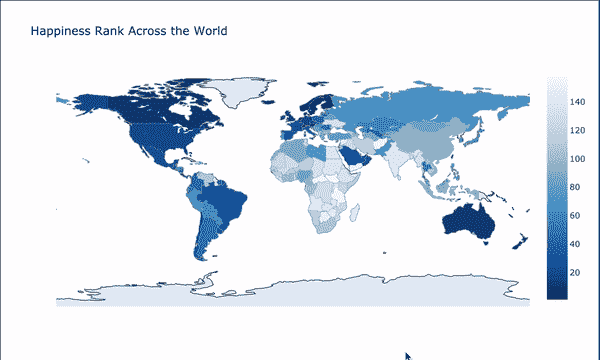

让我们来看看哪些国家在所分析的每个方面都有更好的定位。

```
fig, axes = plt.subplots(nrows=3, ncols=2,constrained_layout=True,figsize=(10,10))seabornInstance.barplot(x='GDP',y='Country',
                        data=finaldf.nlargest(10,'GDP'),
                        ax=axes[0,0],palette="Blues_r")
seabornInstance.barplot(x='Health' ,y='Country',
                        data=finaldf.nlargest(10,'Health'),
                        ax=axes[0,1],palette='Blues_r')
seabornInstance.barplot(x='Score' ,y='Country',
                        data=finaldf.nlargest(10,'Score'),
                        ax=axes[1,0],palette='Blues_r')
seabornInstance.barplot(x='Generosity' ,y='Country',
                        data=finaldf.nlargest(10,'Generosity'),
                        ax=axes[1,1],palette='Blues_r')
seabornInstance.barplot(x='Freedom' ,y='Country',
                        data=finaldf.nlargest(10,'Freedom'),
                        ax=axes[2,0],palette='Blues_r')
seabornInstance.barplot(x='Corruption' ,y='Country',
                        data=finaldf.nlargest(10,'Corruption'),
                        ax=axes[2,1],palette='Blues_r')
```

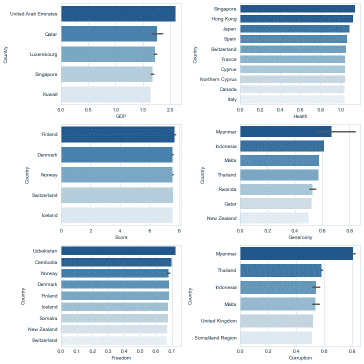

## 检验解释变量之间的相关性

```
mask = np.zeros_like(finaldf[usecols].corr(), dtype=np.bool) 
mask[np.triu_indices_from(mask)] = Truef, ax = plt.subplots(figsize=(16, 12))
plt.title('Pearson Correlation Matrix',fontsize=25)seabornInstance.heatmap(finaldf[usecols].corr(),
                        linewidths=0.25,vmax=0.7,square=True,cmap="Blues", 
            linecolor='w',annot=True,annot_kws={"size":8},mask=mask,cbar_kws={"shrink": .9});
```

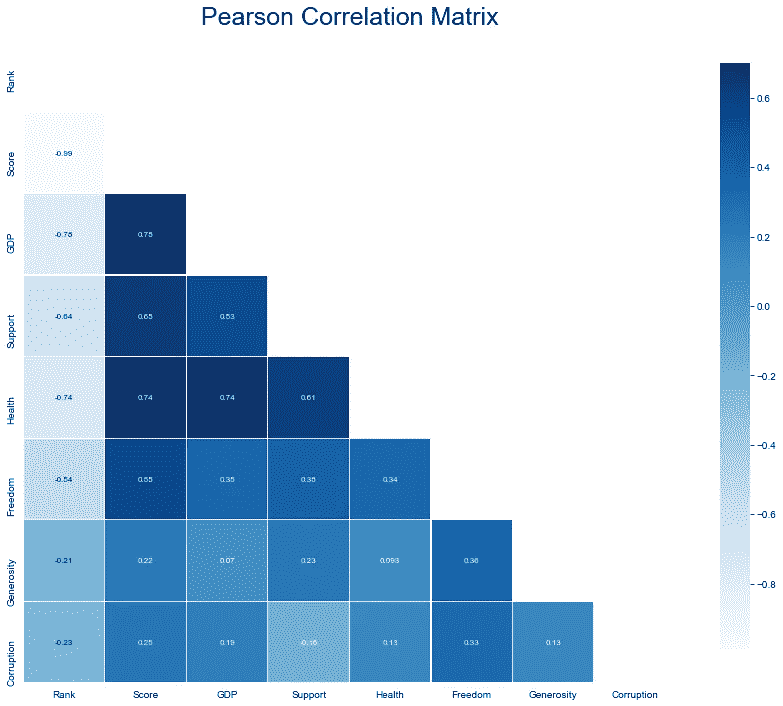

看起来`GDP`、`Health`和`Support`与幸福指数密切相关。`Freedom`与幸福指数有很好的相关性；然而，`Freedom`与所有数据连接得相当好。`Corruption`与幸福得分的相关性仍然一般。

## 超越简单的关联

在散点图中，我们可以看到`GDP`、`Health`和`Support`与某些噪声呈线性相关。我们发现`Corruption`的自相关在这里很迷人，这里一切都很可怕，但如果腐败程度很高，分布到处都是。它似乎只是一个阈值的负面指标。

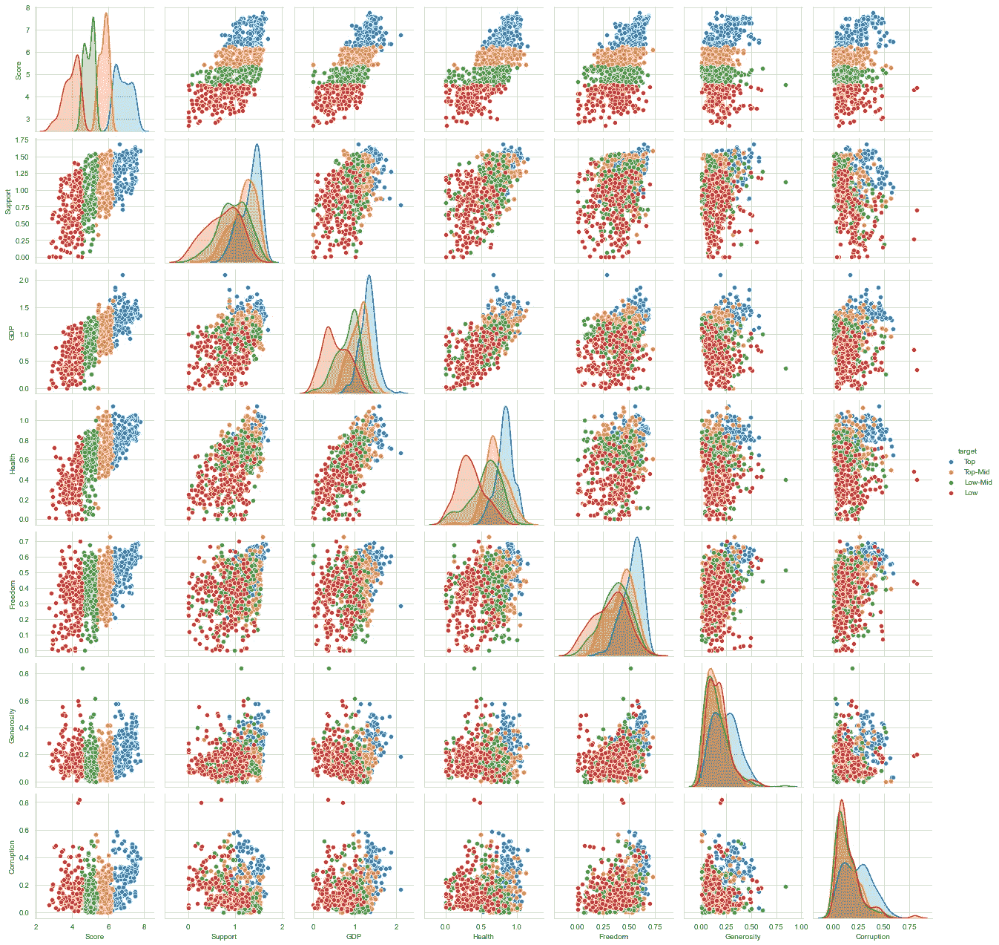

我发现了一个令人兴奋的由 Ian Ozsvald 设计的软件包。它训练随机森林来预测彼此的特征，超越了简单的相关性。

```
# visualize hidden relationships in data
classifier_overrides = set()
df_results = discover.discover(finaldf.drop(['target', 'target_n'],axis=1).sample(frac=1),
                               classifier_overrides)
```

我们在这里使用热图来可视化我们的要素是如何在空间上聚集或变化的。

```
fig, ax = plt.subplots(ncols=2,figsize=(24, 8))
seabornInstance.heatmap(df_results.pivot(index = 'target', 
                             columns = 'feature', 
                             values = 'score').fillna(1).loc[finaldf.drop(
                            ['target', 'target_n'],axis = 1).columns,finaldf.drop(
                            ['target', 'target_n'],axis = 1).columns],
                            annot=True, center = 0, ax = ax[0], vmin = -1, vmax = 1, cmap = "Blues")
seabornInstance.heatmap(df_results.pivot(index = 'target', 
                             columns = 'feature', 
                             values = 'score').fillna(1).loc[finaldf.drop(
                             ['target', 'target_n'],axis=1).columns,finaldf.drop(
                             ['target', 'target_n'],axis=1).columns],
                             annot=True, center=0, ax=ax[1], vmin=-0.25, vmax=1, cmap="Blues_r")
plt.plot()
```

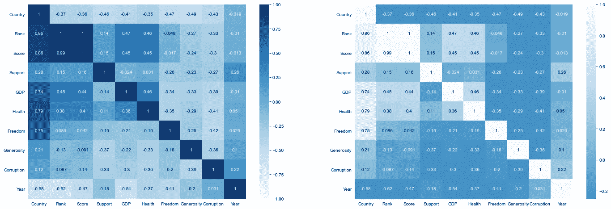

这变得更有趣了。腐败比支持更能预测幸福指数。可能是因为我们之前发现的“门槛”？

此外，虽然社会支持有很好的相关性，但它没有实质性的预测价值。我猜这是因为散点图中所有四分位数的分布都非常接近。

# 6.多元线性回归

在本文的“渴望”一节中，我们使用了一个简单的线性回归来检验幸福指数和其他特征之间的关系。我们发现不适合。为了改进这个模型，我们想增加更多的功能。现在，是时候创建一些复杂的模型了。

通过查看前面的部分，我们初步确定了特征，并在第一次多元线性回归中使用了它们。与简单回归一样，我们打印了模型用于预测的系数。然而，如果我们想手工计算，这次我们必须使用下面的预测定义。

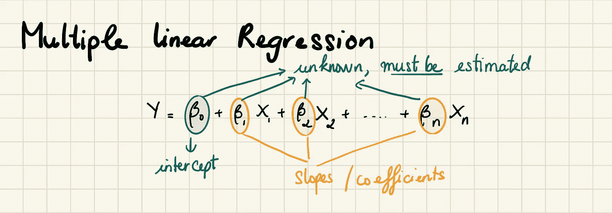

我们创建一个具有所有特征的模型。

```
# MULTIPLE LINEAR REGRESSION 1
train_data_dm,test_data_dm = train_test_split(finaldf,train_size = 0.8,random_state=3)independent_var = ['GDP','Health','Freedom','Support','Generosity','Corruption']
complex_model_1 = LinearRegression()
complex_model_1.fit(train_data_dm[independent_var],train_data_dm['Score'])print('Intercept: {}'.format(complex_model_1.intercept_))
print('Coefficients: {}'.format(complex_model_1.coef_))
print('Happiness score = ',np.round(complex_model_1.intercept_,4),
      '+',np.round(complex_model_1.coef_[0],4),'∗ Support',
      '+',np.round(complex_model_1.coef_[1],4),'* GDP', 
      '+',np.round(complex_model_1.coef_[2],4),'* Health',
      '+',np.round(complex_model_1.coef_[3],4),'* Freedom',
       '+',np.round(complex_model_1.coef_[4],4),'* Generosity',
      '+',np.round(complex_model_1.coef_[5],4),'* Corrption')pred = complex_model_1.predict(test_data_dm[independent_var])
rmsecm = float(format(np.sqrt(metrics.mean_squared_error(
                       test_data_dm['Score'],pred)),'.3f'))
rtrcm = float(format(complex_model_1.score(
                        train_data_dm[independent_var],
                        train_data_dm['Score']),'.3f'))
artrcm = float(format(adjustedR2(complex_model_1.score(
                            train_data_dm[independent_var],
                            train_data_dm['Score']),
                            train_data_dm.shape[0],
                            len(independent_var)),'.3f'))
rtecm = float(format(complex_model_1.score(
                        test_data_dm[independent_var],
                        test_data_dm['Score']),'.3f'))
artecm = float(format(adjustedR2(complex_model_1.score(
                        test_data_dm[independent_var],test_data['Score']),
                        test_data_dm.shape[0],
                        len(independent_var)),'.3f'))
cv = float(format(cross_val_score(complex_model_1,
                    finaldf[independent_var],
                    finaldf['Score'],cv=5).mean(),'.3f'))r = evaluation.shape[0]
evaluation.loc[r] = ['Multiple Linear Regression-1','selected features',rmsecm,rtrcm,artrcm,rtecm,artecm,cv]
evaluation.sort_values(by = '5-Fold Cross Validation', ascending=False)
```

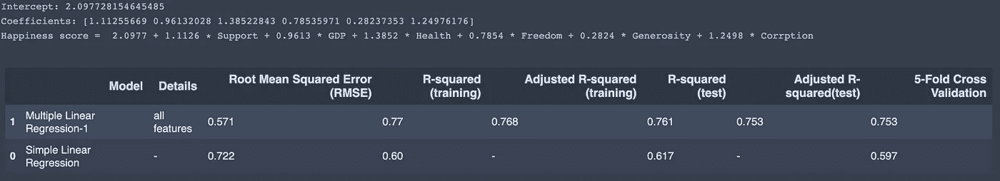

我们知道`GDP`、`Support`和`Health`是线性相关的。这一次，我们创建一个具有这三个特征的模型。

```
# MULTIPLE LINEAR REGRESSION 2
train_data_dm,test_data_dm = train_test_split(finaldf,train_size = 0.8,random_state=3)independent_var = ['GDP','Health','Support']
complex_model_2 = LinearRegression()
complex_model_2.fit(train_data_dm[independent_var],train_data_dm['Score'])print('Intercept: {}'.format(complex_model_2.intercept_))
print('Coefficients: {}'.format(complex_model_2.coef_))
print('Happiness score = ',np.round(complex_model_2.intercept_,4),
      '+',np.round(complex_model_2.coef_[0],4),'∗ Support',
      '+',np.round(complex_model_2.coef_[1],4),'* GDP', 
      '+',np.round(complex_model_2.coef_[2],4),'* Health')pred = complex_model_2.predict(test_data_dm[independent_var])
rmsecm = float(format(np.sqrt(metrics.mean_squared_error(
                       test_data_dm['Score'],pred)),'.3f'))
rtrcm = float(format(complex_model_2.score(
                        train_data_dm[independent_var],
                        train_data_dm['Score']),'.3f'))
artrcm = float(format(adjustedR2(complex_model_2.score(
                            train_data_dm[independent_var],
                            train_data_dm['Score']),
                            train_data_dm.shape[0],
                            len(independent_var)),'.3f'))
rtecm = float(format(complex_model_2.score(
                        test_data_dm[independent_var],
                        test_data_dm['Score']),'.3f'))
artecm = float(format(adjustedR2(complex_model_2.score(
                        test_data_dm[independent_var],test_data['Score']),
                        test_data_dm.shape[0],
                        len(independent_var)),'.3f'))
cv = float(format(cross_val_score(complex_model_2,
                    finaldf[independent_var],
                    finaldf['Score'],cv=5).mean(),'.3f'))r = evaluation.shape[0]
evaluation.loc[r] = ['Multiple Linear Regression-2','selected features',rmsecm,rtrcm,artrcm,rtecm,artecm,cv]
evaluation.sort_values(by = '5-Fold Cross Validation', ascending=False)
```

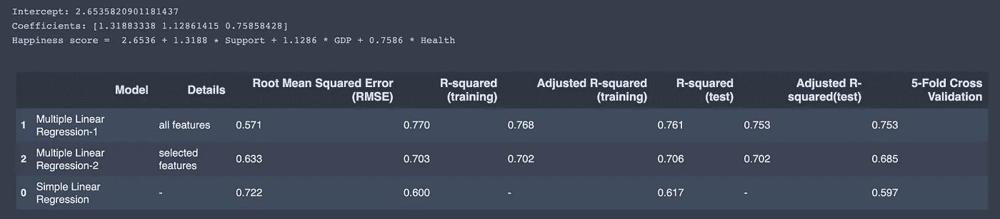

当我们看评估表时，多元线性回归-2(选定特征)是最好的。但是，我怀疑它的可靠性，我更喜欢所有元素的多元线性回归。

```
X = finaldf[[ 'GDP', 'Health', 'Support','Freedom','Generosity','Corruption']]
y = finaldf['Score']'''
 This function takes the features as input and
 returns the normalized values, the mean, as well 
 as the standard deviation for each feature. 
 '''
def featureNormalize(X):
    mu = np.mean(X) ## Define the mean
    sigma = np.std(X) ## Define the standard deviation.
    X_norm = (X - mu)/sigma ## Scaling function.
    return X_norm, mu, sigmam = len(y) ## length of the training data
X = np.hstack((np.ones([m,1]), X)) ## Append the bias term (field containing all ones) to X.
y = np.array(y).reshape(-1,1) ## reshape y to mx1 array
theta = np.zeros([7,1]) ## Initialize theta (the coefficient) to a 3x1 zero vector.''' 
 This function takes in the values for 
 the training set as well as initial values 
 of theta and returns the cost(J).
 '''def cost_function(X,y, theta):
    h = X.dot(theta) ## The hypothesis
    J = 1/(2*m)*(np.sum((h-y)**2)) ## Implementing the cost function
    return J'''
    This function takes in the values of the set, 
    as well the intial theta values(coefficients), the 
    learning rate, and the number of iterations. The output 
    will be the a new set of coefficeients(theta), optimized 
    for making predictions, as well as the array of the cost 
    as it depreciates on each iteration.
    '''num_iters = 2000 ## Initialize the iteration parameter.
alpha = 0.01 ## Initialize the learning rate.
def gradientDescentMulti(X, y, theta, alpha, iterations):
    m = len(y)
    J_history = []
    for _ in range(iterations):
        temp = np.dot(X, theta) - y
        temp = np.dot(X.T, temp)
        theta = theta - (alpha/m) * temp
        J_history.append(cost_function(X, y, theta)) ## Append the cost to the J_history array
    return theta, J_historyprint('Happiness score = ',np.round(theta[0],4),
        '+',np.round(theta[1],4),'∗ Support',
      '+',np.round(theta[2],4),'* GDP', 
      '+',np.round(theta[3],4),'* Health',
      '+',np.round(theta[4],4),'* Freedom',
       '+',np.round(theta[5],4),'* Generosity',
      '+',np.round(theta[6],4),'* Corrption')
```


打印出 J _ history 大约是 0.147。我们可以得出结论，使用梯度下降给了我们一个预测幸福分数的最佳模型。

我们也可以用`statsmodels`来预测幸福得分。

```
# MULTIPLE LR
import statsmodels.api as smX_sm = X = sm.add_constant(X)
model = sm.OLS(y,X_sm)
model.fit().summary()
```

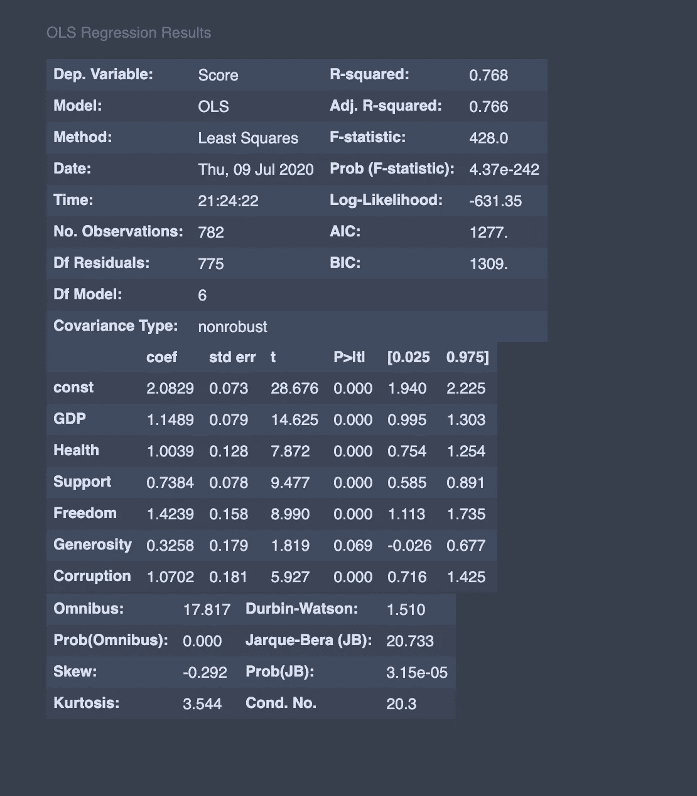

我们的系数非常接近我们在这里得到的。

这篇笔记中的代码可以在 [Github](https://github.com/Nothingaholic/The-World-of-Happiness) 上找到。

# 7.结论

似乎对“世界幸福报告”的普遍批评是很有道理的。高度关注国内生产总值和密切相关的特征，如家庭和预期寿命。

高 GDP 让你幸福吗？最终，我们就是我们。我用我的七月来分析为什么人们不满足或者没有过上充实的生活。我关心的是“为什么”在分析完数据之后，就提出了一个问题:如何才能追逐幸福？


来源:[迷因](https://sayingimages.com/happy-memes/)

就在几个月前，自从锁定以来，我做了一切去追逐幸福。

*   我把自己定义为极简主义者。但是我开始购买很多东西，我认为这让我很开心。
*   我在社交媒体上花了很多时间，与他人保持联系，我希望这能让我开心。
*   我开始在媒介上写作；我找到了与我的技能和兴趣相匹配的志愿者工作，我相信金钱和工作让我快乐。
*   我试着吃素，我希望这能让我开心。

一天结束的时候，我独自躺在床上，想着，“幸福可以实现吗？这种对幸福无止境的追求下一步是什么？”

嗯，我意识到我在追逐一些我自己认为能让我快乐的东西。

在写这篇文章的时候，我看到了拉尔夫·沃尔多·爱默生的一句名言:

> “生活的目的不是快乐。它是有用的，是可敬的，是富有同情心的，是让你活着并过得好的一些不同之处。”

圆点终于连上了。幸福本身不能成为目标。它仅仅是有用的副产品。

让我开心的是我有用的时候。好吧，但是怎么做？有一天我醒来，心想:“我在为这个世界做什么？”答案是什么都没有。同一天，我开始在媒体上写作。我把我的学校笔记变成了文章，希望人们在阅读后能学到一两件事。对你来说，它可以是任何事情，比如绘画，创造一个产品，支持你的家人和朋友，任何你想做的事情。请不要太认真。还有最重要的，不要想多了。做点有用的事就好。任何事。

保持安全和健康！

**资源:**

1.  【2020 年世界幸福报告。
2.  [Kaggle 世界幸福报告](https://www.kaggle.com/unsdsn/world-happiness)。
3.  [2020 年世界幸福国家](https://www.gfmag.com/global-data/non-economic-data/happiest-countries)。
4.  [设计一个幸福预测模型](https://www.trackinghappiness.com/engineering-happiness-prediction-model/)。