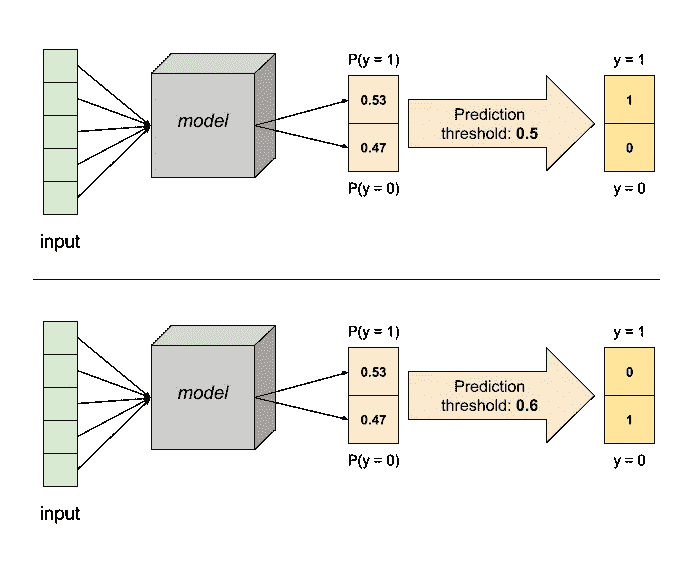
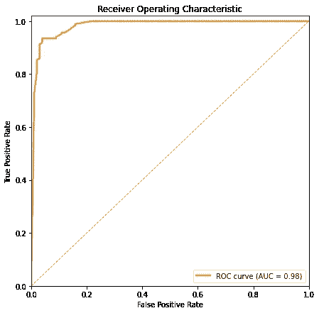
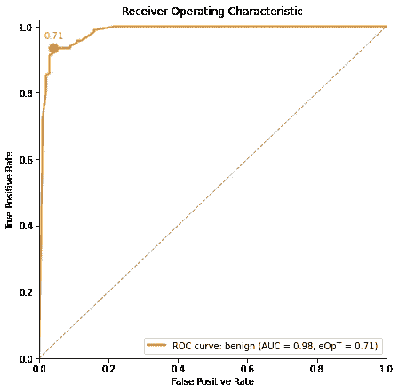
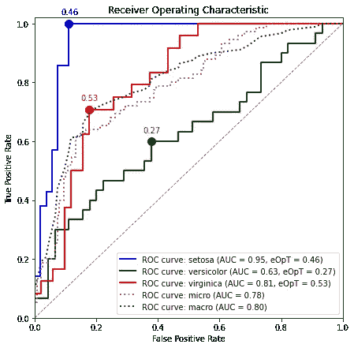

# 硬 ROC:真正理解并正确使用 ROC 和 AUC

> 原文：<https://towardsdatascience.com/hard-roc-really-understanding-and-properly-using-roc-and-auc-13413cf0dc24?source=collection_archive---------39----------------------->

## 学习如何使用 ROC 曲线和 AUC 分数，而不仅仅是说*“我认为这个模型表现很好”*

*本帖中使用的 ROC 图生成代码是* `[dython](http://shakedzy.xyz/dython/)` *库的一部分，可以在我的* [*GitHub 页面*](https://github.com/shakedzy/dython) *找到。本帖中看到的例子也可以作为* [*笔记本*](https://github.com/shakedzy/notebooks/tree/master/roc_graph) *。*

**使用此** [**好友链接**](/hard-roc-really-understanding-and-properly-using-roc-and-auc-13413cf0dc24?sk=b78eb82584fc370c01a3033fe4f99f69) 即使不是中等会员也能阅读此博文


使劲摇(原始图片由 [Nadine_Em](https://pixabay.com/users/Nadine_Em-2242979/?utm_source=link-attribution&utm_medium=referral&utm_campaign=image&utm_content=2708190) 来自 [Pixabay](https://pixabay.com/?utm_source=link-attribution&utm_medium=referral&utm_campaign=image&utm_content=2708190) )

评估任何机器学习模型的预测可能是数据科学家最重要的任务，甚至可能比实际开发模型更重要。毕竟，虽然构建超级复杂的算法是最酷的事情，但不知道如何正确估计它们的输出是*而不是*最酷的事情。

有几种算法和工具致力于让我们更清楚地了解模型如何使用我们提供的输入(如莱姆和 SHAP)，但我们很少讨论如何分析模型的*输出*——这正是我们今天要做的。

我们都熟悉这样一个事实，即我们在输入数据中引入了偏差，但当涉及到分类问题时，我们也会不知不觉地在输出中引入偏差。这是因为模型从来没有真正选择一个类别——它们只输出对每个类别的概率评估。然后，我们通过选择具有最高概率的一个，基于这些概率选择一个类。

虽然这很有道理，但多思考一下就会产生一个问题— *如果预测概率是有噪声的呢？嗯，事实上它们是很合理的——这意味着我们可能想要调整概率阈值，从这个阈值我们将一个类别分配给一个样本。*

让我们看一个例子:考虑一个二元分类问题，其中某个样本属于目标类的预测概率是 0.53。天真地，我们将决定将此解释为*样本属于目标类*并输出 *y = 1* 。但是，如果我们怀疑预测有噪声，0.53 可能和 0.48 一样好，我们可能会决定提高阈值，只向预测概率为 0.6 或更高的样本输出 *y = 1* 。在这种情况下，我们的样本将被赋值为 *y = 0* ，这完全改变了我们的整体预测。



这意味着完全相同的模型的结果可以用各种不同的方式来解释——如何解释完全取决于我们。这意味着，为了真正理解一个模型的表现，我们必须去掉我们解释输出的这个额外的层。这样做的一个非常方便的算法被称为接收机工作特性曲线，或 ROC 曲线。

ROC 曲线已经在各个领域使用了多年，1989 年 Kent Spackman 已经表明机器学习也可以从中受益。

# 了解 roc

ROC 图描绘了对于任何可能的阈值，给定类别的真阳性结果和假阳性结果之间的权衡。让我们看一个例子，以便更好地理解它:



我在乳腺癌数据集上训练的随机森林分类器的 ROC 图，其中目标类是 0 =恶性或 1 = *良性。参见* [*这里的*](https://github.com/shakedzy/notebooks/tree/master/roc_graph) *。*

y 轴显示真阳性率(TPR)，即真阳性(模型正确预测的阳性样本)数除以总阳性数 *(TP/P)* 。x 轴显示假阳性率(FPR) —假阳性除以总阴性数 *(FP/N)* 。两者都是针对 *y = 1* 的情况计算的，因为 *y = 0* 类的行为是相同的。

图上的每个点代表一个可能的阈值，以及紧随其后的相关 TPR 和 FPR。当考虑预测概率时，阈值可以在[0，1]之间变化。当阈值最大时，即 1，我们将所有样本标记为阴性。这意味着没有真阳性和假阳性，这由曲线的起点(0，0)表示。当阈值最小时，即 0，所有样本都被标记为阳性。这意味着所有阳性样本确实被标记为阳性，但所有阴性样本也被错误地标记为阳性。这与图形末端的点(1，1)相匹配。所有 ROC 曲线都从(0，0)开始，到(1，1)结束。理想模型也将经过(0，1) —这意味着存在某个阈值，其中所有阳性都被标记为阳性，但没有任何阴性被错误标记。在这种情况下，使用匹配(0，1)的阈值将产生完美的预测。

但不幸的是，模型往往不是理想的——所以我们想衡量一下*与理想模型的接近程度。如前所述，两个轴都在[0，1]范围内，所有曲线都从(0，0)开始，到(1，1)结束。这意味着我们可以简单地测量曲线下的面积 AUC。最优模型将有 *AUC = 1* 。*

我们可以从 ROC 图中了解关于我们模型的更多见解。注意从(0，0)到(1，1)的虚线，它代表 *TPR = FPR* 。这条线上的任何一点都意味着样本有 50%的机会被正确分类为阳性，也有 50%的机会被错误分类为阳性。这条线代表随机预测，匹配 *AUC = 0.5* 。曲线接近该线的模型表现明显不佳，没有阈值选择将改善这种情况。

如果你的模型曲线低于虚线，AUC 为*0.5*怎么办？嗯，这意味着出于某种原因，你的模型替代了你的类——预测正面而不是负面，反之亦然。如果发生这种情况，请仔细检查自己。

# 使用 ROC 曲线改进您的模型

到目前为止，我们已经讨论了从 ROC 图中可以了解到我们的模型*可能的*性能，但是我们真正关心的是*如何使用 ROC 图改进我们的模型？*

为了提高我们的准确性，我们可以使用 ROC 曲线来尝试并找到一个估计的最佳阈值(eOpT)。我最喜欢的方法是找出曲线上哪个点最接近理想点(0，1)，并使用其对应的阈值。



我在乳腺癌数据集上训练的随机森林分类器的 ROC 图，其中目标类是 0 =恶性或 1 = *良性。曲线上标出了估计的最佳阈值 0.71。参见* [*这里的*](https://github.com/shakedzy/notebooks/tree/master/roc_graph) *。*

在上面显示的示例中，通过简单地将预测阈值调整为 0.71 而不是默认的 0.5，模型的准确性提高了 1%。[自己看](https://github.com/shakedzy/notebooks/tree/master/roc_graph)。很简单，不是吗？

# 多类分类的 ROC 曲线

到目前为止，我们只讨论了二元分类，其中只存在一个类(或者两个，但这是一回事)。当我们面对一个多类分类问题时会发生什么？

当面对许多类别时，我们以一对一的方式单独计算每个类别的 ROC 曲线:所有其他类别都被认为是负面例子，只有被检查的类别被认为是正面的。这产生了每个类别的不同 ROC 曲线。此外，计算整个分类器的微观和宏观 ROC 曲线很有用，只是为了看看它的整体性能(*不确定什么是微观和宏观平均值？下面是 StackExchange 的数据科学论坛*上的 [*精彩解说*](https://datascience.stackexchange.com/a/24051/43870) *。*

让我们看看这是什么样子:



在 Iris 数据集上训练的 SVM 分类器的 ROC 图，其中存在三个不同的类别*。显示了每个类别的估计最佳阈值。参见* [*这里的*](https://github.com/shakedzy/notebooks/tree/master/roc_graph) *。*

在这种情况下，调整阈值变得有点棘手。我是这样处理的:

```
if prediction_probability[2] >= 0.53: predicted_class = 2
elif prediction_probability[0] >= 0.46: predicted_class = 0
elif prediction_probability[1] >= 0.27: predicted_class = 1
else: predicted_class = prediction_probability.argmax() # fallback
```

这变得很棘手，因为一些示例可能无法通过这些阈值中的任何一个(例如:*【0.34，0.16，0.50】*，这就是为什么需要选择最高阈值的原因)，而一些示例可能会通过多个阈值(例如:*【0.49，0.50，0.01】*，这意味着 *if/else* 顺序很重要)。但是一旦你做对了，准确度就提高了——我的 SVM 分类器的准确度在以这种方式重新调整阈值后提高了 2.2%。

# 最后的话

在这篇文章中，我们讨论了从*输出*端引入到分类模型中的偏差，通过天真地将预测解释为标签，而没有考虑它们可能的噪声。我们已经看到 ROC 曲线如何让我们更好地估计我们的模型，去除我们添加的额外偏差，以及我们如何修正该偏差以更好地拟合模型。

如果你想拓宽你对 ROC 曲线的知识和理解，我强烈推荐阅读汤姆·福塞特的论文[*ROC 分析简介。我只能希望这个新工具能让你的模型表现得更好——并且你喜欢这篇文章。注意安全，用力摇！*](https://people.inf.elte.hu/kiss/11dwhdm/roc.pdf)