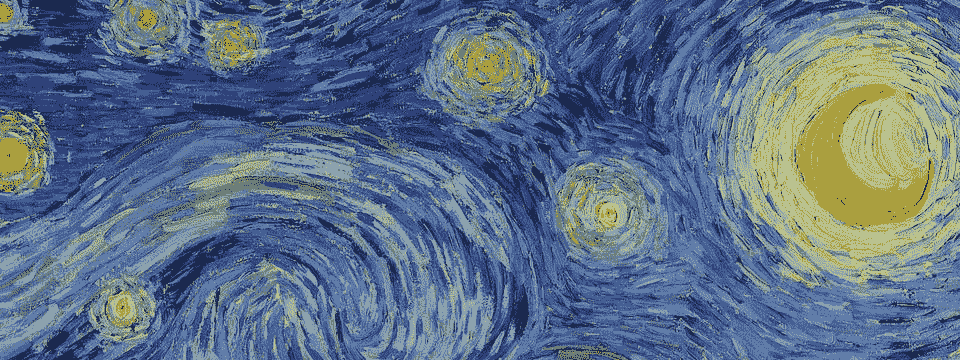

# 直观解释硬统计和数据科学概念

> 原文：<https://towardsdatascience.com/hard-statistics-and-data-science-concepts-visually-explained-de7325c2e9ef?source=collection_archive---------17----------------------->

## 我收集的最佳视觉学习工具。

来源:星夜——梵高

作为一名视觉学习者，我经常发现，如果不在脑海中想象一些复杂的概念可能是什么样子，就很难消化这些概念。研究表明，65%的人是视觉学习者，这意味着视觉学习比其他方式更快更有效。这也解释了为什么我们会在独白课上很快入睡，而在浏览 Instagram 时却保持清醒！

那我们为什么不试着把更多的视觉元素带进我们学习统计、数学和数据科学的方式中呢？我真的相信，我们都可以从它带来的新直觉和新观点中受益，这也更容易和更长久地留在我们的记忆中。

在这篇文章中，我想和你分享我收集的一些有用的资源，这些资源可以帮助你。

****更新 2021:你也可以在我的 Youtube 频道观看下面这篇整篇文章的视频版本📹。***

# 1.直观解释——Setosa 项目

[直观地解释](http://setosa.io/ev/)是一个旨在使难以理解的想法变得直观的项目。你可以在这里找到各种数学和统计概念的直观解释:从普通最小二乘回归到特征向量，到主成分分析和马尔可夫链。最棒的是，你可以直接与可视化互动，改变参数来检查发生了什么。我是一个从来没有真正理解特征向量的人，直到我看了这个网站的解释！

来源:[http://setosa.io/ev/](http://setosa.io/ev/)

# 2.沉浸式数学

[沉浸式数学](http://immersivemath.com/ila/)是一本非常棒的关于线性代数的互动书籍。据说这是世界上第一本完全交互式图形的线性代数书。这本书包括 10 章，解释线性代数的所有基础(向量，矩阵，线性映射，特征向量和特征值等。).你可以在网上阅读这本书。请注意，你应该在浏览器上阅读，而不是在手机上，因为有些插图可能会呈现得有点慢。

# 3.3 蓝色 1 棕色频道

3Blue1Brown 是格兰特·桑德森(Grant Sanderson)创建的一个 Youtube 频道(老实说，这个频道的名字太拗口了，我一直记不住)。我认为这个频道非常有名，有 200 多万订户。你可以找到非常有用的视频和动画来解释各种各样的数学和统计主题。当我试图找到一种方法向我的同事解释 DNN 反向传播算法时，我找到了他的频道。他关于这个主题的视频也非常有帮助。

# 4.决策树直观解释

我遇到了这个伟大的 [d3 可视化](http://www.r2d3.us/visual-intro-to-machine-learning-part-1/)解释决策树如何使用[滚动告诉](https://webflow.com/blog/scrollytelling-guide)工作。这是我第一次看到试图用讲故事来教授机器学习的可视化。而且看起来酷毙了！该网站还有另一个解释[模型调整和偏差-方差](http://www.r2d3.us/visual-intro-to-machine-learning-part-2/)权衡的帖子，这是每个有抱负的数据科学家都应该知道的另一个基本概念。

来源:[http://www.r2d3.us/visual-intro-to-machine-learning-part-1/](http://www.r2d3.us/visual-intro-to-machine-learning-part-1/)

# 5.如何有效地使用 t-SNE

t-SNE(**t**-分布式随机邻居嵌入)是一种非线性降维技术，特别适合于高维数据集的可视化，因为它可以将数据维数降低到基本上 2 或 3 维。[这个视频](https://distill.pub/2016/misread-tsne/)是[distilt](https://distill.pub/)网站上的一个帖子，对于任何想要更深入地了解机器学习算法背后的直觉的人来说，这是另一个有用的来源。

该可视化显示了 t-SNE 算法对于数据中不同类型的模式的工作效率:

来源:[https://distill.pub/2016/misread-tsne/](https://distill.pub/2016/misread-tsne/)

# 6.可视化算法

Mike Bostock 有一个[好玩的网站](https://bost.ocks.org/mike/algorithms/)，用于可视化各种计算机科学基础算法(采样、洗牌、排序等。).对我来说，看到这些画面非常鼓舞人心。即使是那些你可能认为理所当然的事情，你仍然可以通过从不同的角度来看待它们，从而学到一些新的东西。

# 7.视觉理论

[视觉理论](https://seeing-theory.brown.edu/)是另一个关于概率和统计的交互式视觉介绍，由丹尼尔·库宁在布朗大学读本科时创建。它目前包括六章:基本概率，复合概率，概率分布，频率干扰，贝叶斯干扰和回归分析。每章包含互动练习，以帮助形象化和理解信息。

谢谢你看我的帖子。我希望你能找到新的有用的东西。如果知道类似来源，请评论分享！享受学习:)