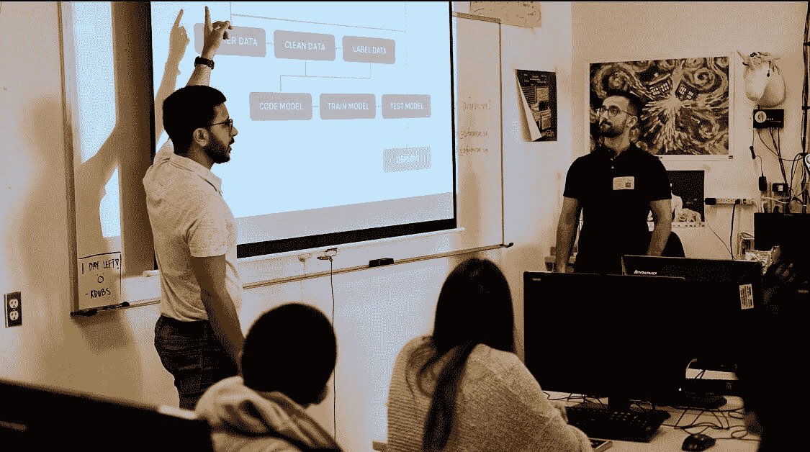
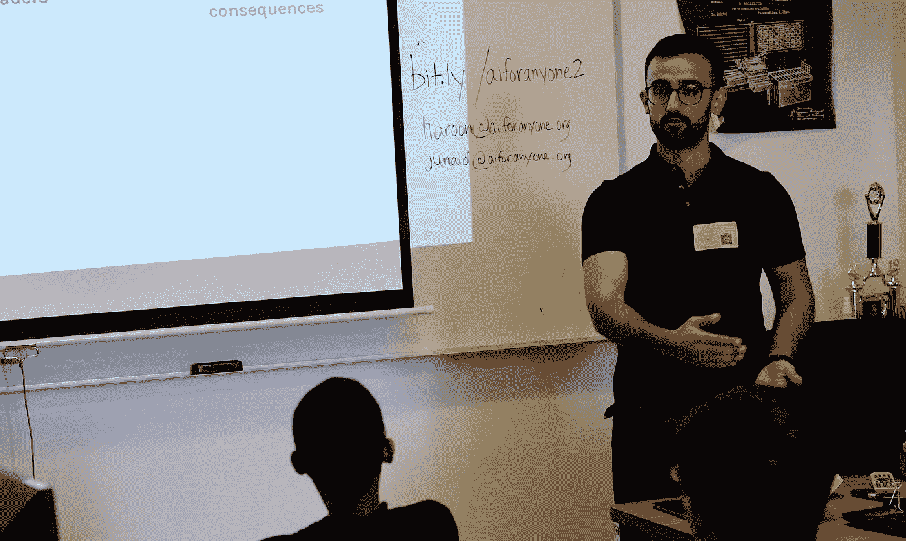
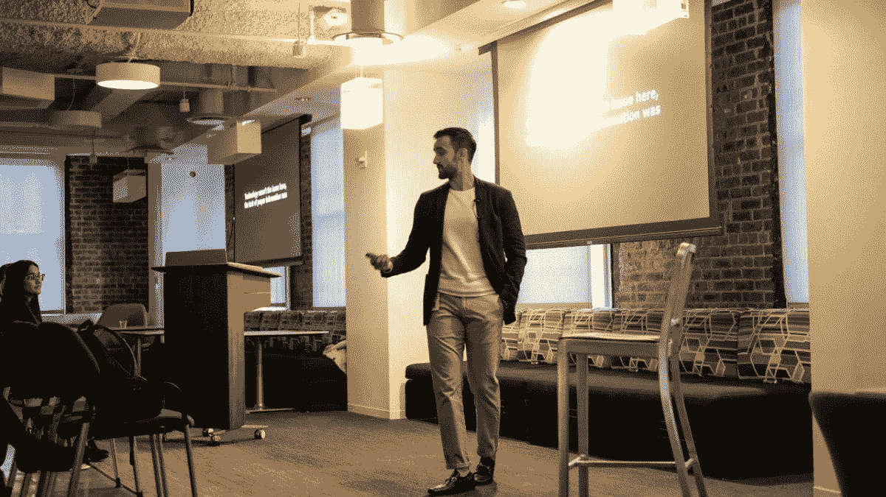
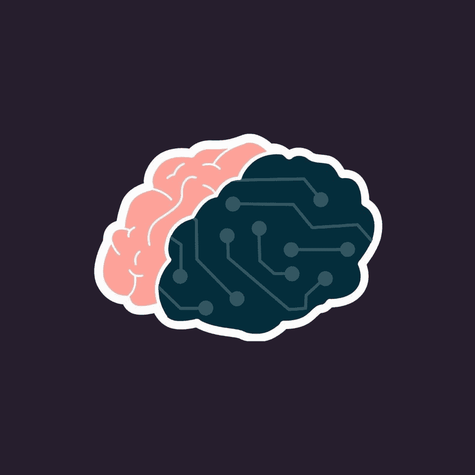

# 哈龙·乔德里:民主化人工智能扫盲

> 原文：<https://towardsdatascience.com/haroon-choudery-democratizing-a-i-literacy-f81b7a624191?source=collection_archive---------92----------------------->

## 技术创新系列

## *为任何人采访人工智能的联合创始人*

人工智能领域的创新已经彻底改变了多个行业的工作。CNN 的一篇[文章称，人工智能的成长创造了历史上最大的“人机协作”。这些新技术的创造和先前发现的新应用已经开始在各行各业创造“利基工作”。随着美国约 16%的工作处于自动化边缘，以及 2025 年人工智能市场蓬勃发展的 900 亿美元规模估计，人工智能显然是未来的发展方向。](https://www.cnn.com/2019/05/30/perspectives/ai-business-jobs/index.html)

图片由哈龙·乔德里提供

然而，伴随这些创新而来的是跟上当今急剧变化的技术格局的压力。在企业和个人层面，个人都需要采取必要的步骤来利用和最大限度地发挥人工智能的潜力。特别是在新兴国家和边缘化社区，工作替代和收入差距扩大等[社会后果的风险更加突出，跟上技术进步和掌握数据对于防止个人落后至关重要。](https://aiforanyone.org/about-us/)

哈龙和他的团队为任何人创造了一种人工智能，让个人拥有知识和技能，以适应这个不断变化的世界。相信一个对人工智能有更好理解的社会将更有能力设计一个“所有人公平繁荣的未来”，人工智能为任何人创造了大量的资源，旨在提高个人对人工智能的总体理解，并学习必要的技能，以便在人工智能的未来发挥更积极的作用。

图片由哈龙·乔德里提供

Amber: 你能告诉我们一些你的背景吗？
**哈龙:**我目前是人工智能公司的联合创始人&执行董事，也是科莫多健康公司的数据科学家。此前，我曾在包括脸书、马克·库班公司和德勤在内的机构担任过各种角色。

我也是一名自豪的移民和第一代大学毕业生，拥有宾夕法尼亚州立大学经济学学士学位和加州大学伯克利分校信息和数据科学硕士学位。

你一直都知道在科技行业工作是你想做的吗？是什么激励你从事人工智能职业，并为任何人开创人工智能？
**H:** 我从小就一直对科技感兴趣。虽然我的家庭在我童年的大部分时间里没有电脑，但我总是想办法接触技术，无论是走到 J 大道上的布鲁克林图书馆玩电脑游戏，还是在高中时在易贝玩手机，以便购买最新最棒的智能手机。我在大学第一年就开始编写代码——不是因为我的课程要求我这么做——而是因为我很想知道如何为小企业建立和销售网站。

> “现在，我们有机会防止数百万人经历同样的命运。我们不会让学生和员工被技术的快速变化弄得措手不及，而是让他们能够积极主动，在感觉不到被倾听时大胆直言。”哈龙·乔德里

我对人工智能的兴趣是在大学期间发展起来的，主要是通过流行文化对该技术的引用而激发的，包括像《终结者》和《前任玛奇纳》这样的电影。随着我对当今人工智能的现状以及围绕其潜在未来后果的各种理论了解得越来越多，我对涉足该领域变得越来越感兴趣。

在加州大学伯克利分校的研究生学习期间，我在那里学习数据科学和机器学习，我越来越意识到人工智能即将产生的社会影响，以及我们社会的大多数成员，特别是那些在服务水平低下的社区的成员，面对这种影响时是如何毫无准备。具有讽刺意味的是，服务水平低下的社区无法获得比更有特权的社区更多的人工智能教育资源，但却最容易受到自动化的负面影响，包括失业。作为一名移民，他的父亲从事过各种劳动工作——出租车司机、拖车司机和家禽饲养者——作为一名科技工作者，我有机会看到围栏的两面，并发现双方之间的差异令人深感不安。

2017 年，我为任何人创立了人工智能，以帮助白领社区和服务不足的社区之间建立知识桥梁，了解他们对人工智能的理解。

你为什么认为让更广泛的公众了解人工智能很重要？简单地说，越多的人理解人工智能的基本原理，我们在塑造技术轨迹的讨论中就会听到越多的声音。重要的是，我们听到的声音来自各行各业，以便我们的集体声音尽可能具有包容性。

图片由哈龙·乔德里提供

**A:** 你为任何人创办 A.I .时面临的最大挑战是什么，你是如何克服的？ **H:** 对我们来说，最大的挑战是(坦率地说，仍然是)说服那些为大部分得不到充分服务的学生提供服务的学校了解对人工智能教育的迫切需求。这些学校有一系列独特的挑战，很难偏离他们既定的课程。

根据我们对人工智能的观察，对于任何人来说，阻止这些学校教授人工智能的两个最大障碍是 1)时间和 2)人工智能知识。我们减少这些限制的方法是尽可能容易地让非技术人员在短时间内教授人工智能的基础知识。在运营的头几年，这意味着在不到一个小时的时间里开发一个涵盖人工智能基础知识的 AI 101 演示，并免费前往学校举办研讨会。

> “我们的目标是确保每个人都对人工智能和自动化技术有一个基本的了解，在这个任务完成之前，我们不会放慢脚步。”哈龙·乔德里

现在，我们的重点是通过我们的[向任何人教授人工智能工具包](http://aiforanyone.org/teachai)来扩展我们的人工智能 101 演示的交付，该工具包旨在使教育工作者能够在不到一个小时的时间内向其他人教授我们的人工智能 101 演示——不需要事先了解人工智能。除了这种“横向方法”，我们还采取了一种“纵向方法”，即在我们的 AI 101 基础上创建研讨会，例如特定行业的研讨会。

图片由哈龙·乔德里提供

任何人的人工智能旨在“为个人提供知识和技能，以跟上这个不断变化的世界”。任何人的人工智能如何实现这一使命，与 2017 年你首次成立该组织时相比，你实现这一目标的方法有什么变化？**人工智能经常被认为是一个模糊的话题，我们努力改变这种情况，让更多的人感到有权表达他们的想法和意见，以帮助塑造技术的未来。**

我们已经创建了几个渠道，通过这些渠道，我们的观众可以接触到人工智能的世界，包括我们的入门研讨会、我们的[双周简讯](http://aiforanyone.org/newsletter)、我们的播客以及其他等等。

图片由哈龙·乔德里提供

**答:**对于其他有志于发展职业生涯并在行业中产生积极社会影响的数据科学家，你有什么建议？
**H:** 我给数据科学家(以及一般的科技工作者)的最大建议是，尽你所能意识到你的工作对代表性不足的社区的影响。作为技术人员，你比普通人更有权力和特权去影响变化。如果你有能力的话，你可以也应该放大那些被忽视的人的声音。

我们的读者怎样才能和人工智能扯上关系呢？你可以申请成为人工智能的志愿者

*   **志愿者**:[aiforanyone.org/volunteer](http://aiforanyone.org/volunteer)
*   **捐赠**:[aiforanyone.org/donate](http://aiforanyone.org/donate)
*   **关注我们** : [推特](http://twitter.com/aiforanyone) / [Instagram](http://instagram.com/aiforanyone) / [脸书](http://facebook.com/aiforanyone) / [LinkedIn](http://www.linkedin.com/company/13060281)

通过面对面的人工智能基础研讨会接触到 1，500 名学生，超过 50，000 名与会者参加了他们的虚拟研讨会，A.I. For Anyone 正在引领人工智能扫盲的民主化。人工智能不仅仅是人工智能教育的可靠来源，它还为任何人铺平了在技术时代走向更公平、更无障碍的世界的道路。

[1]来自 A.I. For Anyone 网站的数字和统计数据[https://aiforanyone.org/](https://aiforanyone.org/)
【2】[https://aiforanyone.org/about-us/](https://aiforanyone.org/about-us/)
【3】[https://www . LinkedIn . com/pulse/dire-need-ai-education-haroon-choudery/](https://www.linkedin.com/pulse/dire-need-ai-education-haroon-choudery/)

特别感谢 Haroon Choudery 让我在这个系列中采访他，也非常感谢 TDS 编辑团队对这个项目的支持。

你认识一位鼓舞人心的技术专家，你希望他出现在这个系列中吗？你是否正在从事任何你希望我写的很酷的数据科学和技术项目？欢迎给我发电子邮件，向 angelamarieteng@gmail.com 寻求意见和建议。感谢阅读！

## **参考文献:**

“(9)对人工智能教育的迫切需求| LinkedIn。”n.d .于 2020 年 6 月 13 日进入。[https://www . LinkedIn . com/pulse/dire-need-ai-education-haroon-choudery/。](https://www.linkedin.com/pulse/dire-need-ai-education-haroon-choudery/.)

"草根人工智能非营利组织在疫情向 30，000 名观众提供虚拟工作室|新闻专线."n.d .于 2020 年 6 月 13 日进入。[https://www . news wire . com/news/草根-ai-非营利-delives-virtual-workshop-to-30000-viewers-21135771？_ ga = 2.40633573.676169680.1588000445-525467245.1587748007&_ GAC = 1.19205772.1588000451 . eaiaikobchmivpkr 0 fki 6 qivxtsch0 q 5 alaeaayasaaegj 93 VD _ BwE。](https://www.newswire.com/news/grassroots-ai-nonprofit-delivers-virtual-workshop-to-30-000-viewers-21135771?_ga=2.40633573.676169680.1588000445-525467245.1587748007&_gac=1.19205772.1588000451.EAIaIQobChMIvPKR0fKI6QIVxtSzCh0Q5AlaEAAYASAAEgJ93vD_BwE.)

"认识一下人工智能公司的联合创始人哈龙·乔德利吧."n.d .于 2020 年 6 月 13 日进入。[https://medium . com/@ haroonchoudery/get-to-know haroon-choudery-a-I-for-any one 联合创始人-abb6bb9ff4df。](https://medium.com/@haroonchoudery/get-to-know-haroon-choudery-co-founder-of-a-i-for-anyone-abb6bb9ff4df.)

“家——任何人的人工智能。”n.d .于 2020 年 6 月 13 日进入。[https://aiforanyone.org/.](https://aiforanyone.org/.)

“关于我们——任何人的人工智能。”n.d .于 2020 年 6 月 13 日进入。[https://aiforanyone.org/about-us/.](https://aiforanyone.org/about-us/.)

“人工智能革命来了。让员工为此做好准备是企业的责任——CNNn.d .于 2020 年 6 月 13 日进入。[https://www . CNN . com/2019/05/30/perspectives/ai-business-jobs/index . html](https://www.cnn.com/2019/05/30/perspectives/ai-business-jobs/index.html.)