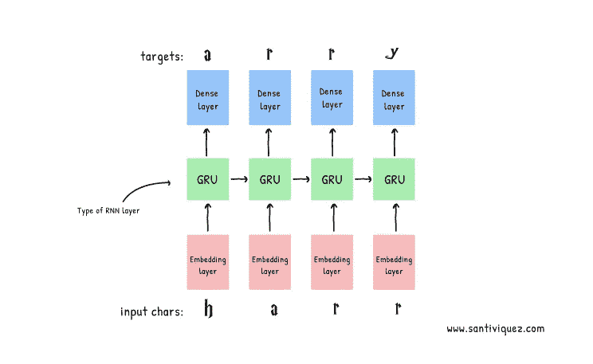
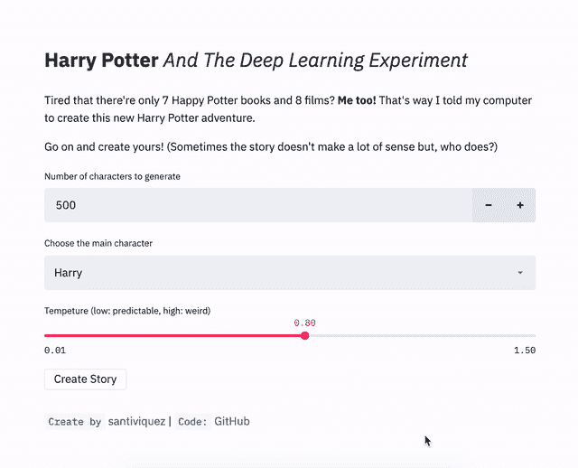

# 哈利·波特与深度学习实验

> 原文：<https://towardsdatascience.com/harry-potter-and-the-deep-learning-experiment-7b312d4b03c0?source=collection_archive---------44----------------------->



对于每个字符，模型查找嵌入，以嵌入作为输入运行 GRU 一个时间步长，并应用密集层来生成预测下一个字符的对数似然的逻辑。

三年前(那时教 RNNs 生成文本很酷)，我有了用哈利波特的书训练张量流模型的想法。这个项目在我的清单上，它在追逐我。

这个周末我终于做到了，还做了一个简单的 [Streamlit](https://www.streamlit.io/) 应用程序供你玩模型:[https://share . Streamlit . io/santiviquez/Harry-Potter-rnn/app . py](https://share.streamlit.io/santiviquez/harry-potter-rnn/app.py)



简化应用程序。代号:[https://github.com/santiviquez/harry-potter-rnn](https://github.com/santiviquez/harry-potter-rnn)

# 一些生成的文本

*哈利坐在了哈利读书时去看的楼梯旁边。*

“很抱歉，你的血腥，男爵先生，斯内普的课就在你的脸颊上，波特，否则我不会比达力更糟糕。达力去过几次图书馆；他吞下了许多刚刚结束的新问题。

让我来吧！不要害怕！别进入我们的第一周。再见。”

弗雷德和乔治·韦斯莱第一次试图阻止格兰芬多，这件事一直像弗农姨父一样困扰着他。他很难信守诺言。他默默地递过来。他一定不想告诉哈利？”

哈利听到了小铜币的声音，猫头鹰猛扑过来，把报纸掉在海格的身上，海格扑在报纸上，在他半信半疑伏地魔会回来的时候，设法通过了考试。

*“什么是巫师决斗？”哈利和罗恩说。*

正如你所看到的，大多数句子都没有意义，但它们都是由计算机生成的，这是令人印象深刻的部分。

# 这不就是把文字重新编排一下吗？

没有。让我们看一个学习过程的例子来理解为什么。

这些是模型生成的一些文本。

**时期 1:** 在第一时期(在整个数据集上的完全训练)，我们看到看起来只是随机的字母和字符。

```
sngns yiiy I rad yit se ke sery Ro, "udGct touveid. samtd ccift, the. fpe gincy lindos ys Towe feeng beunat 
)X h so-int rines Hufons nsmtheis anmin f oideyhend wrratt hit le therf arerre he fo ke thomecAg voutud unfed fow suk rond thet 
macughilg wares thirstof hy youMl hed folh,
```

`akfdjaf`

```

sdjkfaksfkla

“kajdsfkjasfka”

`fkgksjdfkjsfkjsdfsd`

```
sngns yiiy I rad yit se ke sery Ro, "udGct touveid. samtd ccift, the. fpe gincy lindos ys Towe feeng beunat 
)X h so-int rines Hufons nsmtheis anmin f oideyhend wrratt hit le therf arerre he fo ke thomecAg voutud unfed fow suk rond thet 
macughilg wares thirstof hy youMl hed folh,
```

` ` akjshfkjlahfkjhd

akjshfdjkadsf `'

**纪元二:**和以前差不多。

```
"Mald sined ro fastrong orryfe frourd hot'dilg trimt wa thin ware ne bamly oue ntho feringseps thag catkirgen tu hime baicf sait yoveece way yonerbyedene nomt thaney an'thing ve fuba carpouflit  Serofy," saided one whizciof Harr wiole, I it the pie pevainigrofle pors
```

在这里，我们看到了一些进步。它正在学习如何创建段落，它还学习了如何正确拼写罗恩，而且它几乎做到了赫敏。另一个有趣的事实是，它知道每个段落都需要以句号结尾。

```
daven lack a grivert He mad eets plaiced. The inares, ruther Inard in brigt tuffing a to kinares**.**" 

"Haw do get brousl purny to seize whis with hem looking by. We's if ge**.** 

"Haryy, you, wande -- recatbladred got **Herwione**, and Harry ando, him some wich nover Durn **Ron**. Ho said abeary own exard to ke to nextsen, mowned megrmings**.**
```

**Epoch 10:** 它**学会了拼斯内普、哈利、达力和赫敏！**

```
Harry fast roy winged and same forward that **Snape** heard fat looked at all. Small not about is but he didn't makber, wh they furged him. 

"It's going to lim, I'll never thought that Curse for dong tone ach ins other, could poney. **Harry** flocked **Dudley** this if he soll that **Hermione** had be before wouldn't meville. 'veryto his rrom -- and he stop its head. I've reed Lonnem. Snape was gonew like Harry's gettid himmered in elor without hair.
```

注意，在第二段中，它学会了如何正确使用引号(正字法)。

```
Neville had been hand stretching to watch as Harry sped straight at Snape -- she didn't even noticed in tim again. After burning all the letters, he was made difficult by Fathers s had been waiting noise and the sheets a hote there, with right dewild!"**"**But what's only shop.**"**Harry nodded, but stopped quickly, because it made different time was protected wherever he went.
```

所以它基本上试图复制 J.K .罗琳的写作风格和基调。

# 这是如何工作的

理解这是如何工作的最好资源之一是安德烈·卡帕西 2015 年的博客文章[。我将冒昧地使用他的一个例子。](https://karpathy.github.io/2015/05/21/rnn-effectiveness/)

假设我们的整个词汇由四个字母组成: **h** 、 **e** 、 **l** 、 **o** 。我们把文本分成长度=4 的块，我们想在序列“hello”上训练我们的 RNN。

在这种情况下，我们的输入序列是“hell ”,目标序列是“ello”。因此，给定最初只有一个单独的“h”的上下文，模型将猜测下一个单词可能是“e ”,然后给定前两个字母是“h”和“e”的上下文，模型将猜测第三个字母是“l ”,依此类推。

前面所有字母之间的关系有助于预测下一个字母。RNN 记住每个序列的所有这些关系。


[https://karpathy.github.io/2015/05/21/rnn-effectiveness/](https://karpathy.github.io/2015/05/21/rnn-effectiveness/)

要了解更多关于 RNNs 的信息，我真心推荐 Karpathy 的博客文章，如果你想建立自己的教程，这个 [TensorFlow 2 教程](https://www.tensorflow.org/tutorials/text/text_generation)是一个很好的资源。

【1】:[https://www.tensorflow.org/tutorials/text/text_generation](https://www.tensorflow.org/tutorials/text/text_generation)

我想告诉你，我推出了一个数据科学问答游戏，通常会在面试中出现问题和答案。想了解更多关于这个 [**在 twitter 上关注我**](https://twitter.com/santiviquez) 。