# 《哈利·波特》系列丛书和同人小说——词汇分析

> 原文：<https://towardsdatascience.com/harry-potter-books-fanfiction-an-analysis-of-words-cfa29ee28d1a?source=collection_archive---------74----------------------->

# 背景

5 月 28 日，[r/dataisbeautiful](https://www.reddit.com/r/dataisbeautiful/comments/gs4me1/oc_word_cloud_comparison_between_user_comments_on/)上的一个帖子启发我自己学习如何制作文字云。作为一个超级哈利波特迷，我要用的数据是显而易见的。使用这些书似乎太简单了，所以我决定从 Fanfiction.net 的[搜集 250 个故事，并根据这些数据制作一个单词云。我发布了](http://fanfiction.net/)[我在 r/dataisbeautiful](https://www.reddit.com/r/dataisbeautiful/comments/gtxzx8/oc_frequently_occurring_words_in_top_250_harry/) 上的第一次尝试，基于我收到的反馈，我决定写这篇博客。

[完整的源代码(数据文件&输出文件除外)可在此处获得](https://github.com/haideralipunjabi/harrypotter-analysis)

# 尝试 1

我可以采用许多方法来准备数据。由于我的网速慢且不可靠，我决定先下载故事，然后在本地文件上进行处理。

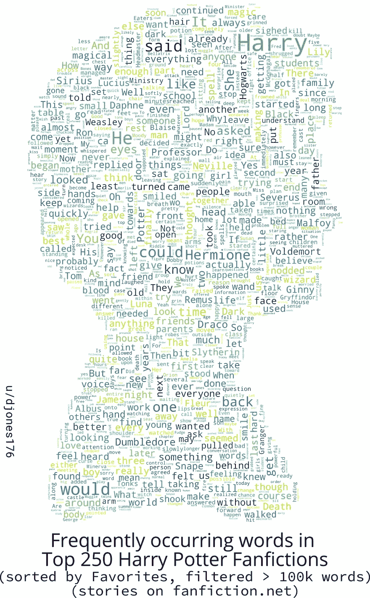

## 刮痧同人小说

我使用简单的 Python + BeautifulSoup 组合从[Fanfiction.net](http://fanfiction.net/)那里收集故事。我根据他们最喜欢的数量对故事进行了分类，并筛选出超过 10 万字的故事。([链接到网址](https://www.fanfiction.net/book/Harry-Potter/?&srt=4&r=10&len=100&p=1))。我刮了前 10 页，(每页有 25 个故事)，结果是 250 个故事。我总共花了 10 个小时(第一天 7 个小时，第二天 3 个小时)才把所有的故事都写完。

## 处理数据

从[原始帖子](https://www.reddit.com/r/dataisbeautiful/comments/gs4me1/oc_word_cloud_comparison_between_user_comments_on/)中得到启示，我使用 nltk 对故事进行了标记，并从 nltk 英语停用词语料库中删除了常用词。这是我第一次尝试这样做，最初每个故事花了 3-4 分钟。经过一些优化后，我能够将每个故事的时间减少到 1-2 分钟。我和一个朋友谈了这个问题，他建议我试试多处理。添加多处理后，我有了在两个 CPU 上分配负载的想法(我的笔记本电脑和一个 Raspberry Pi 4B)。我把剧本和 25%的故事复制到 Pi，开始工作。

*附加提示:* [*屏幕*](https://www.geeksforgeeks.org/screen-command-in-linux-with-examples/) *是通过 SSH 做长时间工作的好工具*

我花了一个小时来处理。如果我需要删除更多的单词，我不想再次进行处理，所以我决定将词频数据存储到 json 文件中。(对未来很有帮助)

## 制造单词云

我看了一下 [wordcloud Python 包](https://github.com/amueller/word_cloud)，从它的例子中复制代码生成 wordcloud。

为了制作蒙版图片，我从网上下载了一些图片，用 Inkscape 修复。

## 反馈

在 Reddit & Twitter 上发布了第一次尝试后，我收到了很多反馈。其中常见的问题是为什么达芙妮更频繁，为什么罗恩更少(我稍后会回答这两个问题)，建议删除更多的单词，更多地关注与哈利波特相关的单词，并显示一些其他的可视化，特别是比较书籍和同人小说的可视化。

# 尝试 2

## 查找更多停用字词

在我的第一次尝试中，我使用了 nltk 英语停用词语料库，它只有 179 个单词。我搜索了一个更大的列表，最终使用了一个定制的 20，000 个最常用单词列表，来自[Google-10000-English repository](https://github.com/first20hours/google-10000-english)。定制是什么？我不得不从 20k 列表中删除一些单词(如魔法、魔法、魔杖、结界、吸血鬼等)和一些名字(哈利、罗恩、弗雷德、亚瑟等)，这样它们就不会从我的分析中删除。将第一次尝试的处理结果存储到 json 文件中，使我避免了再花一个小时进行处理。我只是从每个数据文件中删除了必要的键。

## 哈利·波特系列丛书

我还从网上的某个地方下载了这 7 本书的文本版本，对它们进行了一些清理，并应用了与同人小说故事相同的过程来生成它们的数据。利用这些数据，我能够比较同人小说和佳能小说中一些单词的出现。既然我有了数据和代码，我决定也制作它们相应的单词云。

# 尝试 2 的可视化

## 前 250 位同人小说中的高频词

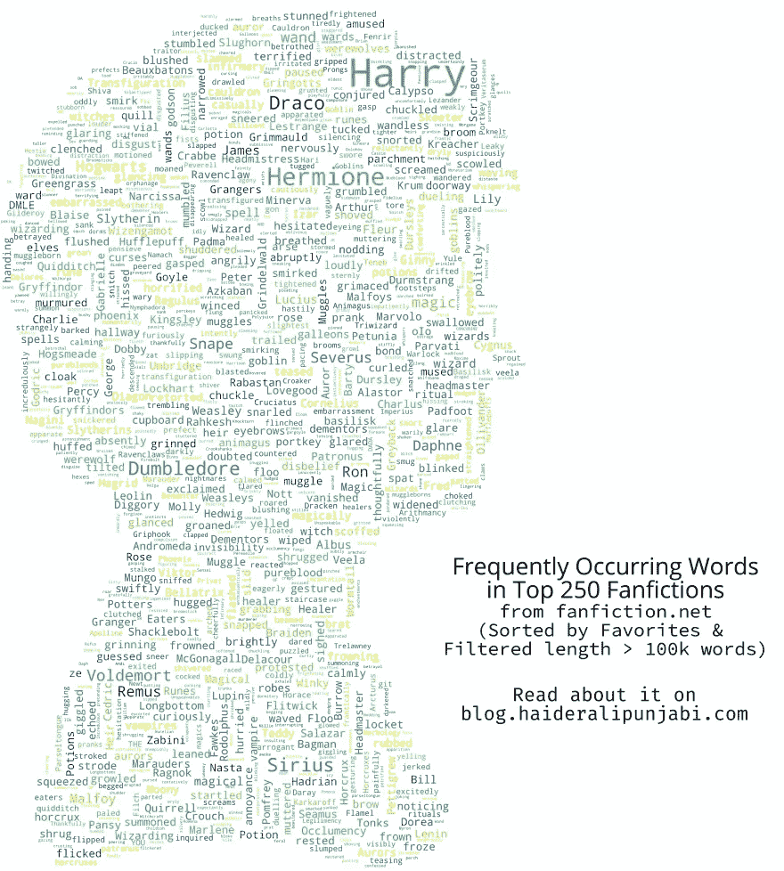

## 每本书或每个故事中单词的平均出现频率

同人小说中出现频率最高的 20 个单词

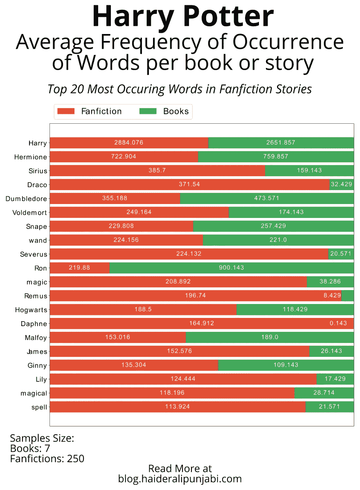

《哈利·波特》系列中出现频率最高的 20 个单词(不包括同人小说中的前 20 个)

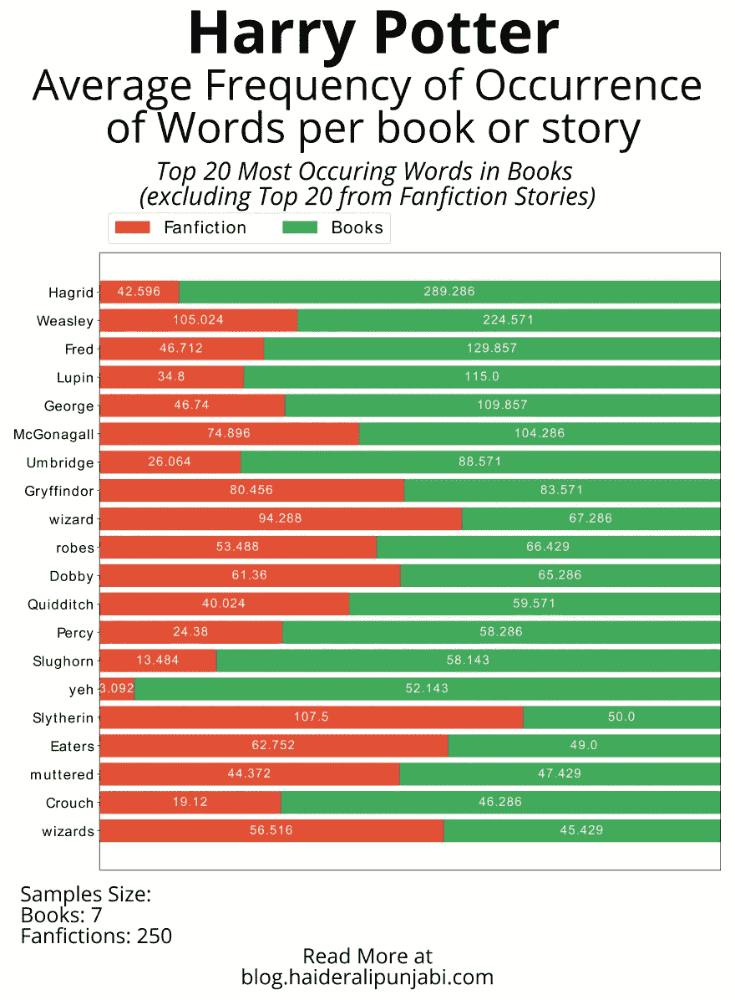

# **重要结果**

**达芙妮是谁？为什么她在同人小说里这么受欢迎？**

> 赫敏的名字被叫到。她颤抖着和安东尼·戈德斯坦、格雷戈里·高尔、以及 ***达芙妮·格林格拉斯*** *一起离开了密室。已经测试过的学生后来没有回来，所以哈利和罗恩不知道赫敏做得怎么样。*
> 
> *- >哈利波特与凤凰社*

达芙妮·格林格拉斯在佳能中几乎不存在，对同人小说作家来说是一张白纸。在正典和大多数同人小说中，她是阿斯托利亚·格林格拉斯(另一个几乎不存在的实体)的妹妹，后来成为德拉科·马尔福的妻子。在同人小说中，她通常是斯莱特林的一员，因为她的野心&狡猾&而不是因为她是一个纯血统的超级怪物。她的家人被描绘成浅色或灰色，支持“波特勋爵”。她是独立哈利故事中很受欢迎的一对。

她是一个性格方面的空白，这对于那些想写一个 OC 而不想明确提及的作家来说是一个福音。

[解释达芙妮·格林格拉斯及其受欢迎程度的视频](https://www.youtube.com/watch?v=4mSD-GAmz1I)

## 罗恩怎么了？

罗恩几乎是达芙妮的对立面。JKR 把罗恩写得如此漂亮，以至于许多同人小说作家都写不出一个好的罗恩。在佳能，罗恩是有缺陷的，但也非常有趣，勇敢和忠于他的朋友。在同人小说中，尤其是哈利与正典非常不同的地方(独立、超能力、哈利波特等)，哈利通常会忽略罗恩(如果在霍格沃茨之前分开的话)，或者作者大量抨击罗恩，以证明哈利破坏他们的友谊是正当的。

# 额外的可视化

## 7 本佳能书籍:

**魔法石**

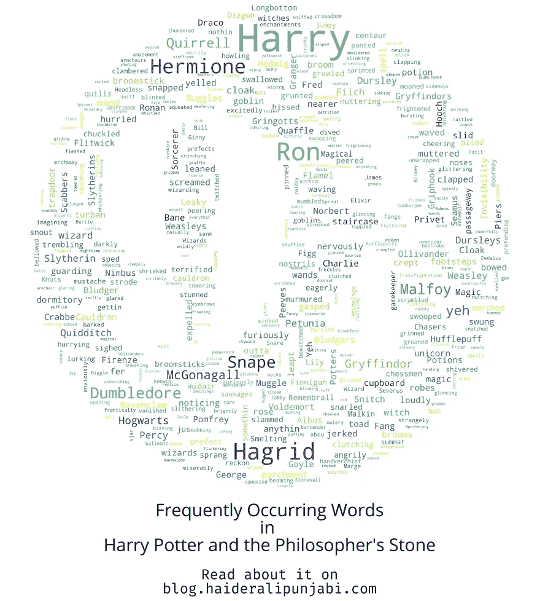

我试着用 9 又 3/4 英寸的图像。奇洛和拉环这个词在本书中出现频率很高，在以后的书中会失去频率。

**密室**

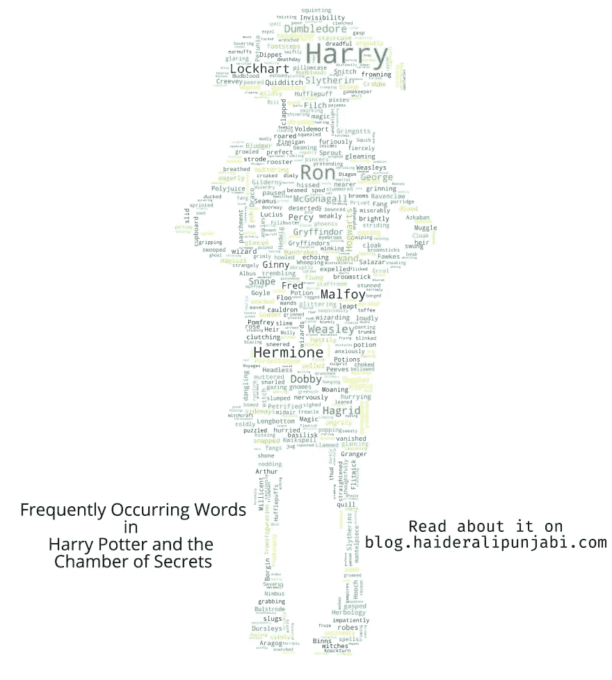

我用了自由精灵多比的照片。像多比、洛克哈特(我讨厌那个家伙)、聚合汁、蛇佬腔、曼德拉草、泥巴种这样的词会在这本书里出现。

**阿兹卡班的囚犯**

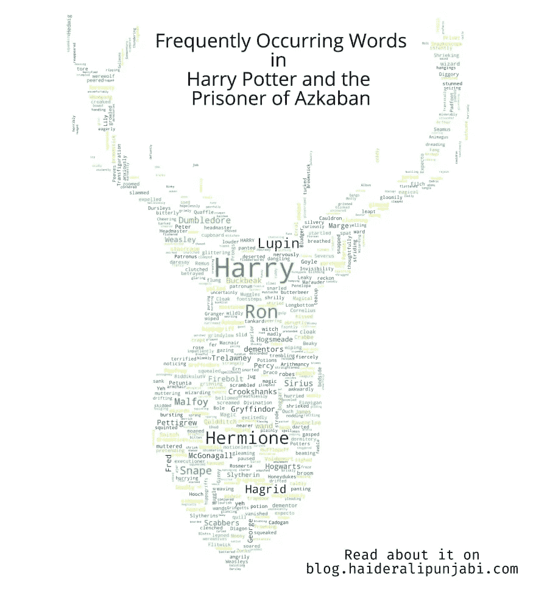

我使用了尖头叉子的形象(詹姆斯的活点昵称，和阿尼马格斯的形式。哈利的守护神)这本书。像鲁邦、小天狼星、小矮星、摄魂怪、克鲁克山、守护神这样的词开始出现。

**火焰杯**

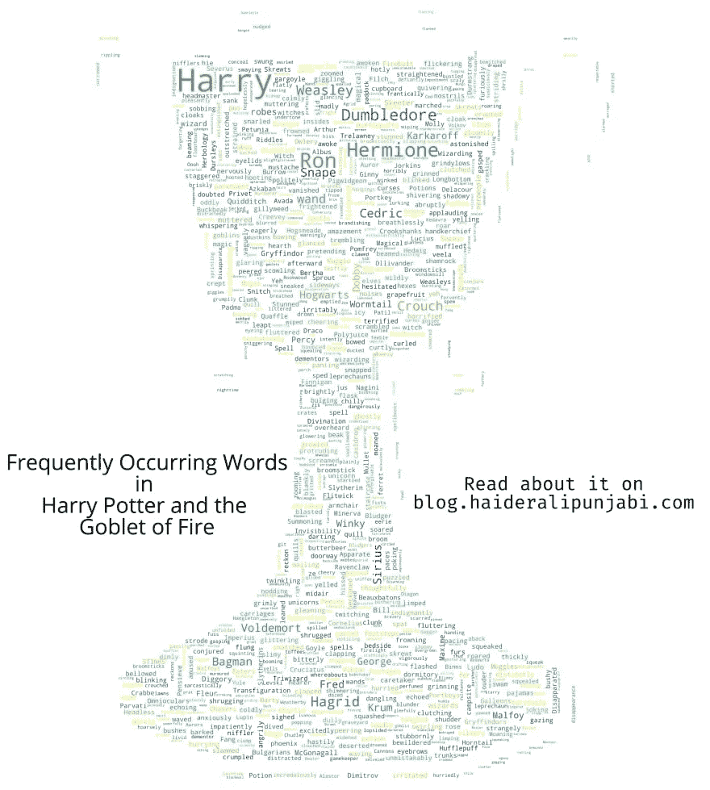

我试着用三强奖杯的图像。像塞德里克、布斯巴顿、克劳奇、德姆斯特朗这样的词开始出现。

**凤凰社**

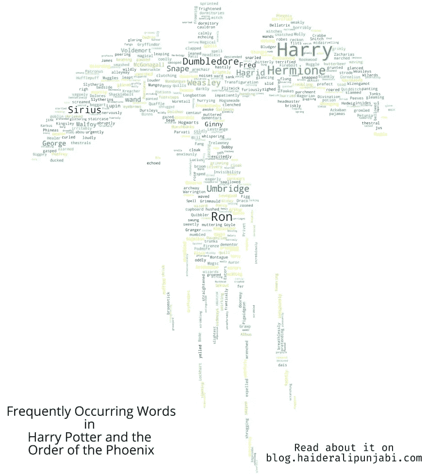

试图用凤凰的形象。乌姆里奇在这本书里很受欢迎。

**混血王子**

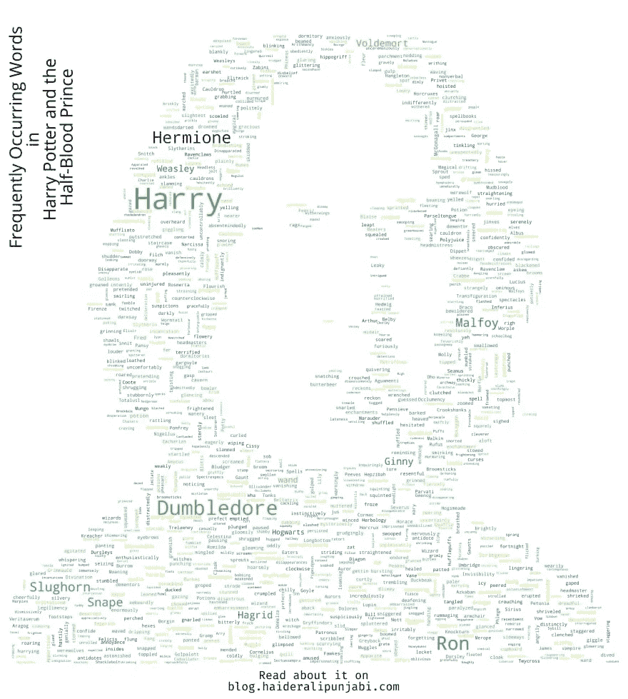

我在这本书里使用了混血王子的图像。除了通常的，斯拉格霍恩是本书中最常见的词。

**死亡圣器**

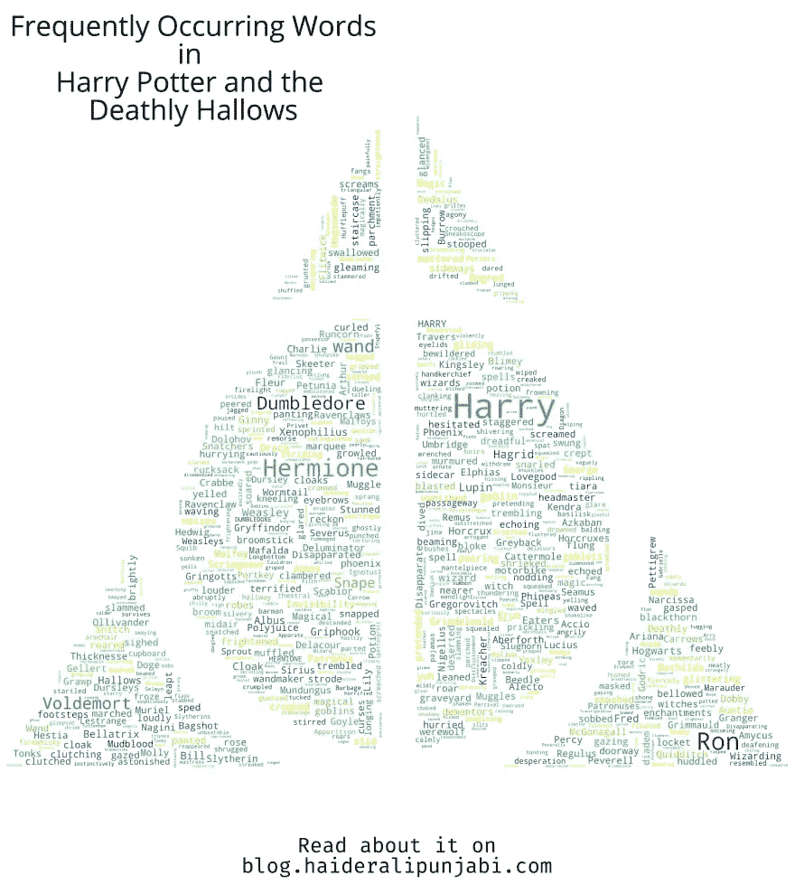

为此，我使用了死亡圣器的图像。你会看到“魔杖”因为“老魔杖”而变得非常常用。圣器，斗篷，魔杖制造者出现。还有，拉环又回来了。

# 未来计划

我打算在未来刮 AO3 做一些更多的分析。我也可能从其他流行书籍中创造一些其他的单词云。

# 参考:

1.  [wordcloud Python 包](https://dev.to/haideralipunjabi/harry-potter-books-fanfiction-an-analysis-of-words-1hi7)
2.  [nltk](https://www.nltk.org/)
3.  [r/HPFanfiction](https://www.reddit.com/r/HPfanfiction)
4.  斯内普，斯内普，西弗勒斯·斯内普——音乐视频

[在我的博客上读这篇文章](https://blog.haideralipunjabi.com/posts/harry-potter-books-fanfiction-an-analysis-of-words/)