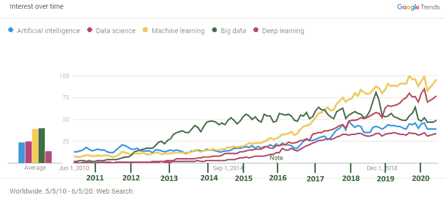
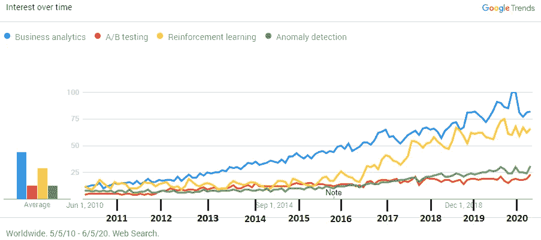
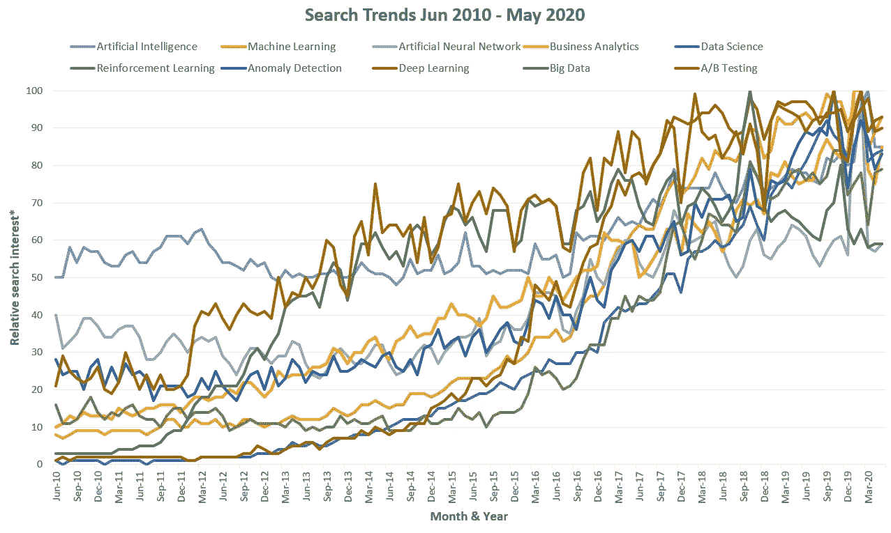
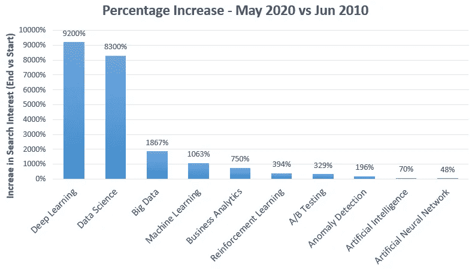
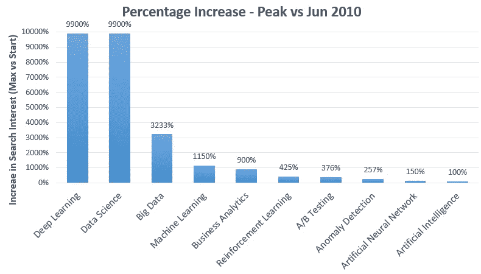
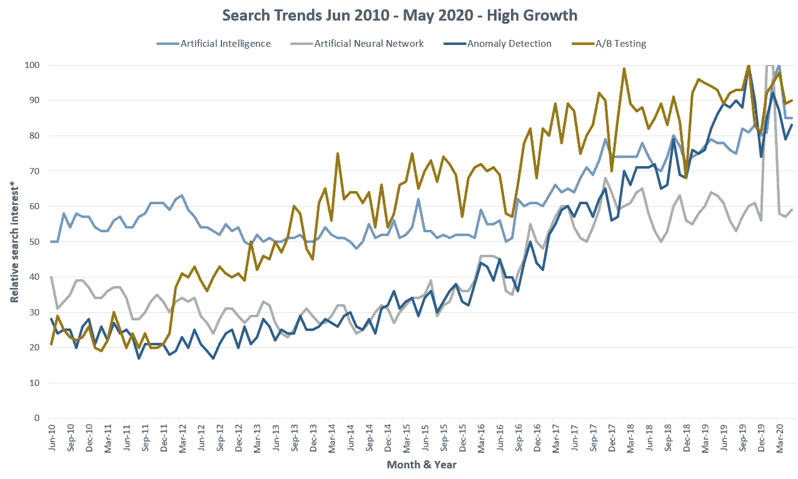
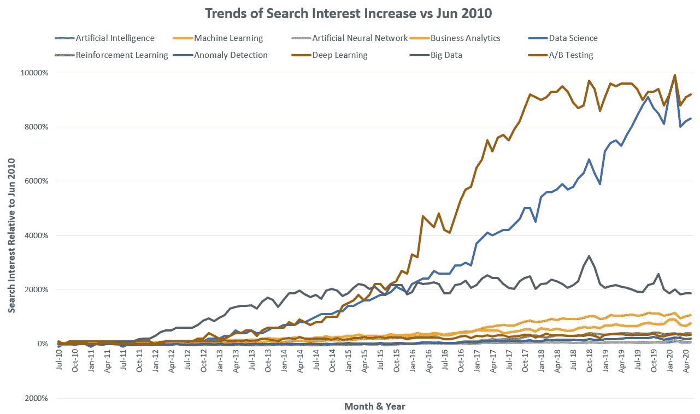

# 对数据科学的兴趣已经达到顶峰了吗？

> 原文：<https://towardsdatascience.com/has-interest-in-data-science-peaked-already-437648d7f408?source=collection_archive---------65----------------------->

## 数据科学相关主题的 10 年搜索兴趣趋势分析:增长最快的领域、增长模式和相关性。

自从 2009 年我用谷歌趋势预测我的国家的全国选举结果以来，我对人们可以从谷歌趋势中获得的洞察力非常着迷，这一预测比所有令人尊敬的民调都要准确得多。仅仅工作了一个小时，我就发表了一个预测，它比盖洛普和其他人花费更多数量级的资源产生的预测更符合观察到的结果。

我现在再次召唤谷歌趋势的力量，通过使用过去十年的搜索兴趣趋势作为代理，来了解数据科学领域的情况。这些数据用于检查以下问题:

*   自 2010 年以来，人们对数据科学的兴趣增长有多快？
*   数据科学中发展最快的子领域是什么？
*   兴趣已经见顶了吗？领域已经停滞了吗？
*   时间线上的关键转折点是什么？
*   对一个子领域的兴趣是否与其他子领域或对数据科学的一般兴趣相关联，或者它们或多或少是独立的？

如果这些听起来像是你想了解更多的问题，请继续读下去。分析中的子领域/子主题如下:数据科学、大数据、人工智能、深度学习、机器学习、强化学习、人工神经网络、商业分析、异常检测、A/B 测试(*详见技术说明 1*)。

# 总体趋势和相对兴趣

首先是土地的基本情况。由于 Google Trends 只允许同时比较 5 个术语，我将 10 个主题中的 9 个分成两个，将它们分组，这样趋势就可见了。

**图 1** ( [数据来源](https://trends.google.com/trends/explore?date=2010-05-05%202020-06-05&q=Artificial%20intelligence,%2Fm%2F0jt3_q3,%2Fm%2F01hyh_,%2Fm%2F0bs2j8q,%2Fm%2F0h1fn8h))

有几个观点是显而易见的。早在 2010 年至 2011 年，对**“人工神经网络”**主题(未显示)的兴趣高于图表中显示的所有五个主题，但它早在 2012 年就被取代，现在与**“人工智能”**的兴趣水平相同。对“人工智能”的兴趣，在**“深度学习”**面前，也逐渐被其余所有人超越，除了这个街区的最新小子。**‘大数据’**最早成为一个东西是在 2011 年。它在四年后的 2015 年达到顶峰，但现在处于下降趋势，并被**“机器学习”**(自 2017 年起)和**“数据科学”**(自 2019 年起)超越。值得注意的是，对“数据科学”和“深度学习”的兴趣在 7 年前几乎不存在，因为它们只是在 2013-2014 年才开始受到关注。

**图 2 (** [数据源](https://trends.google.com/trends/explore?date=2010-05-05%202020-06-05&q=%2Fm%2F02q3c56,A%2FB%20testing,Reinforcement%20learning,%2Fm%2F026vnz3) **)**

在图 2 所示的相对兴趣较低的层中，事情远没有那么疯狂。“业务分析”、“a/b 测试”和“异常检测”都显示出或多或少的稳定增长。“强化学习”在这个群体中是一个温和的异常值，因为它似乎遵循“机器学习”的增长趋势。

**在整个 10 年期间**“机器学习”和“大数据”是最受欢迎的，但到了 2020 年，“数据科学”已经取代“大数据”位居第二。

# 2010-2020 年增长最快的数据科学术语

下面的图 3 结合了所有 10 个主题，以检查随时间推移的增长率(单击查看完整尺寸)。与前两个图不同的是，这个图中的趋势并没有进行相互比较，以便对增长率进行比较。

**图 3**

总的趋势很明显——人们的兴趣全面增长，一些子领域比其他领域增长更快。值得注意的是，即使是非常相关的副主题也在不同的时间点出现，并在整个时间序列中显示出非常不同的增长率。

进一步分析后，有两个子领域脱颖而出。所有十个术语相对于 2010 年 6 月的**增长率**的比较(下图)显示，到目前为止**增长最快的是术语**、【数据科学】和【深度学习】**。**

**图 4**

如果我们将峰值与起点进行比较，这种增长甚至更令人吃惊:

**图 5**

这当然部分是由于它们的起点非常低，这两个术语在 2010 年不存在，不仅相对于它们的峰值，而且相对于分析中的所有其他术语也是如此。当我们考虑到它们出现在地图上*(也见图 8)* 的时间有多晚时，这些术语也是**增长最快的**。无论是由于更容易获得的大数据，还是由于使高科技工具的访问民主化的软件的激增，还是由于来自上面的自动化压力，对深度学习和数据科学的兴趣在过去十年中迅速增长，甚至与其他高增长主题相比也有很大差距。

# 我们对数据科学的兴趣达到顶峰了吗？

对搜索兴趣增长趋势的研究将有助于回答这个问题。粗略分类为**极端增长**区域(超过四倍增长)和**高增长**区域，结果如下两张图:

**图 6**

**图 7**

图 6 显示了“大数据”在 2011 年至 2013 年的惊人增长后，人们的兴趣如何下降。其他术语已经几年没有增长了，只有“商业分析”和“数据科学”看起来可能会有更大的增长。然而，两者都经历了 2020 年 2 月的峰值和随后的显著下降。有理由问这是否是对数据科学的兴趣高峰，如果是，我们是否会看到兴趣在这些水平上保持一段时间，或者它是否会像“大数据”一样进入缓慢下降。

图 8 显示了“数据科学”和“深度学习”的另一个明显的爆炸式增长，甚至相对于其他非常高的增长术语。

**图 8**

这个数字表明，近年来人们对“深度学习”的兴趣缺乏增长。同样显而易见的是“数据科学”快速增长趋势的中断。基于这些数据，我的结论是**“是的，我们很可能已经到达顶峰】**。

# 数据科学子领域的相关性如何？

当我检查趋势线时，我发现它们显示的相关性比我预期的要小得多，因为这些搜索词在直觉上是紧密相关的。一些领域比其他领域发展更快，而且时间也不同。

我决定运行一个相关性分析来更正式地检查这些关系或缺乏这些关系。使用一阶差分对原始搜索兴趣数据进行去趋势化，得到一个平稳序列。最初，我使用皮尔逊相关系数，并注意到一些系数在 0.6-0.7 范围内。经过进一步的检查，这些被证明主要是由于离群值。由于这种关系也可能是非线性的，我决定使用肯德尔的τ等级系数，而不是皮尔逊的。这些方法对异常值更具鲁棒性，可以捕捉任何类型的单调关系，而不仅仅是线性关系(*见技术说明 2* )。肯德尔的 tau 有点不太强大。

相关性是使用[这个相关系数计算器](https://www.gigacalculator.com/calculators/correlation-coefficient-calculator.php)计算的，我已经编码了它，它也提供了附带的统计数据。许多相关性的 p 值非常小，95%的置信区间非常窄，表明真正的关系。

由此产生的相关性矩阵表明，不同主题的搜索兴趣并不像人们预期的那样密切相关。**最大相关性为 0.56，介于“深度学习”和“机器学习”之间**。其他几个在 0.4-0.5 范围内，但大多数更低。

似乎**“机器学习”与所有其他搜索主题关联度最高**，而“商业分析”关联度最低。“数据科学”显示了全面的正相关性，但与“机器学习”相比，这些相关性略弱。对“人工智能”的搜索兴趣与其他人的相关性较低，对“强化学习”的兴趣也是如此。其余的显示系数大多在 0.2-0.4 范围内。

# 外卖食品

在过去十年中，数据科学主题显示出令人印象深刻的兴趣增长。“数据科学”和“深度学习”尤其在 2010 年至 2020 年间呈现出惊人的增长水平。在短短的几年时间里，它们从几乎不存在到成为搜索兴趣方面的领先主题。

也就是说，似乎对大多数数据科学主题的兴趣已经达到顶峰。对一些人来说，高峰早在 2015 年，而对另一些人来说，则更早。虽然我们可能会在 2020 年的剩余时间里看到复苏，但 2013 年建立的“数据科学”快速增长的趋势肯定会被打破。

相关性分析发现，人们对大多数子领域的兴趣与最高相关系数约为 0.5 的相关程度一般。这表明数据科学领域非常多样化，每个子领域或多或少都有自己的生命，有自己的辉煌和衰落时期。

*技术说明:*

1.  这种比较基于可用的研究领域和主题，以及 Google Trends 没有相应主题或研究领域的三个搜索词。这一选择是在检查了搜索词和相应的研究领域或主题的数据在趋势和相对兴趣方面没有显著差异后做出的。
2.  如果您不熟悉肯德尔系数及其与其他相关系数的关系，[请查看此表](https://www.gigacalculator.com/calculators/correlation-coefficient-calculator.php#pearsonvsspearmanvskendall)以及下页的 tau 系数公式和解释。