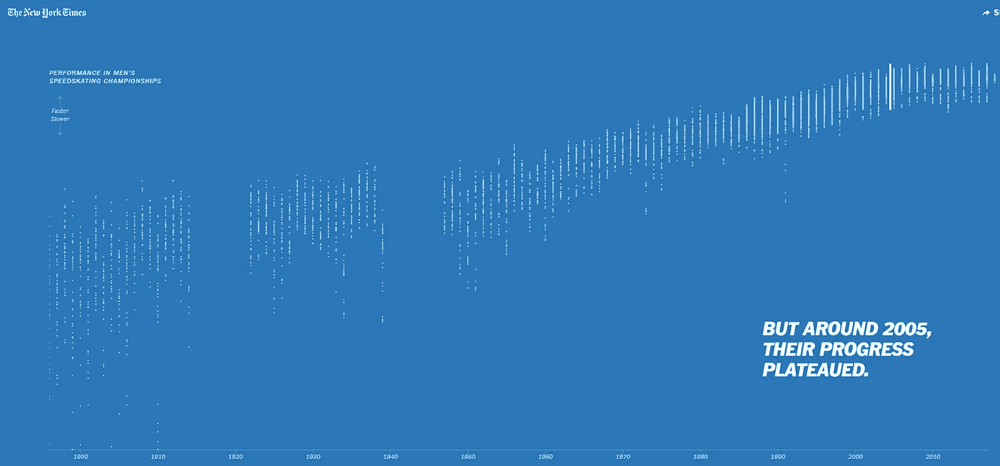
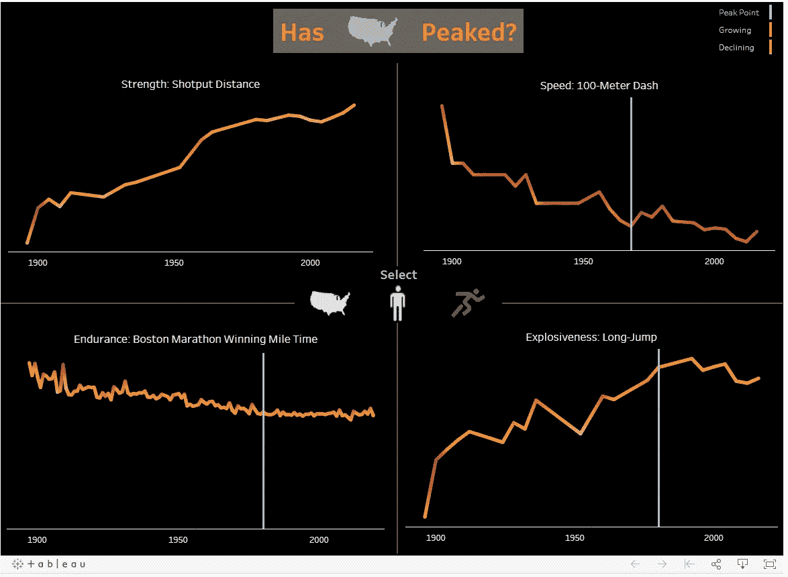
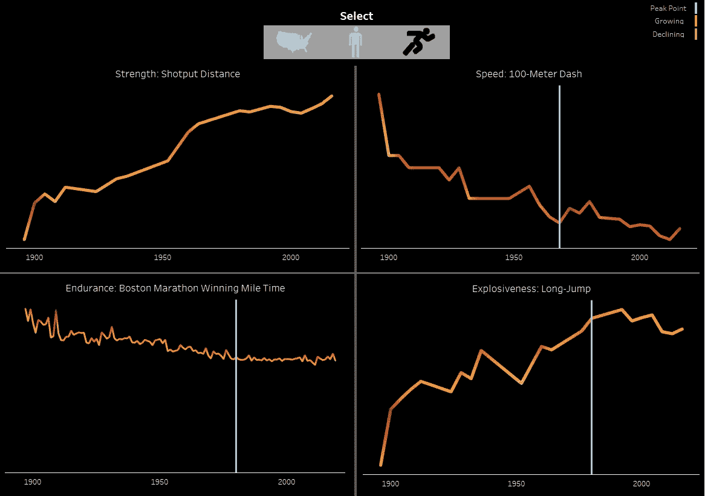
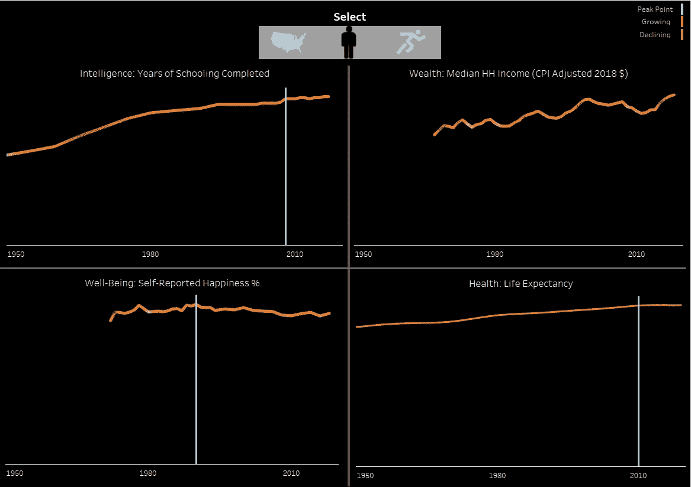
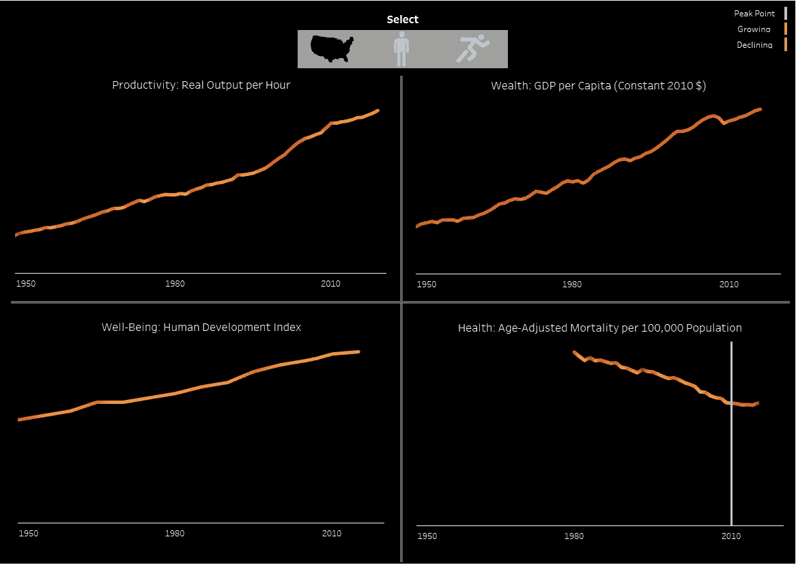

# 美国的进步达到顶峰了吗？

> 原文：<https://towardsdatascience.com/has-progress-in-america-peaked-9421f2e10a56?source=collection_archive---------56----------------------->

## 衡量过去一个世纪身体、个人和国家的发展

我最近看到了《纽约时报》发表的一篇引人注目的数据可视化文章。作者试图证明一个观点，即男子速度滑冰的表现已经达到顶峰，更广泛地说，在其他奥运会项目中也是如此。

来源:[纽约时报](https://www.nytimes.com/interactive/2018/02/10/opinion/this-is-peak-olympics.html)

这让我思考……这一发现仅仅在纯物理指标上成立，还是在其他领域也成立？我们哪里接近了进步的极限，哪里还有成长的空间？

一个困难的问题是如何衡量进展——什么是正确的衡量标准？作为一个社会，我们(或我们应该)重视什么，以至于认为这一指标的增长是进步？按季度来看，GDP 被视为衡量美国经济增长的指标，但我们应该只从金融角度来衡量自己吗？

这些指标还需要有充足的历史数据，并以一致的尺度进行衡量(例如，国家统计数据中的财富或人均通胀调整)。几经周折后，三个总的进度指标及其相关数据点是:

**国家发展**

*   *生产率*(每小时实际产量)
*   *财富*(2010 年人均国内生产总值美元)
*   *幸福感* (人类发展指数)
*   *健康*(每 10 万人口年龄调整死亡率)；

**个人发展**

*   *智力*(平均。完成学校教育的年数)
*   *财富*(2018 年 CPI 调整后的家庭收入中位数，美元)
*   *幸福感*(自我报告的幸福感)
*   *健康*(预期寿命)；

**身体发育**

*   *实力*(奥运铅球)
*   *速度*(奥运百米冲刺)
*   *耐力*(波士顿马拉松获胜英里数)
*   *爆发力*(奥运跳远)

除了身体发育之外，这些指标只关注美国，我们假设美国参加的奥运会的身体发育趋势代表了美国。

[Tableau 仪表盘](https://public.tableau.com/profile/jordan8097#!/vizhome/ProgressDashboard/Progress)

数据显示，12 个指标中有 7 个(~60%)已经见顶(以显著放缓或停止的历史积极势头来衡量)。有趣的是，达到峰值的指标主要是个人的。在 7 个稳定指标中，6 个是个人或身体发展指标，只有 1 个是国家统计指标。亲自查看[这个 Tableau 仪表盘](https://public.tableau.com/profile/jordan8097#!/vizhome/ProgressDashboard/Progress)中的数据，让我知道你的想法。

# 物理显影

[奥运数据来源](https://www.kaggle.com/jayrav13/olympic-track-field-results)；[波斯顿马拉松](https://en.wikipedia.org/wiki/List_of_winners_of_the_Boston_Marathon)

身体发育旨在衡量我们是否看到顶级运动员的力量和速度持续增长。我们比以前更强更快了吗？我们有更好的耐力和爆发力吗？

> 百米短跑冠军是<1% faster in 2016 than 1968\. Between 1920 and 1968 — the same length of time — there was an 8% improvement.

Most physical metrics reached their peak between 1970–1980, as shown by the light blue bar in the above graph. While the 100-Meter Dash had two record performances in 2008 and 2012, the winner in 2016 was only 0.09 seconds, or 1%, faster than the winner in 1968\. For comparison, the winner in 1968 was ~8% faster than the winner in 1920, a similar 48-year time span.

The Long-Jump gold medal winner in 1980 reached a distance of 8.54 meters; the Gold medal winning distance in 2016 was 8.38 meters, a decrease of ~2%. In the Boston Marathon, once the 5-minute mile was eclipsed, little additional progress has been made since 1980\. Strength, as measured by the Shot Put, remains the only area that has continued to progress after a brief slump from 1980–2004.

# Personal Development

Source for [教育](https://www.census.gov/topics/education/educational-attainment/data.html)；[HH 收入中位数](https://www.census.gov/data/tables/time-series/demo/income-poverty/historical-income-households.html)；[自我报告的幸福感](https://gssdataexplorer.norc.org/trends/Gender%20&%20Marriage?measure=happy)；[预期寿命](https://data.oecd.org/healthstat/life-expectancy-at-birth.htm)

个人发展衡量一个国家的每个人是否在进步。接受教育和完成教育的人数是否在增加？人们挣得更多吗？他们更快乐，活得更久吗？

> 与 1999-2008 年相比，2008-2017 年完成教育的增长率下降了 50%以上。

大衰退前后，一些指标出现了有趣的拐点。从 1950 年到 2008 年，以预期寿命衡量的健康水平稳步增长，但自那以后一直顽固地停留在略低于 79 岁。

同样，受教育年限在 2008 年达到 13 年后，仅增加了 0.2 年；在前十年，这一数字增加了 0.5 岁。

GSS 的一项调查显示，受访者自称“非常幸福”或“非常幸福”，这一比例从 1972 年的 83%上升到 1990 年的 92%；此后再也没有回到那个水平，2018 年是 87%。

家庭收入经历了一个坎坷但稳定的上升轨迹。这一数字在经济衰退期间有所下降，但一直达到更高的峰值。

# 国家发展

来源为[每小时实际产出](https://fred.stlouisfed.org/series/OPHNFB?utm_source=series_page&utm_medium=related_content&utm_term=related_resources&utm_campaign=categories)、[人均国内生产总值](https://fred.stlouisfed.org/series/NYGDPPCAPKDUSA)、[人类发展指数](https://ourworldindata.org/human-development-index)、[年龄调整死亡率](https://www.healthsystemtracker.org/brief/measuring-the-quality-of-healthcare-in-the-u-s/)

国家发展是衡量国家总体上是否进步的一种方式。人们在生产更多的商品吗？这个国家正在增加财富和改善公共卫生吗？人们的生活水平正在提高吗？

自 1950 年以来，美国在这一领域持续发展，几乎没有放缓。每小时实际产出、人均 GDP 和人类发展指数(旨在通过健康、教育和生活水平衡量人类发展的指数)都出现了稳步持续的上升。

唯一变平的指标是年龄调整死亡率，这表明我们可能正在达到当前医学促进更长寿、更健康生活的上限。

尽管个人的进步指标停滞不前，但整个国家仍保持着活力和增长。

我们已经调查了美国是否——以及在哪里——达到顶峰，但是一个没有答案的问题仍然存在。缺乏增长通常被认为是负面的——是吗？如果人类可以用 9.5 秒而不是 9.81 秒跑完 100 米，这是不是推动了人类的进步？

总的来说，美国人比以往任何时候都更健康、更富有、更长寿、生活水平更高。数据不可否认地表明这是一个事实，即使在过去几十年里进步是渐进的。

已经达到顶峰或正在达到那个水平的领域是不会阻碍我们作为一个社会的界限。平均而言，13 年以上的教育是一项了不起的成就，代表着自 1950 年以来增加了 5 年的教育。我们不应该强迫每个人都去读学位课程；这表明我们现在让普通公民从高中毕业，让他们选择自己的下一条道路。

那么，美国已经见顶了吗？和大多数数据一样，答案是肯定和否定的。个人进步指标在很大程度上已经达到了一个平台期，但这个平台期是在大多数美国人受过教育、身体健康、财务稳定的情况下出现的。

我希望听到您对判断进度的正确指标的反馈，以及您对仪表盘中数据的[解读。](https://public.tableau.com/profile/jordan8097#!/vizhome/ProgressDashboard/Progress)