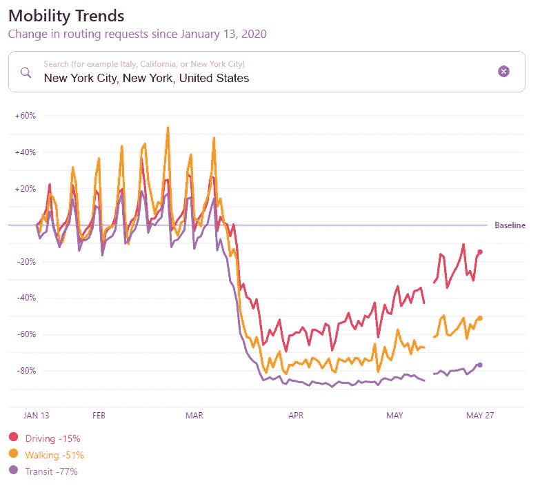
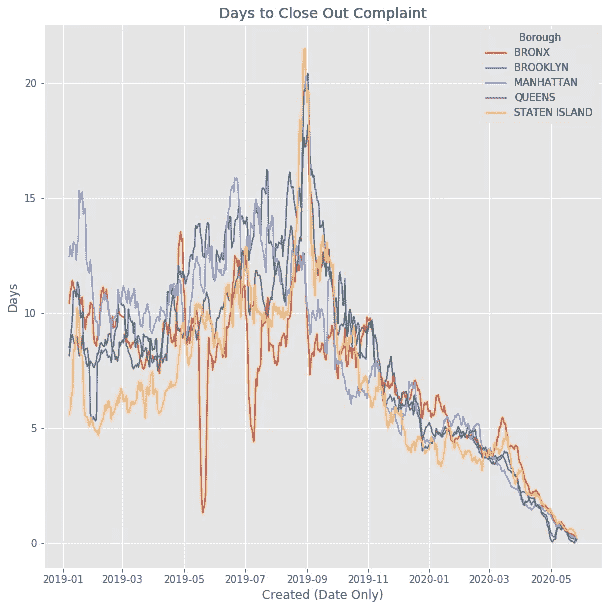

# 使用 Matplotlib 地理图、条形图和折线图探索新冠肺炎的 NYC 311 投诉数据

> 原文：<https://towardsdatascience.com/has-quarantine-made-you-hate-your-loud-neighbors-these-charts-certainly-imply-it-c760e999a04b?source=collection_archive---------68----------------------->


2020 年 2 月至 5 月的投诉

## 数据新闻

## 看起来隔离区让我们很多人讨厌我们的邻居！

从 3 月到 5 月的纽约市 311 投诉数据表明，隔离让我们有更多的时间生邻居的气——同时，我们中的许多人通过播放音乐来保持理智。

如果你不知道什么是 311 电话，你可以在这里阅读。从消防栓漏水到吵闹的邻居，你可以打电话投诉或通知城市几乎任何事情。

在将数据读入 Python 后，我从数据透视表开始，然后是条形图比较。

```
pivot = df.pivot_table(index="Descriptor", columns = "Borough", values = "Unique Key", aggfunc = "count")
pivot = pivot.sort_values(by=['BRONX'],ascending=False)
pivot.iloc[:10,:5].plot(kind="bar", figsize=(10,10)).set(title="Number of Complaints by Type and Borough", ylabel = "Count")
```

以下是 2019 年 1 月至 2020 年 5 月各区最常见的投诉:


对于那些喜欢更多的数据空间视图的人，我创建了一个地图。这只是地图图像顶部的散点图，使用`BBox`匹配边界。

```
descriptors = ["Loud Music/Party", "Loud Talking","Social Distancing","Banging/Pounding"]
plot_df = df[df["Descriptor"].isin(descriptors)]BBox = ((df.Longitude.min(),   df.Longitude.max(),      
         df.Latitude.min(), df.Latitude.max()))#map from openstreetmap
ruh_m = plt.imread(r'C:\Users\Andrew\Documents\Python Scripts\Medium Charts\NYC Open Data\StreetMap.png')

fig, ax = plt.subplots(figsize = (10,10))
sns.scatterplot(x = plot_df["Longitude"], y = plot_df["Latitude"]
                , hue = plot_df["Descriptor"], alpha = 0.2, ax = ax,zorder = 10,
                size = 0.1)
ax.set_title('Plotting Complaint Data on NYC Map')
ax.set_xlim(BBox[0],BBox[1])
ax.set_ylim(BBox[2],BBox[3])
ax.imshow(ruh_m, zorder=0, extent = BBox, aspect= 'auto')
```


底图来自 [OpenStreetData](https://www.openstreetmap.org/export#map=11/40.7048/-73.9744)

同样的想法，但使用趋势线，显示每个区的需求:


我使用 7 天移动平均线来平滑大多数图表上的线条

这条趋势线实际上非常接近苹果的移动数据，然而，由于我们无法直接与 2019 年进行比较，我们无法得出任何结论。



[https://www.apple.com/covid19/mobility](https://www.apple.com/covid19/mobility)

下面我们可以看到自纽约市开始隔离以来的最高投诉-这肯定是周期性的，但仍高于 2019 年！


有趣的是，随着流动性的增加，社交距离电话减少了

我马上想到这是因为我们都呆在家里，所以我希望人们拨打 311 的时间分布更加均匀。

以下是 3 月份之前按投诉类型划分的来电趋势:


这是同一个图表，但使用的是 3 月到 5 月的数据:


它似乎保持大致相同的形状，但是从中午到午夜有更多的呼叫开始。我对此的解释是，人们通常在中午 10 点左右醒来，可能是听着邻居的音乐。

那么现在谁更喜欢聚会呢？


仅 2020 年 3 月至 5 月的数据

不过，这可能是因为大多数人已经离开了曼哈顿和布鲁克林的部分地区——所以我对这张图表持保留态度。

在结束之前，让我们看一下我想探究这些数据的主要原因，看看现在与隔离前相比，服务请求是否需要更长的时间。

为了创建“关闭时间”列，我减去了原始数据集中的“关闭”和“创建”日期列。

```
df["time to close out"] = df["Closed (Date Only)"] - df["Created (Date Only)"]
df = df[pd.notnull(df["time to close out"])]
df["time to close out"] = df["time to close out"].dt.dayspivot = df.pivot_table(index="Created (Date Only)", 
                       columns = "Borough", values = "time to close out", aggfunc = np.mean)
pivot = pivot.rolling(7).mean()
pivot.iloc[:,:5].plot(kind="line", figsize=(10,10)).set(title="Days to Close Out Complaint", ylabel = "Days")
```



令我惊讶的是，自从去年 9 月达到峰值后，解决投诉的时间一直在稳步减少。我们可以看到 3 月初有一点点增长，但很快就下降了。

按一天中的小时检查结算时间会给出以下两个图表:


在隔离之前，不知道史坦顿岛凌晨 3 点会发生什么


3 月至 5 月期间

同样，趋势变化不大。我相信那是好事！

这篇文章引起你的共鸣了吗？如果是，你是打 311 的人还是吹音乐的人？

*(如果想自己探索数据，可以从* [*这里*](https://data.cityofnewyork.us/Social-Services/311-Service-Requests-from-2010-to-Present/erm2-nwe9) *导出 csv)。要创建这些图表，请查看我的*[*GitHub repo*](https://github.com/andrewhong5297/NYC_Open_Data)*。数据列比我在这里选择的要多得多！)*