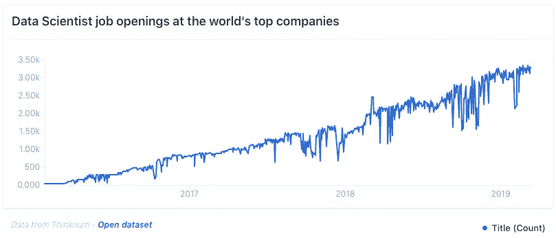

# 招聘不是一直都是断的吗？

> 原文：<https://towardsdatascience.com/hasnt-hiring-always-been-broken-91a2adfb721c?source=collection_archive---------33----------------------->

## 以及为什么新的人工智能招聘创业公司会失败

承蒙[thinknum.com](https://media.thinknum.com/articles/massive-increase-in-demand-for-data-science-jobs-in-2019/)

四年前，我加入了一家名为 Jobr 的小型创业公司，该公司被称为“就业引爆器”。你可以注册，上传你的简历，然后开始刷推荐给你的工作。向右滑动应用，向左滑动通过。我最初是一名机器学习工程师，负责提高用户申请工作的数量，因为这直接影响到我们从外部工作平台和合作伙伴那里赚了多少钱。

由于多种原因，这被证明是具有挑战性的。一个是人们喜欢不上传简历，而期待得到精心调整和推荐的工作。他们会在 app store 评论中抱怨类似于*我正在攻读计算语言学硕士学位，你为什么给我看咖啡师的工作？*另一个原因是用户要么选择性很高，要么根本没有选择性。我们的许多用户，如果有机会**像对待他们的 Tinder 选择一样对待他们的求职，会不断向右滑动，申请数千个职位**。我们称它们为*刷卡轰炸机*，因为讽刺的是，它们为我们带来了大部分收入，但质量却很差。没有人想要一个同时申请该市 2000 份其他工作的候选人。

这最终让 Jobr 陷入了困境。通过降低我们申请的质量，刷单炸弹淹没了我们的工作伙伴(他们按申请付费)，结果质量很差。一个合作伙伴在意识到质量下降了多少后，第二个月就减少了 70%的预算。**应用程序的质量和数量成反比**，我们能做的不多。我们会尽量推荐足够多的高质量申请，这样工作伙伴就不会拒绝我们，但仍会尽量增加申请数量以增加收入。

这种*质 vs 量*的关系很能代表更广阔的就业市场。许多工作从来不会缺少数量，而是缺少高质量的申请人。但是到底什么是“优质”申请人呢？这是一个困扰我们的问题。

在某些情况下，这很容易。如果你是一名卡车司机，申请一份卡车司机的工作，那绝对是质量问题。但是，如果你是一名卡车司机，申请一份行政助理的工作，那么…..那很棘手。从技术上讲，行政助理是一个入门级的工作，但质量可能取决于该职位是否接受其他过去的行政助理。

我现在明白了**大多数工作质量衡量完全是扯淡**不管有多少新的时尚招聘/招聘初创公司吹捧人工智能将如何彻底改变公司的招聘流程。例如，在 Jobr，我们的工作伙伴不能就质量衡量标准达成一致。一位合伙人告诉我们，某个月我们的高质量申请人比例是 30%，而另一位合伙人会说同样的申请人比例是 15%。

但是让我们继续深入下去。比方说，一家公司有一个很棒的招聘人员，他可以非常准确地从简历中判断出谁会通过面试。你经历了面试过程，但昨晚没有睡好，也许你分心了，因为你的孩子因为向别人脸上吐痰而被学校停学，你的面试官决定那天他们想问你关于神经网络的知识，尽管他们过去的六个月都在使数据库符合 GDPR 标准。现在你的申请突然被标记为不合格。

但是，让我们开玩笑说，你通过了面试，你的公司正在使用一个新的闪亮的人力资源分析软件来衡量高质量的表现。现在是你的季度评估，你觉得你的经理只是…有点忘记你了？你认为你的经理对你团队中的每个人都给出了完全客观的绩效评估，但是你的经理确实对你的同事笑得更多一些。昨天你发誓你听到他们花了一半的时间一对一地谈论他们上周末在酒吧的恶作剧。有没有可能你的经理给出的评价更多的是**他们有多喜欢或不喜欢某个人，而不是他们的表现有多好**？！有没有可能是你的经理自己的工作表现更多地**取决于主管有多喜欢他们**而不是收入增加，以便不将你的团队下个季度的预算减半？

我们可以深入探究，但最终，我认为招聘流程被打破这句话之所以流行是有原因的。因为漏斗的每一步都有可能因人的偏见而出错，最终会影响许多我们无法控制的事情。未来，人工智能是否真的可以检查和测量人类推理的个性和细微差别，理解我们的动机和公司的内部运作，以正确解决完美的系统，我不完全确定。

所以下次如果你想知道为什么你没有得到那份工作，也许可以归咎于人性。

# 感谢阅读！

如果你喜欢我的作品并想了解更多…

*   如果你对这篇文章有什么看法，或者想知道你的公司是如何招聘数据科学人才的，你可以在这里给我发电子邮件。
*   查看 [**面试查询博客**](https://www.interviewquery.com/blog) ，我们在这里发布数据科学指南和面试技巧。
*   成为第一批订阅[我的新 **YouTube 频道**](https://www.youtube.com/channel/UCcQx1UnmorvmSEZef4X7-6g?view_as=subscriber) **的人之一。**