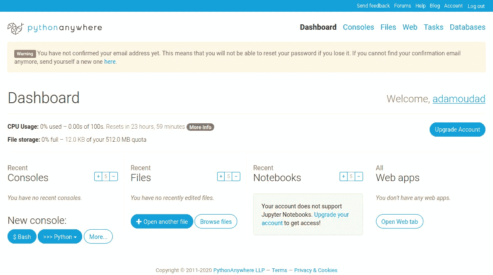
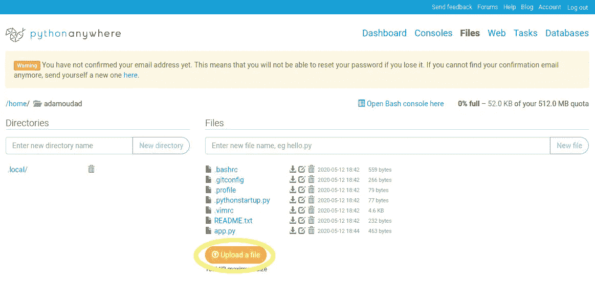
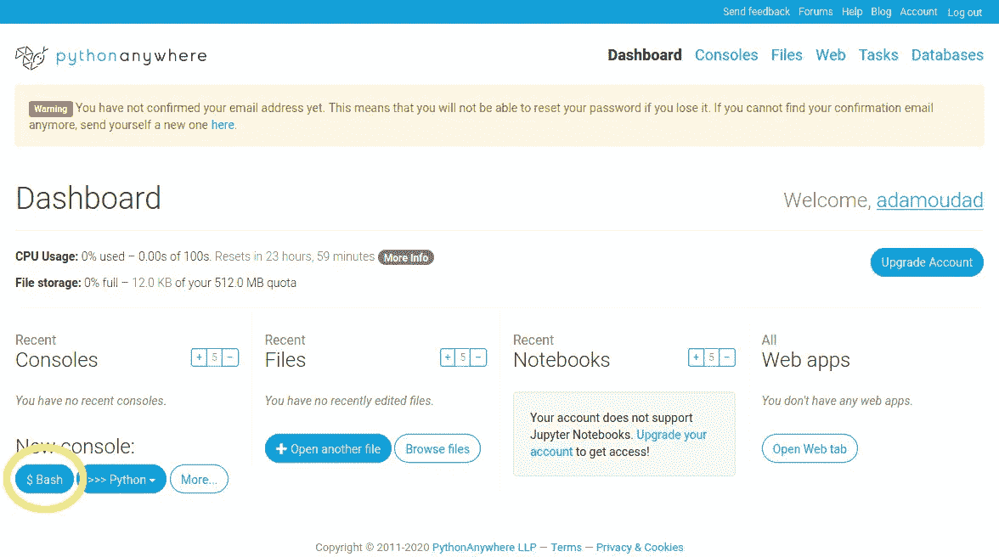
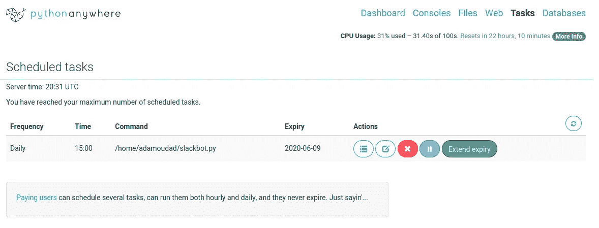

# 让一个机器人在你空闲的工作空间出没

> 原文：<https://towardsdatascience.com/have-a-bot-haunt-your-slack-workspace-1aa333bb1873?source=collection_archive---------59----------------------->

## 用 Python 快速创建你的自动化 Slack 机器人

照片由 [**斯科特·韦布**](https://www.pexels.com/@scottwebb?utm_content=attributionCopyText&utm_medium=referral&utm_source=pexels) 发自 [**Pexels**](https://www.pexels.com/photo/conceptual-creativity-design-display-430205/?utm_content=attributionCopyText&utm_medium=referral&utm_source=pexels)

在本文中，我们将看到如何为 [Slack](https://slack.com) 编写简单的 bot，并安排它定期运行。由于一些测试可能是必要的，我建议在本教程中创建一个虚拟的松弛工作空间。

# 为您的宽松工作空间添加一个 web 挂钩

我们首先需要配置一个 web 钩子来与我们的 Slack 工作空间通信。进入[这个网址](https://my.slack.com/services/new/incoming-webhook/)，选择你的频道，点击添加一个网页挂钩。本教程我选择发帖到`#random`频道。配置的其余部分可以保持不变，因此您可以保存它。

复制你的网页挂钩网址，其形式应该是[https://hooks.slack.com/services/SOME_GIBBERISH_CODE.](https://hooks.slack.com/services/SOME_GIBBERISH_CODE.)

# 在本地运行 bot

让我们在本地测试我们刚刚创建的 web 钩子的连接。我们将使用 python 库 [slackweb](https://github.com/satoshi03/slack-python-webhook) 。代码很简单。我们会把这个放在`slackbot.py`里。

将`HOOK_URL`的内容替换为从上一步复制的钩子 URL。然后运行代码，检查是否有效；您应该在`#random`中看到一条来自您的程序的消息。上面代码的第一行指定了要运行的 python 解释器的位置，如果文件包含 unicode 字符，如日语汉字或法语é，à等，则应该使用第二行。

# 安排节目

你可以决定安排程序在你自己的电脑上运行，但是如果你想让它在你的电脑关机时也能运行，我们需要一个网络服务器。 [PythonAnywhere](https://www.pythonanywhere.com/) 为开发目的提供免费的服务器空间和 python 环境。因此，让我们创建一个帐户，并前往我们的 [PythonAnywhere 仪表板](https://www.pythonanywhere.com/dashboard/)。

转到*文件*选项卡，将您的文件`slackbot.py`上传到您的目录`/home/your_username/`。

然后，让我们安装依赖项。打开一个 bash 终端并运行`pip3 install --user slackweb`。

在同一个终端内，我们可以检查一切是否正常。运行`python3 slackbot.py`，查看该消息是否再次出现在#random channel。

调度在*任务*选项卡中完成。通过指定运行的频率和命令来创建任务:`/home/adamoudad/slackbot.py`。您可以在创建任务时看到任务的截止日期，大概是一个月。对于免费计划，PythonAnywhere 要求您每月至少登录一次，以使您的计划任务保持有效。

# 结论

就是这样！你让你的机器人在网上运行。它会萦绕在你松弛的工作空间，直到时间的尽头…真诚地。

*原载于 2020 年 5 月 21 日*[*https://adamoudad . github . io*](https://adamoudad.github.io/posts/python-slack-bot/)*。*