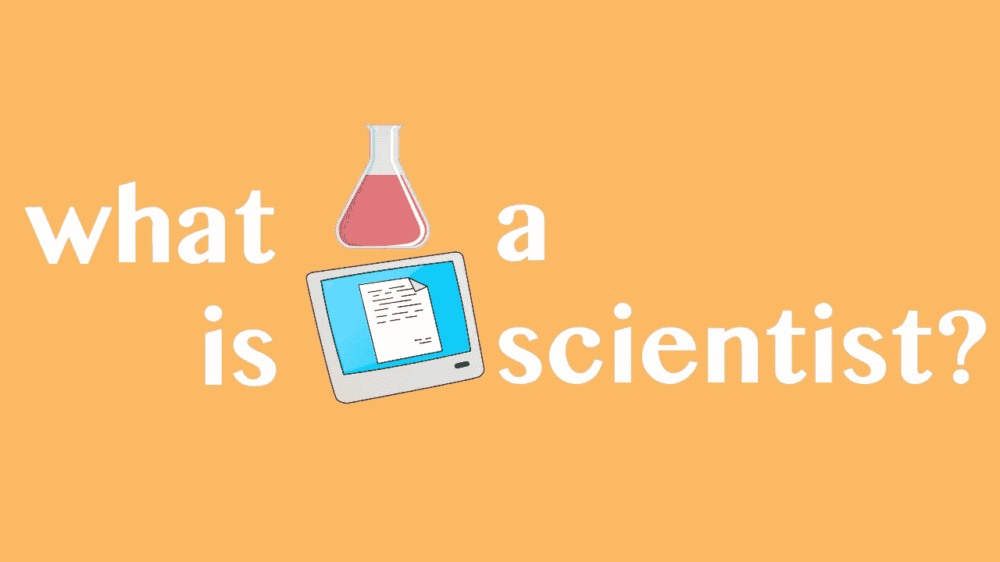

# 所有的科学家都成为数据科学家了吗？

> 原文：<https://towardsdatascience.com/have-all-scientists-become-data-scientists-b6536d38ced1?source=collection_archive---------62----------------------->

## 计算如何革新了几乎所有的应用科学。

几天前，我在观看白宫的一次演讲时，黛布拉·比尔克斯博士走上台，展示了一种正在传播的新型病毒的信息。我记得当她指着她的图表说“看看这个置信区间”时，我笑了，我知道一般人**完全不知道什么是置信区间**。这对我来说很幽默，虽然我的女朋友不知道她在说什么，但她看着我，肯定这确实是统计数据。

虽然这可能对我来说有点有趣，但它也让我的大脑工作起来——加上我最近对生物信息学的兴趣，我真的开始问这个问题了…

> 所有的科学家都成为数据科学家了吗？

# 计算和科学

为了理解为什么所有的科学家都可能以这样或那样的方式成为数据科学家，我们需要理解计算机对科学的影响有多大。典型的科学包括记录结果，我们当然称之为数据，然后比较和测试这些结果，以识别控制的变化。这可能很简单，只要在一个数据框架中分离出当天下午吃了泡菜而死亡的人，并进行独立的 t 检验，以观察吃泡菜的人也自发死亡的统计意义。

也许这是一个不好的例子——因为它可能会被驳回，因为我们可以假设吃泡菜不太可能杀死你，但重点仍然是一样的。计算机特别擅长的一件事是存储数据并利用这些数据进行计算，比如 t 检验。考虑到这一点，很容易理解为什么计算机被用于科学这么久了。计算机和科学就像面包和黄油或花生酱和果冻一样，计算可以让两小时的数学工作迅速变成二十分钟的数学工作。考虑一下在纸上找到一组 300 个元素的观察值的平均值需要多长时间。首先，你需要把它们加起来，这需要用算盘、计算器(从技术上来说是一台计算机)或者在一张纸上手工完成——哎呀！

很容易理解为什么计算机将人类带入了一场巨大的科学运动。几乎很难想象自二战以来，世界各地的生活发生了多大的变化，如果你仔细想想，这大约与计算机在人类生活中发挥作用的时间相同。

因此，不用说，计算机使计算和数据管理和处理比没有它要容易得多。因此，世界上大多数科学家已经在通过对他们收集的数据进行编程来进行他们所有的研究。虽然这肯定是统计学在科学中的应用，以及计算机在统计学中的应用，但这并不一定意味着这些科学家就是数据科学家。

# 数据可视化

数据科学的很大一部分是数据分析和测试。科学家也使用这种方法，我发现生物信息学中的过程实际上与典型的数据科学过程相同。最大的区别是我读取的数据类型，数据存储的格式，以及我如何可视化和交流数据以及我对数据的发现(假设数据是基因组，而不是数字或类别。)

由于这是数据科学中如此巨大的一部分，它也是所有科学中普遍存在的一个巨大部分可能会令人惊讶。随之而来的是一些共同点。统计学。统计学是从各种数据中得出结论的非常重要的工具。很难从 30 万条观察数据中得出任何推论。利用统计学，我们可以利用我们观察到的信息得出有根据的结论，并检验我们的假设。这变得更加容易，而且几乎是由计算机实现的。如前所述，如果没有计算机为你管理，管理大量的数据是相当困难的。所以在某种程度上，我们现在进行的许多统计都是因为计算才成为可能的。

# 机器学习

通常用来区分数据科学家和任何其他科学家的区别是从机器学习模型中得出结论和准确预测的能力。机器学习模型是使用统计数据来自动推断不存在的观察值的算法。

然而，似乎数据科学变得越主流，这样做的工具也变得越主流。随着这一点，机器学习的概念本身也随之改变。越来越多的科学家似乎将机器学习作为他们武器库中的另一种工具，而不认为自己是数据科学家。

回到我举的白宫的例子，黛布拉·比克斯博士，安东尼·福奇——他们一直在遵循**模型**来预测疫情将会发生什么。这些模型当然是定义完全相同的模型；它们被用来预测不存在的观察结果。在这种情况下，他们按日期预测死亡和病例。

# 结论

我认为对于那些参与机器学习的人来说，这可能是一件有趣且发人深省的事情。既然机器学习已经成为科学的主流，那么所有的科学基本上都已经成为数据科学了吗？我认为答案绝对是肯定的，但我好奇的是这给数据科学家们自己留下了什么。如果所有科学家都是数据科学家，那么所有数据科学家都是科学家吗？我认为最大的区别是，通常数据科学家被用来解决企业问题，或将模型应用于更一般化的数据，而不是专门的基因组学和生物信息学。总的来说，这的确是一件有趣的事情。