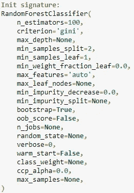
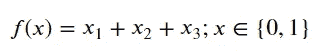
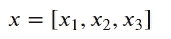
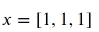
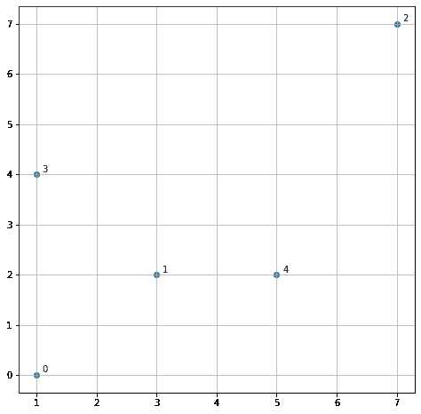
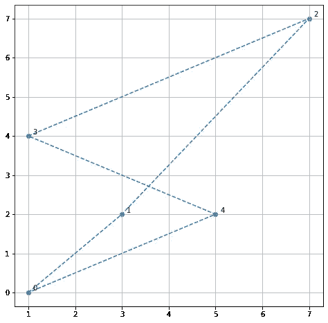
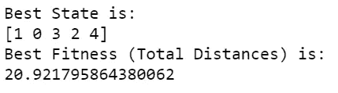
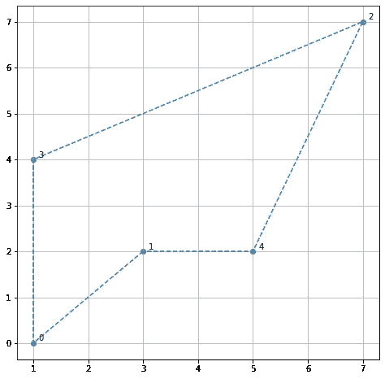

# 你听说过最优化问题吗？

> 原文：<https://towardsdatascience.com/have-you-heard-about-the-optimization-problem-a0bab74e26c?source=collection_archive---------54----------------------->

## 如果没有，这是问题的入门文章。


在 [Unsplash](https://unsplash.com?utm_source=medium&utm_medium=referral) 上 [engin akyurt](https://unsplash.com/@enginakyurt?utm_source=medium&utm_medium=referral) 拍摄的照片

# 介绍

作为一名数据科学家，有时我们需要创建一个脚本或机器学习模型来回答我们的问题。有时候，有很多方法可以解决我们的问题。举一个分类问题的例子；我们可以应用基于概率的模型、基于树的模型或基于线性的模型。最初，在 EDA 之后，我们会选择由数据填充的模型。现在，也许我们采用一个随机森林模型，并希望训练该模型。



你们中的许多人会意识到有许多参数需要调整，就像旁边的图片一样。然后，您尝试参数的每个组合，直到找到适合您模型的**‘最佳’**参数，但这肯定会花费很长时间。

我刚才在上面的文章中解释的就是我们所说的**优化问题**。

形式上，我们可以将优化问题定义为

> "根据目标函数寻找最佳状态的问题."

我们所认为的状态是不同的，因为它取决于上下文。可能是

*   随机森林模型的参数；
*   棋盘上的国际象棋位置；
*   深度学习模型中的神经网络权重
*   地图上火车站的放置顺序。

这里重要的是，可能的状态有很多种，但我们要找到的是**【最佳】**解(或者用数学术语**目标函数**、**适应度函数**、**代价函数**，或者**损失函数**)。对于优化问题，我们希望最大化或最小化这个函数。

在最优化问题的情况下，因为我们比较每个状态以找到数学上的最佳函数，这意味着状态应该是一个**数值**值(或数值向量)。优化问题本身可以分为连续优化，或者取决于变量的离散优化。

# 数学例题

如果你想象有问题，让我用一个简单的数学函数来展示。想象一下，如果我们有一个如下的目标函数。



其中 x 是由状态组成的向量



现在，例如，我们有一个优化问题，我们希望最大化目标函数，或者换句话说，从函数中获得尽可能大的最高值。在上面的问题中，函数只能取 0 或 1 之间的值。现在，我们可以有很多 x 的组合，可能是 x = [0，0，0]，或者 x = [0，1，1]等等。但是我们想最大化目标函数。也就是说，最优解应该是



其中 f(x)设为最优解的函数为 **f(x) = 3。**我刚才解释的是优化问题的一个例子，我们希望目标函数产生最大值。

在现实世界的问题中，等式永远不会那么简单。它通常涉及复杂功能和大量的状态组合。由于我们不能在合理的时间内优化目标函数，这就成了一个问题。

解决这个问题的一个方法是应用**随机优化算法**。顾名思义，我们不会遍历所有状态，而是从一个初始的“最佳”状态向量开始，然后随机生成一个新的状态向量(通常是当前“最佳”状态的邻居)。如果新状态更好，则新向量成为新的“最佳”状态向量。我们重复它，直到达到给定的最大重复次数。

# 实际应用——旅行推销员问题

旅行推销员问题(TSP)是一个优化问题，我们试图确定 n 个城市(或房子、车站等)的最短行程。你喜欢的任何类型)，在同一点开始和结束，并且访问所有的位置一次。例如，我在下面的网格中收集了五个城市。



我希望销售人员在所有城市旅行一次，并且在同一个城市开始和结束。如果我们设置解向量 x = [0，1，2，3，4]并假设城市从 0 开始，那么推销员将像下面的网格一样旅行。



所走的路线似乎不是最佳路径。这就是我们试图找到最短路线或最优化问题的地方。

对于本文，我将使用一个名为 [mlrose](https://mlrose.readthedocs.io/en/stable/index.html) 的优化问题模块。如果要安装该模块，可以运行下面的代码。

```
#Installing using pip
pip install mlrose
```

使用 mlrose 解决优化问题包括三个步骤:

1.  定义一个适应度函数对象(我们喜欢最小化/最大化的函数)。
2.  定义一个优化问题对象(包含我们试图解决的优化问题的所有基本信息的对象)。
3.  运行随机优化算法。

首先，我们需要定义适应度函数对象。幸运的是，mlrose 已经有了用于定义适应度函数对象的`TravellingSales()`类。最初，`TravellingSales()`类需要所有城市的(x，y)坐标(或距离)。

```
import mlrose*# List of city coordinates*
coords = [(1, 0), (3, 2), (7, 7), (1, 4), (5, 2)]*# Initialize fitness function object*
fitness_coords = mlrose.TravellingSales(coords = coords)
```

启动适应度函数后，我们将定义优化问题对象。mlrose 模块已经将`TSPOpt()`作为优化问题对象。我们只需要通过输入几个参数来定义对象。在上面的例子中，我们想要解决长度为 5 的最小化问题。在这种情况下，我们将优化对象定义如下

```
*# Define optimization problem object. length parameter is the number of the cities, fitness_fn is the fitness function, and we set maximize to false as we want the minimal distance*problem = mlrose.TSPOpt(length = 5, fitness_fn = fitness_coords, maximize=False)
```

我们现在准备选择一个随机优化算法，并用它来解决我们的问题。随机优化算法是基于[进化算法](https://en.wikipedia.org/wiki/Evolutionary_algorithm)，我不会深入解释此事，但 mlrose 模块中使用的参数就是基于此。在我们的示例中，我尝试将 mutation_prob 参数(只需将该参数视为基于当前最佳状态的状态变化率)设置为 0.2，将 max _ attemps(重复次数)设置为 100。

```
best_state, best_fitness = mlrose.genetic_alg(problem, mutation_prob = 0.2,max_attempts = 100, random_state = 2)print('Best State is:')
print(best_state)print('Best Fitness (Total Distances) is:')
print(best_fitness)
```



我们可以看到算法找到的最佳状态是[1，0，3，2，4]。我还提出了显示我们所走的总距离的最佳适合度，因为我们在这个问题中最小化的是总距离(准确地说是欧几里德距离)。如果我们把它形象化，我们的销售人员会走下面的路线。



仅此而已。我们已经将优化问题应用到旅行推销员问题中，并找到了推销员可能走过的最佳路线。这就是我们如何用最优化问题来解决我们的问题。

# 结论

优化问题是根据目标函数寻找最佳状态的问题。这种状态可以是任何东西，从机器学习模型参数到推销员的旅行路线。目标是最大化或最小化给定状态的目标函数。

# 如果您喜欢我的内容，并希望获得更多关于数据或数据科学家日常生活的深入知识，请考虑在此订阅我的[简讯。](https://cornellius.substack.com/welcome)

> 如果您没有订阅为中等会员，请考虑通过[我的推荐](https://cornelliusyudhawijaya.medium.com/membership)订阅。