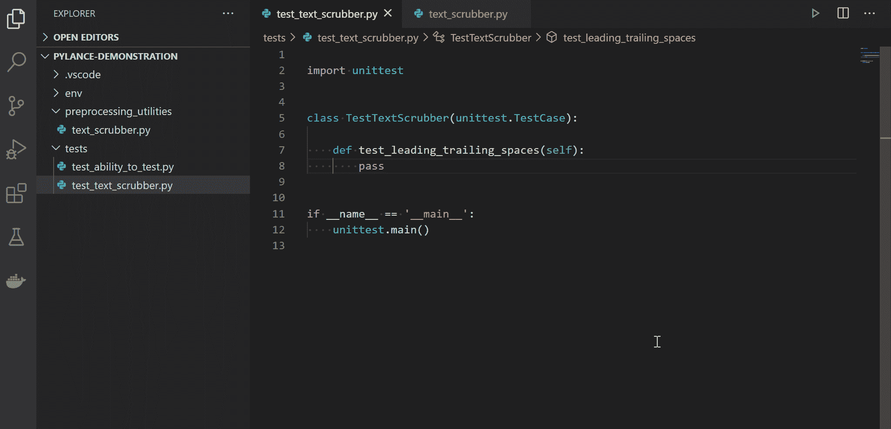
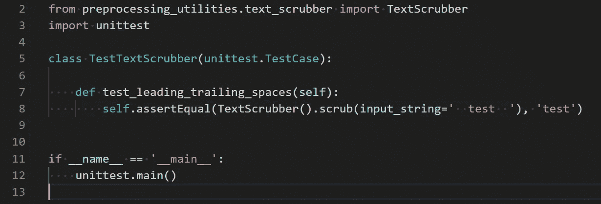
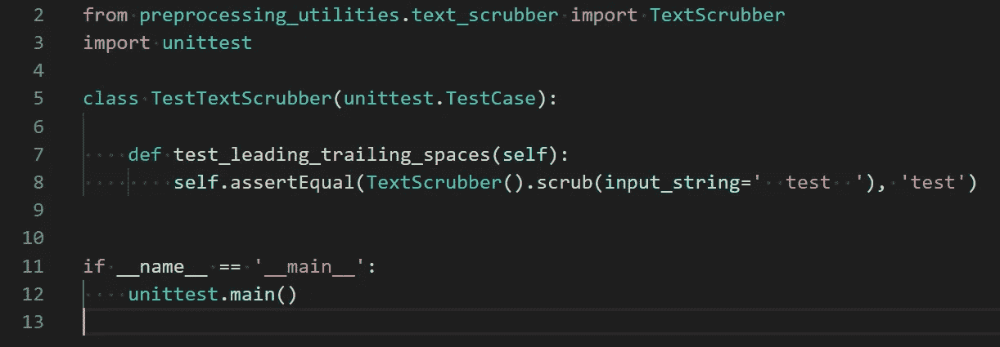
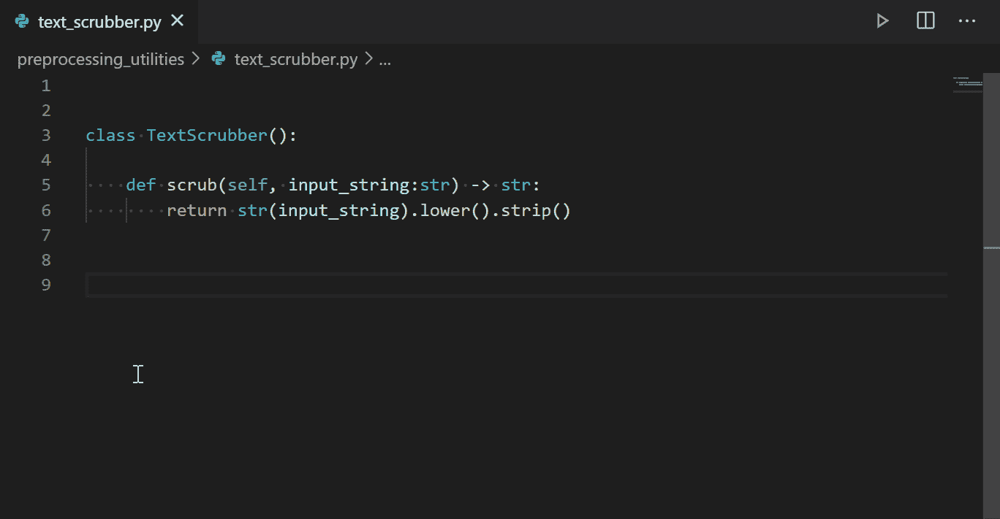

# 你试过 VS 代码的 Pylance 吗？如果没有，下面是你应该这么做的原因。

> 原文：<https://towardsdatascience.com/have-you-tried-pylance-for-vs-code-if-not-heres-why-you-should-a8a7b5adc5f2?source=collection_archive---------5----------------------->

## PYTHON 开发| VISUAL STUDIO 代码

## 最新的 Python 语言服务器(来自微软)是一个巨大的生产力增强器。

如果你使用的是 [Python](https://www.python.org/) 和 [Visual Studio 代码](https://code.visualstudio.com/)，那就帮自己一个忙:下载 [Pylance](https://marketplace.visualstudio.com/items?itemName=ms-python.vscode-pylance) 扩展(预览版)并亲自试用。

# 什么是挂架？

[Pylance](https://marketplace.visualstudio.com/items?itemName=ms-python.vscode-pylance) 是对 [Visual Studio 代码](https://code.visualstudio.com/)的扩展。更具体地说，Pylance 是一个 Python 语言服务器——这意味着它提供了对智能感知、语法高亮、包导入解析和无数其他特性的增强，以改善 Python 语言的开发体验。

你可以在这里找到[功能的完整列表](https://marketplace.visualstudio.com/items?itemName=ms-python.vscode-pylance)。为了简单起见，我将根据我迄今为止对该扩展的体验，重点介绍三个最有用的特性。

# 自动进口(也就是更少的麻烦)

在 Python 中，理解如何正确地从内部和外部模块导入依赖关系对新手和专业人员都是一个挑战。

Pylance 扩展提供了一个特性，当您在环境中引用一个依赖项时，它会自动将导入添加到 Python 文件的顶部。它还会显示一个灯泡图标，根据场景建议添加或删除导入。

值得一提的是，您需要在 Python 环境中安装您所引用的模块，这样才能工作。



下面是 Pylance 的一些功能的快速演示。请注意，依赖项是在第 2 行自动导入的，未使用的导入是灰色的，并且类和函数现在都有自己独特的颜色(分别是绿色和黄色)。

# 语义突出显示(也称为漂亮的颜色)

Pylance 的语义突出显示意味着类、函数、属性和其他 Python 对象类型在屏幕上以更加直观和易读的方式进行着色(即突出显示)。

直观演示比试图描述要容易得多，所以这里有一些截图…

## 禁用 Pylance 的代码高亮显示



导入、函数、类和变量都是白色的。理解上下文需要命名和大小写约定。

## 启用 Pylance 的代码高亮显示



模块和类是绿色的，函数是黄色的，变量是蓝色的。这使得代码一目了然，更容易理解。

# 类型检查(也就是更少的错误)

类型提示，或者为变量/函数/类等指定预期数据类型的实践。，对 Python 来说是相当新的。Python 不强制类型提示，所以在这一点上，它本质上只是文档的最佳实践。

然而，使用 Pylance，启用类型检查设置(见下文)将帮助您了解您的代码是否违反了任何记录的类型提示。类型检查有两种模式，基本模式和严格模式(在首选项中配置)。这个时候我会建议坚持基本设置。

```
{
    "python.analysis.typeCheckingMode": "basic"
}
```



Pylance 创建了两个红色的语法亮点——第一个告诉我，我正在将一个整数传递给一个需要字符串的函数参数，第二个告诉我，我的函数应该返回一个字符串，但却返回了一个整数。

# 结论

用于 [Visual Studio 代码](https://code.visualstudio.com/)的 [Pylance](https://marketplace.visualstudio.com/items?itemName=ms-python.vscode-pylance) 扩展仍在预览中。还需要做更多的工作来提高性能，扩展文档，并解决一些错误。然而，在我的经历中，这已经是一个很棒的扩展了。启用 Pylance 后，我当然不想回到 Python 的默认语言服务器。

我建议你自己尝试一下这个扩展，并随时留下你的想法！