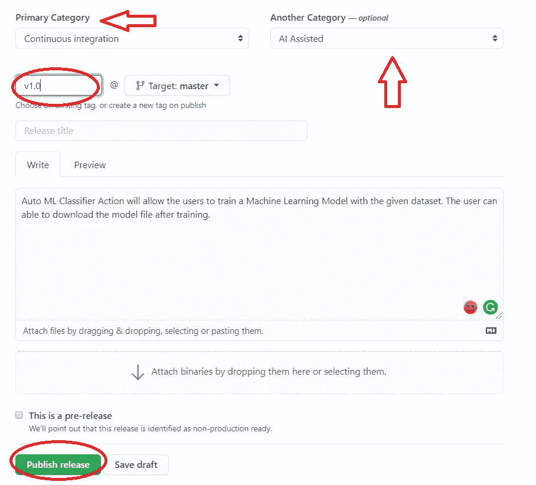
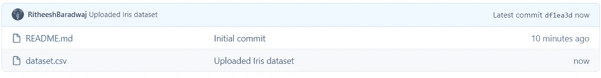

# 使用 GitHub 动作自动构建您的 ML 模型

> 原文：<https://towardsdatascience.com/have-your-ml-models-built-automatically-using-github-actions-5caa03c6f571?source=collection_archive---------38----------------------->

## 如何在 Marketplace 上发布自定义 GitHub 动作，用于构建机器学习应用。

大规模应用的手动任务(使用 Canva 设计)

> GitHub Actions 说:“给我数据集，我会为你建立模型!”！

你有没有想过有一个自动化的流水线，根据我们的需求训练我们的模型，并为我们提供结果？想象一下那会让你有什么感觉！现在，您可以选择创建一个管道，接受来自用户的数据集，并使用 GitHub 操作直接提供模型文件(pickle 文件)。

GitHub Actions 帮助我们自动化从代码提交到部署的任何软件开发工作流程。在这里，我们可以编写称为*动作*的单独任务，为我们完成特定的工作。在本文中，我将向您展示如何创建一个*动作*来在给定数据集时自动构建分类器模型。此外，该操作可以发布在 GitHub Marketplace 上，供其他人使用(使用我们的自定义操作)。

如果你是工作流和动作的新手，你可以访问我之前关于 [GitHub Actions](/github-actions-makes-one-click-to-deploy-feasible-for-ml-ci-cd-pipeline-61470ed3edbc) 的文章来获得一个简要的概述。

> 我们开始吧！

## 计划自定义操作

我们不想在设计工作流时出错，所以让我们用一个清单为我们的自定义操作制定一个计划。

使用 Canva 设计

*   **Dockerfile —** 所有动作都需要一个 Dockerfile 来定义运行动作的容器环境。
*   **action.yml —** 这将为我们的操作定义输入、输出、入口点，以及其他细节，如操作名称、描述、作者姓名等。
*   **脚本—** 一个动作可能需要一个脚本来执行任务，在我们的例子中，导入数据集和训练模型就是任务。所以这里我们使用一个 python 脚本。
*   **README.md —** 这是可选的，但是如果我们想在市场上发布我们的行动，我们就需要它。README.md 文件有助于提供操作顺利运行所需的示例和变量。
*   **一个 GitHub 库—** 所有的动作代码都会保存在一个 GitHub 库中。

## Dockerfile 文件

Dockerfile(作者照片)

我们需要一个操作将在其中运行的 Dockerfile 文件。安装了模型训练所需的必要依赖项，并在此定义了入口点。

## 设置 action.yml 文件以定义操作

actions.yml 文件(作者提供照片)

正如我前面所说的，这个文件帮助我们定义动作的输入和输出。在我们的例子中，在模型被训练之后，我从用户那里获取输入进行分类。我们还将使用 actions.yml 文件在市场中用图标和颜色标记我们的行动。

## 用于训练模型的 Python 脚本

脚本是使动作执行任务的主要核心部分。在这里，我们可以使用环境变量、访问机密和任何事件数据。我们可以考虑使用 Python、Ruby、Java、C#编写脚本。

用于训练模型的 Python 脚本

在当前操作中，我们通过环境变量 **GITHUB_REPOSITORY 访问用户上传到 GitHub 存储库中的数据集。**一旦我们得到数据，输出变量被编码。我用 SVM 来分类。随着模型的构建，它将被存储在容器中以备后用。

> **注意:**这里我们假设数据集是干净的，没有丢失的值。对于不同的任务，脚本可以是不同的，您可以相应地定制它。我们还可以执行几项工作，如数据预处理、特征工程等。

一旦创建了所有必要的文件并上传到 GitHub，存储库应该如下所示。

GitHub 知识库(作者提供图片)

## 将行动发布到市场

GitHub 足够智能，可以检测 action.yml 文件，并询问我们是否要将该操作发布到 Marketplace。点击**发布草稿。**

> 在发布之前，请确保您已经为 GitHub 帐户启用了双因素身份验证。

发布行动(作者照片)

如果一切正常，可以看到上面的控制台。现在提供所需的详细信息，如主要类别、描述、标签名称等。如下图。

发布行动的其他详细信息(作者提供的照片)

填写完必要的详细信息**后，点击**发布发布**。**

行动发布(作者供图)

点击右上角的**市场**。

> TADAAA！！我们的行动已发布，现在出现在[市场上。](https://github.com/marketplace/actions/autom-ml-classifier-action)

GitHub Marketplace 上的自动 ML 分类器操作(作者提供图片)

## 这个动作怎么用？

既然我们已经在市场上发布了*动作*，让我们看看如何在我们的工作流程中使用它。

使用自动 ML 分类器动作(作者照片)

当您点击**使用最新版本时，**将显示提示。我们需要复制代码并在我们的工作流程中使用它，如下所示。为了简单起见，我使用了虹膜数据集来训练模型并对花进行分类。我已经提供了测试模型的输入。

工作流程(作者照片)

现在创建一个存储库并上传数据集来训练模型。数据集文件的名称必须是 **dataset.csv** (在我的例子中)。

GitHub 知识库(作者提供图片)

数据集格式(作者提供的照片)

现在到 GitHub 控制台上的**动作**，点击**自己设置一个工作流程。**

GitHub 操作部分(作者提供图片)

点击**开始提交，**给出提交信息(可选)，点击**提交新文件。**

提交工作流文件(作者照片)

一旦你点击**提交新文件，**工作流就开始了。转到 **Actions** ，您将找到与您之前给出的提交消息同名的工作流。

执行工作流程(作者提供照片)

单击工作流，您将看到控制台输出。对于给定的输入和模型精度，您可以看到模型的输出。在右上角，您可以点击**工件**，下载模型文件并在我们的本地机器上使用。

控制台输出(作者提供照片)

该工作流在 **push** 事件时触发，即每当用户上传数据集或对数据集进行任何更改时，GitHub 动作— **Auto ML Classifier** 将为我们构建模型。当在本地机器上构建模型出现问题时，这个操作会很方便。此外，通过添加不同的阶段，可以测试模型并部署它，或者以不同的版本将应用程序交付给用户。

***自动 ML 分类器动作*** 的完整代码可以在 GitHub [这里](https://github.com/developers-cosmos/Auto-ML-Classifier)找到。

***测试动作*** 的完整代码可以在 GitHub [这里](https://github.com/RitheeshBaradwaj/Testing_GitHubAction)找到。

## 结论

在本文中，我们已经看到了如何创建一个 GitHub 动作，一旦数据集被提供，它就自动构建或训练一个机器学习模型。此外，创建的操作在文章中被发布到 **Marketplace** 。通过使用 GitHub Actions，我们可以实现完全成熟的**持续集成**和交付( **CI** / **CD** )功能，这些功能内置于服务中。

如果你有什么建议，我很乐意听听。我很快会带着另一个有趣的话题回来。在那之前，呆在家里，保持安全，继续探索！

如果想联系，**联系我上**[**LinkedIn**](https://www.linkedin.com/in/ritheesh-baradwaj-yellenki-8a6988173/)**。**