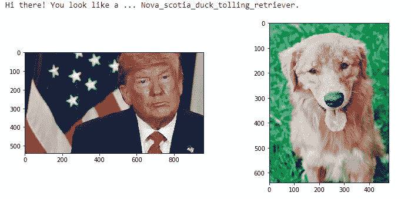
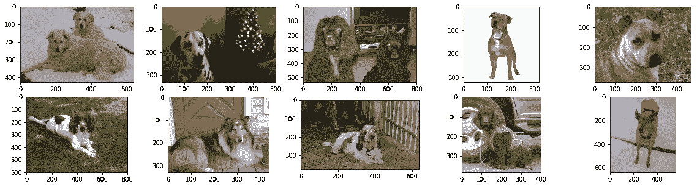
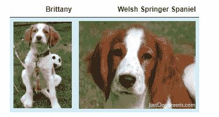
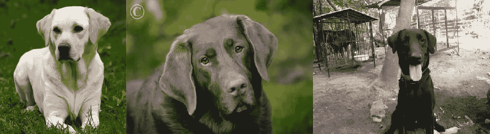
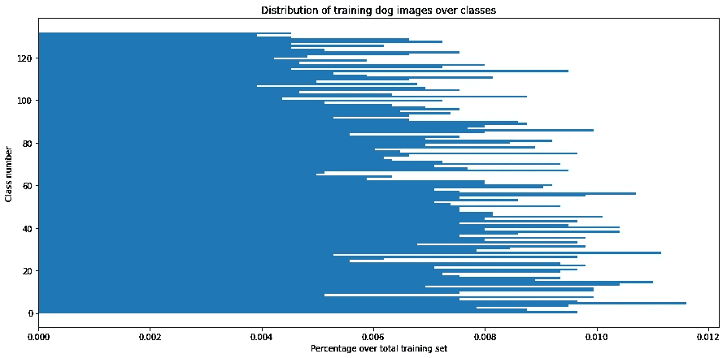
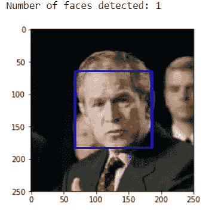
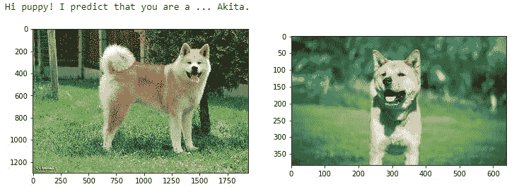
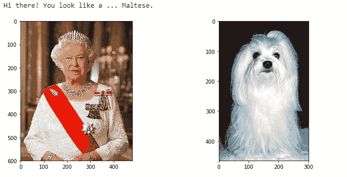

# 愉快地学习 CNN:适用于人类图像的狗品种预测示例

> 原文：<https://towardsdatascience.com/having-fun-learning-cnns-example-of-dog-breed-prediction-applicable-to-human-images-59b0700462b5?source=collection_archive---------39----------------------->

## 应用程序的核心算法，根据狗的品种对狗的图像进行分类，并在提供人的图像时输出最相似的品种。



图 0:预期输出。

# 一.项目定义

## **项目概述**

这个项目旨在创建一个核心算法，根据狗的品种对狗的图像进行分类，这可以用作移动或网络应用的一部分。该应用程序应该提供一个有趣的用户体验，因为它不仅接受狗的图像，而且接受任何用户提供的图像作为输入。如果检测到狗，算法应该输出狗的品种预测。如果检测到人类，输出的应该是最像狗的品种！

## **问题陈述**

使用的分类器是卷积神经网络(CNN)，它被称为最先进的图像分类。涉及以下步骤:

-预处理图像

-建立辅助功能，如人类探测器和狗探测器

-从头开始尝试构建 CNN 分类器

-使用迁移学习训练分类器

-预测和分析结果

在整个项目中，用于构建 CNN 架构的主要库是 Keras。

## **指标**

犬种分类器是一个多类分类问题，因此最相关的评价指标是准确性。准确度被定义为正确预测的数量与做出的预测的总数之比。值得注意的是，该模型将仅在狗图像上进行评估，尽管它将用于预测与人类图像最相似的狗品种。

# 二。分析

## **数据探索**

主数据集总共包含 8351 张狗的图片(Credit: [Udacity](https://github.com/udacity/dog-project) )，数量相当少。这些图片预先标注了 133 个犬种名称。数据集分为训练集、评估集和测试集，比例分别为 80%、10%和 10%。

这里展示了一些狗的图片:



图 1:数据集中狗图像的一些例子。数据集信用: [Udacity](https://github.com/udacity/dog-project)

很容易发现以下情况:

-图像大小不均匀，因此必须进行图像预处理。

-在一幅图像中可以有不止一只狗，因此分类模型的学习任务将更加复杂。

-图像提供有白色背景或彩色和不同背景，其中可以发现各种对象。

分类的任务是非常具有挑战性的，因为在一些犬种对之间存在最小的类间差异，即使是人也很难区分。



图 2:模型能够区分布列塔尼和威尔士史宾格猎犬吗？。信用: [Udacity。](https://github.com/udacity/dog-project)

同时，由于高的类内变异，算法将不得不找出如何将不同颜色的狗分类为同一品种。



图 3:将黄色、巧克力色和黑色拉布拉多归类为同一品种很有挑战性。信用: [Udacity](https://github.com/udacity/dog-project) 。

此外，还提供了 13，233 幅人体图像的数据集。这将有助于测试人类检测器的功能以及最终算法的输出。

## **数据可视化**

下图显示了每类训练图像的分布。可见品类之间是不平衡的。频率最高的类大约是训练集大小的 1.2%，而频率最低的类大约低 3 倍(训练集大小的 0.4%)。这种不平衡问题可能会导致过度拟合，而模型可能更适合常见的犬种。

然而，这种不平衡并不严重，就像有些班级图像很少一样。事实上，就绝对数量而言，每类图像的数量大约在 26 到 80 之间。这不会阻止模型学习并以一定的准确度输出预测。



图 4:训练狗图像分布不均衡。

# 三。方法学

## **数据预处理**

由 Keras 构建的 CNN 需要具有形状(nb_samples，rows，column，channels)的 4D 输入张量，其中 nb_samples 对应于图像的总数，rows，column 和 channels 分别对应于每个图像的行数、列数和通道数。

从上面可以看出，输入图像需要预处理。图像预处理函数以彩色图像文件路径作为输入，加载图像，将其调整为 224x224 像素的正方形图像，将其转换为数组，最后输出适合 Keras 模型的 4D 张量。为了加快训练过程，每个图像都被重新缩放:每个像素在被馈送到模型之前被除以 255。

## **助手功能**

为了检测输入图像包含人还是狗的图像，建立了两个辅助函数:第一个用于人脸检测，第二个用于狗的检测。

人类检测器使用 OpenCV 实现的[基于 Haar 特征的级联分类器](http://docs.opencv.org/trunk/d7/d8b/tutorial_py_face_detection.html)来检测图像中的人脸。在预训练模型被下载之后，人体检测器功能接受图像作为输入，并将其转换为灰度。根据在输入图像中是否检测到人脸，它输出一个布尔值。



图 5:人体探测器。

人脸检测器功能已经在 100 幅人类图像和 100 幅狗图像上分别以 100%和 89%的准确率进行了测试。值得注意的是，在由算法检测到人脸的 11 幅狗图像中，有一幅具有清晰的人脸，两幅具有人体存在。尽管它在狗的图像上表现得并不完美，但它的准确性仍然是可以接受的。

同样，dog detector 使用的是 [Resnet50](http://ethereon.github.io/netscope/#/gist/db945b393d40bfa26006) 模型，该模型已经在 [ImageNet](http://www.image-net.org/) 上进行了预训练，这是一个来自 [1000 个类别](https://gist.github.com/yrevar/942d3a0ac09ec9e5eb3a)的+1000 万图像数据集。虽然 Resnet50 模型预测 ImageNet 上的可用类别之一，但我们的狗检测器有一个附加功能:它检查预测的类别是否对应于狗类别，如果是，则返回 True，否则返回 False。

就准确性而言，它在人和狗的图像上都表现完美。没有人的图像被检测为具有狗，并且 100%的狗图像具有检测到的狗。

## **实现**

实施过程可以分为两个主要步骤:

1.从头开始构建 CNN 模型

2.利用迁移学习获得更好的绩效

第一阶段旨在试验不同的 Keras 基本模型。这一步应该很好地反映了如何在下一阶段调整预训练模型。

当从头开始构建 CNN 时，主要思想是增加整个层的频道数量，同时减少层的长度和宽度。

为了能够快速测试性能，我构建了具有三到五个 2D 卷积层的小型架构。三种不同的模型进行了基准测试:

-第一个使用 3 个卷积层和 3 个填充层，随后是 2 个全连接层；

-第二个使用 5 个卷积层和 5 个填充层，然后是 2 个全连接层。

-第三个使用 5 个卷积层和 5 个填充层，然后是 3 个全连接层。

在每种情况下，密集层都配备了脱扣，以防止过度拟合。最终输出层配备了 softmax 功能。

对于第一个 2D 卷积层，我选择 16 作为信道数量，因为这是一个合理的数量，它将在各层中增加 2 倍。

为了保持图像边缘附近像素处的输入值，选择相同的填充而不是有效的填充。

Relu 激活被选择在 2D 卷积层，因为它在训练 CNN 模型的性能上的声誉。

在整个 CNN 中使用步长为 1 的 3×3 内核大小，以便捕捉每个像素的输入。这是由一些品种的高类内变异引起的，因此必须提取任何以狗的模式为特征的值。与 5x5 或 7x7 内核大小相比，这种内核大小还有助于减少参数数量。例如:对于第二个模型，3x3 内核大小的网络有 2616157 个参数要训练，而 5x5 CNN 有 3051101 个，7x7 CNN 有 3703517 个参数。

对于池图层，选择大小为 3、步幅为 2 的重叠最大池，以便提取邻近邻域中的主要特征值。这种选择是基于这样一个事实，即存在具有最小类间差异的犬种对，因此必须提取任何不同的特征值。


图 6:从零开始构建 CNN，你需要的只是 Zen。在 [Unsplash](https://unsplash.com/photos/MD6E2Sv__iA) 归功于 MartinSanchez。

在第二阶段，迁移学习用于提高准确性和减少训练时间。预训练的 [VGG-16](https://neurohive.io/en/popular-networks/vgg16/) 被导入，它的最后卷积输出被馈送到我们的模型。模型中添加了一个全局平均池层和一个具有 133 个节点的全连接层。

## **精致**

如上面实施部分所实验，使用迁移学习有助于提高模型准确性。但是，为了获得更高的性能并使算法更高效，有必要对模型进行微调。

导入了 Resnet50 模型的预计算功能，并向模型中添加了几个附加层:一个全局最大池层，后面是两个带有 dropout 的全连接层。最大池允许检测噪声，所以我认为它应该在类间有一些最小变化的地方表现良好。为了防止过度拟合，在两个致密层中加入了脱扣。

请注意，全局最大池层的输出有 2048 个神经元。它们被馈送到配备有 ReLU 激活功能的第一密集层，以便过滤出前 500 个相关输出。这些输出然后被送入第二个密集层“投票”，与 softmax 激活功能，最大概率的标签。

```
_________________________________________________________________Layer (type)                 Output Shape              Param #=================================================================global_max_pooling2d_1 (Glob (None, 2048)              0_________________________________________________________________dropout_12 (Dropout)         (None, 2048)              0_________________________________________________________________dense_13 (Dense)             (None, 500)               1024500_________________________________________________________________dropout_13 (Dropout)         (None, 500)               0_________________________________________________________________dense_14 (Dense)             (None, 133)               66633=================================================================Total params: 1,091,133Trainable params: 1,091,133Non-trainable params: 0_________________________________________________________________
```

与之前的实验模型一样，我继续使用分类交叉熵损失和 RMSProp 作为优化器，因为它们工作得很好。

然后，具有最高精确度的模型被用于创建最终算法，该算法接受文件路径作为输入，并且首先确定是否有狗、人或者两者都没有。如果检测到狗或人，它应该分别返回预测的狗品种或最相似的狗品种。如果两者都没有检测到，将显示一条错误消息。这就是早先构建的助手功能(人脸检测器和狗检测器)发挥作用的地方。

# 四。结果

## **模型评估和验证**

每个模型被训练 20 个时期。验证集用于评估模型，并检查验证损失是否减少。如果是这种情况，模型权重用一个检查指针保存，稍后将被加载用于测试。

从零开始构建的三个模型分别报告了 7.65%、14.35%和 17.10%的准确率。从这个基准测试中，我们可以得出结论，更多的卷积层和更多的全连接层有助于提高模型精度。当添加更深的层时，在图像的边缘和形状已经被较浅的层检测到之后，该模型能够捕获高级特征。

使用 VGG 16 网络的迁移学习在测试集上报告了 42.34%的准确率。这一结果与上述分析一致，因为 VGG-16 有多达 16 层，特别是在超过 1000 万张图像上进行了预训练。

结合预训练的 Resnet50 模型和定制架构的最终模型达到了 80.14%的良好准确率。然后用它来构建最终的算法。

为了验证这种算法的鲁棒性，使用我的个人电脑中的输入图像进行了几次检查。当输入两幅猫的图像时，该模型给出正确答案，并准确预测 3/4 的狗品种。请注意，它正确地预测了布列塔尼，这是一个具有挑战性的品种。对于人类图像，结果是相当令人信服的，然而，这是应用程序的有趣部分，没有应用准确性度量。



图 7:模型正确预测了秋田犬。



图 8:马耳他人？

## **正当理由**

从零开始然后从上述部分迁移学习模型的实验表明，预训练模型对于提高模型精度非常好，但是为了达到可接受的和有效的性能，需要根据这里的具体问题进行微调。如前所述，狗的品种分类是很有挑战性的，因为数据集很大，类间的差异很小，类内的差异也很大。

使用从大数据集学习的预训练模型允许算法快速获得瓶颈特征，并且几个附加层有助于为狗品种分类任务定制它。请注意，仅添加一个密集层可能不足以获得可接受的性能(基于预训练的 VGG-16 模型的实验)。这个观察可以为下一部分的改进反思打开一个好的思路。

# 动词 （verb 的缩写）结论

## **倒影**

总而言之，该项目已经通过了以下步骤:

-问题概述和陈述

-导入数据集、浏览数据和预处理输入图像

-为最终算法构建辅助函数

-构建不同的 CNN 架构并对分类器进行基准测试

-选择最终模型，并将其集成到最终算法中

-评估和验证算法的鲁棒性

最具挑战性和最有趣的部分是从零开始构建模型。看到特定分类任务的困难，即使要求是 1%,从 0 开始创建一个给出最低精度的东西也不容易。这一部分需要我寻找文件和研究论文，但也是我学到最多的地方。在深度 CNN 中，没有比建立和实验我自己的模型更好的理解方式了。最后，结果比我预期的要好得多。

## **改进**

为了提高模型性能，有几条途径值得考虑:

*   使用更多完全连接的层:从零开始构建模型，更密集的层可能会提高模型的准确性。
*   执行数据收集或数据扩充:数据集非常小，而且类别不平衡。收集额外的图像和/或为低频率的类创建变换图像可能是个好主意。
*   为了配合有趣的用户体验目标的应用程序，这将是一个伟大的实现猫探测器，然后训练模型，以便它将输出最相似的狗！

希望你喜欢阅读这篇长文。觉得有用就拍手！

这篇博文是 [Udacity 的数据科学家 Nanodegree](https://www.udacity.com/course/data-scientist-nanodegree--nd025) Capstone 项目的一部分。完整的 Python 代码可以在这个 [GitHub repo](https://github.com/ngthianhphuong/deep-learning-dog-breed-classification) 上找到。

## 参考资料:

-亚历克斯·克里日夫斯基、伊利亚·苏茨基弗和杰弗里·e·辛顿。[“使用深度卷积神经网络的 ImageNet 分类”](https://papers.nips.cc/paper/4824-imagenet-classification-with-deep-convolutional-neural-networks.pdf) NIPS 2012

- Quora: [在 CNN](https://www.quora.com/How-does-pooling-control-overfitting-in-CNN)) 中 pooling 是如何控制过拟合的？

- Quora: [卷积神经网络(CNN)中池化的动机是什么？](https://www.quora.com/What-is-the-motivation-for-pooling-in-convolutional-neural-networks-CNN)