# 动力不足的 A/B 测试有问题吗？试着控制你的可变性。

> 原文：<https://towardsdatascience.com/having-issues-with-under-powered-a-b-tests-try-controlling-your-variability-903748f0aefd?source=collection_archive---------23----------------------->

## 提高 A/B 测试能力的方差缩减技术概述

在研究生院，我参加了一个关于强化学习行为的会议，特别是关于实验室老鼠和实验的主题。会谈结果中让我印象深刻的一点是，实验条件几乎没有变化。这些实验中的大鼠是近亲繁殖的，具有相同的基因组成，因此任何变异都是由于没有正确控制环境(例如，在运送到实验室的过程中，大鼠意外受到刺激)或实际实验治疗引起的异常。因此，鉴于研究人员能够控制实验室老鼠的基因构成和生长环境，他们能够进行置信区间和误差线概念毫无意义的实验。这是在进行实验时控制可变性的一个极端例子，是我们大多数人在实践中无法承受的。

如果你上一门基础统计学课程，控制方差的话题很可能会出现几次。例如，你可能知道设计一个受试者内部的实验比设计一个受试者之间的实验更好。你可能还会了解到，许多想要探索基因-环境相互作用影响的纵向研究特别关注双生子研究。在更高级的课程中，你可能会学到线性混合效应模型，以及如何对实验中随机效应引起的一些方差进行建模，或者如何在进行分层抽样时对实验设计的层次性质进行建模。所有这些主题都集中在同一个问题上:如何建模和控制你的可变性，这样你就可以确保你的研究能够检测到一个真实的效果。

在进行功效分析时，您会很快了解到，您的实验功效与您在研究中的 N 个受试者的平方根成反比，这意味着它根本没有很好地成比例！因为实验包括测试可能比现状更糟糕的条件，所以依靠群体规模作为参数来增加你的力量变得非常不切实际。相反，为了增加你的能力，你有另外两个选择:1)想出更好的实验，有更大的效果大小，或者 2)想出一个方法，在不增加用户数量的情况下，减少实验中的方差。这篇文章将关注与后者相关的具体技术，并展示如何将可用流量增加一倍，甚至三倍，以进行实验。

# **技术 1:线性模型协变量调整**

控制方差最常见的选择是将非治疗效应指定为线性模型中的协变量(如果您使用 LMM 模型变量，您也可以将这些指定为随机效应)。例如，让我们假设我正在尝试估计用户多快可以完成他们的纳税。而且，假设我们有两种应用格式，我们认为我们开发的新格式比旧格式好。当我们设计实验时，我们将用户随机分为两组:新用户和老用户。此外，让我们假设我们为每个用户收集关于他们收入的信息，并且我们预计高收入的个人需要更长的时间来报税。数据结构看起来是这样的:

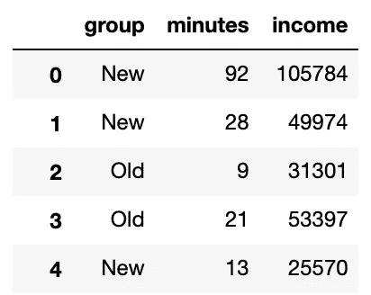

在我们的例子中，应用程序类型是治疗效果，分钟是结果，收入是我们有幸测量的协变量。请注意，这里我们假设所有启动报税应用程序的用户最终都会完成它。如果不是这种情况，你就必须在实验任务执行之前收集现有的协变量。我们方程的一般形式变成这样:

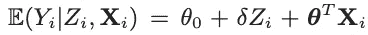

*   y 代表目标结果(分钟)
*   z 是治疗变量(应用类型)
*   **X** 是协变量的矩阵(我们只有收入，所以是向量)
*   δ我们试图估计的效果大小(新的应用程序格式快了多少)
*   **θ** 和θ_0 是截距和协变量的参数

让我们假设我们有以下条件:

*   每组 100 名用户
*   预计起飞时间为 2 分钟。换句话说，我们想设计一个足够强大的实验来检测 2 分钟的改善。

如果我们仅对治疗效果进行简单的 OLS，我们会得到以下结果(注意，这些结果等同于样本间 t 检验)。

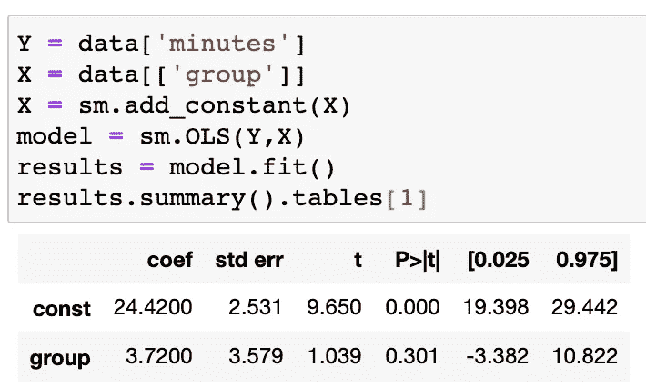

这些结果来自一次运行，所以信息不多。如果我们引导我们的实验，我们应该期望我们的效果看起来像这样:

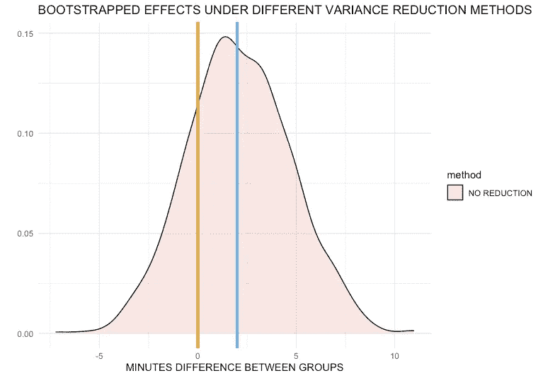

蓝线代表预期的效果大小。橙色线是没有效果的时候。

我们可以立即注意到，在我们的许多自举实验中，当它存在时，我们未能检测到它。当我们将收入作为协变量加入模型时会发生什么？下图显示，将收入作为协变量有助于减少方差，从而提高实验的功效。

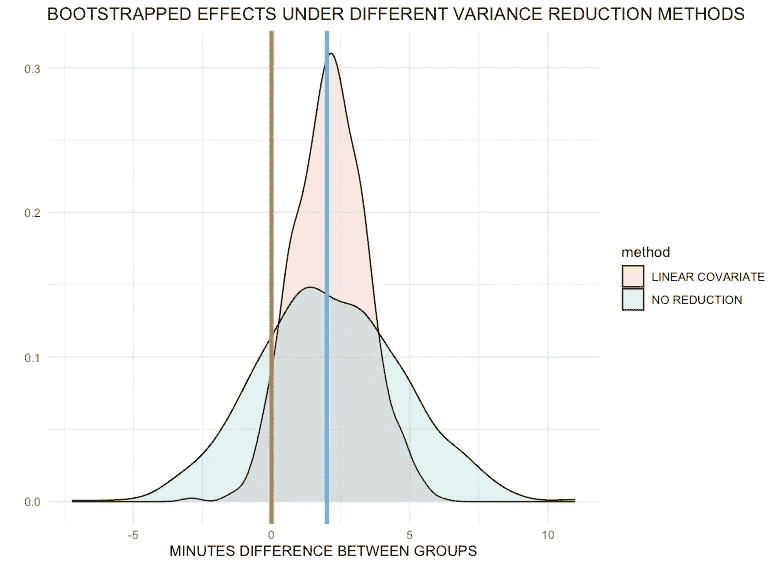

虽然这可能是个好消息，但在实践中，我发现由于需要满足许多假设，正确构建线性模型非常具有挑战性。例如，如果结果数据不是线性的，协变量可能不会在输出变量的范围内均匀地减少方差。例如，我模拟的收入和分钟数之间的实际关系不是线性的，但是 OLS 模型中指定的公式并不知道这一点。这将导致一些地方的方差被低估，而另一些地方的方差被高估，从而使得出相关结论变得更加困难。

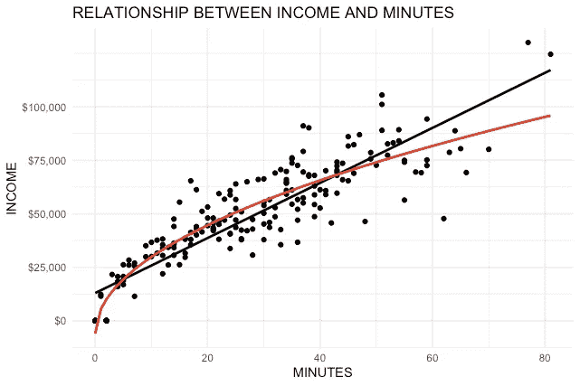

# **技术 2:使用预实验数据的受控实验(CUPED)**

控制方差的另一种选择在[邓等人的论文中描述。al (2013)](https://www.exp-platform.com/Documents/2013-02-CUPED-ImprovingSensitivityOfControlledExperiments.pdf) 简称 CUPED。他们从蒙特卡罗模拟中使用的控制协变量中借用了这一思想。在这种方法中，我们可以注意到以下关系:

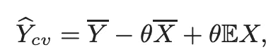

Y_hat 表示 E(Y)的无偏估计量。给定适当的θ，θE(X) + θE(X)应该相互抵消，因为我们假设在实验处理之前，组间协变量的影响是相同的。这个等式基本上是说，这个新的控制变量结果具有与实际结果相同的期望值。接下来，我们计算控制变量的方差。

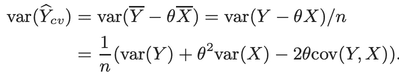

方差方程允许我们看到，当θ如下时，无偏控制变量的方差将最小化:

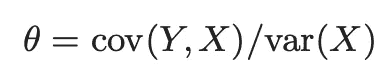

所有这些都可以用几行非常简单的代码来编写:

结果如下:

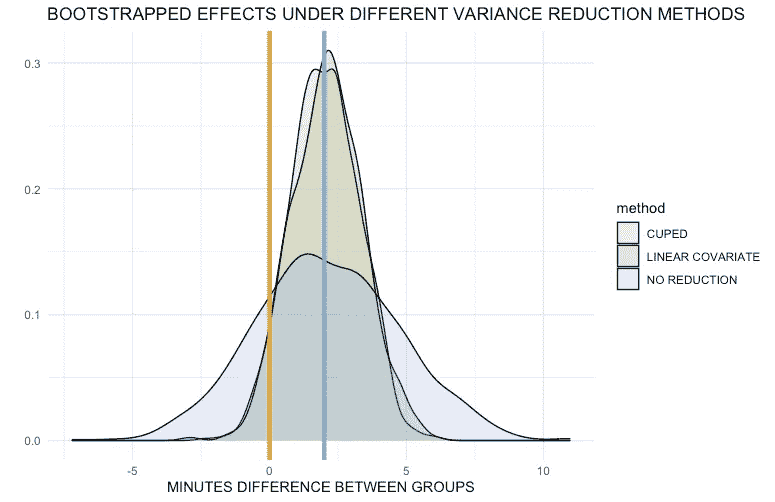

在我们的实验设置中，CUPED 的表现与线性协变量法大致相同。这种方法非常优雅，尽管当有多个协变量时，它的表现如何还不完全清楚。如果我们有多个相关的协变量，我们将不得不生成这些协变量的一维汇总，这可能会导致信息的丢失。此外，仍然需要保持结果和协变量之间的线性假设。

# **技巧 3:非参数模型协变量调整**

这项技术在某种程度上是技术 1 的延续。这不是我在其他地方完全探索和看到的技术，所以欢迎建议。您可以注意到，到目前为止，我们所做的只是使用不同的方法测量方差，然后对总方差进行调整。自然的问题是，既然现实世界中有以下场景，我们为什么要使用参数模型来实现这一点:

*   我们可以有多个协变量
*   我们可以有协变量之间的相互作用
*   我们可以有非线性数据
*   我们可以有缺失数据的协变量

我们知道非参数模型在减少数据偏差方面会更好，所以我试验的一种技术是用随机森林模型代替 OLS 模型。为了获得无偏的预测，我所做的唯一改变是使用我的模型中的袋外分数。请参见下面的代码片段。

自举实验的输出可以在下面找到:

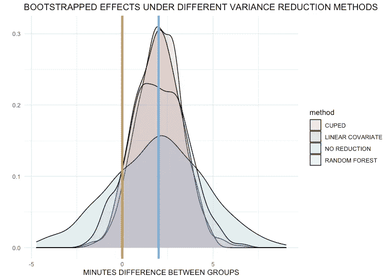

使用随机森林模型来消除由协变量引起的方差似乎确实有效，尽管效果比其他方法稍小。我的直觉表明，这可能是因为 OOB 估计包含大量的方差，因为样本量非常小(两组总共 200 个观察值)，所以很难建立非参数模型来很好地概括他们的 OOB 分数。

# **结果汇总**

我的实验设置有点琐碎，因为我选择了一个与结果高度相关的协变量。正因为如此，我们将看到大量的方差减少。具体来说，我在方差减少和 0.8 幂的主体要求中看到了以下内容(我使用自举方差的平均值进行幂计算)。

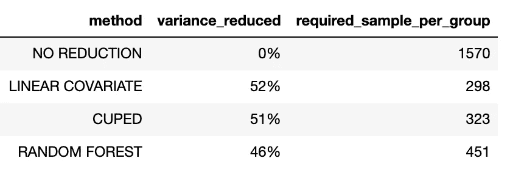

# 结论和警告

在数据驱动的组织中，以最小化流量需求的方式执行实验至关重要。我上面描述的任何一种方法都可以用来在拥有相同流量的情况下有效地将实验数量增加一倍或两倍。尽管如此，每种方法都需要知道协变量相对于实验结果的表现，当可用的实验数据太少，并且模型无法用于正确消除方差时，一些方法可能不起作用。