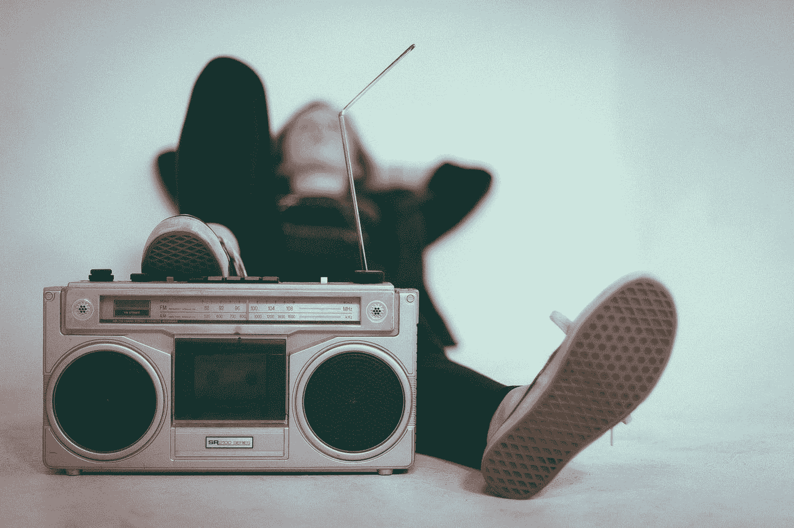
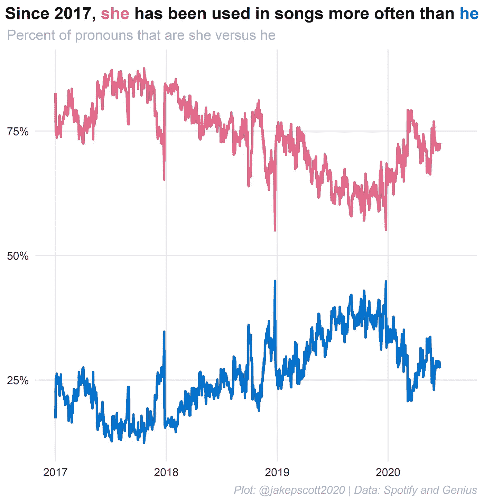
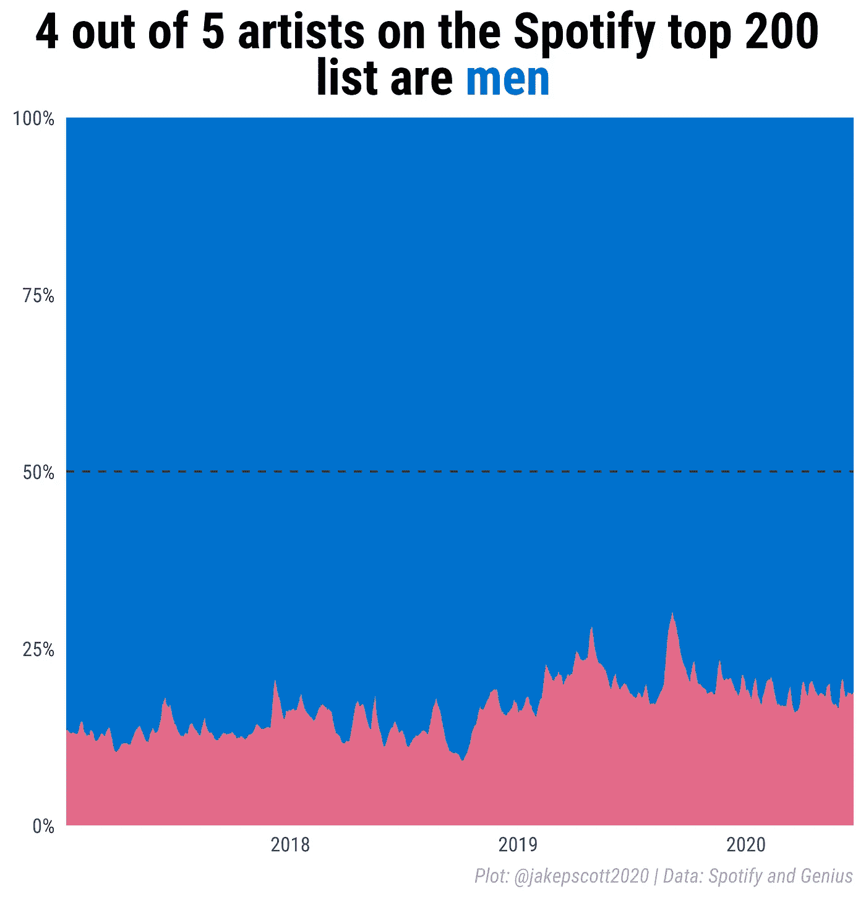
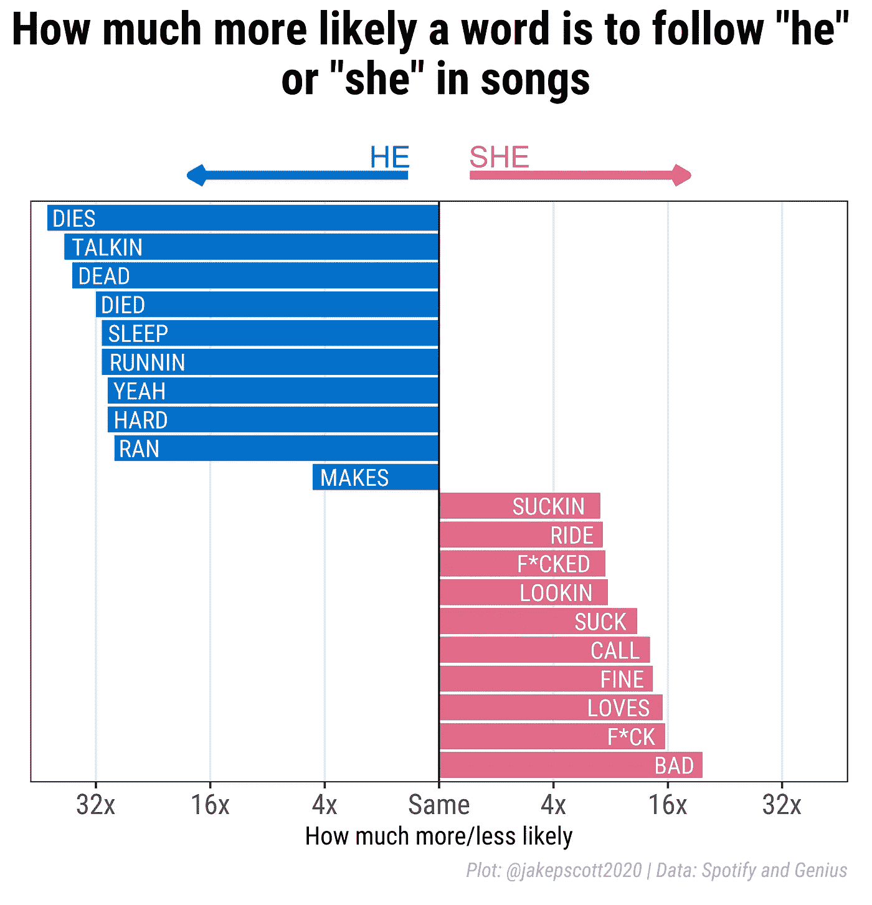
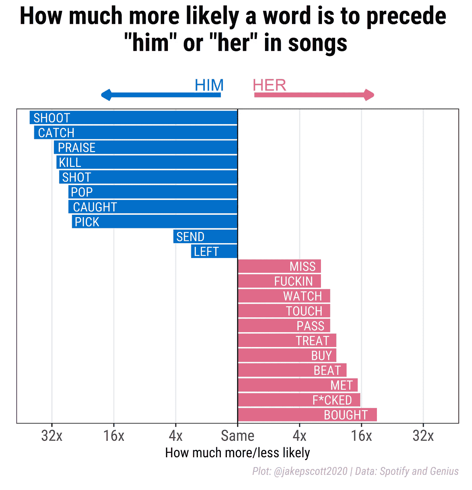
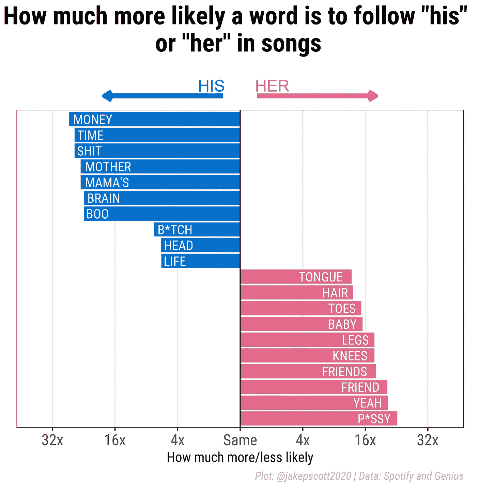
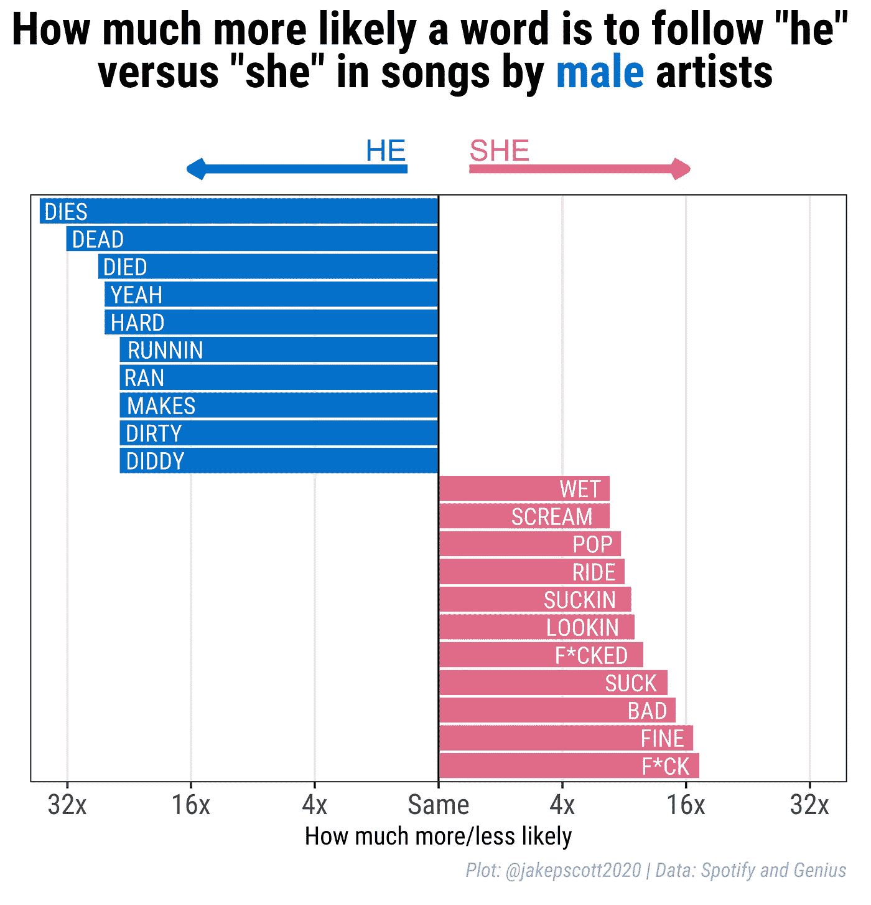
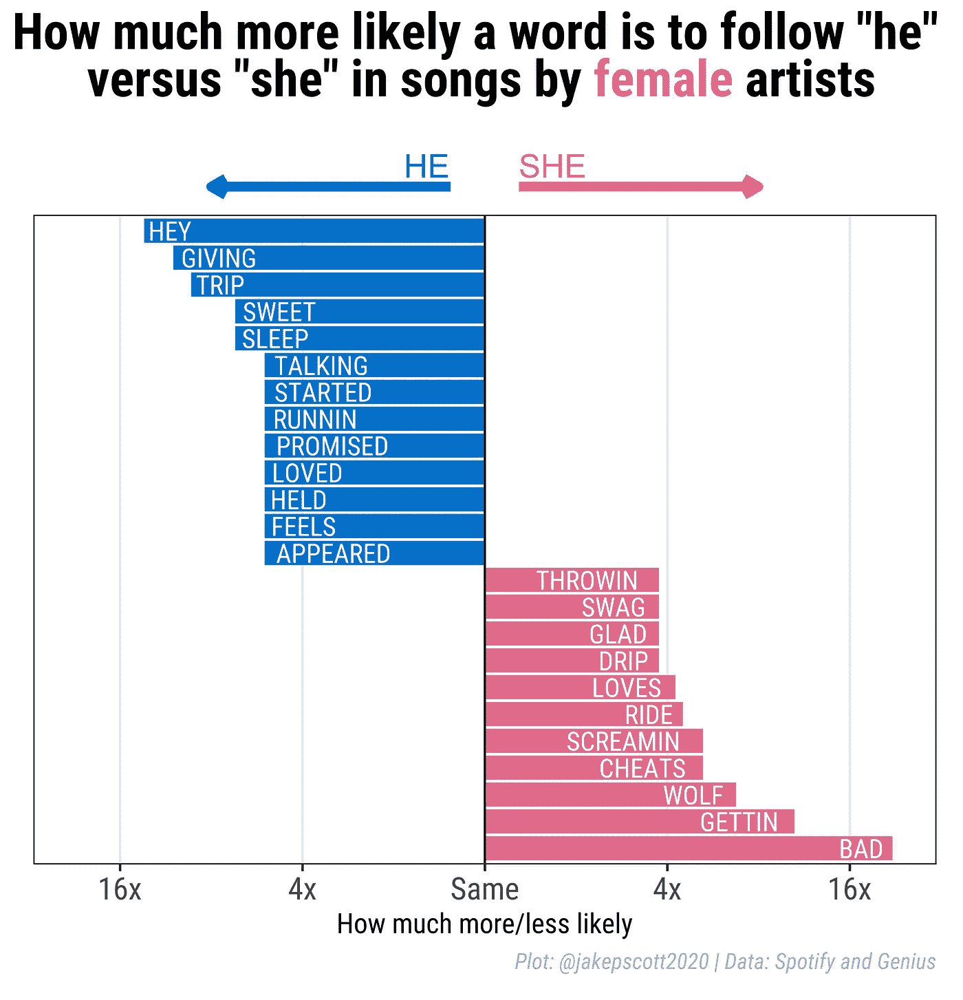

# 他死了，她糟透了

> 原文：<https://towardsdatascience.com/he-dies-she-sucks-b4a8ac18cb73?source=collection_archive---------52----------------------->

## Spotify 上歌曲的性别和语言分析

埃里克·诺帕宁在 [Unsplash](https://unsplash.com?utm_source=medium&utm_medium=referral) 上拍摄的照片

他死了。她很好。他跑了。她在吮吸。

在娱乐界，男人和女人被描绘得非常不同。他们说话的方式，他们是如何被描绘的，以及他们如何相互影响，都是由性别决定的。

一个突出的例子与[大屏幕](https://pudding.cool/2017/08/screen-direction/)有关。早在 2017 年，Julia Silge、Russell Goldenberg、Amber Thomas 和 Hanah Anderson 就按性别对 2000 多个好莱坞剧本进行了舞台指导。他们发现，女性更有可能被指示依偎、傻笑和尖叫，而男性则更有可能被指示系皮带、飞奔和嚎叫。

这种差异，无论是在舞台上还是在舞台之外，都有意无意地塑造了人们的观点，往往强化了刻板印象和现有的权力结构。鉴于这种暗示的重要性，我决定对歌词进行类似的分析。

为此，我使用了 Spotify top 200 列表，其中包含了自 2017 年以来每天播放量最高的 200 首歌曲。我使用 Genius API 获得了超过 90%的这些歌曲的歌词，并且我手动获得了超过 95%的艺术家的性别(大约 3%的乐队既有男性也有女性)。

我想探索的歌曲的第一个方面是“她”和“他”的相对使用的表现。起初，我惊讶地发现“她”这个词比“他”用得更频繁。

作者图片

鉴于媒体和娱乐界经常出现男性过多的问题，我本以为会出现均等，甚至是不相称地使用“他”这个词。

然而，这一发现在歌曲的背景下是合理的，歌曲通常将浪漫和欲望集中在异性身上。我们实际上可以在数据中很清楚地看到这一点:男性更有可能使用“她”这个词(80%的时间)，而女性使用它的时间不到一半(47%)。

这似乎是因为“她”这个词的使用频率要高得多，因为在前 200 名艺术家中，男性占了绝大多数。自 2017 年以来，名单上只有 16%的艺术家是女性。这就是男性在媒体中的过度表现抬头的地方。

作者图片

然而，我的兴趣并不是揭示流行音乐中男性过多的现象。相反，我想看看歌曲本身是如何描写男人和女人的。为此，我把注意力集中在“他”和“她”后面的单词上

如果不删除所谓的“[停用词](https://nlp.stanford.edu/IR-book/html/htmledition/dropping-common-terms-stop-words-1.html)”就绝对这么做，是没有意义的。像*得了*、*得了*、*表示*这样的词在“他”和“她”这两个词都占据了榜单。

去掉这些没有信息的文字后，一个更有趣的画面出现了。像*告诉*、*离开*和*死去*这样的词对“他”来说是最常见的，分别占与“他”相关的词的 3.5%、2%和 2%。*爱*、*坏*、*告诉*排在首位的为“她”(4%、3%、2.5%)。

这本身就很有趣。然而，一个更有见地的方法是西尔奇首创的:查看相对可能性。例如，如果单词*死亡*在歌曲中出现在“他”旁边 3 次，在“她”旁边 1 次，我们会说“*他死亡*”比“*她死亡*”多 3 倍

这样做证明了我从哪里得到这个标题的灵感:

作者图片

与女性相比，男性死亡、说话或死亡的几率是女性的 32 倍。他们也更有可能睡觉、跑步和做爱。另一方面，女性变坏、做爱和恋爱的可能性是男性的 16 倍。他们也更有可能吮吸/被吮吸，骑，并呼吁。

其他性别代词也是如此。比如“他”之前的话一般都比较暴力(*射*、*杀*、*爆*)，而“她”之前的话一般都是性或者跟钱有关的(*买了*、 *f*cked* 、*摸*)。有一些明显的例外。例如，“*夸他*”出现在歌曲中的可能性是“*夸她*”的 32 倍左右，而“*打她*”出现的可能性是“*打他*”的 10 倍以上。

作者图片

“他的”和“她”的情况类似然而，与其他男性代词相关的词相比，歌曲中“他的”后面的词不那么暴力，占有欲更强(*金钱、时间、嘘)*)，女性代词再次变得性欲超强，像 *p*ssy* 、*膝盖*、*舌头*，甚至*脚趾*这样的词高居榜首。

作者图片

这样的发现几乎不需要分析。正如大多数人所料，女性被性别化，而男性要么被描述为更暴力，要么更有可能遭受暴力。

数据中一个有趣的问题是，这些相对可能性对于男性和女性艺术家有什么不同。

不出所料，考虑到前 200 名中男性的普遍存在，关注他们主要反映了总体发现。也就是说，值得指出的是，当只看男歌手的歌曲时，女性变得更加性感，男性变得更加 T2 化。

作者图片

这与女艺术家截然不同。像*死*和*死*这样的词对“他”来说消失了，像*吸*和*骑在*上的词对“她”来说消失了取而代之的是对男性而言的*甜蜜*和*睡眠*以及对女性而言的*不好*和*炫耀*等词汇。换句话说，女性不太可能将自己性感化，也不太可能将男性与暴力联系在一起。

作者图片

最终，我的发现是微妙的。的确，在流行音乐中，女性与肉体和性联系在一起，而男性则与暴力和财产联系在一起。然而，艺术家性别之间存在异质性。排名靠前的发现是由男性推动的，他们目前在排名前 200 的艺术家中占了绝大多数。另一方面，女性对男性和女性同胞的唱功非常不同:不那么暴力，也不那么性感。

事实上，所有这些都导致了与西尔格得出的结论相似的结论——如果当女性艺术家开始在 200 强名单中占据更大比例的艺术家份额，我们可能会看到男性死亡和女性吮吸的歌曲越来越少，而男性付出和女性滴下的歌曲越来越多。