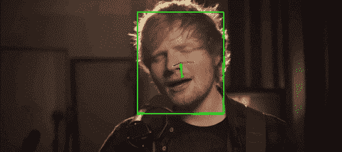
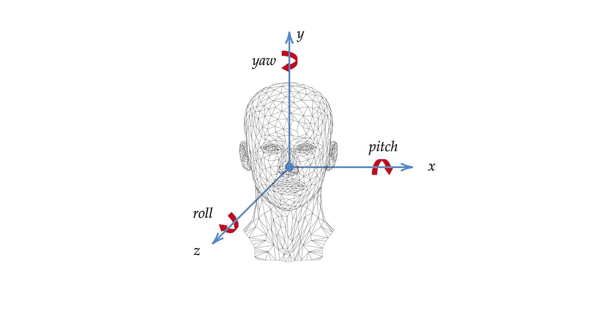
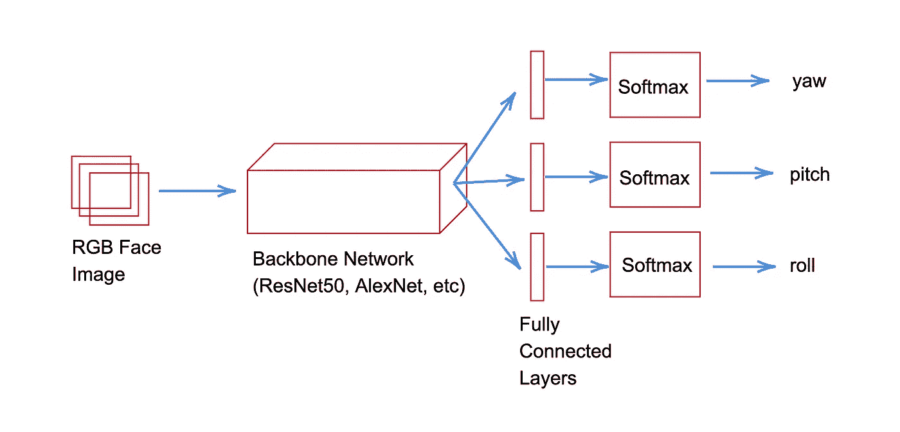
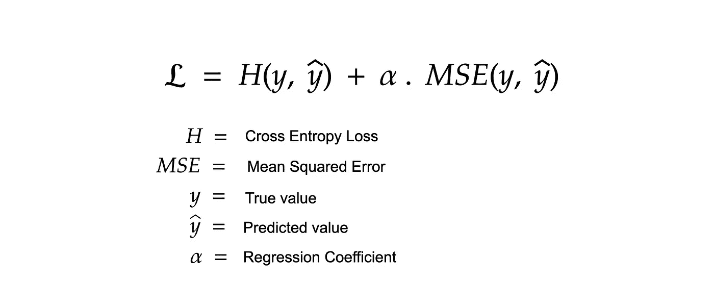

# 基于 Hopenet 的头部姿态估计

> 原文：<https://towardsdatascience.com/head-pose-estimation-with-hopenet-5e62ace254d5?source=collection_archive---------29----------------------->

## 一种直接估计头部姿态的深度学习方法。

Hopenet 展示了艾德·希兰演唱的歌曲“[大声说出想法](https://youtu.be/f6Cswdm601A)”。

# 一.动机

在计算机视觉领域有许多有趣的研究。我们已经看到了物体检测、人脸检测、面部识别、光学字符识别(OCR)等许多方面的惊人进步。在学习人脸检测的时候，我遇到了一个关于头部姿态估计的研究领域。在这篇文章中，我想与你分享我所学到的东西。更具体地说，我将从讨论头部姿态估计开始。然后，我将讨论一种由 Nataniel Ruiz、Eunji Chong 和 James M. Rehg 介绍的深度学习方法，称为 Hopenet。

> **免责声明:**本文假设你已经熟悉深度学习中的 CNN 概念。

# 二。头部姿态估计

## 什么是头部姿态估计？

图 1:说明三个欧拉角的图表。

顾名思义，计算机视觉中的头部姿态估计研究侧重于预测图像中的人类头部姿态。更具体地说，它涉及人类头部欧拉角的预测。欧拉角由三个值组成:偏航、俯仰和滚动。这三个值描述了对象在 3D 空间中的旋转。通过准确预测这三个值，我们可以计算出人的头部朝向哪个方向。拥有一台能够计算出人类头部朝向哪个方向的计算机提供了许多有用的应用。例如，它可以用来绘制 3D 对象，以匹配人类头部的方向，类似于抖音，Snapchat 和 Instagram 过滤器中看到的那些。此外，它还可以用于自动驾驶汽车，以跟踪驾驶员是否专注于道路。

> **注:**你可以参考这个由 Udacity 提供的 Youtube [视频](https://youtu.be/q0jgqeS_ACM)进行欧拉角的互动讲解。

## 用来估计头部姿势的不同技术有哪些？

> **注意:**头部姿态估计中的许多方法假设面部检测作为初步步骤。首先，检测人脸，然后才能估计头部姿态。

有两种主要的方法用于估计头部姿态。一种方法包括估计面部标志的中间步骤。面部标志然后被映射到人类头部的 3D 模型上。将创建的 3D 界标与相机的信息(如图像中的焦距、失真和光学中心)相结合，可以使用数学公式来计算人类头部的偏航、俯仰和滚动值(Mallick，2016)。然而，这种方法有一些缺点。根据 Ruiz，Chong 和 Rehg (2018)，这种方法的性能严重依赖于面部标志预测的性能、3D 头部模型的代表性以及用于完成估计的数学模型。

另一种方法是直接预测偏航、俯仰和滚动值，而不必首先估计面部标志。这就是 Hopenet 的创建者所采取的方法。通过跳过面部标志估计步骤，这种方法有可能变得更鲁棒、更快速、更准确(Ruiz，Chong 和 Rehg，2018)。Ruiz，Chong & Rehg (2018)的工作并不是这种方法的唯一尝试。剑桥大学的一个团队也提供了这种头部姿态估计的直接方法(杨，牟，张，，Gunes 和 Robinson，2015)。Ruiz、Chong 和 Rehg(2018)的工作与其他尝试的主要区别在于使用了一个多重损失函数，这将在下面讨论。

# 三。希望网

> **注:**Hopenet 的创建者慷慨地开源了他们在 PyTorch 中的实现，你可以在这里找到。本文中显示的代码片段是我自己在 Keras 中的实现。我尽我所能根据自己的理解重新创作了他们的作品。虽然我无法复制 Nataniel、Eunji 和 James 的论文中显示的完全相同的结果，但我相信这些代码片段对您创建自己的“从头”实现他们的工作是有用的。此外，我决定不解释 Hopenet 的培训过程，因为我认为这篇文章已经为你如何进行培训提供了一个清晰的指导方针。

## 网络架构

图 Hopenet 架构的简图。

Hopenet 的架构由两个主要部分组成:一个主干网络和三个使用 softmax 激活的全连接层(每个欧拉角一个)。三个完全连接的层共享同一个主干网络。请务必注意，来自完全连接层的每个欧拉角的输出不是单个值。相反，它是一个大小为 *num_bins* 的向量，这是您必须设置的网络的超参数。所以，如果你决定选择 *num_bins* 作为 *n* ，那么将会有三个输出向量，它们的大小都是 *n* 。角度的输出向量中的值表示该角度落入该条柱的概率。在他们的论文中，创造者展示了两种不同主干网络的性能:ResNet50 和 AlexNet。他们已经证明，与 AlexNet 相比，使用 ResNet50 作为主干网络会产生更好的结果。即使在他们的论文中，Hopenet 的创建者仅使用 AlexNet 和 ResNet50 作为主干层，也可以使用任何其他 CNN(Ruiz，Chong，& Rehg，2018)。

下面是用 ResNet50 作为主干层重新创建 Hopenet 网络的代码片段。值得注意的是，与 AlexNet 相比，ResNet50 的训练时间要长得多，因为它是一个更大的网络。

以 ResNet50 为骨干网构建 Hopenet。注意，偏航、俯仰和滚转有三种不同的损失计算。

> **注:** [这里的](https://github.com/OverEuro/deep-head-pose-lite)是 Hopenet 的开源实现，使用 ShuffleNet 作为主干网络。

## 多损失损失函数

图 2: Hopenet 的多损损失函数。从我的理解来说，alpha 是用来强调回归损失值的变化。

每个欧拉角有三个不同的全连接层，可以分别优化每个角度的损耗(Ruiz，Chong & Reh，2018)。每个角度的损失由两部分组成:分类损失和回归损失。创建者使用交叉熵作为分类损失，使用均方误差作为回归损失。根据 Ruiz、Chong 和 Rehg (2018 年):

*这种方法背后的思想是，通过执行 bin 分类，我们使用非常稳定的 softmax 层和交叉熵，因此网络学习以稳健的方式预测姿态的邻域。通过三个交叉熵损失(每个欧拉角一个),我们有三个信号反向传播到网络中以改善学习……然后我们向网络添加一个回归损失，即均方误差损失，以改善细粒度预测。* (Ruiz，Chong，& Rehg，2018，第 3 页)

下面的代码显示了如何为每个欧拉角定义损失函数。

Hopenet 的多重损失计算。

# 动词 （verb 的缩写）结论

最后，我希望这篇文章能帮助你理解头部姿态估计领域的一些关键概念，并让你了解 Hopenet。也就是说，我也希望这篇文章能激发你对头部姿态估计的兴趣，并促使你对这个主题进行进一步的研究。

*喜欢这篇文章并想表达你的支持？关注我或给我买咖啡*

# 参考

Mallick，S. (2016 年 9 月 26 日)。*基于 OpenCV 和 Dlib 的头部姿态估计。*学习 OpenCV。检索自[https://www . learnopencv . com/head-pose-estimation-using-opencv-and-dlib](https://www.learnopencv.com/head-pose-estimation-using-opencv-and-dlib/)

Ruiz，Chong，e . Rehg，m . j .(2018 年)。无需关键点的细粒度头部姿态估计。*IEEE 计算机视觉和模式识别会议(CVPR)研讨会，2018 年，第 2074–2083 页*。从 https://arxiv.org/abs/1710.00925[取回](https://arxiv.org/abs/1710.00925)

杨，h，牟，w，张，y，，I，Gunes，h .，& Robinson，P. (2015)。头部姿态估计辅助的人脸对齐。从 https://arxiv.org/abs/1507.03148[取回](https://arxiv.org/abs/1507.03148)

魏，J. (2019)。 *AlexNet:挑战 CNN 的架构*。走向数据科学。检索自[https://towards data science . com/Alex net-the-architecture-that-challenged-CNNs-e406d 5297951](/alexnet-the-architecture-that-challenged-cnns-e406d5297951)