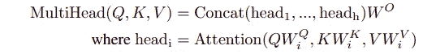
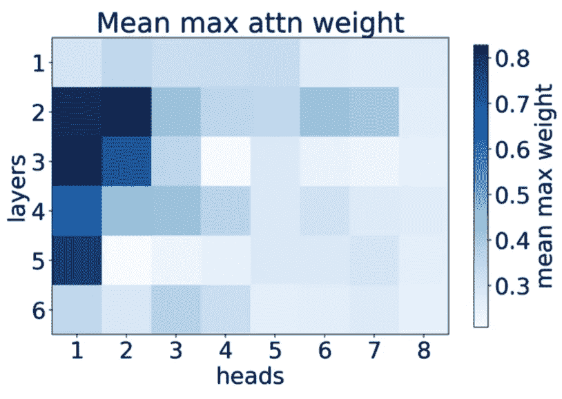
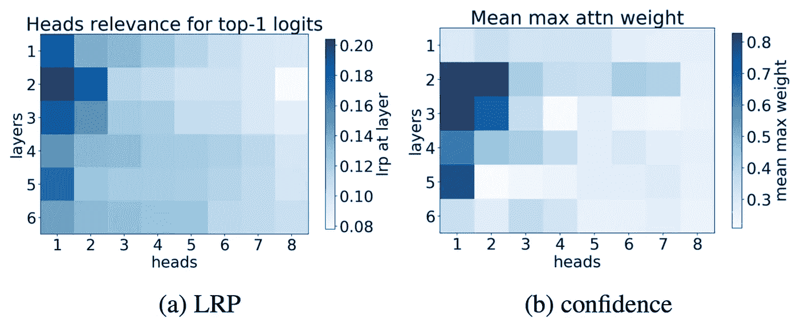
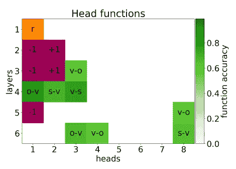
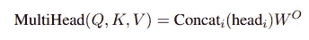
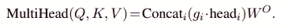
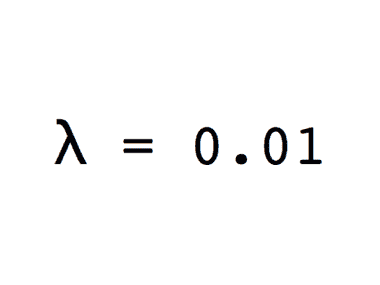
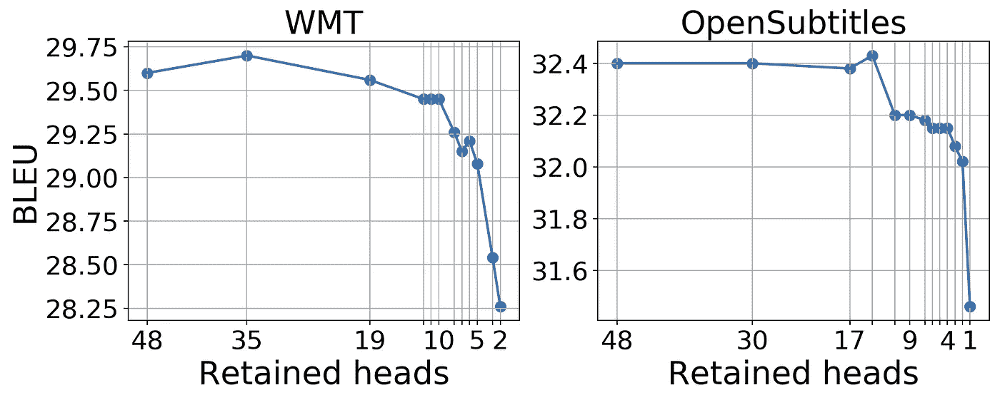
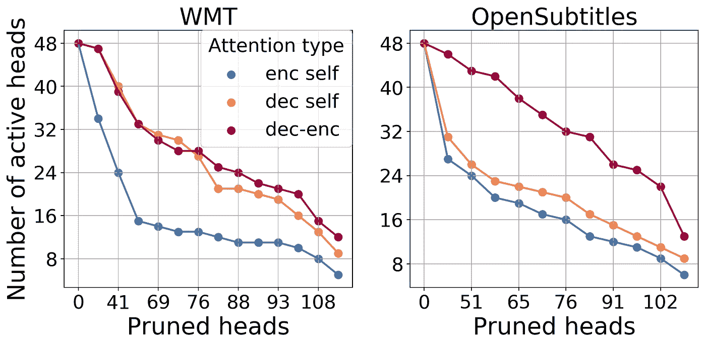
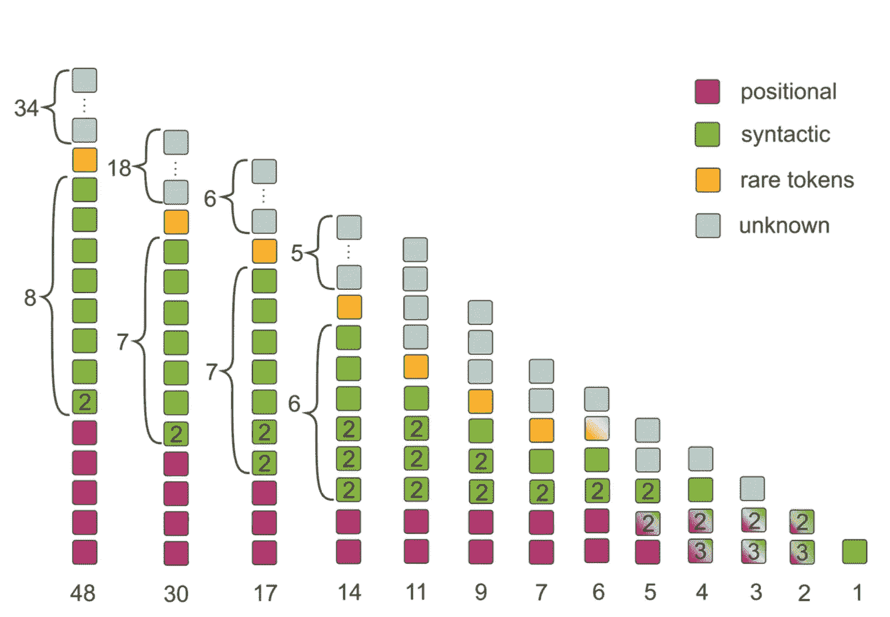

# 变压器模型中的头部修剪！

> 原文：<https://towardsdatascience.com/head-pruning-in-transformer-models-ec222ca9ece7?source=collection_archive---------22----------------------->

## 在这篇文章中，我们将研究如何在像伯特这样的变形金刚模型中修剪注意力。

阿瑟尼·托古列夫在 [Unsplash](https://unsplash.com/s/photos/transformer?utm_source=unsplash&utm_medium=referral&utm_content=creditCopyText) 上的照片

概述:

*   **本文背景作品**。
*   **注意力头**和**的重要性为什么需要修剪**。
*   **识别重要头部**及其**头部**功能**。**
*   **如何修剪头部？**
*   修剪如何影响 **BLEU 分数**。
*   **用于分析的剪枝**

# 背景工作

简单回顾一下，这是基本的变压器模型

变压器的模型架构，(图片来源:图 1 和图 2 来自[)你所需要的就是注意力](http://papers.nips.cc/paper/7181-attention-is-all-you-need.pdf)

从上图可以看出，变压器有**三种**注意力实现方式，分别是:
-多头注意力**编码器**、
- **屏蔽**多头注意力**解码器**、
-多头注意力**编码器-解码器**

每个 MHA 由几个**缩放的点积**注意力头的**串联**组成，这些注意力头在**并行**中运行，不像递归网络，这就是为什么注意力比几乎所有的 rnn 都好。

每个头是**查询的注意函数，键和值**带有可训练参数 **(Wᵢᵩ、Wᵢᵏ、Wᵢᵛ)** 。

# 注意力集中的重要性

**MHA** 的所有 **3 种**都以不同的方式发挥着特定的重要作用。

*   **编码器 MHA** 包含自我关注层，这里所有的参数即查询、键和值都来自同一个地方，在这种情况下，是先前的编码器或输入向量序列。
*   **解码器屏蔽 MHA** 屏蔽掉该特定字之后的所有字，这表明解码器中的每个位置都基于序列的**先前输入**，该**模仿**序列中的**编码器-解码器机制来对递归**模型进行排序。
*   在**编码器-解码器 MHA** ，**查询**来自被屏蔽的 MHA 的向量，然后将其与来自顶部编码器的**密钥和值**向量组合。这种整体结构允许基于先前的输入产生有效的结果。

自我关注在 MHA 是变压器的关键组成部分，因为 MHAs 依赖于关注头，对他们来说准确是很重要的，依赖于**多个头可以提高**效率达 **1 BLEU** 分数。

# 为什么修剪？

在 [***论文***](https://arxiv.org/pdf/1905.09418.pdf) **，**中作出了令人惊讶的观察，即使在正常训练模型(具有所有头部)之后，许多头部可以在**测试时间**被**移除**，并且它将**不会显著影响 BLEU** 分数，事实上，在一些情况下移除少量头部导致 BLEU 分数提高。

# 识别重要负责人

为了从 MHA 中检测重要的头，为了去除不太重要的头，我们可以使用许多方法，如头的**或**逐层相关性传播(LRP)** 。**

****

**图片来源:图 1 来自[分析多头自我关注](https://arxiv.org/pdf/1905.09418.pdf)**

****置信度**是一种比 LRP 相对简单的方法**，它包含了其**最大注意力权重**的平均值，其中平均值是对用于评估的一组句子取的，它是翻译的一个重要**考虑因素。**

**从这个图中可以看到，几乎**模特 80%** 的注意力都给了**单令牌头**。**

**LRP 比“信心”更可靠。这有助于找到头部**网络**中头部的**相对贡献**。**

****

**图片来源:图 1 来自[分析多头自我关注](https://arxiv.org/pdf/1905.09418.pdf)**

****置信度和 LRP 都用于**检测重要头部**，从上图可以看出，LRP 和置信度显示的结果几乎相同。那么，现在我们知道了哪些头部是重要的，让我们来看看它们的作用。****

# ****头部功能****

****在变形金刚的 MHA 中，每个头部都在影响模型产生的翻译中发挥作用，这些是头部可能执行的功能:****

*   ******位置**:在此，头部指向**附近的令牌**，下图中以紫色显示。****
*   ******句法**:指向句子中的**特定关系**，以绿色显示****
*   ******生僻字**:此处指向最不常用的**或生僻字**，以橙色显示。****

********

****图片来源:图 1 来自[分析多头自我关注](https://arxiv.org/pdf/1905.09418.pdf)****

****从这些头函数中，很明显**某些头**比其他头更准确地检测和学习**句法关系。******

****这也支持了一个假设，即编码器确实支持句子中一定量的**句法歧义消除**。****

# ****如何修剪头部？****

****在原始变压器中，正如我们在背景工作中看到的，MHA 由下式给出:****

********

****为了去除不太重要的磁头，我们通过使用特定的门 g **ᵢ** 来修改等式:****

********

****其中 g **ᵢ** 在 **{0，1}** 之间，如果 g **ᵢ** 为 1，那么在拼接时我们考虑**的所有注意力**否则如果 g **ᵢ** 为 0，那么我们就**修剪**它。****

****因此， **gᵢ是一个可学习的参数**，并且独立于输入序列，因为我们想要为此修剪头部，我们理想地将 **L0 正则化**应用到标量门 g **ᵢ** 。 **L0 范数**等于非零组件的数量，并强制模型移除不太重要的头。****

********

****重要头部的模型聚合(图片来源:来自[头部故事](https://lena-voita.github.io/posts/acl19_heads.html)的莉娜·沃伊塔)****

****这个模型得到收敛，最后，头部被完全移除或者保持打开，这意味着我们只使用所有注意力头部的子集。****

# ****BLEU 评分****

****移除头部后，让我们看看它如何影响模型的 BLEU 分数，从下图中可以看到，当将模型从 **48 个头部压缩到 10 个头部时，BLEU 分数**几乎没有下降 0.25** **BLEU** 。******

****

**图片来源:图 7 来自[分析多头自我关注](https://arxiv.org/pdf/1905.09418.pdf)**

**这篇[论文](https://arxiv.org/pdf/1905.09418.pdf)展示了在两个数据集**【WMT】**和 **OpenSubtitle** 上执行的头部修剪。如上图所示，BLEU 分数根据使用的注意力头部来标注。**

**令人惊讶的是，在 WMT 数据集的情况下，在移除几个头部后，我们可以看到 BLEU 分数的**增量**，当我们将头部从 5 个减少到 1 个时，BLEU 分数**急剧减少**。这些观察结果表明，我们只需要**几个头(5–10)**就可以用基本模型取得有竞争力的结果。**

# **用于分析的修剪**

**变压器由三个 mha 组成，如背景工作中所述。这些 MHA 是:
(a)编码器 **的多头注意(MHAs】屏蔽**解码器 **的多头注意** (c)编码器-解码器**的多头注意****

****所有这些 MHA 包含了多个头部的连接。头部修剪可以发生在这些 mha 中的任何一个。据观察，模型**更倾向于首先修剪编码器**自关注头，而**编码器-解码器 MHA** 在两个数据集之间似乎是**重要的**。显然，没有编码器-解码器 MHA 翻译任务是不可能的。如下图所示，在这两种情况下，不太重要的磁头都来自编码器 MHA。****

********

****图片来源:图 9 来自[分析多头自我关注](https://arxiv.org/pdf/1905.09418.pdf)****

****另一个观察结果是，MHA 的头部功能即使在修剪后仍然保留。当修剪 5-6 个头以下的模型时，由于头的数量较少，只有**几个头**必须执行**几个功能**然后它们也被保留。****

********

****图片来源:图 8 来自[分析多头自我关注](https://arxiv.org/pdf/1905.09418.pdf)****

****我希望这篇文章增加了你对 MHA 和修剪头部更好的效率的了解。****

# ****参考****

*   ****人头的故事:([贴](https://lena-voita.github.io/posts/acl19_heads.html))****
*   ****分析多头自我关注:([原文)](https://arxiv.org/pdf/1905.09418.pdf)****
*   ****十六个头真的比一个好吗？:([原文)](https://arxiv.org/pdf/1905.10650.pdf)****
*   ****关注就是你需要的全部:([原文](https://arxiv.org/pdf/1706.03762.pdf))****

> *****感谢阅读，您可以在*[*LinkedIn*](http://linkedin.com/in/gauravghati/)*[*Twitter*](https://twitter.com/GauravGhati/)*或我的* [*作品集*](http://gauravghati.world/) 上与我联系*****