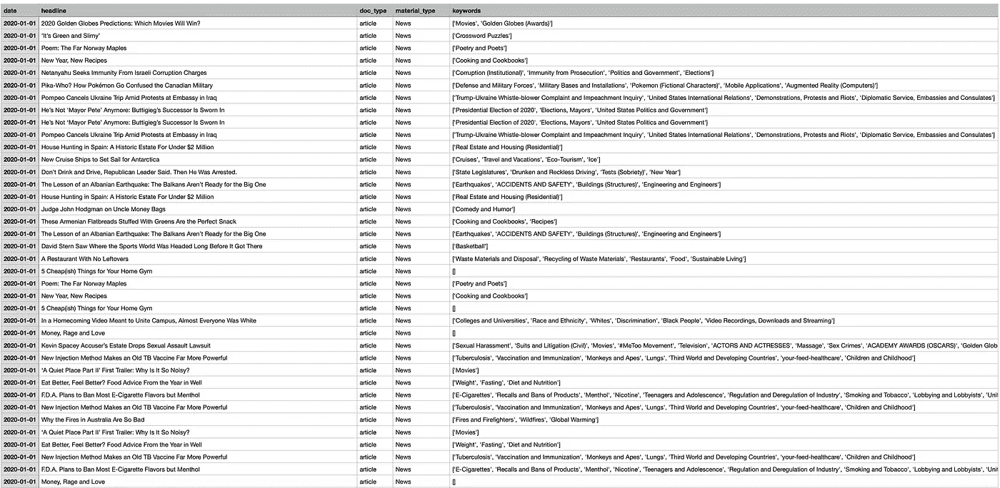
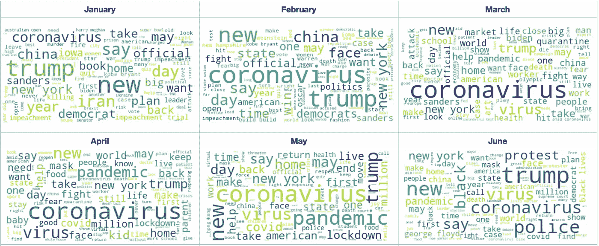
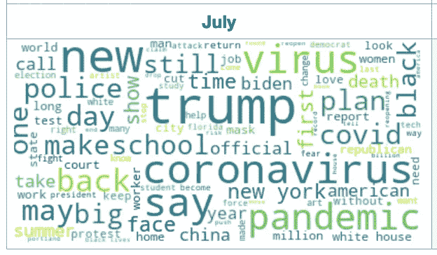
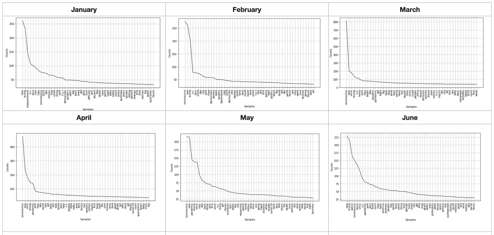
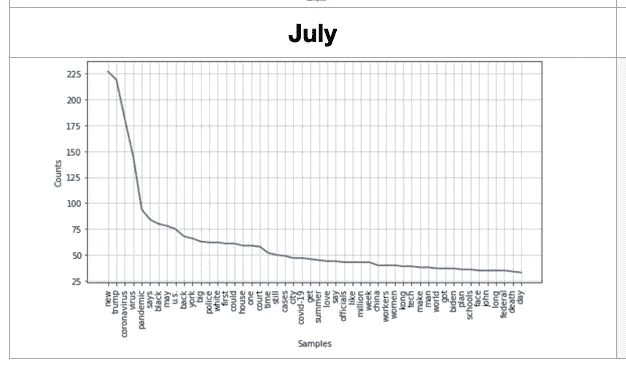
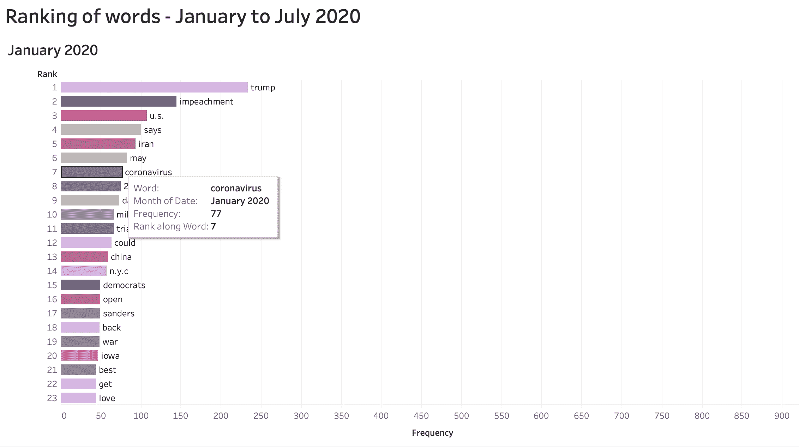

# 标题文章分析和自然语言处理

> 原文：<https://towardsdatascience.com/headlines-articles-analysis-and-nlp-4013a66dbac?source=collection_archive---------24----------------------->

## 使用 NLP 查看 2020 年 1 月至 7 月《纽约时报》文章标题中提到最多的单词。


图 1——由[威利·海德尔巴赫](https://pixabay.com/pt/users/wilhei-883152/?utm_source=link-attribution&utm_medium=referral&utm_campaign=image&utm_content=705667)在 [Pixabay](https://pixabay.com/pt/?utm_source=link-attribution&utm_medium=referral&utm_campaign=image&utm_content=705667) 上拍摄的图像

据世卫组织介绍，2020 年 12 月 31 日，中国武汉首次报道了冠状病毒。2020 年 3 月 11 日，世卫组织宣布乔维德为疫情。新冠肺炎相关的时间表可以在[这里](https://www.who.int/news-room/detail/29-06-2020-covidtimeline)查看。

可以想象，从 2020 年 1 月到 7 月，**冠状病毒*、*** **病毒、**和**疫情**这几个词被引用的次数最多。但是在同一时期有多少其他的相关呢？我们如何分析它们？

为了回答这些问题，我选择了一个来源和两个工具:

-来源:**纽约时报**报纸选取 2020 年 1 月至 7 月的文章标题。
-工具:自然语言工具包( **NLTK** )，一个用于处理自然语言处理的 **Python** 库( **NLP** )，以及 **Tableau** ，一个可视化分析平台。

## **获得报纸头条**

首先，我需要创建一个包含报纸标题的数据库。在一些方法中，我选择了纽约时报，因为他们的文章很重要，他们在疫情的报道，因为纽约是世界上受影响最大的城市之一，还因为它的文章搜索 API。

**API**(*应用编程接口*)可用于编程访问纽约时报数据。首先，有必要创建一个 API 键，用它可以搜索自 1851 年以来的文件、畅销书列表、电影评论等等。你可以看到这个网站[这里](https://developer.nytimes.com)。

我创建了我的 API 键，我的目标是获得指定时间段的标题，这样，我创建了如下所示的数据库:



图 2—作者提供的图片。标题文章数据库

上图显示了截至 7 月 31 日的数据库中的前几行。

## 自然语言处理

> "自然语言处理(NLP)是使用计算机理解人类语言的领域."

*摘自:阿鲁姆甘，拉杰什；Shanmugamani，Rajalingappaa。“用 Python 实际操作自然语言处理。*

自然语言处理是对语言处理的研究。使用 NLP 的一些应用:

*   搜索
*   分析情绪
*   识别命名实体
*   翻译文本
*   检测垃圾邮件

## NLTK

**自然语言工具包** (NLTK)是一个 Python 库，用于处理自然语言处理(NLP)任务，如分割单词或短语，以执行高级任务，如解析和文本分类。

在这项工作中，NLTK 被用来分割报纸文章标题中的单词，然后检查哪些是最常用的。

以下代码是针对一月份描述的，同样的原则也适用于其他月份。要访问所有代码，你可以访问 GitHub 上的[我的资源库](https://github.com/ssilvacris/coffee-and-code/blob/master/newspaper_nlp.ipynb)。

## 库和数据集

```
 import pandas as pd
import numpy as np
import seaborn as sns
import matplotlib.pyplot as plt
import nltkmonths_df = pd.read_csv(‘months.csv’, parse_dates=True, index_col=’date’)

months_df.info()
```

## 安装 NLTK 模块

```
nltk.download() 
```

## 探索性数据分析

我需要分析和整理所有的标题。首先，我将把每个标题连接成一个字符串。然后，字符串将被拆分成一个列表，其中每个单词都是一个列表项。

```
 # join the strings of every row
sentences_jan = jan_df[‘headline’].str.cat(sep = ‘’) 
```

## 标记化

从短语中提取关键短语用于研究应用是自然语言处理的应用之一，最小的文本单位是单词。我使用函数 *word_tokenizer()* 到根据标点符号(如空格和逗号)将句子分割成单词。

```
from nltk.tokenize import word_tokenize
tok_jan = word_tokenize(sentences_jan)
```

## 删除标点符号和停用字词

标点符号将只是符号化的噪音已被删除。然后是那些从头条上删除的:


停用词去除是 NLP 应用程序常用的预处理步骤，用于去除英语中的常用词，如 *it* 、 *is* 、 *he* 等。我还过滤了所有长度大于 3 的单词。

```
import string
string.punctuationtok_jan = [char for char in tok_jan if char not in string.punctuation]from nltk.corpus import stopwords
# remove stopwords
stop = stopwords.words(‘english’)
tok_jan = [token for token in tok_jan if token not in stop]# remove words less than three letters
tok_jan = [word for word in tok_jan if len(word) >= 3]
```

去掉标点和停用词后，列表只剩下 **27209** **词** (token)。对于下一个情节，选择了前 100 个被引用最多的词。

## **查看每月被引用最多的词**

我们可以生成一个单词云，根据单词的大小直观地显示标题中最常用的单词。

```
!pip install WordCloud
from wordcloud import WordCloud, STOPWORDS, ImageColorGenerator
from PIL import Imageplt.figure(figsize=(20,20))wc = WordCloud(max_font_size=50, max_words=100, background_color=”white”)
wordcloud_jan = wc.generate_from_text(‘ ‘.join(tok_jan))plt.imshow(wordcloud_jan, interpolation=”bilinear”)
plt.axis(“off”)
plt.show()
```



图 3 —作者提供的图片。一月到六月的词云



图 4 —作者提供的图片。七月的文字云

这样，我们可以很快看到哪些单词在这七个月中出现的频率增加了。

## 获得单词的频率分布

对于下一个情节，选择了前 50 个被引用最多的词。

```
 import operator
freq_dis_jan={}
for tok in tok_jan:
 if tok in freq_dis_jan:
 freq_dis_jan[tok]+= 1
 else:
 freq_dis_jan[tok]=1

# We want to sort this dictionary on values ( freq in this case )sorted_freq_jan = sorted(freq_dis_jan.items(), key=operator.itemgetter(1), reverse=True)
print(sorted_freq_jan[:25])
plt.figure(figsize=(10, 5))
Freq_dist_nltk=nltk.FreqDist(tok_feb)
Freq_dist_nltk.plot(50, cumulative=False)
```



图 5—作者提供的图片。一月至六月的词频分布



图 6 —七月词的频率分布

## 词语关联性的变化

为了以动态的方式查看单词引用数在几个月内的变化，我使用了数据可视化软件 **Tableau** 。
有一些噪音，比如“新”这个词，没有包含在停用词列表中。所以我把它从单词列表中删除，并创建了一个动画图表。接下来的情节，选择了前 23 个被引用最多的词。



图 7—作者提供的图片。图表动画

请注意“ ***冠状病毒****这个词在 2 月(275 年)到 3 月(811 年)世卫组织建立疫情期间出现了大量的头条引用。*

*另一个观察是，乔治·弗洛伊德于 5 月下旬去世后，单词“*”在 6 月成为第二名。”***【Floyd】***也出现在 6 月份的第一份名单中。**

**最后，随着美国总统大选的临近，我们可以看到“ ***川普*** ”这个词在 7 月变得越来越重要。**