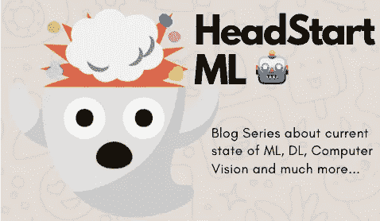
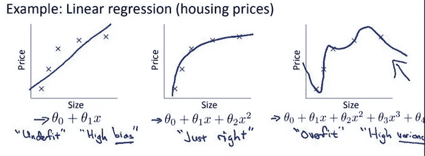

# 机器学习的概要

> 原文：<https://towardsdatascience.com/headstart-ml-part-1-distilled-summary-of-ml-d1f038c6ff9a?source=collection_archive---------37----------------------->

## 介绍最大似然法的现状及其所有重要概念

# **ML 与传统编程有何不同？**

传统的编程包括手动或脚手架(*即*之前已经写好，因此是克隆/重复的)逻辑过程，该逻辑过程编写一种方法，以根据某些预定义的约束将某个输入转换成期望的输出。简而言之:

> 传统编程:
> 输入+程序(通过编码器)=输出

相比之下，机器学习(ML)及其相关领域通过查看一大组正确的输入及其相应的正确输出来自动化这种提出逻辑程序的手动过程，并“学习”这种输入到输出的映射，称为 ***模型*** 。

然后用这个生成的***模型*** 用一组新的输入来预测一组新的输出。简而言之:

> 机器学习:
> a)输入+输出=模型
> b)模型+新输入=新预测输出

**这个*【学习】*是怎么发生的？**

***学习*发生在训练阶段，此时大量的正确输入及其相应的正确输出被组合起来，并用于训练，以获得一个模型，该模型随后可用于对新的输入值进行预测。**

> **这个庞大的正确输入和输出集合一起被称为**训练集**。**

**最后，当模型完成训练后，我们可以预测一组新输入值的输出。**

> **这一组被称为**测试组**，我们在其上测试网络的准确性。**

# ****历史:****

**如果我们看看过去 10 年(2010 年至 2019 年)的技术世界，一个取得巨大进步的研究领域是 ML。**

**在这十年之前，由于缺乏计算资源来支持最大似然算法所需的大量并行化任务，这些算法仅用于一小部分*电子商务和数字市场网站*以提供推荐。**

**在本世纪初，当 GPU 开始成为趋势，计算的大量并行化成为现实时，该领域和子领域(如深度学习)以及其他相关领域(如计算机视觉)都取得了快速发展，每 3 至 6 个月发布一次最新模型，在一个*或多个指标(如* ***准确性*** *、* ***泛化*** *、* **)方面比前代模型表现更好****

## **这些术语的含义是什么？**

*****准确度*** *是指 ML 模型能够预测正确输出的程度。该输出可以是分类变量(即是或否的答案)或数字(即某公司股票的价格)。***

*****泛化*** *指的是在被“训练”以对相似任务域进行预测之后，ML 模型如何能够对任务域进行预测。
也就是说，一个经过训练可以区分猫和狗的模型可以扩展到其他动物吗，比如人类和黑猩猩？***

*****健壮性*** *是指 ML 模型如何处理输入的“怪异边缘情况”。也就是说，当人穿着狗装而狗穿着 t 恤时，被训练来区分人和狗的模型也能区分它们吗？***

****易训练性**衡量模型“学习”预测给定正确输出所花费的计算资源和训练时间(*即*时间)用于训练模型在不同的测试输入集上达到给定的精确度。*即*如果模型 A 需要 4 个小时的训练时间来以 80%的准确度区分人和狗，而模型 B 在 12 个小时的训练中以相同的准确度在 1000 张新的人和狗的图像上进行测试，那么模型 A 更好，因为它花费更少的时间来训练和重新训练。**

****注:**除了训练时间之外，不同模型的推理时间(即模型对给定输入做出预测所用的时间)也可能不同，但通常这一时间比训练时间小得多，因此除非提供的输入非常大，否则这不是一个大问题。**

> **请注意，这与解决任务 a 并给出正确输出的传统编程非常相似。如果一段代码 a 以 O(n)线性时间复杂度完成任务，另一段代码 b 以 O(n^2 多项式时间复杂度完成任务，那么第一段代码 a 会被认为更好，因为它对于巨大的输入会执行得更快。**

*****即*如果用一个模型来决定何时卖出或买入某家公司的股票。由一名 ML 工程师向一名经验丰富的技术股票分析师解释训练后的模型考虑了哪些因素，这被视为其**可解释性**。****

> ****在 2017-2018 年之后，模型对于领域利益相关者来说更具解释力，因此，像它是否偏向于某种类型的输入，或者它是否公平地对待所有输入，或者没有违反生态系统的任何规则这样的问题可以由可能不是 ML 专家的领域专家来验证。****
> 
> ****由于最近对消费者数据保护的共同兴趣，以及复杂的 ML 算法在做出任何决定时会考虑哪些数据点，以及它们在这样做时是否遵循所有道德和法律规则，这些进步获得了急需的支持。****

# ******什么是**不同的**类型的 ML 算法？******

****基于提供给它们的训练集，ML 算法大致分为:****

******监督学习:**
在 ***监督*** 学习中，既提供了模型在最佳情况下应该预测的输入(也称为**非目标属性**)及其正确输出(也称为**目标属性**或**地面真值**)。****

****任务是学习一个函数 F，它取非目标属性 **X** 并输出一个逼近目标属性的值*，即****F*(*X*)≈*y*。**目标属性 ***y*** 作为指导学习任务的老师，因为它提供了学习结果的基准。因此，这项任务被称为监督学习。****

*****即*在虹膜数据集中，虹膜花的类别可以作为目标属性。带有目标属性的数据通常被称为 ***标注为*** 数据。基于上述定义，对于使用标记数据预测鸢尾花的类别的任务，可以看出这是监督学习。****

******无监督学习:******

****与监督学习不同，我们在*非监督*学习任务中没有基础事实。人们期望从数据中学习潜在的模式或规则，而没有预先定义的基础事实作为基准。****

****[聚类算法](https://developers.google.com/machine-learning/clustering/clustering-algorithms)是非监督学习的例子之一。****

******半监督学习:******

****在数据集很大但标记样本很少的情况下，人们可能会发现监督和非监督学习的应用。我们可以把这个任务称为 ***半监督学习*** 。****

*****即*如果想要预测图像的标记，但是只有 10%的图像被标记。通过应用监督学习，我们用已标记的数据训练一个模型，然后我们应用该模型预测未标记的数据。很难说服我们自己这个模型足够通用，毕竟，我们只是从少数数据集中学习。更好的策略可能是首先将图像聚类成组(无监督学习)，然后对每个组单独应用监督学习算法。****

****第一阶段的无监督学习可以帮助我们缩小学习范围，以便第二阶段的监督学习可以获得更好的精度。****

****基于最大似然算法进行预测的类型，最大似然算法大致分为:****

******回归算法:******

****预测连续数值的算法，如一天中的温度预测，或特定时间给定股票的股价，称为回归算法。****

****回归算法的例子有[线性回归](https://en.wikipedia.org/wiki/Linear_regression)、[多元回归](https://brilliant.org/wiki/multivariate-regression/)等。****

******分类算法:******

****预测离散分类值的算法被称为分类算法，例如基于胸部 X 射线预测某人是否患有新冠肺炎病(*真*或*假*，或者给定图像中是否有猫、狗或人(*猫*或*狗*或*人*)。****

****分类算法的一个例子是[逻辑回归。](https://en.wikipedia.org/wiki/Logistic_regression)****

## ******ML 模型预测的常见问题有哪些:******

****尽管使用 ML 模型进行预测存在许多问题，但我们将重点关注两大类型:****

********

****预测房价的线性回归模型的拟合不足、拟合恰到好处和拟合过度的示例。来源:公开开放 MOOC [斯坦福的机器学习来自 Coursera](https://www.coursera.org/learn/machine-learning)****

******欠拟合** 欠拟合模型是与训练数据拟合不佳的模型，*即*明显偏离训练集目标变量。****

****拟合不足的原因之一可能是模型对数据过于简化，因此无法捕捉数据中隐藏的关系。****

****从上图可以看出，在第一部分中，为了预测*房价*，*几乎线性的线无法正确预测房价，预测价格与实际价格相差太大。在这里，一个简单的线性模型(一条线)不能够“拟合”价格曲线，从而导致价格预测的重大误差。*****

*****作为避免上述欠拟合原因的对策，可以选择能够从训练数据集生成更复杂模型的替代算法。*****

*****人们也可以有一个大而多样的训练集，以避免模型的欠适应。*****

> *****欠拟合也可以直观地与 [**高偏差**](https://en.wikipedia.org/wiki/Bias%E2%80%93variance_tradeoff) 联系起来，因为这里的模型是在高偏差的原则下，即房价随着房子的面积(大小)线性增加。*****

*******过拟合*******

*****过拟合模型是与训练数据很好地拟合的模型，即很少或没有误差，然而，它不能很好地推广到看不见的数据。*****

*****与拟合不足的情况相反，一个能够拟合每一点数据的过于复杂的模型会陷入噪声和误差的陷阱。*****

*****从上图中可以看出，在第 3 部分中，模型在训练数据中的价格预测误差几乎为零，但它更有可能会在看不见的数据上出错。*****

*****类似于欠拟合的情况，为了避免过拟合，可以尝试另一种算法，该算法可以从训练数据集生成更简单的模型。*****

*****或者，保持生成过拟合模型的原始算法，但是将[正则化](https://en.wikipedia.org/wiki/Regularization_(mathematics))项添加到该算法中，*即*惩罚过于复杂的模型，使得该算法在拟合数据的同时生成不太复杂的模型。*****

> *****过度拟合也可以直观地与 [**高方差**](https://en.wikipedia.org/wiki/Bias%E2%80%93variance_tradeoff) 相关联，因为这里模型预测非常具体的价格与房屋面积相比突然下降或上升，只是小于或大于房屋的当前输入面积，因为它在训练数据上过度拟合。*****
> 
> *****因此，**证明了我们的直觉**，当相对于独立变量，即房屋的面积(大小)作图时，过度拟合的模型对于房屋价格具有高的*****

## ********资源********

******从现在开始，您可以从以下网址进一步了解上述主题:******

*   ******[LeetCode 机器学习 101](https://leetcode.com/explore/learn/card/machine-learning-101/)******
*   ******[机器学习速成班——谷歌开发者](https://developers.google.com/machine-learning/crash-course/ml-intro)******
*   ******[来自 Coursera 的斯坦福机器学习](https://www.coursera.org/learn/machine-learning)******
*   ******[Coursera 的深度学习专业化](https://www.coursera.org/specializations/deep-learning)******
*   ******[fast.ai](http://fast.ai/) 的机器学习和深度学习课程******

******谢谢你一直读到最后一点！******

******我是 Ravi Vats，软件工程师，毕业于班加罗尔 Ramaiah 理工学院的计算机科学与工程专业。我感兴趣的领域是深度学习、ML、算法和数据结构、可伸缩和并发系统、数据分析和可视化。******

******您可以通过我的 LinkedIn 个人资料与我联系。******

******或者，我也可以在[推特](https://twitter.com/ravivats_)、[脸书](https://www.facebook.com/ravivats01)、 [Instagram](https://www.instagram.com/ravivats_/) 和 [Quora](https://www.quora.com/profile/Ravi-Vats-5) 上找到。******

******我希望你觉得这个系列有趣且足智多谋。我随时欢迎任何编辑或建议，以增强本系列中提供的信息。******

******为学习干杯！:)******