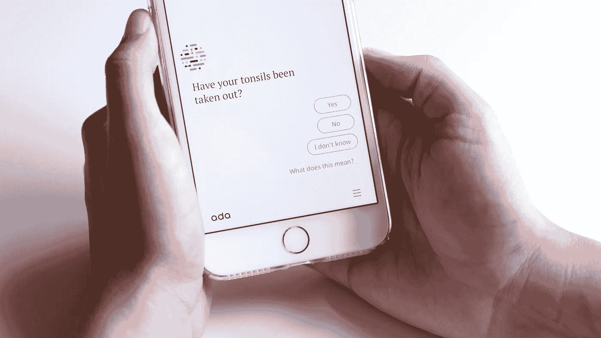
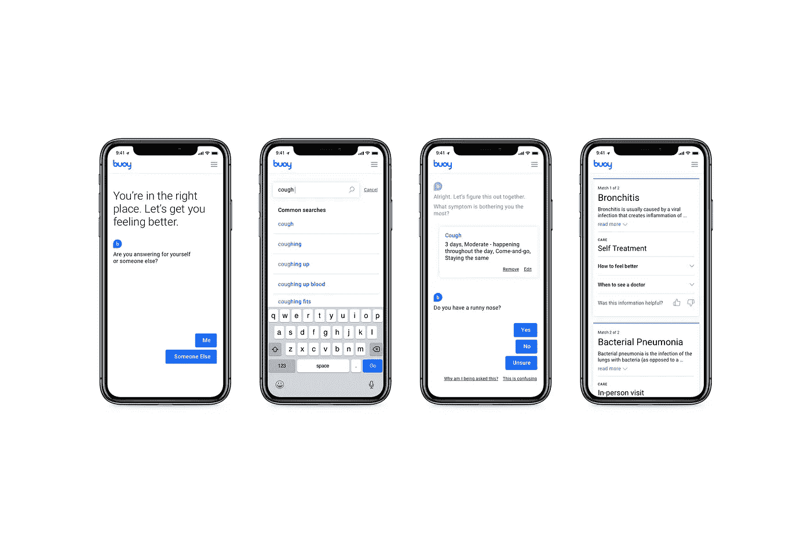
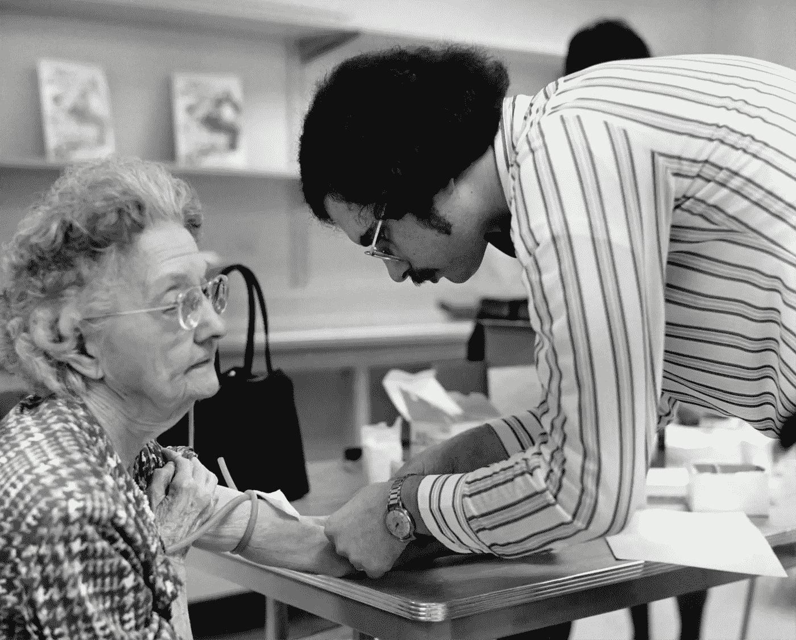
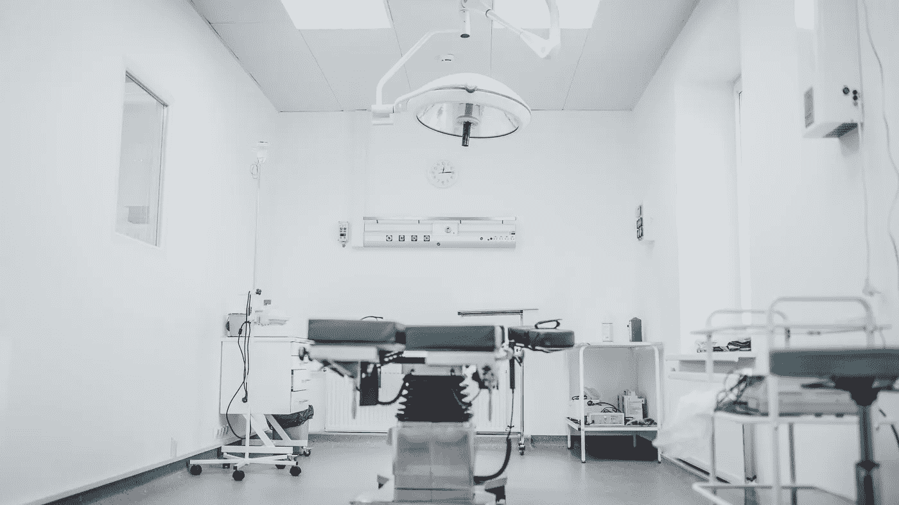
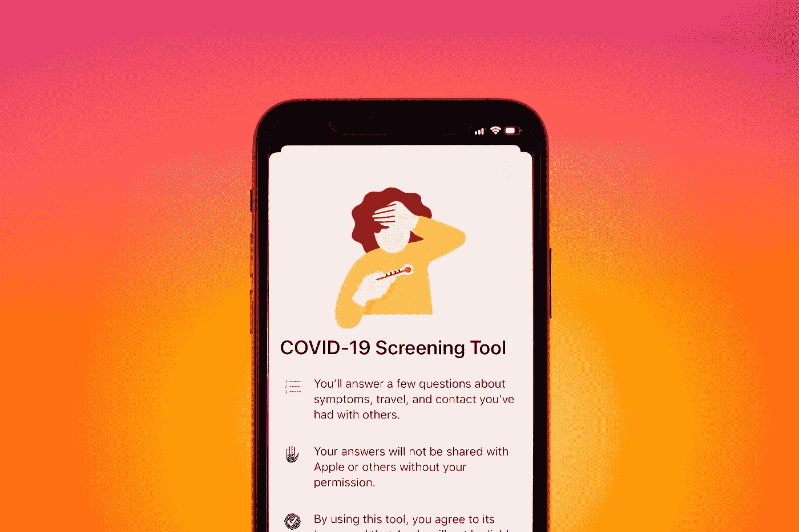

# 医疗聊天机器人可以帮助疫情

> 原文：<https://towardsdatascience.com/healthcare-chatbots-can-help-with-the-pandemic-bcc07fc606c9?source=collection_archive---------59----------------------->

## 随着全球疫情给医疗系统带来压力，这将是对远程健康聊天机器人的最终考验

沃洛季米尔·赫里先科在 [Unsplash](https://unsplash.com/s/photos/chat-bot?utm_source=unsplash&utm_medium=referral&utm_content=creditCopyText) 上的照片

电子医学已经存在了很多年，随着交流方式的进步，它也在不断变化和发展。亚历山大·格雷厄姆·贝尔最早遇到的情况是，当你发高烧时，他[把酸洒在他的裤子上](https://books.google.com/books?id=LgiXOEqS-LoC&pg=PA240&lpg=PA240&dq=Alexander+Graham+Bell+using+his+telephone+to+get+assistance+when+he+spilled+acid+on+his+trousers&source=bl&ots=4nnk0h7k5P&sig=ACfU3U04nF78HQJnml23rWpgpYtngdEsFA&hl=en&sa=X&ved=2ahUKEwjf77C_3LHpAhWUlHIEHZI4BggQ6AEwAHoECB8QAQ#v=onepage&q=Alexander%20Graham%20Bell%20using%20his%20telephone%20to%20get%20assistance%20when%20he%20spilled%20acid%20on%20his%20trousers&f=false)让你的妈妈打电话给医生，于是他用电话寻求帮助。随着时间的推移，远程医疗发生了巨大的变化。如今，高速互联网、视频会议和物联网设备让远程医疗变得更加可行。

新冠肺炎极大地改变了我们互动的方式，随着虚拟医生咨询的出现，远程医疗正迅速成为一种新常态。例如，Babylon Health 通过医患视频聊天、咨询历史和疾病报告在英国迅速扩张。不出所料，随着新冠肺炎疫情的推出，该平台的人气飙升。随着医疗保健行业和技术的不断发展，人们不禁要问:人工智能在远程医疗中能扮演什么角色？

第一批聊天机器人可以追溯到 20 世纪 60 年代。第一批著名的聊天机器人之一是伊莱扎，创造了一个对最初的精神病学采访的模仿。自 2010 年以来，大多数聊天机器人都用于客户服务。如果软件中有错误或者你想报告反馈，你可以使用聊天机器人，它会指引你正确的方向，而不是搜索用户文档。然而，聊天机器人刚刚开始在医疗保健行业站稳脚跟。

# 患者参与

对于习惯于即时信息的人来说，使用现有的聊天机器人如 Alexa、Siri 和 Facebook Messenger 来回答问题并改善与医疗专业人员的联系可以加强提供者和患者之间的关系。现有的聊天机器人提供的服务包括安排预约、定位医疗设施和鼓励临床试验。

此外，增加患者参与度有助于解决具体问题。在一个例子中，人工智能解决方案有助于减少结肠镜检查的“缺席”。聊天机器人有助于满足我们“按需”社会中消费者的现有期望，并改善患者体验。

# 患者诊断

最近，人工智能聊天机器人已经开始转变病人诊断和家庭自我护理。对于新冠肺炎疫情，有必要进行自我治疗，以减少疾病的传播和医疗保健专业人员的负担。

沃洛季米尔·赫里先科在 [Unsplash](https://unsplash.com/s/photos/thermometer?utm_source=unsplash&utm_medium=referral&utm_content=creditCopyText) 上的照片

它是如何工作的？假设你头痛，并开始发冷。你量了体温，有轻度发烧。你吃止痛药吗？你去看医生吗？聊天机器人将检查你的症状，询问与医疗保健专业人员相同的筛查问题，以排除病症。在告诉聊天机器人你的症状，并为你提供可能的诊断后，使用自然语言处理。简单来说，我们不一定知道该问什么样的问题。聊天机器人可以帮助识别你可能没有意识到的潜在症状。

## 更好的信息

聊天机器人可以帮助他们以更高的准确性缩小潜在原因的范围，而不是让 WebMD 上的患者匹配自己的症状。

> Buoy Health 的准确率为 92 %,而 WebMD 的准确率为 56 %, Health line 的准确率为 53 %, Mayo Clinic 的准确率为 38%

例如 [Ada Health](https://ada.com) 就是一个这样做的聊天机器人。如果你感觉不舒服，Ada 会“问”你一系列越来越具体的关于你症状的问题。该应用程序在审查可能的原因时为您提供可能性指标，以及您可以采取的后续措施。此外，Ada 允许您跟踪您的症状，如果它们升级到与医疗保健提供者共享。

[阿达健康聊天机器人](https://ada.com)

总之，这些功能有助于患者更准确地推断他们的疾病，使人们能够采取更好的自我护理措施，并防止可能的歇斯底里。此外，医疗保健聊天机器人有助于提供多样化和个性化的资源。例如， [Youper](https://www.youper.ai) 是一个聊天机器人，为患者提供心理健康的个性化资源。人工智能可以建议一些技术来监控你的进展，测量健康状况，并与你的医疗保健专业人员分享信息。同样，内置于脸书 messenger 的[癌症聊天机器人为癌症患者、护理人员和家人提供最新资源。与简单地在线阅读静态信息不同，根据患者的需求定制资源非常有益。](https://www.facebook.com/CancerChatbot/)

## 数据聚合

由于数据驱动的方法，使用大型数据库有可能提供更准确的信息。 [Buoy Health](https://www.buoyhealth.com) ，另一个用于自我保健诊断的聊天机器人，在他们的解决方案中使用了大量数据。与其他聊天机器人类似，它提供了一个基于文本的症状检查器，将您的输入与可能的情况进行匹配。该公司使用来自 18000 篇医学论文(500 万名患者，1700 种情况)的临床数据进行训练，以模仿医生。

[浮标健康助手聊天机器人](http://buoyhealth.com)

例如，在 Buoy Health 推出之前，它进行的一项测试是如何解释咳嗽。据首席执行官乐介绍，“他们研究了 100 个标准化病例，涉及 33 种不同的诊断，从良性咳嗽到危及生命的肺栓塞，以及罕见疾病的流行，如组织胞浆菌病和普通感冒。Buoy 在 92%的情况下都是正确的，相比之下，WebMD 的正确率为 56%，Healthline 为 53%，Mayo Clinic 为 38%。([来源](https://www.mobihealthnews.com/content/digital-health-startup-buoy-launches-ai-powered-symptom-checking-chatbot))

此外，Buoy 随着时间的推移向用户学习，测量症状的流行程度。该公司正在使用该软件收集传统研究中无法测量的大量数据。迄今为止，Buoy Health 还没有发表多少关于他们从其平台上了解到的数据的研究文章，但他们确实有一个工作人员写作团队为症状诊断创建已发布的内容。

## 不去看医生

对于更小的健康问题，聊天机器人可以完全避免去看医生。据统计，78%去急诊室的病人本可以在急诊室外得到照顾。你的。MD 是一个人工智能聊天机器人，其主要功能是自我保健检查器。它决定了你正在经历的症状是否值得去看医生，或者你只是在经历一种自我护理的状况，如普通感冒或过敏。它可以加快患者的分类，并为患者提供更个性化的体验。然而，如果聊天机器人确定你的病情更加严重，它还可以快速联系你所在地区的医疗服务提供者

不去看医生还有很多“隐藏”的好处。除了节省时间之外，依靠保险**看医生可能会很贵**。聊天机器人如 Ada，Buoy 和 Your。MD 可以免费使用。有趣的是，这些聊天机器人通过向你推荐医疗机构来创收。在不去看医生的情况下，呆在家里可以防止疾病传播。另一方面，你也限制了自己在医疗机构感染其他疾病的可能性。此外，与家庭医生和急救设施不同，聊天机器人是全天候可用的。即使对于简单的医疗问题，如果你在半夜醒来打寒战，这也是一个很好的便利。

创建于 1976 年，这张历史性的照片展示了一位公共卫生科学家从一位老年妇女身上抽血，在 1976 年 10 月开始的全国范围的猪流感疫苗接种活动中进行测试。|图片由[疾控中心](https://unsplash.com/@cdc?utm_source=unsplash&utm_medium=referral&utm_content=creditCopyText)在 [Unsplash](https://unsplash.com/s/photos/cdc?utm_source=unsplash&utm_medium=referral&utm_content=creditCopyText) 拍摄

# 聊天机器人的挑战

## 不愿采用新技术

聊天机器人缺乏医生给予的个人接触和直觉。尽管人们毫不犹豫地使用聊天机器人进行基本的客户支持，但许多人不愿意使用聊天机器人来讨论敏感的医疗信息。

Conversa Health 是一个聊天机器人，它简化了患者和提供者之间的客户服务和管理。首席执行官 Kouris Kalligas 是医疗保健创新的倡导者，但提醒该领域的其他人，他们需要认识到系统中现有的限制。

> “创新者应该记住，推动技术发展的是看似合理的需求，而不仅仅是技术上的可能性。”
> 
> **—首席执行官康沃斯·卡利加斯**

在过去几年中，像 Marriot、MyFitnessPal、Target 和 MyHeritage 这样的公司都经历过[重大数据泄露](https://www.businessinsider.com/data-hacks-breaches-biggest-of-2018-2018-12)。尤其是对于敏感的医疗数据，提供安全的解决方案和保护技术以确保数据不会落入他人之手至关重要。

[阿瑟尼·托古列夫](https://unsplash.com/@tetrakiss?utm_source=unsplash&utm_medium=referral&utm_content=creditCopyText)在 [Unsplash](https://unsplash.com/s/photos/surgery?utm_source=unsplash&utm_medium=referral&utm_content=creditCopyText) 上的照片

## 聊天机器人永远不会完全取代医生

你的。MD 注册为[1 类医疗器械](https://www.your.md/legal/cemark/)，符合欧盟医疗器械指令，可用作医生流程的辅助设备。它指出，这些服务在法律上不提供诊断、医疗建议或治疗。尽管理论上聊天机器人会比使用谷歌的自我研究提供更有针对性的结论。更多的是明显的实际限制。有了医疗设备和程序，聊天机器人在诊断和解决医疗疾病时只能触及表面。

# 作为医疗助理的聊天机器人

如前所述，聊天机器人的局限性将阻止它们完全取代医生。随着人工智能聊天机器人的改进和日益成为主流，聊天机器人和医生一起工作可能会成为现实。例如， [Sensely](https://www.sensely.com) 目前向医疗保健提供商提供解决方案，以提供患者服务和健康评估。它有助于护理机构为预约提供动态登记服务，并帮助消费者处理保险索赔。此外，它通过问卷和反馈为医生提供了来自患者行为的实时信息。

这种类型的“候诊室问卷”已经存在了几十年，但聊天机器人解决方案可以提供更多针对患者习惯的个性化问题，自动附加到患者记录中，并让医生立即了解患者预先筛选的健康状况。

苹果的新冠肺炎筛选工具，照片由 [Brian McGowan](https://unsplash.com/@sushioutlaw?utm_source=unsplash&utm_medium=referral&utm_content=creditCopyText) 在 [Unsplash](https://unsplash.com/s/photos/cdc?utm_source=unsplash&utm_medium=referral&utm_content=creditCopyText) 上拍摄

此外，聊天机器人还有其他明显的局限性，例如对婴儿和老人的治疗，病人无法使用这项技术。然而，随着技术的发展，聊天机器人甚至可以帮助替代最基本的任务。因为聊天机器人会做琐碎的工作，医生会利用聊天机器人的资源做出诊断。随着医生和护士的压力减少，他们将能够看到更多需要人工智能聊天机器人无法提供的关键治疗的病人。

医疗保健行业中交织的聊天机器人显然**应用了社会公益**的概念。然而，重要的是要始终考虑技术可以帮助的程度，以及实施技术会在哪些方面阻碍整体用户体验。此外，经常提到的是，医疗科技初创公司从风险投资公司获得了大量资金。透过烟雾来看哪些公司提供了最准确的结果是很重要的。

鉴于医疗行业的某些方面已经过时，而另一些方面却非常先进，聊天机器人可以改善患者的整体体验，以提供准确的医疗信息。

# 新冠肺炎（新型冠状病毒肺炎）

虽然全球疫情给医疗系统带来了巨大压力，但看看聊天机器人的使用是否有所增加将是一件有趣的事情。在疫情期间，许多初级保健机构和特护医生已经远程切换。越来越多的人已经习惯于联系他们的医生，并通过视频分享关于他们健康的私密细节。就在几个月前，医生对待病人的方式还被认为是“不恰当的”,现在他们也变得更加自如了。然而，一些专业(例如整形外科)将面临为患者提供虚拟护理的挑战。

Twitter 允许员工永远在家工作

随着许多公司考虑永久转移到远程环境，医疗保健行业将继续发展。这将是对远程医疗的最终考验，看看虚拟咨询、患者参与平台和自我护理聊天机器人等程序是否会在疫情飓风过后继续存在。

[*彼得·巴鲁*](https://www.luba.io)*(*[*@彼得鲁巴*](https://medium.com/@peterluba) *)是利哈伊大学 CS +设计专业的学生。他联合创立了一个教育技术安全平台 SmartPass，并且喜欢在⛷滑雪*

*指导撰写*[*Daniel p . lop resti*](http://www.cse.lehigh.edu/~lopresti/)*教授，Data X Initiative 主任，利哈伊大学计算机科学教授(CSE 398: AI for Social Good)*

**参考文献&延伸阅读**

[1]魏曾鲍姆，约瑟夫。*伊莱扎——一个用于研究人机自然语言交流的计算机程序*

[2]麦克，希瑟。[“数字健康初创公司 Buoy 推出人工智能驱动的症状检查聊天机器人。”](http://www.mobihealthnews.com/content/digital-health-startup-buoy-launches-ai-powered-symptom-checking-chatbot) *MobiHealthNews* ，2017 年 3 月 8 日